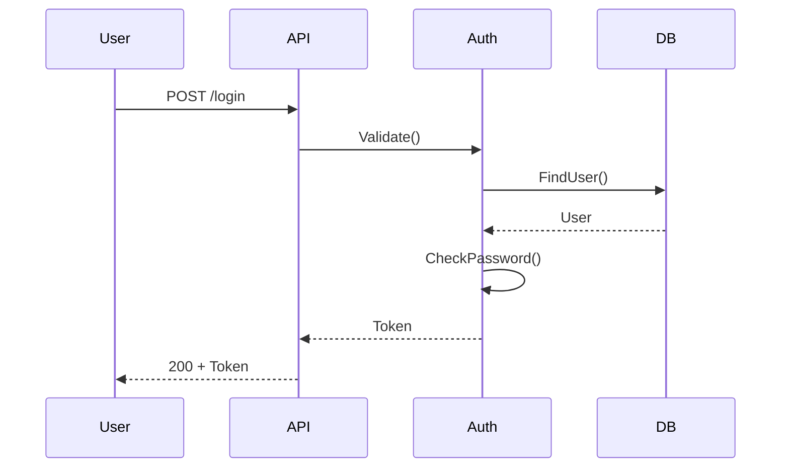

# SIP 3: Block System

**Status:** Draft  
**Version:** 0.1.0  
**Author:** Speclang Core Team

## README

This SIP defines the block system for structured content in specs.

### Quick Start

1. **Block Declaration:** `# @block:id @kind:type`
2. **Block Content:** Follows declaration
3. **Block Kinds:** entity, operation, policy, test, code, diagram, etc.
4. **References:** Link blocks with `@ref:file#block`

### Example

```markdown
# @block:auth/login @kind:operation
login(email: String, password: String) -> Result<Token, Error>:
  inputs:
    - email: String
  steps:
    1. Validate
    2. Authenticate
    3. Return token
```

### Key Concepts

- **Named Units:** Every block has unique ID
- **Typed:** Kind determines structure
- **Referenceable:** Link to specific blocks
- **Flat:** No nesting, use refs instead

### When to Read This

- **Writing specs:** Structure content in blocks
- **Implementing parsers:** Parse block syntax
- **Code generation:** Map blocks to code

### Related SIPs

- SIP 2: Header Format
- SIP 4: Reference System

## Abstract

This SIP defines the block system for Speclang specs. Blocks are the fundamental units of content, each with a unique ID, kind, and structured data.

## Motivation

Specs need structure beyond just text. Blocks provide:
- Named, referenceable content units
- Type safety for different content kinds
- Machine-parseable structure
- Natural language + formal specification

## Rationale

**Why Blocks?**
- Documents get large and unwieldy
- Need to reference specific parts
- Different content needs different handling
- AI needs structure to understand intent

**Block Format:**
```
# @block:domain/name @kind:type
Content here...
```

This is:
- Human readable (just markdown)
- Machine parseable (regex + AST)
- Referenceable (@ref:file#block-id)
- Typed (kind determines structure)

## Specification

### Block Declaration

**Format:** `# @block:id @kind:kind`

**Components:**
- `#` - Markdown comment marker
- `@block:` - Block prefix
- `id` - Unique block identifier
- `@kind:` - Block type

**Example:**
```markdown
# @block:auth/login @kind:operation
```

### Block ID

**Format:** `domain/name` or `domain/subdomain/name`

**Rules:**
- Lowercase
- Hyphen-separated
- Unique within file
- Reflects content hierarchy

**Examples:**
```
auth/login
auth/entities/user
api/handlers/get-user
```

### Block Kinds

**Core Kinds:**

| Kind | Purpose | Structure |
|------|---------|-----------|
| `entity` | Data structures | Fields, invariants |
| `operation` | Functions/methods | Inputs, outputs, steps |
| `policy` | Rules/constraints | Conditions, enforcement |
| `test` | Test cases | Given/when/then |
| `note` | Documentation | Free text |
| `code` | Code examples | Syntax highlighted |
| `table` | Tabular data | Rows/columns |
| `diagram` | Visual diagrams | Mermaid |

**Extended Kinds:**

| Kind | Purpose |
|------|---------|
| `review` | Review findings |
| `recovery` | Recovery actions |
| `config` | Configuration |
| `validation` | Validation rules |

### Block Content

**Content depends on kind:**

#### Entity Block

```markdown
# @block:user @kind:entity
User:
  fields:
    id: UUID @primary
    email: String @unique @email
    password: String @secret
    
  invariants:
    - "email must be verified before login"
    - "password must be hashed"
```

#### Operation Block

```markdown
# @block:auth/login @kind:operation
login(email: String, password: String) -> Result<Token, Error>:

inputs:
  - email: String @email @required
  - password: String @min=8 @required

outputs:
  - Ok: Token
  - Err: AuthError

steps:
  1. Validate inputs
  2. Find user by email
  3. Verify password (bcrypt)
  4. Generate JWT
  5. Return token

refs:
  - @ref:specs/auth/entities#User
```

#### Test Block

```markdown
# @block:tests/login-success @kind:test
category: unit
refs: [@ref:specs/auth/login]

Test: User can log in with valid credentials

Given: user exists with email "test@example.com"
And: password is "secret123"
And: user is verified
When: login called with (email, password)
Then: returns Ok with JWT
And: token expires in 1 hour
```

#### Code Block

```markdown
# @block:auth/login-example @kind:code
```go
func Login(email, password string) (*Token, error) {
    user, err := db.FindByEmail(email)
    if err != nil {
        return nil, err
    }
    
    if err := bcrypt.Compare(user.Password, password); err != nil {
        return nil, ErrInvalidCredentials
    }
    
    return GenerateJWT(user.ID)
}
```
```

#### Diagram Block

```markdown
# @block:auth/flow-diagram @kind:diagram

```

### Block Attributes

**Standard Attributes:**

```markdown
# @block:id @kind:kind @status:draft
# @block:id @kind:kind @deprecated
# @block:id @kind:kind @since:1.0.0
```

**Test-Specific:**

```markdown
# @block:tests/login @kind:test @status:passed @duration:23ms
# @block:tests/login @kind:test @status:failed @error:timeout
```

### Block References

**From within block:**
```markdown
# @block:auth/login @kind:operation
refs:
  - @ref:specs/auth/entities#User
  - @ref:specs/auth/policies#rate-limit
```

**From other blocks:**
```markdown
# @block:user-profile @kind:operation
uses:
  - @ref:specs/auth#login for authentication
```

## Block Parsing

### Algorithm

```python
def parse_blocks(content):
    blocks = []
    current_block = None
    
    for line in content.split('\n'):
        # Check for block declaration
        match = re.match(r'^#\s+@block:(\S+)\s+@kind:(\S+)', line)
        if match:
            # Save previous block
            if current_block:
                blocks.append(current_block)
            
            # Start new block
            current_block = Block(
                id=match.group(1),
                kind=match.group(2),
                content=[]
            )
        elif current_block:
            current_block.content.append(line)
    
    # Don't forget last block
    if current_block:
        blocks.append(current_block)
    
    return blocks
```

### Validation

**Checks:**
1. Block ID unique within file
2. Kind is valid
3. Content matches kind structure
4. No nested blocks (flat)

**Errors:**
```
Error: Duplicate block ID "auth/login" in specs/auth.spec.yaml
Error: Invalid block kind "function" in specs/auth.spec.yaml
Error: Missing "steps" in operation block @block:auth/login
```

## Block Hierarchy

**File Level:**
- Header (lines 1-N)
- Block 1
- Block 2
- ...
- Block M

**No nesting:**
- Blocks are flat
- References link them
- Parent/child via refs, not nesting

**Example:**
```markdown
# Header
---

# @block:auth @kind:note
Overview of auth system...

# @block:auth/entities @kind:entity
User entity...

# @block:auth/login @kind:operation
Login operation...

# @block:auth/tests @kind:test
Test cases...
```

## Block Size

**Recommendations:**
- Keep blocks focused
- One concept per block
- Link related blocks with refs
- Split large blocks

**Example - Large Block (Bad):**
```markdown
# @block:auth @kind:entity
Includes: User, Session, Token, Audit, 
RateLimit, Policy, etc...
```

**Example - Split Blocks (Good):**
```markdown
# @block:auth/entities/user @kind:entity
User entity...

# @block:auth/entities/session @kind:entity
Session entity...

# @block:auth/entities/token @kind:entity
Token entity...
```

## Block References

**Format:** `@ref:file-path#block-id`

**Examples:**
```
@ref:specs/auth#login
@ref:specs/auth/entities#User
@ref:specs/auth/tests#login-success
```

**In code:**
```go
// SPECLANG-ID: @ref:specs/auth/login
func Login(...) {...}
```

## Integration

**With Headers:**
```yaml
# speclang-header lines:12
id: @specs/auth
refs:
  - @ref:specs/user
---

# @block:auth/overview @kind:note
Overview...

# @block:auth/login @kind:operation
Login...
```

**With Splitting:**
```
auth.spec.yaml (index)
  refs: children in auth.spec.spec.dir/

auth.spec.spec.dir/
  entities.spec.yaml
  operations.spec.yaml
  policies.spec.yaml
```

## Backwards Compatibility

**Migration:**
- Old specs without blocks are supported
- Treated as single `note` block
- Can be migrated automatically

## Examples

### Complete Spec with Blocks

```markdown
---
# speclang-header lines:15
id: @specs/auth
version: 1.0.0
refs: [@ref:specs/user]
tags: [auth, security]
short: Authentication system
---

# @block:auth/overview @kind:note
Authentication system using JWT tokens.

Supports:
- Email/password login
- Token refresh
- Rate limiting
- Audit logging

# @block:auth/entities @kind:entity
User:
  id: UUID @primary
  email: String @unique @email
  password: String @secret
  verified: Boolean
  
Session:
  id: UUID @primary
  user_id: UUID @ref:User
  token: JWT
  expires: DateTime

# @block:auth/login @kind:operation
login(email: String, password: String) -> Result<Token, Error>:

inputs:
  - email: String @email
  - password: String @min=8

steps:
  1. Find user by email
  2. Verify password (bcrypt)
  3. Check rate limits
  4. Generate JWT
  5. Create session
  6. Log audit event

refs:
  - @ref:#auth/entities
  - @ref:specs/policies#rate-limit

# @block:auth/tests/login @kind:test
category: unit

Test: Valid login returns token

Given: user exists, password correct
When: login called
Then: returns Ok with valid JWT
```

## References

- SIP 2: Header Format
- SIP 4: Reference System
- SIP 5: Splitting and Sizing
- Markdown Specification

## Copyright

This document is in the public domain.