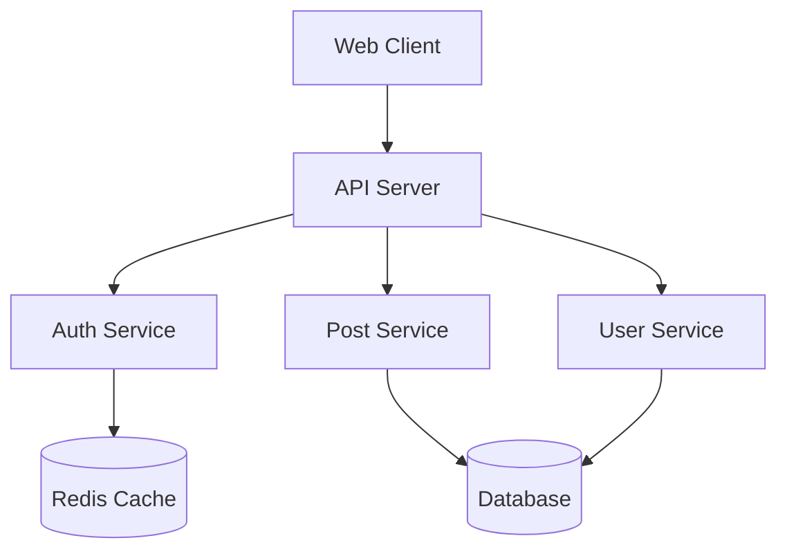

# Bootstrap Phase 7.1: Example Projects

## Context
You are building SpecLang - a reactive multi-agent system where specs self-assemble into code. This is Phase 7.1 of the bootstrap process.

**Prerequisites**: 
- Phase 0-6 complete
- All core systems operational
- Documentation infrastructure ready

## Your Task
Create comprehensive example projects demonstrating SpecLang features. Each example should be self-contained, runnable, and serve as both documentation and test case.

## Read These Specs First
1. `specs/examples.spec.md` - Example specifications
2. `specs/ui.spec.md` - Dashboard example
3. `specs/mcp.spec.md` - MCP example

## What to Build

### Files to Create
```
examples/
├── hello-world/
│   ├── hello.spec.md         # Simple hello world spec
│   ├── README.md             # Quick start guide
│   └── expected-output/
│       ├── hello.ts          # Generated TypeScript
│       ├── hello.go          # Generated Go
│       └── hello.py          # Generated Python
│
├── user-auth/
│   ├── auth.spec.md          # Authentication module
│   ├── user.spec.md          # User entity specs
│   ├── session.spec.md       # Session management
│   ├── README.md             # Multi-file example
│   └── expected-output/
│       └── auth/
│           ├── index.ts
│           ├── user.ts
│           └── session.ts
│
├── api-server/
│   ├── api.spec.md           # REST API spec
│   ├── routes.spec.md        # Route definitions
│   ├── middleware.spec.md    # Middleware specs
│   ├── README.md             # Full API example
│   └── expected-output/
│       └── api/
│           └── server.ts
│
├── cascade-demo/
│   ├── trigger.spec.md       # Cascade trigger spec
│   ├── generator.spec.md     # Generated content
│   ├── test.spec.md          # Generated tests
│   ├── README.md             # Cascade behavior demo
│   └── cascade-log.json      # Example cascade log
│
├── mcp-tools/
│   ├── custom-tools.spec.md  # Custom MCP tools
│   ├── openapi.yaml          # OpenAPI spec
│   ├── README.md             # MCP integration example
│   └── expected-output/
│       └── mcp/
│           └── server.ts
│
└── full-stack/
    ├── northstar.spec.md     # Project vision
    ├── features/
    │   ├── auth.spec.md
    │   ├── api.spec.md
    │   └── ui.spec.md
    ├── components/
    │   ├── user.spec.md
    │   ├── post.spec.md
    │   └── comment.spec.md
    ├── README.md             # Full project structure
    └── expected-output/
        └── src/
            ├── auth/
            ├── api/
            └── models/

docs/
└── examples/
    ├── getting-started.md    # Tutorial from examples
    ├── patterns.md           # Common patterns
    └── best-practices.md     # Recommended approaches
```

### Requirements

#### 1. Hello World Example

```yaml
# examples/hello-world/hello.spec.md
# speclang-header lines:12
id: "@examples/hello-world"
version: 1.0.0
layer: 0
tags: [example, hello-world, getting-started]
project_level: Production
agent_support: agent_autonomous
short: Hello World - simplest SpecLang example
---

# Hello World

A minimal example demonstrating basic SpecLang syntax.

## Greeting Entity

```speclang
# @block:hello/greeting @kind:entity
Greeting:
  message: String "The greeting message"
  language: String "ISO language code"
  timestamp: DateTime "When the greeting was created"
```

## Say Hello Operation

```speclang
# @block:hello/say-hello @kind:operation
sayHello(name: String) -> Greeting

Steps:
1. Validate name is not empty
2. Create greeting with message "Hello, {name}!"
3. Set language to "en"
4. Set timestamp to current time
5. Return greeting
```

## Acceptance Criteria

```speclang
# @block:hello/acceptance @kind:acceptance
GIVEN a valid name "World"
WHEN sayHello is called
THEN returns Greeting with message "Hello, World!"
AND language is "en"
AND timestamp is recent
```
```

#### 2. User Authentication Example

```yaml
# examples/user-auth/auth.spec.md
# speclang-header lines:12
id: "@examples/auth"
version: 1.0.0
layer: 1
tags: [example, auth, authentication]
imports: ["@examples/auth/user", "@examples/auth/session"]
project_level: Beta
agent_support: agent_assisted
short: User authentication module
---

# Authentication Module

Complete authentication system with users, sessions, and security policies.

## User Entity

@ref:examples/auth/user#user-entity

## Session Entity

@ref:examples/auth/session#session-entity

## Login Operation

```speclang
# @block:auth/login @kind:operation
login(email: String, password: String) -> Result<Session, AuthError>

Steps:
1. Validate email format using regex
2. Find user by email in database
3. If user not found, return AuthError.UserNotFound
4. Verify password hash using bcrypt
5. If password invalid, return AuthError.InvalidPassword
6. Create new session with UUID
7. Set session expiry to 24 hours from now
8. Store session in database
9. Return session
```

## Logout Operation

```speclang
# @block:auth/logout @kind:operation
logout(sessionId: String) -> Void

Steps:
1. Validate session ID format
2. Find session in database
3. If session not found, return silently
4. Delete session from database
5. Return void
```

## Security Policy

```speclang
# @block:auth/policy @kind:policy
AuthPolicy:
  rules:
    - condition: "user.failedAttempts >= 5"
      action: deny
      message: "Account locked due to too many failed attempts"
    
    - condition: "session.age > 24.hours"
      action: deny
      message: "Session expired"
```
```

```yaml
# examples/user-auth/user.spec.md
# speclang-header lines:12
id: "@examples/auth/user"
version: 1.0.0
layer: 2
tags: [example, auth, user]
project_level: Beta
agent_support: agent_assisted
parent: "@ref:examples/auth"
short: User entity definition
---

# User Entity

```speclang
# @block:user/entity @kind:entity
User:
  id: UUID "Unique user identifier"
  email: String "User email address"
  passwordHash: String "Bcrypt hashed password"
  name: String? "Optional display name"
  role: UserRole "User role for permissions"
  createdAt: DateTime "Account creation timestamp"
  updatedAt: DateTime "Last update timestamp"
  failedAttempts: Integer "Failed login attempts count"
  lockedUntil: DateTime? "Account lock expiry"

# @block:user/role @kind:enum
UserRole:
  ADMIN: "Full administrative access"
  USER: "Standard user access"
  GUEST: "Limited read-only access"
```
```

#### 3. API Server Example

```yaml
# examples/api-server/api.spec.md
# speclang-header lines:12
id: "@examples/api"
version: 1.0.0
layer: 1
tags: [example, api, rest, server]
imports: ["@speclang/stdlib/http"]
project_level: Beta
agent_support: agent_assisted
short: REST API server specification
---

# API Server

A RESTful API server with routes, middleware, and error handling.

## Server Configuration

```speclang
# @block:api/config @kind:entity
ServerConfig:
  port: Integer "Server port (default: 3000)"
  host: String "Server host (default: localhost)"
  cors: CORSConfig "CORS configuration"
  rateLimit: RateLimitConfig "Rate limiting"

# @block:api/cors @kind:entity
CORSConfig:
  origins: Array<String> "Allowed origins"
  methods: Array<String> "Allowed HTTP methods"
  headers: Array<String> "Allowed headers"
```

## Routes

@ref:examples/api/routes

## Middleware

@ref:examples/api/middleware

## Error Handling

```speclang
# @block:api/errors @kind:entity
APIError:
  code: String "Error code"
  message: String "Human-readable message"
  details: JSON? "Additional error details"
  statusCode: Integer "HTTP status code"

# @block:api/error-codes @kind:enum
ErrorCode:
  VALIDATION_ERROR: "Request validation failed"
  NOT_FOUND: "Resource not found"
  UNAUTHORIZED: "Authentication required"
  FORBIDDEN: "Access denied"
  INTERNAL_ERROR: "Internal server error"
```
```

#### 4. Cascade Demo Example

```yaml
# examples/cascade-demo/trigger.spec.md
# speclang-header lines:12
id: "@examples/cascade/trigger"
version: 1.0.0
layer: 0
tags: [example, cascade, demo]
project_level: Beta
agent_support: agent_autonomous
short: Demonstrates cascade behavior
---

# Cascade Demo

This example demonstrates how changes propagate through the cascade.

## Source Entity

```speclang
# @block:cascade/source @kind:entity
SourceEntity:
  id: UUID
  name: String
  value: Integer
```

When this file is modified, it triggers:

1. Code generation (@ref:examples/cascade/generator)
2. Test generation (@ref:examples/cascade/test)
3. Documentation update
```

```yaml
# examples/cascade-demo/generator.spec.md
# speclang-header lines:12
id: "@examples/cascade/generator"
version: 1.0.0
layer: 1
tags: [example, cascade, generated]
parent: "@ref:examples/cascade/trigger"
project_level: Beta
agent_support: agent_autonomous
short: Generated from trigger
---

# Generated Code

This file is automatically generated when the source changes.

@ref:examples/cascade/trigger#source-entity

## Generated TypeScript

```speclang
# @block:generated/ts @kind:code
```typescript
// Auto-generated from cascade-demo/trigger.spec.md
export interface SourceEntity {
  id: string;
  name: string;
  value: number;
}
```
```
```

#### 5. MCP Tools Example

```yaml
# examples/mcp-tools/custom-tools.spec.md
# speclang-header lines:12
id: "@examples/mcp/tools"
version: 1.0.0
layer: 1
tags: [example, mcp, tools]
imports: ["@speclang/mcp"]
project_level: Beta
agent_support: agent_assisted
short: Custom MCP tools example
---

# Custom MCP Tools

Example of creating custom MCP tools for SpecLang.

## File Analysis Tool

```speclang
# @block:mcp/analyze-file @kind:entity
AnalyzeFileTool:
  name: "speclang_analyze_file"
  description: "Analyze a spec file and return metrics"
  
  input:
    path: String "Path to spec file"
    metrics: Array<String>? "Specific metrics to compute"
  
  output:
    lineCount: Integer
    blockCount: Integer
    refCount: Integer
    complexity: Float
```

## Dependency Graph Tool

```speclang
# @block:mcp/dependency-graph @kind:entity
DependencyGraphTool:
  name: "speclang_dependency_graph"
  description: "Generate dependency graph for a spec"
  
  input:
    id: String "Spec ID to analyze"
    depth: Integer? "Max depth (default: 5)"
  
  output:
    nodes: Array<GraphNode>
    edges: Array<GraphEdge>
```

## Tool Registration

```speclang
# @block:mcp/registration @kind:code
```typescript
import { MCPServer } from '@speclang/mcp';

const server = new MCPServer();

server.registerTool({
  name: 'speclang_analyze_file',
  description: 'Analyze a spec file',
  inputSchema: {
    type: 'object',
    properties: {
      path: { type: 'string' },
      metrics: { type: 'array', items: { type: 'string' } }
    },
    required: ['path']
  },
  handler: async (input) => {
    // Implementation
    return { success: true, data: analyzeFile(input.path) };
  }
});
```
```
```

#### 6. Full Stack Example Structure

```yaml
# examples/full-stack/northstar.spec.md
# speclang-header lines:12
id: "@examples/fullstack"
version: 1.0.0
layer: 0
tags: [example, fullstack, application]
project_level: Beta
agent_support: agent_assisted
short: Full stack application example
children:
  - "@examples/fullstack/features"
  - "@examples/fullstack/components"
---

# Full Stack Application

A complete example showing project structure with multiple layers.

## Vision

```speclang
# @block:fullstack/vision @kind:note
A social media platform where users can:
- Create and share posts
- Comment on posts
- Follow other users
- Receive notifications
```

## Architecture

```speclang
# @block:fullstack/architecture @kind:diagram

```
```

#### 7. Documentation Files

```markdown
# docs/examples/getting-started.md

# Getting Started with SpecLang Examples

This guide walks through the examples from simplest to most complex.

## Prerequisites

- SpecLang CLI installed: `npm install -g speclang`
- Basic understanding of YAML and Markdown

## 1. Hello World (5 minutes)

The simplest example demonstrating basic syntax.

```bash
cd examples/hello-world
speclang compile hello.spec.md --target typescript
```

**What you'll learn:**
- Basic spec structure
- Entity definitions
- Operation signatures
- Acceptance criteria

## 2. User Auth (15 minutes)

Multi-file spec with dependencies.

```bash
cd examples/user-auth
speclang compile . --target typescript --output ./dist
```

**What you'll learn:**
- File references (@ref)
- Layer organization
- Policy definitions
- Error types

## 3. API Server (30 minutes)

Full REST API specification.

```bash
cd examples/api-server
speclang compile . --target typescript
speclang serve . --port 3000
```

**What you'll learn:**
- Route definitions
- Middleware patterns
- Error handling
- Server configuration

## 4. Cascade Demo (Interactive)

See the cascade in action.

```bash
cd examples/cascade-demo
speclang watch .

# In another terminal, modify trigger.spec.md
# Watch the cascade propagate
```

**What you'll learn:**
- Cascade triggers
- Change propagation
- Agent behavior

## 5. Full Stack (1 hour)

Complete application structure.

```bash
cd examples/full-stack
speclang compile . --all-targets
```

**What you'll learn:**
- Project organization
- Multi-layer specs
- Cross-cutting concerns
```

```markdown
# docs/examples/patterns.md

# Common SpecLang Patterns

## Entity-Operation Pattern

Define entities first, then operations that use them.

```speclang
# Entity
User:
  id: UUID
  name: String

# Operation using entity
createUser(name: String) -> User
```

## Repository Pattern

Abstract data access with repository operations.

```speclang
# @block:repo/user @kind:entity
UserRepository:
  findById(id: UUID) -> User?
  findAll() -> Array<User>
  save(user: User) -> User
  delete(id: UUID) -> Void
```

## Policy Enforcement

Use policies for access control.

```speclang
# @block:policy/admin @kind:policy
AdminOnlyPolicy:
  rules:
    - condition: "user.role != ADMIN"
      action: deny
      message: "Admin access required"
```

## Cascade Trigger Pattern

Structure specs for cascade propagation.

```speclang
# Layer 0: Source of truth
# source.spec.md
Entity:
  field: Type

# Layer 1: Generated
# @ref:source#Entity
GeneratedEntity:
  ...derived fields
```
```

#### 8. Example README Template

```markdown
# Example: [Name]

[Brief description of what this example demonstrates]

## What You'll Learn

- [Learning objective 1]
- [Learning objective 2]
- [Learning objective 3]

## Running the Example

```bash
# Compile specs
speclang compile . --target typescript

# Run generated code
node dist/index.js

# Run tests
speclang test .
```

## Structure

```
.
├── *.spec.md          # Specification files
├── README.md          # This file
└── expected-output/   # Expected generated code
```

## Key Concepts

### [Concept 1]

[Explanation with code example]

### [Concept 2]

[Explanation with code example]

## Next Steps

- Try modifying the specs
- Add new entities and operations
- Run the cascade to see changes propagate
```

## Test Cases
1. Hello World compiles to TypeScript
2. Hello World compiles to Go
3. Hello World compiles to Python
4. User Auth validates references
5. API Server generates routes
6. Cascade Demo propagates changes
7. MCP Tools register correctly
8. Full Stack has valid structure
9. All examples pass validation
10. Documentation is accurate

## Validation
```bash
# Validate all examples
for dir in examples/*/; do
  echo "Validating $dir"
  speclang validate "$dir"
done

# Compile examples to all targets
speclang compile examples/ --target all

# Run example tests
bun test examples/
```

## Output Format
After completing, output:
1. Examples created
2. Languages demonstrated
3. Patterns covered
4. Test results
