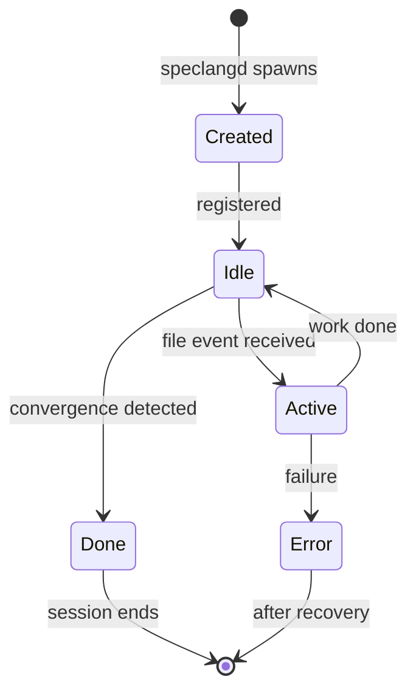

# speclang-header lines:11
id: "@speclang/agent-protocol/sessions"
version: 0.1.0
layer: 2
project_level: Alpha
agent_support: agent_assisted
tags: [agents, protocol, sessions, lifecycle, api]
short: Agent Sessions and Lifecycle
parent: "@ref:speclang/agent-protocol"
part: 1/2
---

## Sessions

### @protocol/session

```speclang
# @block:protocol/session @kind:entity
AgentSession:
  id: String                    # unique session ID
  agent: AgentKind              # type of agent
  owns: FilePattern[]           # files this session can write
  created: DateTime
  last_active: DateTime
  status: idle | active | done | error
  
AgentKind:
  - orchestrator    # user's primary AI
  - spec-writer     # expands specs
  - code-gen        # generates code
  - test-writer     # writes tests
  - back-sync       # syncs code to spec
```

### @protocol/session-lifecycle

```speclang
# @block:protocol/session-lifecycle @kind:diagram

```

---

## Session Management

### @protocol/session-api

```speclang
# @block:protocol/session-api @kind:entity
SessionAPI:
  base_url: http://localhost:{port}
  
  endpoints:
    POST /session/create
      body: { agent, owns }
      response: { session_id }
      
    GET /session/{id}/status
      response: { status, files, last_active }
      
    POST /session/{id}/event
      body: { kind, path, details }
      response: { accepted }
      
    DELETE /session/{id}
      response: { ok }
```

---

## Concurrency

### @protocol/concurrency

```speclang
# @block:protocol/concurrency @kind:entity
ConcurrencyModel:
  description: "Multiple agents run concurrently, one per file"
  
  guarantees:
    - No two agents write same file
    - Reads are always allowed
    - Writes are serialized per file
    - Agents can read while another writes
    
  limits:
    - max_concurrent_agents: 50 (configurable)
    - max_file_changes_per_cascade: 100
```

---

## Error Handling

### @protocol/errors

```speclang
# @block:protocol/errors @kind:entity
AgentError:
  types:
    - AccessDenied: tried to write non-owned file
    - LockTimeout: couldn't acquire lock
    - SessionNotFound: invalid session ID
    - AgentTimeout: agent didn't respond
    
  recovery:
    - log error to .speclang/errors/
    - notify orchestrator if critical
    - retry with backoff for transient errors
    - abort session after max retries
```

---

## Behavior Based on Metadata

### @protocol/metadata-behavior

```speclang
# @block:protocol/metadata-behavior @kind:note
Agent behavior is influenced by spec metadata fields:
- `project_level`: Determines autonomy level and resource allocation
- `agent_support`: Determines permissions and human involvement
- `layer`: Determines appropriate level of detail to add

See @ref:speclang/agent-behavior-matrix for detailed behavior rules.

Key principles:
1. Lower project_level (POC/MVP) → more human oversight
2. Higher project_level (Production+) → more autonomy
3. `human_only` specs → read-only access
4. `agent_assisted` specs → write with approval
5. `agent_autonomous` specs → full write/deploy permissions

Agents must check these fields before acting and adjust behavior accordingly.
```

### @protocol/metadata-routing

```speclang
# @block:protocol/metadata-routing @kind:entity
MetadataRouting:
  
  session_behavior:
    - Agents check `project_level` and `agent_support` of target spec
    - Adjust interaction style based on metadata
    - Request human approval when required by metadata
    
  ownership_transfer:
    - During maturity transitions, ownership may transfer between agents
    - Example: `agent_assisted` → `agent_autonomous` may transfer from human to agent
    
  resource_allocation:
    - Higher `project_level` specs get more computational resources
    - `agent_autonomous` specs get priority in cascade routing
```