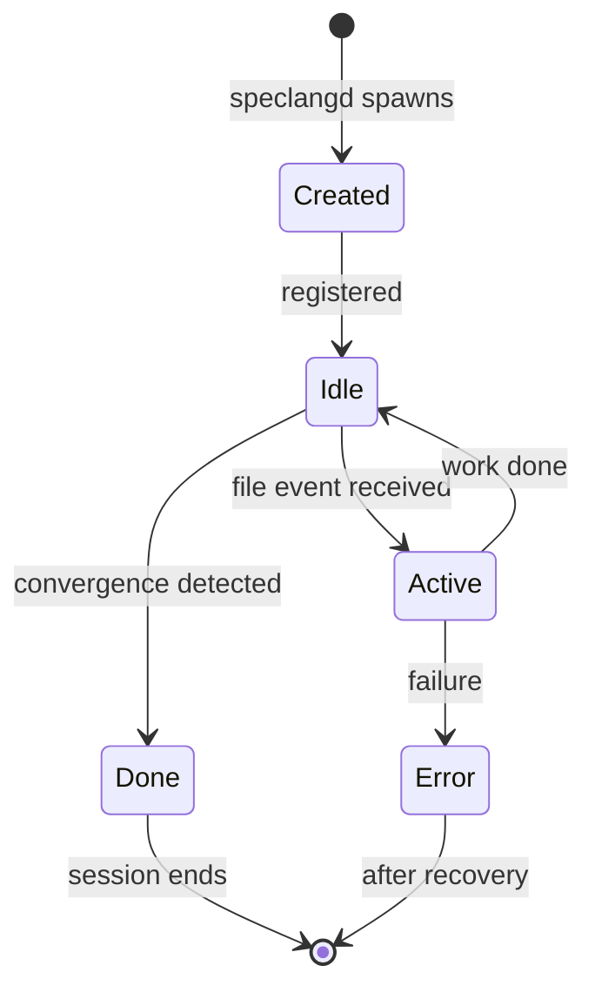
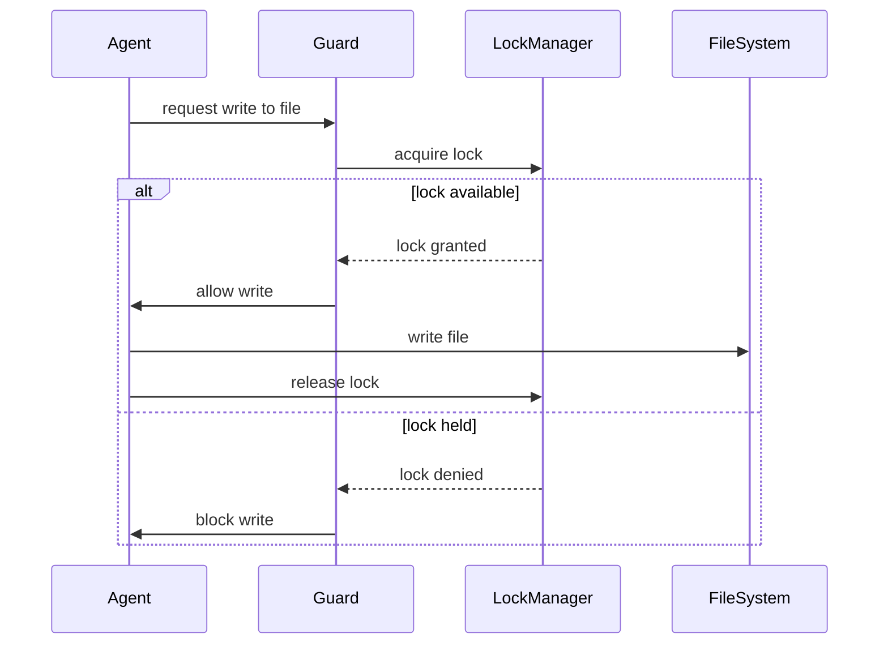

# speclang-header
id: "@speclang/agent-protocol"
version: 0.1.0
layer: 0
tags: [agents, protocol, ownership, sessions]
imports: ["@speclang/core"]
status: draft

---

# Agent Protocol

How agents communicate, own files, and respect boundaries.

## Overview

```speclang
# @block:protocol/overview @kind:note
Every agent runs in its own session. Each session owns specific files.
Agents can read anything but only write to files they own.
The guard plugin enforces this at the AI editor level.
```

---

## Sessions

### @protocol/session

```speclang
# @block:protocol/session @kind:entity
AgentSession:
  id: String                    # unique session ID
  agent: AgentKind              # type of agent
  owns: FilePattern[]           # files this session can write
  created: DateTime
  last_active: DateTime
  status: idle | active | done | error
  
AgentKind:
  - orchestrator    # user's primary AI
  - spec-writer     # expands specs
  - code-gen        # generates code
  - test-writer     # writes tests
  - back-sync       # syncs code to spec
```

### @protocol/session-lifecycle

```speclang
# @block:protocol/session-lifecycle @kind:diagram

```

---

## File Ownership

### @protocol/ownership

```speclang
# @block:protocol/ownership @kind:entity
FileOwnership:
  file: Path
  owner: SessionId
  lock: Lock?
  
Rules:
  - Each file has exactly one owner
  - Owner can read and write
  - Non-owners can only read
  - Lock prevents concurrent writes
```

### @protocol/ownership-patterns

```speclang
# @block:protocol/ownership-patterns @kind:table
| File Pattern | Owner Agent |
|--------------|-------------|
| project.scl | orchestrator |
| specs/**/*.scl | spec-writer |
| tests/**/*.test.spec.* | test-writer |
| generated/**/*.go | code-gen-go |
| generated/**/*.ts | code-gen-ts |
| generated/**/*.py | code-gen-py |
```

### @protocol/ownership-example

```speclang
# @block:protocol/ownership-example @kind:code
```yaml
# .speclang/ownership.json
{
  "sessions": {
    "sess-001": {
      "agent": "orchestrator",
      "owns": ["project.scl", "build.yaml"]
    },
    "sess-002": {
      "agent": "spec-writer",
      "owns": ["specs/**/*.scl"]
    },
    "sess-003": {
      "agent": "code-gen-go",
      "owns": ["generated/go/**/*.go"]
    }
  }
}
```
```

---

## Access Control

### @protocol/access

```speclang
# @block:protocol/access @kind:entity
AccessLevel:
  read: any file in project
  write: only owned files
  delete: only owned files
  create: only in owned directories
  
Enforcement:
  - Guard plugin intercepts all file operations
  - Blocked operations return error, logged
  - Orchestrator session is exempt (full access)
```

### @protocol/access-rules

```speclang
# @block:protocol/access-rules @kind:code
```yaml
# access rules enforced by guard plugin
rules:
  - agent: spec-writer
    can_read: ["**/*"]
    can_write: ["specs/**/*.scl", "specs/**/*.spec.*"]
    cannot_write: ["generated/**", "project.scl"]
    
  - agent: code-gen-go
    can_read: ["**/*"]
    can_write: ["generated/go/**"]
    cannot_write: ["specs/**", "tests/**"]
    
  - agent: orchestrator
    can_read: ["**/*"]
    can_write: ["**/*"]  # full access
    exempt_from_guard: true
```
```

---

## Communication

### @protocol/events

```speclang
# @block:protocol/events @kind:entity
AgentEvent:
  kind: create | modify | delete
  path: FilePath
  session: SessionId?
  timestamp: DateTime
  
EventRouting:
  1. speclangd detects file change
  2. speclangd identifies file owner
  3. speclangd sends event to owner's session
  4. Agent receives and processes
```

### @protocol/event-format

```speclang
# @block:protocol/event-format @kind:code
```json
{
  "event": "modify",
  "path": "specs/auth.scl",
  "timestamp": "2024-01-15T10:30:00Z",
  "session": "sess-002",
  "diff": {
    "added": 15,
    "removed": 3,
    "blocks_changed": ["auth/login", "auth/user"]
  }
}
```
```

---

## Guard Plugin

### @protocol/guard

```speclang
# @block:protocol/guard @kind:entity
GuardPlugin:
  name: speclang-guard
  targets: OpenCode, VS Code, Cursor, Windsurf
  
  purpose: enforce file ownership at AI editor level
  
  behavior:
    - Intercepts all file write requests from agents
    - Checks if agent owns the file
    - Blocks if not owner, allows if owner
    - Logs all blocked attempts
    - Orchestrator sessions are whitelisted
```

### @protocol/guard-check

```speclang
# @block:protocol/guard-check @kind:pseudocode
```
on_file_write(agent, path):
  session = get_session(agent)
  
  if session.is_orchestrator:
    return ALLOW  # full access
    
  if session.owns(path):
    return ALLOW
    
  log("BLOCKED: {agent} tried to write {path}")
  return DENY
```
```

### @protocol/guard-skill-marker

```speclang
# @block:protocol/guard-skill-marker @kind:note
Skills that should be guarded include a marker:

```yaml
# SKILL.md
---
speclang-agent: true
session-type: spec-writer
owns: specs/**/*.scl
---
```

The guard only applies to skills with `speclang-agent: true`.
User-created skills without this marker are not restricted.
```

---

## Locking

### @protocol/lock

```speclang
# @block:protocol/lock @kind:entity
FileLock:
  file: Path
  holder: SessionId
  acquired: DateTime
  expires: DateTime
  
LockRules:
  - Required before any write
  - Auto-expires after 30s
  - Only owner can acquire lock
  - Lock released after write complete
```

### @protocol/lock-flow

```speclang
# @block:protocol/lock-flow @kind:diagram

```

---

## Session Management

### @protocol/session-api

```speclang
# @block:protocol/session-api @kind:entity
SessionAPI:
  base_url: http://localhost:{port}
  
  endpoints:
    POST /session/create
      body: { agent, owns }
      response: { session_id }
      
    GET /session/{id}/status
      response: { status, files, last_active }
      
    POST /session/{id}/event
      body: { kind, path, details }
      response: { accepted }
      
    DELETE /session/{id}
      response: { ok }
```

---

## Concurrency

### @protocol/concurrency

```speclang
# @block:protocol/concurrency @kind:entity
ConcurrencyModel:
  description: "Multiple agents run concurrently, one per file"
  
  guarantees:
    - No two agents write same file
    - Reads are always allowed
    - Writes are serialized per file
    - Agents can read while another writes
    
  limits:
    - max_concurrent_agents: 50 (configurable)
    - max_file_changes_per_cascade: 100
```

---

## Error Handling

### @protocol/errors

```speclang
# @block:protocol/errors @kind:entity
AgentError:
  types:
    - AccessDenied: tried to write non-owned file
    - LockTimeout: couldn't acquire lock
    - SessionNotFound: invalid session ID
    - AgentTimeout: agent didn't respond
    
  recovery:
    - log error to .speclang/errors/
    - notify orchestrator if critical
    - retry with backoff for transient errors
    - abort session after max retries
```

---

## Custom Agents

### @protocol/custom

```speclang
# @block:protocol/custom @kind:entity
CustomAgent:
  description: "Users can create their own agents"
  
  steps:
    1. Create SKILL.md without speclang-agent marker
    2. Agent has full read/write access (not guarded)
    3. Or, add speclang-agent: true to restrict
    4. Define owns pattern for file ownership
    
  example:
    ```yaml
    ---
    name: my-custom-agent
    speclang-agent: true
    owns: custom/**/*.generated.*
    ---
    ```
```
