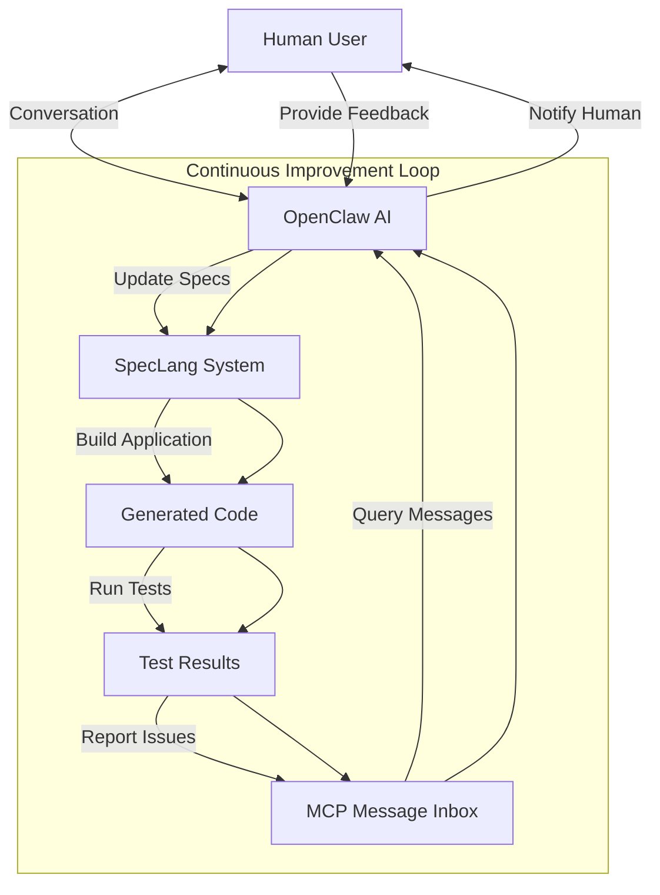

# speclang-header lines:10
id: "@speclang/cascade/continuous-improvement"
version: 0.1.0
layer: 2
tags: [cascade, continuous-improvement, loop, self-improving, openclaw]
parent: "@ref:specs/cascade"
project_level: Alpha
agent_support: agent_autonomous
short: Continuous Improvement Loop - Self-improving applications like OpenClaw
---
# Continuous Improvement Loop

Enables applications that constantly evolve and improve through AI-human collaboration, similar to OpenClaw workflow.

## Overview

```speclang
# @block:continuous-improvement/overview @kind:note
Continuous Improvement Loop:

Human talks with AI (OpenClaw) → AI updates specs → SpecLang builds application → 
Reports back to AI → AI communicates with human (WhatsApp/email) → Loop continues

Key principles:
- Applications are never "finished" - always changing and improving
- AI focuses on writing specs, not code
- Human-AI collaboration through MCP message inbox
- Quality gates defined by user, not fixed thresholds
- System runs its own controlled improvement loop
```

## The OpenClaw-SpecLang Integration

### @continuous-improvement/openclaw-integration

```speclang
# @block:continuous-improvement/openclaw-integration @kind:entity
OpenClawIntegration:
  
  workflow:
    1. Human talks with OpenClaw about desired improvements
    2. OpenClaw analyzes current application state via SpecLang MCP
    3. OpenClaw updates specs based on conversation
    4. SpecLang cascade builds updated application
    5. SpecLang reports results back to OpenClaw via MCP
    6. OpenClaw communicates with human (WhatsApp/email)
    7. Loop continues with next improvement
    
  communication_channels:
    - MCP message inbox for spec issues
    - WhatsApp/email for human notifications
    - Real-time dashboard for monitoring
    - Periodic summary reports
    
  ai_focus: "Writing specs, not code"
    - OpenClaw focuses on intent and requirements
    - SpecLang handles implementation details
    - Clear separation of concerns
```

## Self-Improving System Loop

### @continuous-improvement/loop

```speclang
# @block:continuous-improvement/loop @kind:diagram

```

## Quality Gates and Iteration Control

### @continuous-improvement/quality-gates

```speclang
# @block:continuous-improvement/quality-gates @kind:entity
QualityGates:
  
  user_defined_conditions:
    - "Stop when test coverage reaches X%"
    - "Stop when performance meets Y threshold"
    - "Stop when security scan passes"
    - "Stop when user acceptance criteria met"
    - "Continue indefinitely for evolving applications"
    
  no_fixed_thresholds:
    - Applications evolve continuously
    - Quality gates adapt over time
    - Users can adjust gates mid-process
    - AI suggests appropriate gates based on project scope
    
  example_gates:
    - Weekend project: "Stop when basic functionality works"
    - Enterprise project: "Stop when all compliance requirements met"
    - Research project: "Continue indefinitely, report findings"
    
  ai_guided_iteration:
    - AI monitors progress against gates
    - Suggests when to stop iterating
    - Can ask human for clarification
    - Can propose alternative approaches
```

## MCP Message Inbox Integration

### @continuous-improvement/message-integration

```speclang
# @block:continuous-improvement/message-integration @kind:entity
MessageIntegration:
  
  ai_agent_messages:
    - SpecWriter: "Ambiguity in business logic, need clarification"
    - CodeGen: "Validation failure, cannot generate code"
    - TestWriter: "Incomplete test spec, need more scenarios"
    - Orchestrator: "Systemic issue detected, suggest architectural change"
    
  human_agent_workflow:
    1. OpenClaw queries MCP message inbox
    2. Reviews all new messages
    3. Determines which require human input
    4. Contacts human via preferred channel (WhatsApp/email)
    5. Human responds, OpenClaw updates specs
    6. OpenClaw marks messages as resolved
    7. Cascade triggers automatically
    
  automated_resolution:
    - Some messages can be resolved automatically
    - AI learns from human resolutions
    - Pattern matching for common issues
    - Escalation only when confidence low
```

## Test-Driven Improvement

### @continuous-improvement/test-driven

```speclang
# @block:continuous-improvement/test-driven @kind:entity
TestDrivenImprovement:
  
  loop:
    1. AI builds tests around each spec
    2. Tests run, failures reported
    3. AI analyzes failures, updates specs
    4. SpecLang regenerates code
    5. Tests run again
    6. Loop continues until tests pass
    
  regression_prevention:
    - All tests preserved between iterations
    - New tests added for new functionality
    - Breaking changes detected immediately
    - Rollback automatic on test failure
    
  end_to_end_testing:
    - AI generates E2E tests from user stories
    - Tests simulate real user workflows
    - Failures indicate broken functionality
    - AI fixes specs to make tests pass
```

## Reporting and Communication

### @continuous-improvement/reporting

```speclang
# @block:continuous-improvement/reporting @kind:entity
Reporting:
  
  ai_to_human_communication:
    - WhatsApp: "Your todo app now has user authentication. Test it here: [link]"
    - Email: "Weekly improvement summary: Added 5 features, fixed 3 bugs"
    - Dashboard: Real-time progress visualization
    - Periodic reports: "This week's improvements and next week's plan"
    
  human_feedback_channels:
    - Natural language: "Make the login faster"
    - Direct spec edits: Human can edit specs directly
    - Priority setting: "Focus on security this week"
    - Goal setting: "Get ready for beta launch by Friday"
    
  progress_tracking:
    - Metrics: Test coverage, performance, security score
    - Velocity: Improvements per time period
    - Quality trends: Getting better or worse
    - User satisfaction: Based on feedback
```

## Example Workflows

### @continuous-improvement/examples

```speclang
# @block:continuous-improvement/examples @kind:code
```yaml
# Example 1: Weekend project improvement
Human: "My todo app needs user accounts"
OpenClaw: "I'll add authentication. Need password requirements?"
Human: "Just basic, it's a weekend project"
OpenClaw: Updates specs/auth.spec.md with basic auth
SpecLang: Builds auth system, runs tests
OpenClaw: "Done! Your app now has login. Test at localhost:3000"

# Example 2: Enterprise security audit
OpenClaw: "Security scan found XSS vulnerability in contact form"
Human: "Fix it"
OpenClaw: Updates specs/security.spec.md with XSS protection
SpecLang: Builds secure version, runs penetration tests
OpenClaw: "Fixed! All security tests now pass"

# Example 3: Performance optimization
Human: "App feels slow"
OpenClaw: Runs performance tests, identifies bottleneck
OpenClaw: Updates specs/performance.spec.md with caching
SpecLang: Builds optimized version
OpenClaw: "Performance improved by 40%. Dashboard updated."
```

## Integration Points

### @continuous-improvement/integration

```speclang
# @block:continuous-improvement/integration @kind:entity
IntegrationPoints:
  
  with_mcp_message_protocol:
    - Message inbox for issue reporting
    - Status updates on resolution progress
    - Automated notifications to human agents
    
  with_cascade_system:
    - Automatic triggering on spec updates
    - Rollback on test failure
    - Progressive enhancement cycles
    
  with_git_history:
    - Every improvement tracked with UUID
    - Full audit trail of changes
    - Easy rollback to any point
    
  with_project_scope:
    - Improvement pace matches project scope
    - Weekend: Rapid iteration, minimal process
    - Enterprise: Systematic improvement with governance
```

## Configuration

### @continuous-improvement/configuration

```speclang
# @block:continuous-improvement/configuration @kind:entity
ContinuousImprovementConfiguration:
  
  loop_control:
    - Configured via `config.continuous_improvement` in project.scl
    - Settings: max_iterations, max_time_since_human_update, escalation_threshold
    - Defaults provide safe automatic operation
    - Can be disabled for manual control
    
  integration_with_config_schema:
    - "@ref:specs/config/schema defines ContinuousImprovementConfig
    - All loop control parameters type-safe
    - Validation ensures safe values
    
  example_configuration: |
    continuous_improvement:
      enabled: true
      max_iterations: 0  # unlimited
      max_time_since_human_update: 86400  # 24 hours
      escalation_threshold: 5
      auto_resolve_confidence_threshold: 0.8
```

## The Vision

### @continuous-improvement/vision

```speclang
# @block:continuous-improvement/vision @kind:note
The vision: A world where your AI assistant focuses on understanding your needs and writing specs, while SpecLang handles the implementation. Your application continuously improves through this collaboration.

Key benefits:
- AI focuses on what it does best: understanding intent
- SpecLang focuses on what it does best: generating correct code
- Humans stay in the loop for strategic decisions
- Applications evolve naturally over time
- No more "finished" software - only software that keeps getting better

This is the future of software development: continuous, collaborative, and adaptive.
```

## References

- "@ref:specs/mcp/messages - MCP message protocol
- @ref:specs/project-maturity-levels/depth-requirements - Depth requirements by scope
- @ref:specs/cascade - Cascade system
- @ref:specs/config/schema - Configuration schema including loop control
- @ref:specs/git-history - Git as memory system