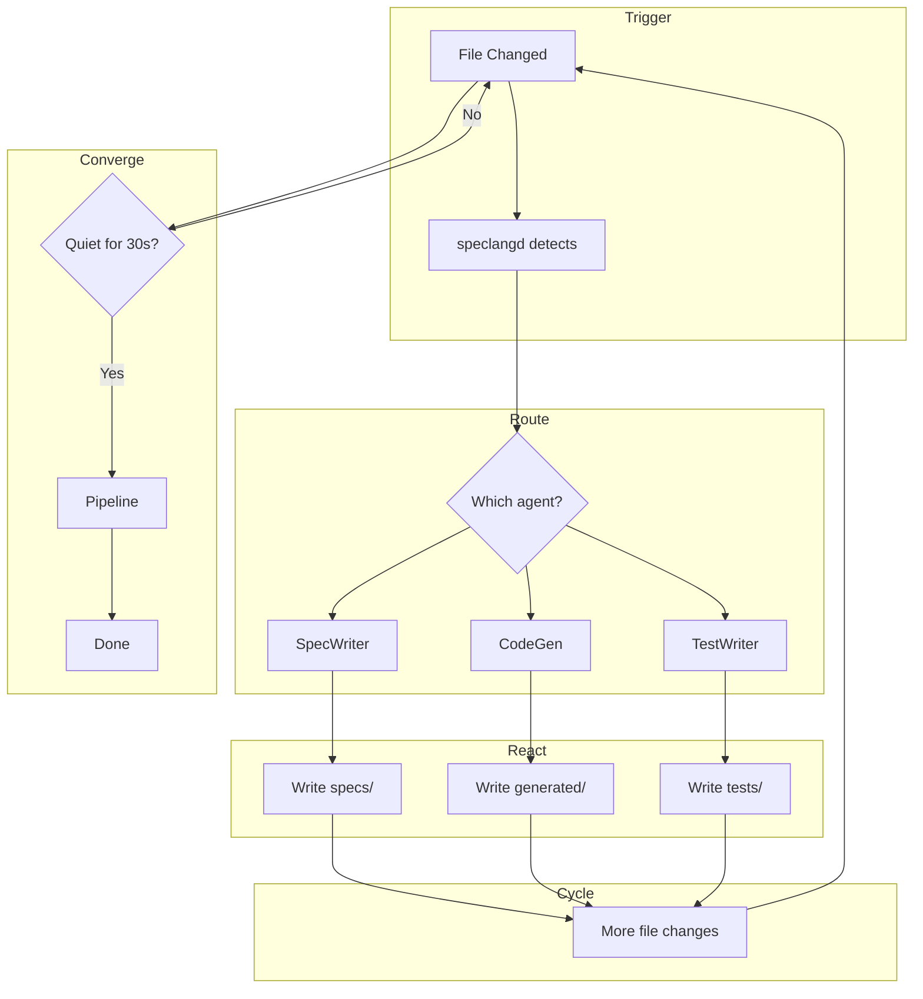
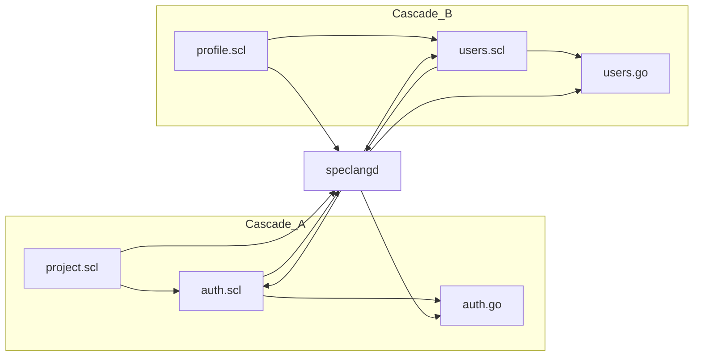
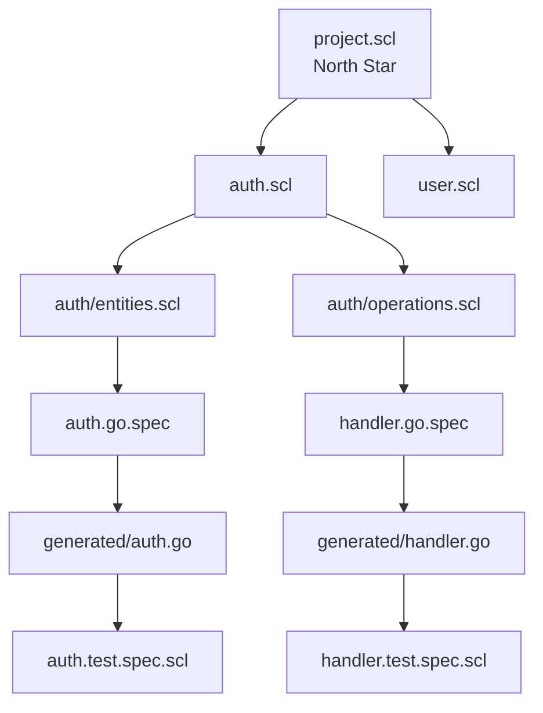

# speclang-header lines:12
id: "@speclang/cascade/triggers"
version: 0.1.0
layer: 2
tags: [cascade, reactive, loop, trigger]
status: draft
project_level: Alpha
agent_support: agent_assisted
short: Cascade Triggers
parent: "@ref:speclang/cascade"
part: 1/2
---
# Cascade Triggers

The reactive loop where files trigger files. The heart of Speclang.

## Overview

```speclang
# @block:cascade/overview @kind:note
The cascade is the never-ending cycle of:
1. File changes
2. Agent reactions
3. New file changes
4. More agent reactions
5. Repeat until convergence

It's a living system - files trigger agents, agents write files,
files trigger more agents. Like a reactor, not a compiler.
```

## The Loop

### @cascade/loop

```speclang
# @block:cascade/loop @kind:diagram

```

---

## Trigger Types

### @cascade/triggers

```speclang
# @block:cascade/triggers @kind:entity
Trigger:
  description: "What starts a cascade"
  
  types:
    user_edit:
      who: human or orchestrator
      what: edits north star or level-0 specs
      result: starts full cascade
      
    agent_write:
      who: any agent
      what: writes its owned file
      result: triggers downstream agents
      
    external:
      who: git pull, file sync
      what: files appear/change from outside
      result: detected by inotify, cascade starts
```

### @cascade/trigger-flow

```speclang
# @block:cascade/trigger-flow @kind:code
```yaml
trigger_sources:
  - source: user
    files: [project.scl, specs/core/**]
    priority: high
    starts_cascade: true
    
  - source: spec-writer
    files: [specs/**/*.scl, specs/**/*.spec.*]
    priority: normal
    triggers: [code-gen, test-writer]
    
  - source: code-gen
    files: [generated/**/*]
    priority: normal
    triggers: [test-runner]
    
  - source: external
    files: ["**/*"]
    priority: low
    triggers: depends_on_file
```
```

---

## Cascade Depth

### @cascade/depth

```speclang
# @block:cascade/depth @kind:entity
CascadeDepth:
  description: "How deep a cascade can go"
  
  limits:
    max_depth: 100
    max_files_per_cascade: 1000
    max_duration: 10 minutes
    
  depth_tracking:
    - each file change increments depth
    - depth resets on convergence
    - max depth triggers pause + notify
    
  purpose:
    - prevent infinite loops
    - detect circular dependencies
    - protect system resources
```

### @cascade/depth-example

```speclang
# @block:cascade/depth-example @kind:code
```
Depth 0:  user edits project.scl
Depth 1:  spec-writer creates auth.scl
Depth 2:  spec-writer creates auth/entities.scl
Depth 3:  spec-writer creates auth/operations.scl
Depth 4:  code-gen creates auth.go.spec
Depth 5:  code-gen creates generated/go/auth.go
Depth 6:  test-writer creates auth.test.spec.scl
Depth 7:  test-writer creates auth_test.go
Depth 8:  convergence detected
```
```

---

## Concurrent Cascades

### @cascade/concurrent

```speclang
# @block:cascade/concurrent @kind:entity
ConcurrentCascades:
  description: "Multiple cascades running at once"
  
  rules:
    - One cascade per root trigger
    - Cascades can run in parallel
    - File locks prevent conflicts
    - Each cascade has own depth counter
  
  example:
    Cascade A: user edits project.scl → auth system
    Cascade B: user edits another feature → user profile
    Both run concurrently, different files
```

### @cascade/concurrent-diagram

```speclang
# @block:cascade/concurrent-diagram @kind:diagram

```

---

## Cascade Events

### @cascade/events

```speclang
# @block:cascade/events @kind:entity
CascadeEvent:
  cascade_id: String
  depth: Int
  trigger: FileChange
  agent: SessionId
  output: FilePath[]
  timestamp: DateTime
  
EventLog:
  location: .speclang/cascade.log
  format: JSON lines
  purpose: debugging, rollback, analysis
```

### @cascade/event-example

```speclang
# @block:cascade/event-example @kind:code
```json
{"cascade_id":"cas-001","depth":2,"trigger":{"file":"specs/auth.scl","kind":"modify"},"agent":"spec-writer","output":["specs/auth/entities.scl"],"timestamp":"2024-01-15T10:30:01Z"}
{"cascade_id":"cas-001","depth":3,"trigger":{"file":"specs/auth/entities.scl","kind":"create"},"agent":"code-gen-go","output":["generated/go/auth/entities.go"],"timestamp":"2024-01-15T10:30:02Z"}
{"cascade_id":"cas-001","depth":4,"trigger":{"file":"generated/go/auth/entities.go","kind":"create"},"agent":"test-writer","output":["tests/auth/entities.test.spec.scl"],"timestamp":"2024-01-15T10:30:03Z"}
```
```

---

## Cascade Control

### @cascade/control

```speclang
# @block:cascade/control @kind:entity
CascadeControl:
  description: "How to control the cascade"
  
  commands:
    /pause: stop cascade, keep state
    /resume: continue paused cascade
    /abort: kill cascade, rollback
    /step: one iteration, then pause
    /status: show cascade state
    
  limits:
    max_cascades: 10 concurrent
    max_depth: 100
    max_files: 1000
    max_time: 10 minutes
    
  on_limit:
    - pause cascade
    - notify orchestrator
    - wait for /resume or /abort
```

---

## Cascade Graph

### @cascade/graph

```speclang
# @block:cascade/graph @kind:entity
CascadeGraph:
  description: "The directed graph of file dependencies"
  
  nodes:
    - spec files
    - generated files
    - test files
  
  edges:
    - "@ref: spec → spec"
    - produces: spec → generated
    - tests: test → generated
  
  properties:
    - acyclic (no circular deps)
    - single source (north star)
    - multiple sinks (final code files)
```

### @cascade/graph-example

```speclang
# @block:cascade/graph-example @kind:diagram

```

---

## Loop Prevention

### @cascade/loop-prevention

```speclang
# @block:cascade/loop-prevention @kind:entity
LoopPrevention:
  description: "Prevent infinite cascades"
  
  watcher_ignores:
    # Respect .gitignore (OpenCode style)
    - Uses: .gitignore patterns
    - Plus: [".speclang/", "*.log", "reports/", ".git/"]
    - Support negation: !path/to/spec
  
  # System generated files never trigger
  ignore_patterns:
    - "*.log"                    # Log files
    - "reports/**/*"           # Test reports
    - ".speclang/**/*"         # Internal state
    - "generated/**/*"         # Only trigger on .spec files
  
  # Only spec files trigger cascades
  watch_patterns:
    - "**/*.spec.{md,yaml,yml,scl}"    # Spec files
    - "**/*.{go,ts,js,py,rs,java}.spec" # Code specs
    - "**/project.scl"                  # North Star
    - "**/build.{scl,yaml}"           # Build config
  
  why_it_works:
    - Test results written to reports/
    - Logs written to .speclang/logs/
    - Generated code watched but...
    - Only .go.spec files trigger, not .go files
    - Result: test results don't re-trigger tests
```