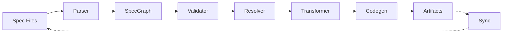

# Compiler Phases

Transforms specs into code. Multi-target. Bidirectional.

## Overview

```speclang
# @block:compiler/overview @kind:diagram

```

## Pipeline

### @compiler/parse

```speclang
# @block:compiler/parse @kind:operation
parse(sources: File[]) -> SpecGraph

Steps:
  1. Read each file
  2. Extract header
  3. Parse blocks
  4. Extract refs
  5. Build graph

Output:
  - nodes: all blocks with IDs
  - edges: refs between blocks
  - headers: file metadata
  - errors: parse failures
```

### @compiler/validate

```speclang
# @block:compiler/validate @kind:operation
validate(graph: SpecGraph) -> ValidationResult

Checks:
  - header format valid
  - block IDs unique
  - refs point to existing blocks
  - kind-specific syntax valid
  - no circular deps (or marked as intentional)

Output:
  - valid: bool
  - errors: list with locations
  - warnings: list with suggestions
```

### @compiler/resolve

```speclang
# @block:compiler/resolve @kind:operation
resolve(graph: SpecGraph) -> ResolvedGraph

Steps:
  1. Expand imports
  2. Inline stdlib refs
  3. Calculate dependency order
  4. Type all expressions
  5. Bind all refs

Output:
  - ordered blocks
  - resolved types
  - dependency map
```

### @compiler/transform

```speclang
# @block:compiler/transform @kind:operation
transform(graph: ResolvedGraph, target: Target) -> IR

Steps:
  1. Lower to target-agnostic IR
  2. Apply target-specific transforms
  3. Optimize
  4. Prepare for codegen

IR:
  - entities -> structs/classes
  - operations -> functions/methods
  - policies -> middleware/guards
  - diagrams -> comments or skip
```

### @compiler/codegen

```speclang
# @block:compiler/codegen @kind:operation
codegen(ir: IR, target: Target) -> Artifact[]

Targets:
  - typescript: .ts files
  - go: .go files
  - rust: .rs files
  - python: .py files
  - openapi: .yaml spec
  - jsonschema: .json schemas

Each artifact:
  - path: output location
  - content: generated code
  - markers: @speclang-id refs back to source
```

## Bidirectional Sync

### @compiler/detect-drift

```speclang
# @block:compiler/detect-drift @kind:operation
detectDrift(spec: SpecGraph, files: File[]) -> DriftReport

Steps:
  1. Parse generated file markers
  2. Compare with current spec
  3. Detect manual edits
  4. Detect spec changes

Output:
  - spec_ahead: spec changed, code stale
  - code_ahead: code changed, spec stale
  - in_sync: no drift
```

### @compiler/sync-code-to-spec

```speclang
# @block:compiler/sync-code-to-spec @kind:operation
syncCodeToSpec(code: Code, spec: Block) -> BlockUpdate

When code was edited:
  1. Parse code with markers
  2. Extract logic/structure
  3. Propose spec block update
  4. Ask user to accept/reject
  5. Update spec if accepted

refs: [@speclang/sync]
```

### @compiler/sync-spec-to-code

```speclang
# @block:compiler/sync-spec-to-code @kind:operation
syncSpecToCode(spec: Block, code: Code) -> CodeUpdate

When spec was edited:
  1. Parse spec changes
  2. Find affected generated files
  3. Regenerate those files
  4. Diff and show changes
  5. Write if approved

refs: [@speclang/compile]
```

## Incremental Compilation

### @compiler/incremental

```speclang
# @block:compiler/incremental @kind:operation
compileIncremental(graph: SpecGraph, changed: BlockId[]) -> Artifact[]

Steps:
  1. Find transitive deps of changed blocks
  2. Only recompile affected scope
  3. Reuse cached IR where possible
  4. Write only changed artifacts

Benefits:
  - low-latency watch mode
  - efficient CI
```

### @compiler/cache

```speclang
# @block:compiler/cache @kind:entity
CompileCache:
  location: .speclang/cache
  entries:
    - blockId -> IR hash
    - IR hash -> artifact hash
  
  invalidation:
    - spec content changed
    - import version changed
    - compiler version changed
```

## Plugins

### @compiler/plugin-api

```speclang
# @block:compiler/plugin-api @kind:entity
CompilerPlugin:
  name: String
  version: SemVer
  
  hooks:
    - beforeParse(source) -> source
    - afterParse(graph) -> graph
    - beforeValidate(graph) -> graph
    - afterValidate(result) -> result
    - beforeTransform(ir) -> ir
    - beforeCodegen(ir, target) -> ir
    - afterCodegen(artifacts) -> artifacts
```

### @compiler/builtin-plugins

```speclang
# @block:compiler/builtin-plugins @kind:note
Built-in plugins:
  - mermaid-validator: validates diagram syntax
  - ref-resolver: resolves @id references
  - stdlib-inliner: inlines stdlib blocks
  - layer-enforcer: warns on missing layers
```

## Error Handling

### @compiler/errors

```speclang
# @block:compiler/errors @kind:entity
CompileError:
  code: String          # E001, E002, etc
  message: String
  location: Location
  block: BlockId?
  suggestions: String[]

Location:
  file: String
  line: Int
  column: Int
  endLine: Int?
  endColumn: Int?
```

### @compiler/error-codes

```speclang
# @block:compiler/error-codes @kind:table
| Code | Meaning |
|------|---------|
| E001 | Invalid header |
| E002 | Missing header |
| E003 | Duplicate block ID |
| E004 | Unresolved ref |
| E005 | Invalid block syntax |
| E006 | Circular dependency |
| E007 | Type mismatch |
| E008 | Unknown kind |
| W001 | Missing layer |
| W002 | Unused import |
```

## Lockfile

### @compiler/lockfile

```speclang
# @block:compiler/lockfile @kind:entity
Lockfile:
  version: SemVer
  compiler_version: SemVer
  entries: LockEntry[]
  generated_at: DateTime

LockEntry:
  spec_id: String
  spec_version: SemVer
  spec_hash: String
  artifacts: ArtifactEntry[]

ArtifactEntry:
  path: String
  hash: String
  target: String

Purpose:
  - detect drift
  - enable reproducible builds
  - track what version generated what
```