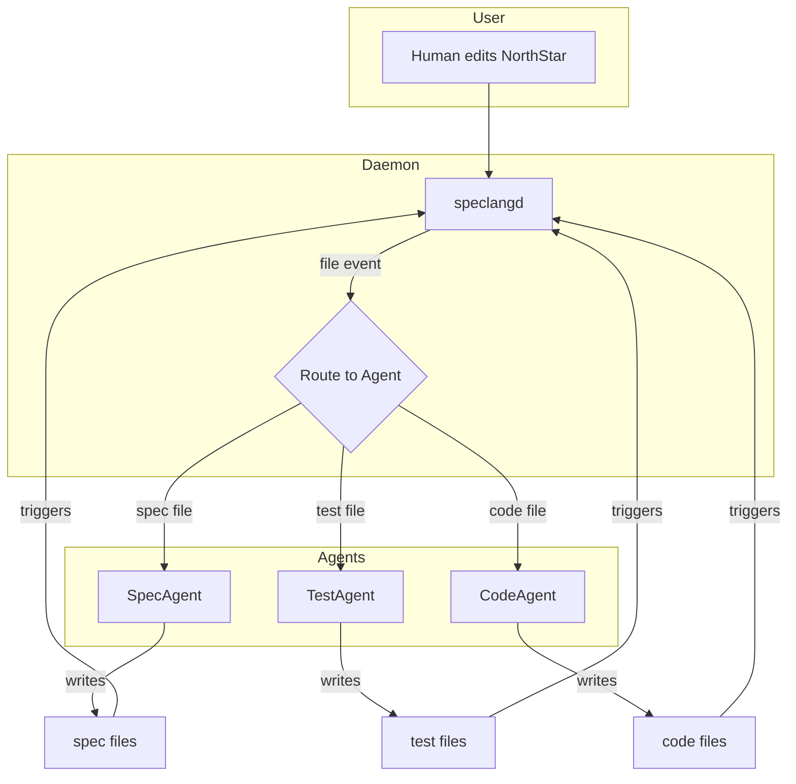

## The Reactive Loop

### @speclang/cascade

```speclang
# @block:speclang/cascade @kind:diagram

```

### @speclang/convergence

```speclang
# @block:speclang/convergence @kind:entity
Convergence:
  description: "How the system knows it's done"
  
  signals:
    - quiet_period: no file changes for N seconds
    - user_command: /finalize in north star
    - explicit_done: agent marks itself complete
    
  default:
    quiet_period: 30 seconds
    
  on_converge:
    - commit all changes
    - run tests
    - report status
    - await next user input
```