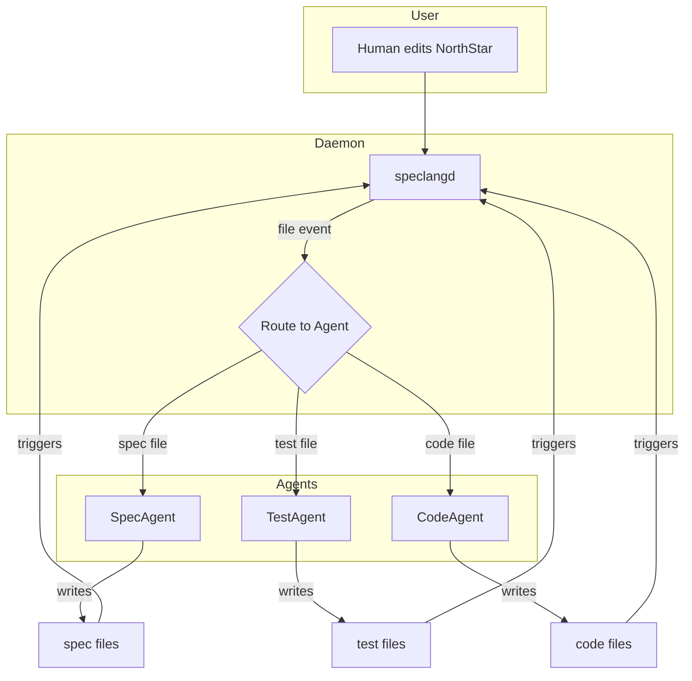

# speclang-header lines:10
id: "@speclang/core"
version: 0.1.0
layer: 0
project_level: Alpha
agent_support: agent_autonomous
tags: [core, architecture, reactive]
status: draft

---

# Speclang Core

A reactive multi-agent system where specs self-assemble into code.

## The Big Idea

```
Human writes natural language → North Star file
     ↓
inotify daemon detects change
     ↓
Owning agent reacts, creates/updates files
     ↓
More inotify events, more agents react
     ↓
Cascade until quiet (convergence)
     ↓
Final output: clean Go/TS/Rust/Java/etc.
```

## Core Concepts

### @speclang/daemon

```speclang
# @block:speclang/daemon @kind:entity
speclangd:
  description: "File watcher daemon (inotify-based)"
  triggers: file create/modify/delete
  broadcasts: change events to owning agents
  detects: convergence (quiet period)
  
  responsibilities:
    - watch specs/ directory
    - watch generated/ directory
    - route events to correct agent sessions
    - manage file locks for concurrent writes
    - detect when cascade is complete
```

### @speclang/agent

```speclang
# @block:speclang/agent @kind:entity
Agent:
  id: String              # unique agent identifier
  owns: FilePattern[]     # which files this agent handles
  triggers: ChangeKind[]  # what events wake it
  produces: FilePattern[] # what files it outputs
  
  lifecycle:
    - idle: waiting for event
    - active: processing file change
    - blocked: waiting for upstream
    - done: no more work needed

AgentKind:
  - NorthStar: user intent, high-level direction
  - SpecWriter: expands specs from north star
  - CodeGen: generates target language code
  - TestWriter: writes test specs and test code
  - BackSync: syncs code changes back to specs
```

### @speclang/northstar

```speclang
# @block:speclang/northstar @kind:entity
NorthStar:
  description: "The top-level spec the user edits"
  file: project.scl (or user-defined)
  purpose: single source of human intent
  
  contents:
    - project description
    - high-level requirements
    - technology choices
    - active pointers to all specs
  
  special:
    - everything references back to here
    - user's main conversation point
    - AI reads this for full context
```

### @speclang/pointer-graph

```speclang
# @block:speclang/pointer-graph @kind:entity
PointerGraph:
  description: "Universal reference system"
  
  format:
    @ref:path/to/file#block-id
    
  examples:
    @ref:northstar#auth
    @ref:specs/auth#login-handler
    @ref:generated/auth.ts#login-fn
    
  purpose:
    - AI never loses context
    - every file points to dependencies
    - north star is always reachable
    
  markers:
    // SPECLANG-ID: @ref:specs/auth#login
    // SPECLANG-PARENT: @ref:northstar#auth
```

### @speclang/autonomous-readiness

```speclang
# @block:speclang/autonomous-readiness @kind:entity
AutonomousReadiness:
  description: "Spec depth and completeness for autonomous agent usage"
  
  fields:
    - layer: abstraction depth (0-10)
    - project_level: maturity stage (POC, MVP, Alpha, Beta, Production, Startup, SMB, MSB, Enterprise)
    - agent_support: readiness level (human_only, agent_assisted, agent_autonomous)
  
  goal:
    - specs should have enough depth to be used by autonomous agents totally
    - agents can generate code, tests, and further specs without human intervention
    - spec completeness increases with project_level maturity
  
  guidelines:
    - POC: minimal specs, human-heavy
    - MVP: specs detailed enough for agent-assisted generation
    - Alpha/Beta: agent_autonomous capable for most features
    - Production: full autonomous agent support with validation
```

---

## The Reactive Loop

### @speclang/cascade

```speclang
# @block:speclang/cascade @kind:diagram

```

### @speclang/convergence

```speclang
# @block:speclang/convergence @kind:entity
Convergence:
  description: "How the system knows it's done"
  
  signals:
    - quiet_period: no file changes for N seconds
    - user_command: /finalize in north star
    - explicit_done: agent marks itself complete
    
  default:
    quiet_period: 30 seconds
    
  on_converge:
    - commit all changes
    - run tests
    - report status
    - await next user input
```

---

## File Types

### @speclang/spec-file

```speclang
# @block:speclang/spec-file @kind:entity
SpecFile:
  extension: .scl
  format: header + blocks
  purpose: describe what to build
  
  kinds:
    - feature.spec.scl: entities, operations
    - test.spec.scl: natural language tests
    - config.spec.scl: configuration
    - northstar.scl: top-level intent
```

### @speclang/test-spec

```speclang
# @block:speclang/test-spec @kind:entity
TestSpec:
  description: "Tests written as specs in natural language"
  
  format:
    # @block:tests/auth.login @kind:test
    Test: User can log in with valid credentials
    
    Given: user exists with email "test@example.com"
    And: password is "secret123"
    When: login is called
    Then: returns success with valid token
    And: session is created
    
    TargetFile: tests/auth.test.go
    Refs: [@ref:specs/auth#login]
```

### @speclang/generated-file

```speclang
# @block:speclang/generated-file @kind:entity
GeneratedFile:
  description: "Output code in target language"
  
  markers:
    // SPECLANG-ID: @ref:specs/auth#login
    // SPECLANG-NORTHSTAR: @ref:northstar#auth
    // SPECLANG-VERSION: 1.0.0
    // SPECLANG-GENERATED: DO NOT EDIT
    
  back_sync:
    - if human edits, BackSyncAgent proposes spec update
    - bidirectional integrity maintained
```

---

## Agent Responsibilities

### @speclang/spec-agent

```speclang
# @block:speclang/spec-agent @kind:entity
SpecAgent:
  owns: specs/**/*.scl
  listens_to: northstar changes, other spec changes
  
  on_event:
    1. read changed file
    2. find refs to expand
    3. generate/update downstream specs
    4. write new spec files
    5. update pointer graph
```

### @speclang/code-agent

```speclang
# @block:speclang/code-agent @kind:entity
CodeAgent:
  owns: generated/**/*.{go,ts,py,rs,java}
  listens_to: spec file changes
  
  on_event:
    1. read spec file
    2. resolve all refs
    3. generate target language code
    4. inject SPECLANG markers
    5. write to generated/
```

### @speclang/test-agent

```speclang
# @block:speclang/test-agent @kind:entity
TestAgent:
  owns: tests/**/*.test.spec.scl, tests/**/*_test.{go,ts,py}
  listens_to: test spec changes, code changes
  
  on_event:
    1. read test spec
    2. parse natural language criteria
    3. generate test code in target language
    4. run tests
    5. report results back to spec
```

### @speclang/backsync-agent

```speclang
# @block:speclang/backsync-agent @kind:entity
BackSyncAgent:
  owns: nothing (reads generated/)
  listens_to: generated file changes (human edits)
  
  on_event:
    1. detect non-AI edit to generated file
    2. parse change with SPECLANG markers
    3. propose spec update
    4. if approved, update spec file
```

---

## Skills Pack

### @speclang/skills

```speclang
# @block:speclang/skills @kind:entity
SkillsPack:
  description: "AI editor skills for Speclang"
  
  structure:
    speclang-skills/
      SpecWriter/
        SKILL.md
        prompts/
      CodeGen/
        SKILL.md
        prompts/
      TestWriter/
        SKILL.md
        prompts/
      Orchestrator/
        SKILL.md
        prompts/
  
  usage:
    - download to ~/.speclang/skills/
    - point editor to skills folder
    - editor loads skills automatically
```

---

## Concurrency Model

### @speclang/concurrency

```speclang
# @block:speclang/concurrency @kind:entity
Concurrency:
  model: one agent session per file
  
  safety:
    - file locks prevent write conflicts
    - read operations are concurrent
    - write operations are serialized per file
    - agents can read while another writes
    
  flow:
    1. daemon detects change
    2. daemon finds owning agent
    3. daemon notifies agent
    4. agent acquires lock
    5. agent reads/writes
    6. agent releases lock
    7. daemon sees new changes
    8. repeat
```

---

## Project Layout

```speclang
# @block:speclang/layout @kind:entity
ProjectLayout:
  project.scl          # north star (user edits this)
  specs/               # spec files (agents write these)
    auth.scl
    users.scl
    ...
  tests/               # test specs + generated tests
    auth.test.spec.scl
    auth_test.go
  generated/           # output code
    go/
      auth/
        handler.go
      users/
        model.go
  .speclang/
    daemon.pid
    lockfile.json
    skills/            # local skills override
```

---

## See Also

- @speclang/daemon-impl - Rust implementation
- @speclang/skills-pack - skill definitions
- @speclang/test-specs - test spec format
- @speclang/pointers - reference system
