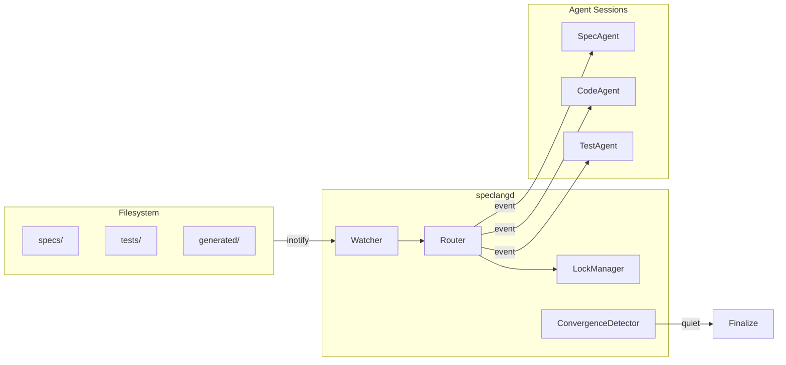
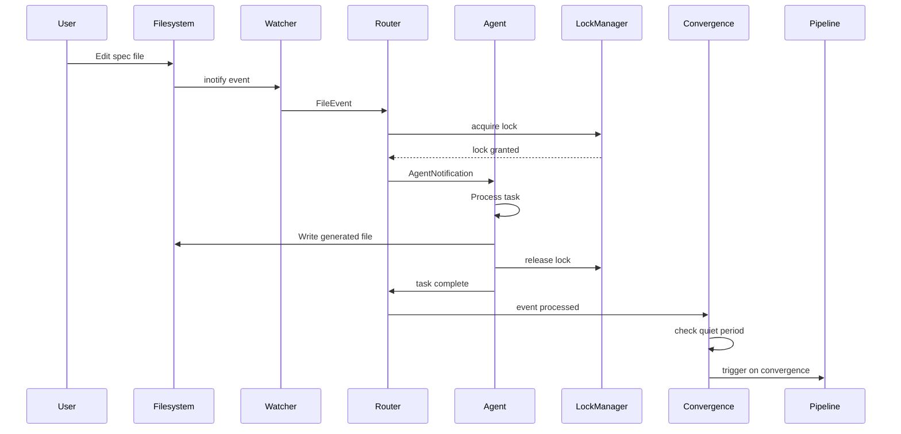

# Daemon Architecture

Overview and architectural components of speclangd.

The reactive file watcher daemon. Rust binary, ~5MB, cross-platform.

## Overview

```speclang
# @block:daemon/overview @kind:entity
speclangd:
  language: Rust
  size: ~5MB binary
  platforms: Linux, macOS, Windows
  
  responsibilities:
    - watch file system for changes
    - route events to owning agents
    - manage concurrency and locks
    - detect convergence
```

## Architecture

### @daemon/components

```speclang
# @block:daemon/components @kind:diagram

```

## Event Flow

### @daemon/event-sequence

```speclang
# @block:daemon/event-sequence @kind:diagram

```

## Lock Manager

### @daemon/locks

```speclang
# @block:daemon/locks @kind:entity
LockManager:
  purpose: prevent concurrent write conflicts
  
  lock_file: .speclang/locks/{file-path}.lock
  
  lock_contents:
    agent_id: who holds the lock
    acquired_at: timestamp
    file_hash: content hash when locked
  
  protocol:
    1. agent requests lock
    2. if no lock exists, grant it
    3. if lock exists and expired (>30s), force grant
    4. agent writes file
    5. agent releases lock
  
  timeout: 30 seconds (auto-release)
```

### @daemon/lock-impl

```speclang
# @block:daemon/lock-impl @kind:code
```rust
pub struct LockManager {
    locks_dir: PathBuf,
    timeout: Duration,
}

impl LockManager {
    pub fn acquire(&self, file: &Path, agent: &str) -> Result<Lock, LockError> {
        let lock_path = self.lock_path(file);
        
        if lock_path.exists() {
            let lock: Lock = read_json(&lock_path)?;
            if !lock.is_expired(self.timeout) {
                return Err(LockError::Held(lock.agent));
            }
        }
        
        let lock = Lock::new(agent);
        write_json(&lock_path, &lock)?;
        Ok(lock)
    }
    
    pub fn release(&self, file: &Path) {
        let lock_path = self.lock_path(file);
        fs::remove_file(lock_path).ok();
    }
}
```
```

---

## Agent Communication

### @daemon/agent-api

```speclang
# @block:daemon/agent-api @kind:entity
AgentAPI:
  protocol: HTTP (local) or IPC
  
  endpoints:
    POST /event
      body: { kind, file, diff?, timestamp }
      response: { accepted: bool }
    
    GET /status
      response: { status, current_file, queue_depth }
    
    POST /lock/acquire
      body: { file }
      response: { granted: bool, lock_id? }
    
    POST /lock/release
      body: { file, lock_id }
      response: { ok: bool }
```

---

## CLI Interface

### @daemon/cli

```speclang
# @block:daemon/cli @kind:entity
speclangd commands:

  speclangd start
    starts the daemon in background
    
  speclangd stop
    stops the daemon
    
  speclangd status
    shows daemon status, watched files, agent states
    
  speclangd attach
    attaches to daemon output (logs)
    
  speclangd trigger <file>
    manually trigger an event (for testing)
    
  speclangd converge
    wait for convergence, then exit
    
Options:
  --config      path to .speclangrc
  --quiet       set quiet period (default: 30s)
  --port        agent API port (default: 7777)
```

---

## Configuration

### @daemon/config

```speclang
# @block:daemon/config @kind:entity
DaemonConfig:
  watch_dirs:
    - specs/
    - tests/
    - generated/
    - project.scl
  
  quiet_period: 30s
  
  agent_api:
    port: 7777
    host: localhost
  
  locks:
    dir: .speclang/locks
    timeout: 30s
  
  logging:
    level: info
    file: .speclang/daemon.log
```

---

## Error Handling

### @daemon/errors

```speclang
# @block:daemon/errors @kind:entity
DaemonError:
  - WatchFailed: can't watch directory
  - AgentUnreachable: agent not responding
  - LockTimeout: couldn't acquire lock
  - ConfigError: bad configuration
  
Recovery:
  - retry agent notification (3x)
  - force release stale locks
  - continue on non-fatal errors
  - log everything
```

---

## Deployment Modes

### @daemon/deployment-modes

```speclang
# @block:daemon/deployment-modes @kind:entity
DeploymentModes:
  light:
    description: TypeScript daemon using chokidar
    components:
      - chokidar cross-platform file events
      - TypeScript agent sessions
      - No separate daemon process
    use_cases:
      - Small projects
      - Development environments
      - Quick prototyping
  
  enterprise:
    description: Rust daemon with MCP server
    components:
      - Rust daemon (speclangd)
      - Raw inotify/fsnotify
      - MCP server for agent communication
      - SQLite database for state
    use_cases:
      - Large codebases
      - Production deployments
      - Team collaboration
      - Enterprise security requirements
```

## Binary Distribution

### @daemon/dist

```speclang
# @block:daemon/dist @kind:entity
Binaries:
  speclangd-linux-amd64
  speclangd-linux-arm64
  speclangd-darwin-amd64
  speclangd-darwin-arm64
  speclangd-windows-amd64.exe

Size: ~5MB each

Install:
  curl -sSL https://speclang.dev/install | sh
  
Or:
  cargo install speclangd
```
