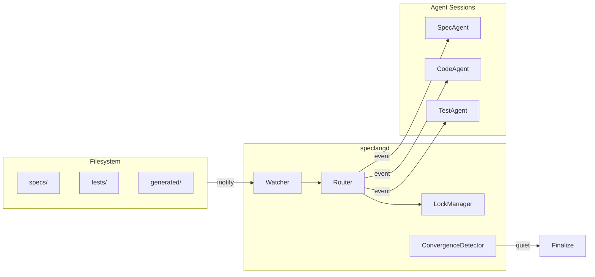

# speclang-header lines:9
id: "@speclang/daemon"
version: 0.1.0
layer: 0
tags: [daemon, inotify, watcher, rust]
imports: ["@speclang/core"]
status: draft

---

# speclangd

The reactive file watcher daemon. Rust binary, ~5MB, cross-platform.

## Overview

```speclang
# @block:daemon/overview @kind:entity
speclangd:
  language: Rust
  size: ~5MB binary
  platforms: Linux, macOS, Windows
  
  responsibilities:
    - watch file system for changes
    - route events to owning agents
    - manage concurrency and locks
    - detect convergence
```

## Architecture

### @daemon/components

```speclang
# @block:daemon/components @kind:diagram

```

---

## Watcher

### @daemon/watcher

```speclang
# @block:daemon/watcher @kind:entity
Watcher:
  library: notify crate (Rust)
  
  patterns:
    # Primary spec patterns
    - "**/*.spec.{md,yaml,yml,scl}"      # e.g., auth.spec.yaml, auth.spec.md
    - "**/*.{go,ts,js,py,rs,java}.spec"  # e.g., auth.go.spec, auth.ts.spec
    - "**/project.scl"                    # North Star
    - "**/build.scl"                      # Build config
    - "**/build.yaml"                     # Pipeline config
    
  # Ignore patterns (respect .gitignore)
  ignore:
    - Uses: .gitignore rules
    - Plus: [".speclang/", "*.log", "reports/"]
    - System generated never triggers
    
  gitignore_support:
    - Read .gitignore from project root
    - Support negation: !path/to/spec
    - Cache patterns for performance
    - Watch .gitignore for changes
  
  events:
    - Create: new file
    - Modify: content changed  
    - Delete: file removed
    - Rename: file moved
  
  debounce: 100ms (batch rapid changes)
```

### @daemon/watcher-impl

```speclang
# @block:daemon/watcher-impl @kind:code
```rust
use notify::{Watcher, RecursiveMode, watcher};
use std::sync::mpsc::channel;
use glob::Pattern;

pub struct FileWatcher {
    watcher: RecommendedWatcher,
    gitignore: Gitignore,
    spec_patterns: Vec<Pattern>,
}

impl FileWatcher {
    pub fn new() -> Self {
        let spec_patterns = vec![
            Pattern::new("**/*.spec.{md,yaml,yml,scl}").unwrap(),
            Pattern::new("**/*.{go,ts,js,py,rs,java}.spec").unwrap(),
            Pattern::new("**/project.scl").unwrap(),
            Pattern::new("**/build.{scl,yaml}").unwrap(),
        ];
        
        let gitignore = Gitignore::from_file(".gitignore")
            .unwrap_or_default()
            .add(".speclang/")
            .add("*.log")
            .add("reports/");
            
        FileWatcher {
            watcher: watcher(tx, Duration::from_millis(100)).unwrap(),
            gitignore,
            spec_patterns,
        }
    }
    
    pub fn should_watch(&self, path: &Path) -> bool {
        // Check gitignore first
        if self.gitignore.is_ignored(path) {
            return false;
        }
        
        // Check if matches spec patterns
        let path_str = path.to_string_lossy();
        self.spec_patterns.iter().any(|p| p.matches(&path_str))
    }
    
    pub fn handle_event(&self, event: Event) -> Option<SpecEvent> {
        let path = event.paths.first()?;
        
        if !self.should_watch(path) {
            return None; // Silently ignore
        }
        
        Some(SpecEvent {
            kind: event.kind,
            path: path.clone(),
            timestamp: Instant::now(),
        })
    }
}
```
```

---

## Router

### @daemon/router

```speclang
# @block:daemon/router @kind:entity
Router:
  input: file change event
  output: notification to owning agent
  
  routing_rules:
    project.scl → NorthStarAgent
    specs/**/*.scl → SpecAgent (by file pattern)
    tests/**/*.test.spec.scl → TestAgent
    generated/**/*.go → CodeAgent-Go
    generated/**/*.ts → CodeAgent-TS
    
  notification:
    method: HTTP POST to agent session
    payload: { event, file, diff? }
```

### @daemon/router-impl

```speclang
# @block:daemon/router-impl @kind:pseudocode
```
route(event):
  file = event.path
  
  if file matches "project.scl":
    return notify(NorthStarAgent, event)
    
  if file matches "specs/*.scl":
    agent = find_owner(file) or SpecAgent
    return notify(agent, event)
    
  if file matches "tests/*.test.spec.scl":
    return notify(TestAgent, event)
    
  if file matches "generated/**/*.go":
    return notify(CodeAgent-Go, event)
    
  if file matches "generated/**/*.ts":
    return notify(CodeAgent-TS, event)
    
  if file matches "generated/*" and is_human_edit(file):
    return notify(BackSyncAgent, event)
```
```

---

## Lock Manager

### @daemon/locks

```speclang
# @block:daemon/locks @kind:entity
LockManager:
  purpose: prevent concurrent write conflicts
  
  lock_file: .speclang/locks/{file-path}.lock
  
  lock_contents:
    agent_id: who holds the lock
    acquired_at: timestamp
    file_hash: content hash when locked
  
  protocol:
    1. agent requests lock
    2. if no lock exists, grant it
    3. if lock exists and expired (>30s), force grant
    4. agent writes file
    5. agent releases lock
  
  timeout: 30 seconds (auto-release)
```

### @daemon/lock-impl

```speclang
# @block:daemon/lock-impl @kind:code
```rust
pub struct LockManager {
    locks_dir: PathBuf,
    timeout: Duration,
}

impl LockManager {
    pub fn acquire(&self, file: &Path, agent: &str) -> Result<Lock, LockError> {
        let lock_path = self.lock_path(file);
        
        if lock_path.exists() {
            let lock: Lock = read_json(&lock_path)?;
            if !lock.is_expired(self.timeout) {
                return Err(LockError::Held(lock.agent));
            }
        }
        
        let lock = Lock::new(agent);
        write_json(&lock_path, &lock)?;
        Ok(lock)
    }
    
    pub fn release(&self, file: &Path) {
        let lock_path = self.lock_path(file);
        fs::remove_file(lock_path).ok();
    }
}
```
```

---

## Convergence Detector

### @daemon/convergence

```speclang
# @block:daemon/convergence @kind:entity
ConvergenceDetector:
  purpose: know when the cascade is done
  
  signals:
    - quiet_period: no events for N seconds
    - all_agents_done: every agent reports idle
    - user_finalize: /finalize in north star
  
  default_quiet: 30 seconds
  
  on_converge:
    1. wait for all in-flight events
    2. verify all agents idle
    3. run tests
    4. commit changes
    5. notify user
    6. await next input
```

### @daemon/convergence-impl

```speclang
# @block:daemon/convergence-impl @kind:pseudocode
```
check_convergence():
  now = timestamp()
  
  # quiet period check
  if now - last_event_time < QUIET_SECONDS:
    return StillCascading
    
  # agent status check
  for agent in all_agents:
    if agent.status != Idle:
      return StillCascading
  
  # converged!
  return Converged(
    files_changed: changed_count,
    duration: start_time - now,
    test_results: run_tests()
  )
```
```

---

## Agent Communication

### @daemon/agent-api

```speclang
# @block:daemon/agent-api @kind:entity
AgentAPI:
  protocol: HTTP (local) or IPC
  
  endpoints:
    POST /event
      body: { kind, file, diff?, timestamp }
      response: { accepted: bool }
    
    GET /status
      response: { status, current_file, queue_depth }
    
    POST /lock/acquire
      body: { file }
      response: { granted: bool, lock_id? }
    
    POST /lock/release
      body: { file, lock_id }
      response: { ok: bool }
```

---

## CLI Interface

### @daemon/cli

```speclang
# @block:daemon/cli @kind:entity
speclangd commands:

  speclangd start
    starts the daemon in background
    
  speclangd stop
    stops the daemon
    
  speclangd status
    shows daemon status, watched files, agent states
    
  speclangd attach
    attaches to daemon output (logs)
    
  speclangd trigger <file>
    manually trigger an event (for testing)
    
  speclangd converge
    wait for convergence, then exit
    
Options:
  --config      path to .speclangrc
  --quiet       set quiet period (default: 30s)
  --port        agent API port (default: 7777)
```

---

## Configuration

### @daemon/config

```speclang
# @block:daemon/config @kind:entity
DaemonConfig:
  watch_dirs:
    - specs/
    - tests/
    - generated/
    - project.scl
  
  quiet_period: 30s
  
  agent_api:
    port: 7777
    host: localhost
  
  locks:
    dir: .speclang/locks
    timeout: 30s
  
  logging:
    level: info
    file: .speclang/daemon.log
```

---

## Error Handling

### @daemon/errors

```speclang
# @block:daemon/errors @kind:entity
DaemonError:
  - WatchFailed: can't watch directory
  - AgentUnreachable: agent not responding
  - LockTimeout: couldn't acquire lock
  - ConfigError: bad configuration
  
Recovery:
  - retry agent notification (3x)
  - force release stale locks
  - continue on non-fatal errors
  - log everything
```

---

## Binary Distribution

### @daemon/dist

```speclang
# @block:daemon/dist @kind:entity
Binaries:
  speclangd-linux-amd64
  speclangd-linux-arm64
  speclangd-darwin-amd64
  speclangd-darwin-arm64
  speclangd-windows-amd64.exe

Size: ~5MB each

Install:
  curl -sSL https://speclang.dev/install | sh
  
Or:
  cargo install speclangd
```
