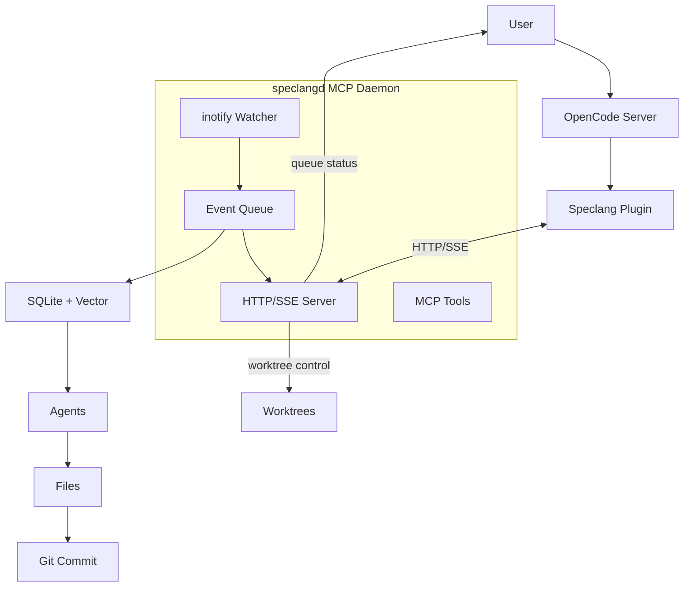

# speclang-header lines:13
id: "@speclang/deployment/enterprise"
version: 0.1.0
layer: 2
tags: [deployment, enterprise, scale, compliance]
status: draft
parent: "@ref:specs/deployment"
part: "2/2"

project_level: Alpha
agent_support: agent_assisted
short: Enterprise Deployment Mode
---

# Enterprise Mode

Enterprise mode adds the MCP daemon for observability, control, and scale.

## Overview

```speclang
# @block:deploy/enterprise-overview @kind:note
Enterprise Mode provides:
- OpenCode + Speclang plugin + MCP daemon
- Dedicated inotify watcher + HTTP/SSE server
- Queue visibility, worktree isolation
- Good for 500+ files, multiple teams, compliance
```

## Enterprise Mode Details

### @deploy/enterprise

```speclang
# @block:deploy/enterprise @kind:entity
EnterpriseMode:
  start: speclang init --mode=enterprise
  
  components:
    - OpenCode server (opencode serve --mode=build)
    - Speclang plugin
    - speclangd MCP daemon
    
  file_watching:
    provider: speclangd (inotify)
    events: HTTP/SSE stream
    latency: ~10ms
    
  extra_features:
    - queue visibility (how many files pending)
    - worktree isolation (test while building)
    - agent control (pause/resume/priority)
    - compliance logging
    - team coordination
```

## Architecture

### @deploy/enterprise-arch

```speclang
# @block:deploy/enterprise-arch @kind:diagram

```

## Configuration

### @deploy/enterprise-config

```speclang
# @block:deploy/enterprise-config @kind:code
```yaml
# .speclangrc (enterprise mode)
mode: enterprise

enterprise:
  daemon_port: 8765
  queue_size: 1000
  worktrees: 3    # max concurrent worktrees
  compliance_log: .speclang/compliance.log
```
```

## Performance

### @deploy/enterprise-performance

```speclang
# @block:deploy/enterprise-performance @kind:table
| Metric | Enterprise |
|--------|------------|
| Event latency | ~10ms |
| Max files | 10k+ |
| Max agents | 100+ |
| Memory | +100MB |
| Processes | 2 |
| Startup time | ~3s |
```