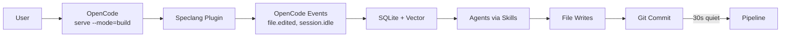
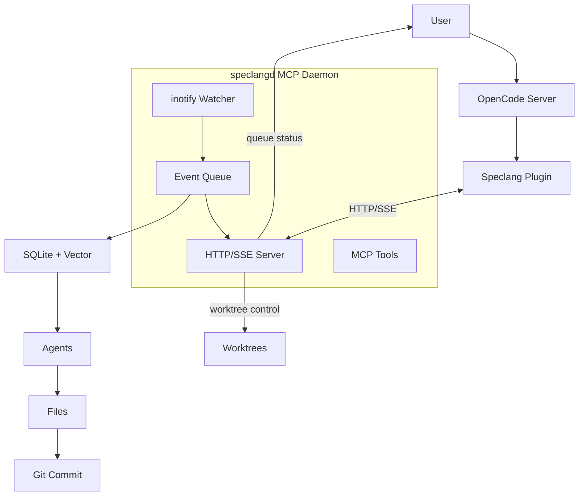

# speclang-header
id: "@speclang/deployment"
version: 0.1.0
layer: 0
tags: [deployment, modes, light, enterprise, scale]
imports: ["@speclang/core", "@speclang/opencode", "@speclang/daemon"]
status: draft

---

# Deployment Modes

Users choose between light (OpenCode only) or enterprise (with MCP daemon).

## Overview

```speclang
# @block:deploy/overview @kind:note
Two deployment profiles:

Light Mode:
- Just OpenCode + Speclang plugin
- Uses OpenCode's native file watching
- Good for <500 files, solo/small teams
- Zero extra processes

Enterprise Mode:
- OpenCode + Speclang plugin + MCP daemon
- Dedicated inotify watcher + HTTP/SSE server
- Queue visibility, worktree isolation
- Good for 500+ files, multiple teams, compliance

Same codebase, different scale.
```

---

## Mode Selection

### @deploy/selection

```speclang
# @block:deploy/selection @kind:entity
ModeSelection:
  command: speclang init --mode=light|enterprise
  
  light:
    description: "Minimal setup"
    processes: 1 (opencode serve)
    file_watcher: OpenCode native
    features: basic cascade, convergence, commit
    
  enterprise:
    description: "Full observability"
    processes: 2 (opencode serve + speclangd)
    file_watcher: dedicated inotify daemon
    features: queue visibility, worktrees, agent control, compliance
```

### @deploy/comparison

```speclang
# @block:deploy/comparison @kind:table
| Feature | Light | Enterprise |
|---------|-------|------------|
| File watching | OpenCode native | Dedicated inotify |
| Processes | 1 | 2 |
| Queue visibility | No | Yes |
| Worktree isolation | No | Yes |
| Agent control | Basic | Full |
| Scale | <500 files | 500+ files |
| Team size | Solo/small | Multiple teams |
| Compliance | No | Yes |
| Setup complexity | Low | Medium |
```

---

## Light Mode

### @deploy/light

```speclang
# @block:deploy/light @kind:entity
LightMode:
  start: speclang init --mode=light
  
  components:
    - OpenCode server (opencode serve --mode=build)
    - Speclang plugin (hooks into OpenCode events)
    
  file_watching:
    provider: OpenCode native
    events: file.edited, agent.finished, session.idle
    latency: ~100ms
    
  features:
    - cascade triggering
    - convergence detection
    - per-file commits
    - basic pipeline
    
  limitations:
    - no queue visibility
    - no worktree isolation
    - no agent control commands
```

### @deploy/light-arch

```speclang
# @block:deploy/light-arch @kind:diagram

```

---

## Enterprise Mode

### @deploy/enterprise

```speclang
# @block:deploy/enterprise @kind:entity
EnterpriseMode:
  start: speclang init --mode=enterprise
  
  components:
    - OpenCode server (opencode serve --mode=build)
    - Speclang plugin
    - speclangd MCP daemon
    
  file_watching:
    provider: speclangd (inotify)
    events: HTTP/SSE stream
    latency: ~10ms
    
  extra_features:
    - queue visibility (how many files pending)
    - worktree isolation (test while building)
    - agent control (pause/resume/priority)
    - compliance logging
    - team coordination
```

### @deploy/enterprise-arch

```speclang
# @block:deploy/enterprise-arch @kind:diagram

```

---

## Switching Modes

### @deploy/switching

```speclang
# @block:deploy/switching @kind:operation
switchMode(mode: light|enterprise):

steps:
  1. Update .speclangrc with mode
  2. If switching to enterprise:
     - download speclangd binary
     - configure daemon port
     - start daemon
  3. If switching to light:
     - stop daemon
     - remove daemon config
  4. Restart OpenCode server

note: specs and database remain the same
```

---

## Configuration

### @deploy/config

```speclang
# @block:deploy/config @kind:code
```yaml
# .speclangrc
mode: enterprise  # or light

scale_thresholds:
  files: 500      # suggest enterprise above this
  agents: 20      # suggest enterprise above this

enterprise:
  daemon_port: 8765
  queue_size: 1000
  worktrees: 3    # max concurrent worktrees
  compliance_log: .speclang/compliance.log

light:
  # no extra config needed
```
```

---

## Recommendations

### @deploy/recommend

```speclang
# @block:deploy/recommend @kind:entity
ModeRecommendation:
  
  use_light_when:
    - Solo developer
    - <500 spec files
    - <20 concurrent agents
    - No compliance requirements
    - Quick prototyping
    
  use_enterprise_when:
    - Multiple developers
    - 500+ spec files
    - 20+ concurrent agents
    - Compliance requirements (SOC2, etc.)
    - Need queue visibility
    - Need worktree isolation
    - Production/enterprise projects
```

---

## Performance Characteristics

### @deploy/performance

```speclang
# @block:deploy/performance @kind:table
| Metric | Light | Enterprise |
|--------|-------|------------|
| Event latency | ~100ms | ~10ms |
| Max files | ~500 | 10k+ |
| Max agents | ~20 | 100+ |
| Memory | +50MB | +100MB |
| Processes | 1 | 2 |
| Startup time | ~2s | ~3s |
```
