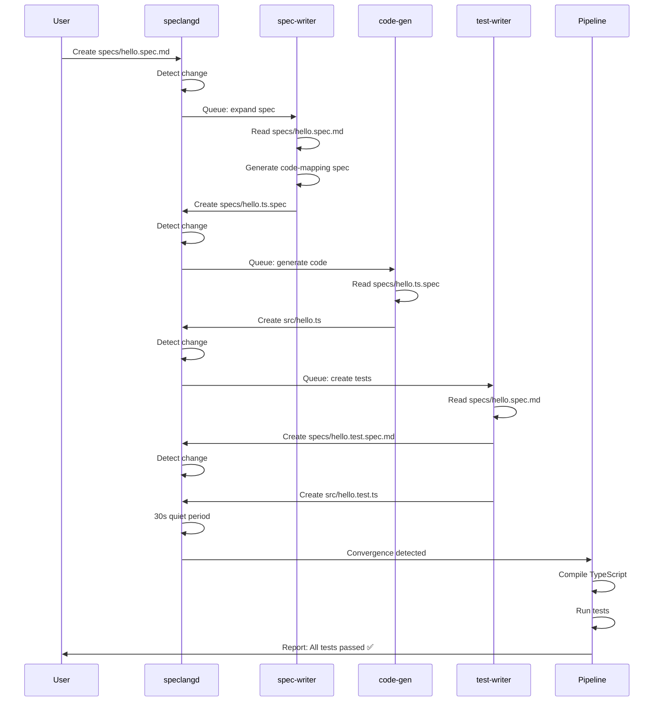

# speclang-header lines:10
id: "@speclang/examples-spec-dir/hello-world-cascade"
version: 0.1.0
layer: 2
tags: [example, cascade, end-to-end, tutorial, demo]
parent: "@ref:specs/examples.spec"
project_level: POC
agent_support: agent_autonomous
short: "Hello World Cascade - Complete end-to-end demonstration"
---

# Hello World Cascade Example

**This spec demonstrates the complete SpecLang flow from spec to working code.**

## What This Example Shows

```speclang
# @block:hello-cascade/overview @kind:note
This example demonstrates the COMPLETE SpecLang flow:

1. User creates a simple spec (hello.spec.md)
2. File watcher detects the change
3. Cascade triggers spec-writer agent
4. spec-writer creates code-mapping spec (hello.ts.spec)
5. code-gen agent generates TypeScript code
6. test-writer agent creates test spec
7. test-writer generates test code
8. Cascade converges (quiet period)
9. Pipeline runs: compile, test
10. All tests pass, system reports success

Total time: < 30 seconds for this simple example
```

## Step 1: Initial Spec (User Creates)

### @hello-cascade/step1-input

The user creates this file: `specs/hello.spec.md`

```yaml
# speclang-header lines:10
id: "@myproject/hello"
version: 1.0.0
layer: 1
project_level: POC
agent_support: agent_autonomous
tags: [greeting, example]
short: "Simple greeting module"
---

# Hello Module

A simple greeting module with customizable messages.

## Greeting Function

```speclang
# @block:hello/greet @kind:operation
greet(name: string): string
  purpose: "Return a personalized greeting"
  input: name - The name to greet
  output: A greeting string like "Hello, {name}!"
  
  examples:
    - greet("World") → "Hello, World!"
    - greet("SpecLang") → "Hello, SpecLang!"
```

## Farewell Function

```speclang
# @block:hello/farewell @kind:operation
farewell(name: string): string
  purpose: "Return a personalized farewell"
  input: name - The name to say goodbye to
  output: A farewell string like "Goodbye, {name}!"
  
  examples:
    - farewell("World") → "Goodbye, World!"
```
```

## Step 2: File Change Detected

### @hello-cascade/step2-detection

```speclang
# @block:hello-cascade/detection @kind:entity
FileChange:
  timestamp: "2024-02-23T10:00:00Z"
  file: "specs/hello.spec.md"
  event: "created"
  
DaemonActions:
  1. speclangd detects new file via inotify
  2. Parses header: id=@myproject/hello, layer=1
  3. Determines owner: spec-writer agent
  4. Adds to cascade queue:
     - trigger: specs/hello.spec.md
     - owner: spec-writer
     - depth: 1
```

## Step 3: Spec-Writer Agent Expands

### @hello-cascade/step3-spec-writer

The spec-writer agent analyzes the spec and determines it needs a code-mapping spec:

**Agent creates:** `specs/hello.ts.spec`

```yaml
# speclang-header lines:10
id: "@myproject/hello.ts"
version: 1.0.0
layer: 5
target: typescript
parent: ""@ref:specs/helloproject_level: POC
agent_support: agent_autonomous
tags: [greeting, typescript, generated]
short: "TypeScript code mapping for hello module"
---

# Hello TypeScript Mapping

## greet Function

```speclang
# @block:hello.ts/greet @kind:code
export function greet(name: string): string {
  return `Hello, ${name}!`;
}
```

## farewell Function

```speclang
# @block:hello.ts/farewell @kind:code
export function farewell(name: string): string {
  return `Goodbye, ${name}!`;
}
```
```

**Agent commit:**
```
git commit --only specs/hello.ts.spec -m "speclang: spec-writer Create TypeScript mapping for hello module [parent:abc123]"
```

## Step 4: Code-Gen Agent Generates

### @hello-cascade/step4-code-gen

The code-gen agent reads `specs/hello.ts.spec` and generates actual code:

**Agent creates:** `src/hello.ts`

```typescript
// @speclang-id: @ref:specs/hello.ts#greet
// Generated from specs/hello.ts.spec
// DO NOT EDIT - changes will be overwritten

/**
 * Return a personalized greeting
 * @param name - The name to greet
 * @returns A greeting string like "Hello, {name}!"
 */
export function greet(name: string): string {
  return `Hello, ${name}!`;
}

// @speclang-id: @ref:specs/hello.ts#farewell
// Generated from specs/hello.ts.spec
// DO NOT EDIT - changes will be overwritten

/**
 * Return a personalized farewell
 * @param name - The name to say goodbye to
 * @returns A farewell string like "Goodbye, {name}!"
 */
export function farewell(name: string): string {
  return `Goodbye, ${name}!`;
}
```

**Agent commit:**
```
git commit --only src/hello.ts -m "speclang: code-gen Generate hello.ts from spec [parent:def456]"
```

## Step 5: Test-Writer Agent Creates Tests

### @hello-cascade/step5-test-writer

The test-writer agent creates a test spec:

**Agent creates:** `specs/hello.test.spec.md`

```yaml
# speclang-header lines:10
id: "@myproject/hello.test"
version: 1.0.0
layer: 7
parent: ""@ref:specs/helloproject_level: POC
agent_support: agent_autonomous
tags: [test, greeting]
short: "Tests for hello module"
---

# Hello Module Tests

## greet Function Tests

### @hello.test/greet-world

```speclang
# @block:hello.test/greet-world @kind:test
Given: The greet function is available
When: I call greet("World")
Then: It returns "Hello, World!"
```

### @hello.test/greet-speclang

```speclang
# @block:hello.test/greet-speclang @kind:test
Given: The greet function is available
When: I call greet("SpecLang")
Then: It returns "Hello, SpecLang!"
```

## farewell Function Tests

### @hello.test/farewell-world

```speclang
# @block:hello.test/farewell-world @kind:test
Given: The farewell function is available
When: I call farewell("World")
Then: It returns "Goodbye, World!"
```
```

## Step 6: Test-Writer Generates Test Code

### @hello-cascade/step6-test-code

**Agent creates:** `src/hello.test.ts`

```typescript
// @speclang-id: @ref:specs/hello.test
// Generated from specs/hello.test.spec.md
// DO NOT EDIT - changes will be overwritten

import { greet, farewell } from './hello';

describe('hello module', () => {
  
  describe('greet', () => {
    it('should return "Hello, World!" when given "World"', () => {
      expect(greet('World')).toBe('Hello, World!');
    });
    
    it('should return "Hello, SpecLang!" when given "SpecLang"', () => {
      expect(greet('SpecLang')).toBe('Hello, SpecLang!');
    });
  });
  
  describe('farewell', () => {
    it('should return "Goodbye, World!" when given "World"', () => {
      expect(farewell('World')).toBe('Goodbye, World!');
    });
  });
});
```

**Agent commit:**
```
git commit --only src/hello.test.ts -m "speclang: test-writer Generate tests for hello module [parent:ghi789]"
```

## Step 7: Convergence Detection

### @hello-cascade/step7-convergence

```speclang
# @block:hello-cascade/convergence @kind:entity
ConvergenceTimeline:
  T+0s: User creates specs/hello.spec.md
  T+1s: spec-writer creates specs/hello.ts.spec
  T+3s: code-gen creates src/hello.ts
  T+5s: test-writer creates specs/hello.test.spec.md
  T+7s: test-writer creates src/hello.test.ts
  T+37s: Quiet period detected (30s no changes)
  
ConvergenceTrigger:
  - Cascade ID: cascade-20240223-001
  - Total commits: 5
  - Files changed: 5
  - Max depth reached: 2
```

## Step 8: Pipeline Execution

### @hello-cascade/step8-pipeline

```speclang
# @block:hello-cascade/pipeline @kind:entity
PipelineExecution:
  cascade_id: "cascade-20240223-001"
  
  steps:
    1. compile:
       command: "npx tsc --noEmit"
       status: passed
       duration: 2.3s
       
    2. test:
       command: "npx jest src/hello.test.ts"
       status: passed
       duration: 1.5s
       results:
         - greet → "Hello, World!" ✅
         - greet → "Hello, SpecLang!" ✅
         - farewell → "Goodbye, World!" ✅
         
  final_status: success
  
  commits_created:
    - "speclang: pipeline Run tests for cascade-20240223-001 - all passed"
```

## Step 9: Final Result

### @hello-cascade/step9-result

```speclang
# @block:hello-cascade/result @kind:entity
FinalResult:
  status: success
  
  files_created:
    - specs/hello.spec.md (user)
    - specs/hello.ts.spec (spec-writer)
    - src/hello.ts (code-gen)
    - specs/hello.test.spec.md (test-writer)
    - src/hello.test.ts (test-writer)
    
  git_history:
    abc123: "user: Add hello.spec.md"
    def456: "speclang: spec-writer Create TypeScript mapping [parent:abc123]"
    ghi789: "speclang: code-gen Generate hello.ts [parent:def456]"
    jkl012: "speclang: test-writer Create test spec [parent:def456]"
    mno345: "speclang: test-writer Generate test code [parent:jkl012]"
    pqr678: "speclang: pipeline Run tests - all passed [cascade:20240223-001]"
    
  metrics:
    total_time: "39 seconds"
    agent_invocations: 3
    tests_passed: 3
    tests_failed: 0
```

## Complete Timeline Visualization

### @hello-cascade/timeline

```speclang
# @block:hello-cascade/timeline @kind:diagram


## How to Run This Example

### @hello-cascade/run-instructions

```speclang
# @block:hello-cascade/run-instructions @kind:note
To run this example manually:

1. Create specs/hello.spec.md with the content from Step 1
2. Wait for cascade to complete (watch the logs)
3. Verify files were created:
   - specs/hello.ts.spec
   - src/hello.ts
   - specs/hello.test.spec.md
   - src/hello.test.ts
4. Run tests: npx jest src/hello.test.ts
5. All tests should pass

Expected output:
  PASS  src/hello.test.ts
  hello module
    greet
      ✓ should return "Hello, World!" (2ms)
      ✓ should return "Hello, SpecLang!"
    farewell
      ✓ should return "Goodbye, World!" (1ms)
```

## References

- "@ref:specs/examples.spec.dir/hello-world - Simple hello world
- @ref:specs/cascade - Cascade system
- @ref:specs/agent-protocol - Agent roles
- @ref:specs/compiler - Code generation
- @ref:specs/pipeline - Build pipeline