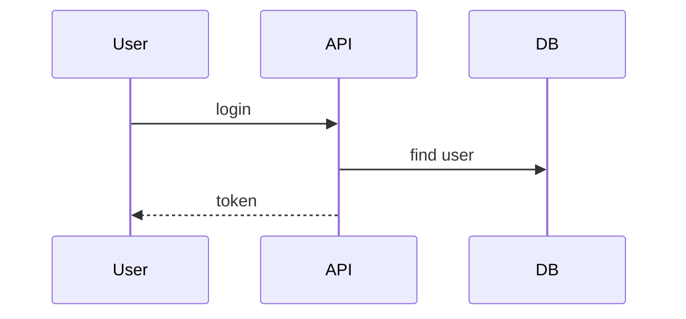

# speclang-header lines:12
id: "@speclang/file-naming/extensions"
version: 0.1.0
layer: 2
tags: [naming, format, files, conventions, extensions]
imports: ["@speclang/core"]
status: draft
project_level: Alpha
agent_support: agent_assisted
short: File Extensions
---
# File Extensions

Part 1 of 2: File extensions and format types.

Parent: @ref:speclang/file-naming

## File Extensions

### @naming/extensions

```speclang
# @block:naming/extensions @kind:entity
SpecExtensions:
  .scl:
    description: "Core speclang format"
    use: primary spec files
    parsable: both human and machine
    
  .spec.md:
    description: "Markdown spec"
    use: human-edited specs with diagrams
    supports: mermaid, prose, code fences
    
  .spec.yaml:
    description: "YAML spec"
    use: machine-first, precise structure
    supports: headers, refs, blocks as yaml
    
  .{lang}.spec:
    description: "Direct code mapping spec"
    examples: .go.spec, .ts.spec, .py.spec
    use: this spec produces exactly one code file
```

### @naming/extension-decision

```speclang
# @block:naming/extension-decision @kind:table
| Format | When to Use |
|--------|-------------|
| .scl | Core specs, north star |
| .spec.md | Specs with mermaid, prose, mixed content |
| .spec.yaml | Specs needing precise structure, locks, headers |
| .go.spec | Produces exactly one .go file |
| .ts.spec | Produces exactly one .ts file |
| .py.spec | Produces exactly one .py file |
```

## Direct Code Mapping

### @naming/direct-mapping

```speclang
# @block:naming/direct-mapping @kind:entity
DirectMapping:
  description: "Spec that produces exactly one code file"
  
  pattern: {name}.{ext}.spec → {name}.{ext}
  
  examples:
    - handler.go.spec → handler.go
    - auth.ts.spec → auth.ts
    - models.py.spec → models.py
    
  purpose:
    - Final layer before code
    - Direct correspondence
    - No expansion needed
```

### @naming/direct-example

```speclang
# @block:naming/direct-example @kind:code
```yaml
# handler.go.spec
speclang-header:
  id: @generated/handler-go
  layer: 10
  produces: handler.go
  refs: [@ref:specs/auth#login]

block:
  kind: code
  target: go
  content: |
    package auth
    
    // SPECLANG-ID: @ref:specs/auth#login
    func Login(email, password string) (*Token, error) {
      // implementation
    }
```

Output: `generated/go/auth/handler.go`
```
```

## Markdown Specs

### @naming/markdown

```speclang
# @block:naming/markdown @kind:entity
MarkdownSpec:
  extension: .spec.md
  purpose: human-readable with rich formatting
  
  supports:
    - prose explanations
    - mermaid diagrams
    - code fences
    - tables
    - lists
    
  best_for:
    - level 0-2 specs (high level)
    - architecture decisions
    - documentation
    - flows and diagrams
```

### @naming/markdown-example

```speclang
# @block:naming/markdown-example @kind:code
```markdown
# auth.spec.md

# speclang-header
id: @specs/auth
layer: 1

---

## Overview

This spec defines the authentication system.

## Flow



## Entities

### User

- id: UUID
- email: String
- verified: Bool

## Operations

### login(email, password) -> Token

1. Validate credentials
2. Generate JWT
3. Return token
```
```

## YAML Specs

### @naming/yaml

```speclang
# @block:naming/yaml @kind:entity
YAMLSpec:
  extension: .spec.yaml
  purpose: machine-parsable, precise structure
  
  supports:
    - structured headers
    - explicit refs
    - type definitions
    - lock information
    
  best_for:
    - level 3+ specs (detailed)
    - entities with types
    - operations with signatures
    - direct code mapping prep
```

### @naming/yaml-example

```speclang
# @block:naming/yaml-example @kind:code
```yaml
# auth.spec.yaml
speclang-header:
  id: @specs/auth
  version: 1.0.0
  layer: 3
  refs:
    - @ref:northstar#auth
    - @ref:stdlib/Result

blocks:
  - id: auth/User
    kind: entity
    fields:
      - name: id
        type: UUID
        primary: true
      - name: email
        type: String
        unique: true
      - name: verified
        type: Bool
        default: false
        
  - id: auth/login
    kind: operation
    signature: "login(email: String, password: String) -> Result<Token, AuthError>"
    steps:
      - validate: email format
      - find: user by email
      - verify: password hash
      - generate: JWT token
      - return: Result
```
```

## Header Requirements

### @naming/header

```speclang
# @block:naming/header @kind:entity
SpecHeader:
  required:
    - id: unique identifier
    - version: semver
    
  recommended:
    - layer: abstraction level
    - refs: related specs
    - produces: output file (for direct mapping)
    
  format: YAML block at start of file
  
  yaml:
    speclang-header:
      id: @specs/auth
      version: 1.0.0
      layer: 2
      
  markdown:
    # speclang-header
    id: @specs/auth
    version: 1.0.0
```