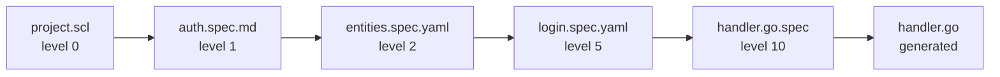

# speclang-header lines:10
id: "@speclang/file-naming/patterns"
version: 0.1.0
layer: 2
tags: [naming, format, files, conventions, patterns]
imports: ["@speclang/core"]
status: draft
project_level: Alpha
agent_support: agent_assisted
short: File Naming Patterns
---
# File Naming Patterns

Part 2 of 2: Layer organization, directory structure, and naming conventions.

Parent: @ref:speclang/file-naming

## Layer Organization

### @naming/layers

```speclang
# @block:naming/layers @kind:entity
LayerStructure:
  description: "Specs expand through layers"
  
  level_0:
    name: intent
    format: .scl or .spec.md
    owner: user + orchestrator
    content: one-liner goals, features
    
  level_1:
    name: features
    format: .spec.md
    owner: spec-writer
    content: feature breakdown, flows
    
  level_2:
    name: components
    format: .spec.md or .spec.yaml
    owner: spec-writer
    content: entities, operations, policies
    
  level_3_to_9:
    name: details
    format: .spec.yaml
    owner: spec-writer
    content: detailed implementation specs
    
  level_10:
    name: code-mapping
    format: .{ext}.spec
    owner: code-gen
    content: direct code generation
```

### @naming/layer-example

```speclang
# @block:naming/layer-example @kind:code
```
specs/
  project.scl                    # level 0 (north star)
  auth.spec.md                   # level 1 (feature overview)
  auth/
    entities.spec.yaml           # level 2 (components)
    operations.spec.yaml         # level 2
    login-flow.spec.yaml         # level 3 (details)
    jwt-handler.go.spec          # level 10 (direct mapping)
```
```

## Directory Structure

### @naming/directories

```speclang
# @block:naming/directories @kind:entity
SpecDirectories:
  specs/:
    content: all spec files
    subdirs: by feature or domain
    
  specs/core/:
    content: level 0 files (user edited)
    
  specs/expanded/:
    content: level 1+ files (AI generated)
    
  tests/:
    content: test specs
    
  generated/:
    content: output code
    subdirs: by target language
```

## Transformation Flow

### @naming/transform

```speclang
# @block:naming/transform @kind:diagram

```

## Naming Conventions

### @naming/conventions

```speclang
# @block:naming/conventions @kind:entity
NamingRules:
  spec_files:
    - lowercase
    - hyphens for spaces
    - descriptive names
    
  examples:
    - user-auth.spec.md ✓
    - UserAuth.spec.md ✗
    - user_auth.spec.md ✗
    
  block_ids:
    - @domain/feature-name
    - lowercase, hyphens
    - hierarchical with /
    
  examples:
    - @auth/login-handler ✓
    - @Auth/LoginHandler ✗
```