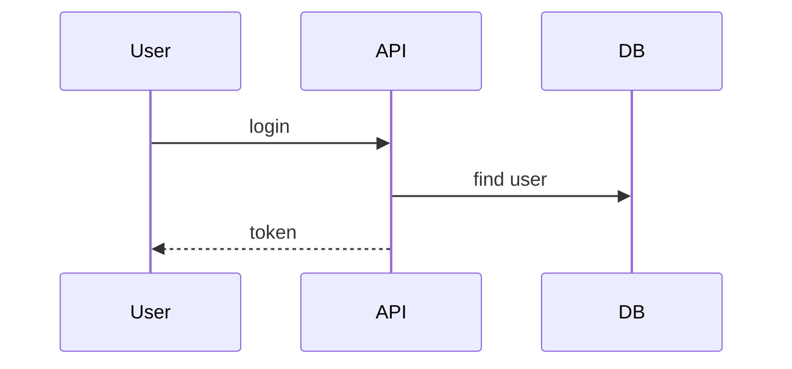
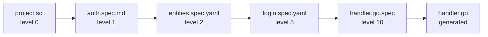

# speclang-header lines:15
id: "@speclang/file-naming"
version: 0.1.0
layer: 1
tags: [naming, format, files, conventions]
imports: ["@speclang/core"]
status: draft
parts:
  - "@speclang/file-naming/extensions"
  - "@speclang/file-naming/patterns"

project_level: Alpha
agent_support: agent_assisted
short: File Naming
---

# File Naming

How specs are named and what each format means.

## Overview

```speclang
# @block:naming/overview @kind:note
Specs can be expressed in multiple formats:
- .spec.md for markdown (humans + diagrams)
- .spec.yaml for yaml (machines + precise parsing)
- .{ext}.spec for direct code mapping

The format determines how speclangd parses and uses the file.
```

## Parts

This spec is split into two sub‑specs:

1. **Extensions** (@ref:speclang/file-naming/extensions) – File extensions, direct code mapping, markdown/YAML specs, header requirements.
2. **Patterns** (@ref:speclang/file-naming/patterns) – Layer organization, directory structure, transformation flow, naming conventions.

See the sub‑specs for detailed information.

---

## File Extensions

### @naming/extensions

```speclang
# @block:naming/extensions @kind:entity
SpecExtensions:
  .scl:
    description: "Core speclang format"
    use: primary spec files
    parsable: both human and machine
    
  .spec.md:
    description: "Markdown spec"
    use: human-edited specs with diagrams
    supports: mermaid, prose, code fences
    
  .spec.yaml:
    description: "YAML spec"
    use: machine-first, precise structure
    supports: headers, refs, blocks as yaml
    
  .{lang}.spec:
    description: "Direct code mapping spec"
    examples: .go.spec, .ts.spec, .py.spec
    use: this spec produces exactly one code file
```

### @naming/extension-decision

```speclang
# @block:naming/extension-decision @kind:table
| Format | When to Use |
|--------|-------------|
| .scl | Core specs, north star |
| .spec.md | Specs with mermaid, prose, mixed content |
| .spec.yaml | Specs needing precise structure, locks, headers |
| .go.spec | Produces exactly one .go file |
| .ts.spec | Produces exactly one .ts file |
| .py.spec | Produces exactly one .py file |
```

---

## Direct Code Mapping

### @naming/direct-mapping

```speclang
# @block:naming/direct-mapping @kind:entity
DirectMapping:
  description: "Spec that produces exactly one code file"
  
  pattern: {name}.{ext}.spec → {name}.{ext}
  
  examples:
    - handler.go.spec → handler.go
    - auth.ts.spec → auth.ts
    - models.py.spec → models.py
    
  purpose:
    - Leaf nodes in spanning tree that generate code
    - Direct correspondence (spec → generated file)
    - No further expansion needed
  
  format_rule: "Always YAML format for precise schema"
  yaml_schema: "Follows structured schema for boilerplate generation"
  tree_position: "Final leaves in dependency tree"
  benefits:
    - Reduces model errors with validation
    - Provides clear structure for code generation
    - Enables contract definition (APIs, databases)
    - Links dependencies via @ref: markers
```

### @naming/direct-example

```speclang
# @block:naming/direct-example @kind:code
```yaml
# handler.go.spec
speclang-header:
  id: @generated/handler-go
  layer: 5
  produces: handler.go
  refs: ["@ref:specs/auth#login"]

block:
  kind: code
  target: go
  content: |
    package auth
    
    // SPECLANG-ID: @ref:specs/auth#login
    func Login(email, password string) (*Token, error) {
      // implementation
    }
```

Output: `generated/go/auth/handler.go`
```
```

---

## Markdown Specs

### @naming/markdown

```speclang
# @block:naming/markdown @kind:entity
MarkdownSpec:
  extension: .spec.md
  purpose: human-readable with rich formatting
  
  supports:
    - prose explanations
    - mermaid diagrams
    - code fences
    - tables
    - lists
    
  best_for:
    - level 0-2 specs (high level)
    - architecture decisions
    - documentation
    - flows and diagrams
```

### @naming/markdown-example

```speclang
# @block:naming/markdown-example @kind:code
```markdown
# auth.spec.md

# speclang-header
id: "@specs/auth"
layer: 1

---

## Overview

This spec defines the authentication system.

## Flow



## Entities

### User

- id: UUID
- email: String
- verified: Bool

## Operations

### login(email, password) -> Token

1. Validate credentials
2. Generate JWT
3. Return token
```
```
```

---

## YAML Specs

### @naming/yaml

```speclang
# @block:naming/yaml @kind:entity
YAMLSpec:
  extension: .spec.yaml
  purpose: machine-parsable, precise structure
  
  supports:
    - structured headers
    - explicit refs
    - type definitions
    - lock information
    
  best_for:
    - level 3+ specs (detailed)
    - entities with types
    - operations with signatures
    - direct code mapping prep
```

### @naming/yaml-example

```speclang
# @block:naming/yaml-example @kind:code
```yaml
# auth.spec.yaml
speclang-header:
  id: @specs/auth
  version: 1.0.0
  layer: 3
  refs:
    - "@ref:northstar#auth
    - "@ref:stdlib/Result

blocks:
  - id: auth/User
    kind: entity
    fields:
      - name: id
        type: UUID
        primary: true
      - name: email
        type: String
        unique: true
      - name: verified
        type: Bool
        default: false
        
  - id: auth/login
    kind: operation
    signature: "login(email: String, password: String) -> Result<Token, AuthError>"
    steps:
      - validate: email format
      - find: user by email
      - verify: password hash
      - generate: JWT token
      - return: Result
```
```
```

---

## Spanning Tree Structure

### @naming/spanning-tree

```speclang
# @block:naming/spanning-tree @kind:entity
SpanningTree:
  description: "Specs form a dependency tree that self-expands"
  
  root:
    name: north-star
    format: .scl or .yaml (project.scl or project.yaml)
    owner: user + orchestrator
    content: system intent, goals, rules
    
  branches:
    name: expanding-specs
    format: .spec.md or .spec.yaml
    owner: spec-writer
    content: feature definitions, architecture, design
    depth: "Any depth allowed - tree expands as needed"
    
  leaves:
    name: code-mapping
    format: .{ext}.spec (always YAML)
    owner: code-gen
    content: direct code generation with YAML schema
    schema: "Structured YAML for contracts, APIs, boilerplate"
  
  properties:
    - no_fixed_layers: "Tree depth depends on system complexity"
    - self_expanding: "Agents create new nodes as needed"
    - dependency_based: "Tree structure follows @ref: links"
    - concurrent_expansion: "Multiple branches can expand simultaneously"
```

### @naming/tree-example

```speclang
# @block:naming/tree-example @kind:code
```
specs/
  project.scl                    # root (north star)
  auth.spec.md                   # branch (feature)
  auth/
    entities.spec.yaml           # sub-branch (data structures)
    operations.spec.yaml         # sub-branch (functions)
    login-flow.spec.yaml         # deeper branch (detailed flow)
    jwt-handler.go.spec          # leaf → generates handler.go
  user-profile.spec.md           # parallel branch
  user-profile/
    api.ts.spec                  # leaf → generates api.ts
  docker-compose.yaml.spec       # leaf → generates docker-compose.yaml
```
```

---

## Directory Structure

### @naming/directories

```speclang
# @block:naming/directories @kind:entity
SpecDirectories:
  specs/:
    content: all spec files
    subdirs: by feature or domain
    
  specs/core/:
    content: level 0 files (user edited)
    
  specs/expanded/:
    content: level 1+ files (AI generated)
    
  tests/:
    content: test specs
    
  generated/:
    content: output code
    subdirs: by target language
```

---

## Header Requirements

### @naming/header

```speclang
# @block:naming/header @kind:entity
SpecHeader:
  required:
    - id: unique identifier
    - version: semver
    
  recommended:
    - layer: abstraction level
    - refs: related specs
    - produces: output file (for direct mapping)
    
  format: YAML block at start of file
  
  yaml:
    speclang-header:
      id: @specs/auth
      version: 1.0.0
      layer: 2
      
  markdown:
    # speclang-header
    id: @specs/auth
    version: 1.0.0
```

---

## Transformation Flow

### @naming/transform

```speclang
# @block:naming/transform @kind:diagram

```

---

## Naming Conventions

### @naming/conventions

```speclang
# @block:naming/conventions @kind:entity
NamingRules:
  spec_files:
    - lowercase
    - hyphens for spaces
    - descriptive names
    
  examples:
    - user-auth.spec.md ✓
    - UserAuth.spec.md ✗
    - user_auth.spec.md ✗
    
  block_ids:
    - @domain/feature-name
    - lowercase, hyphens
    - hierarchical with /
    
  examples:
    - @auth/login-handler ✓
    - @Auth/LoginHandler ✗
```
