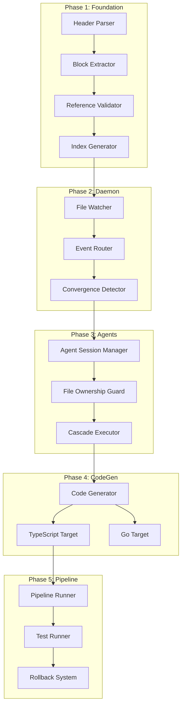

# speclang-header lines:10
id: "@speclang/implementation-path"
version: 0.1.0
layer: 0
project_level: Alpha
agent_support: agent_autonomous
tags: [bootstrap, implementation, guide, getting-started, phases]
short: "Implementation Path - Step-by-step guide to building SpecLang"
status: active
---

# Implementation Path

**This spec provides a clear, step-by-step path to build SpecLang from scratch.**

## Purpose

This spec answers: "Where do I start? What do I build first? How do I know when I'm done?"

## System Goal

```speclang
# @block:implementation/goal @kind:entity
SystemGoal:
  vision: "Specs are source code. Generated code is machine code."
  
  what_we_build:
    - A reactive multi-agent system
    - File changes trigger agent reactions
    - Agents write specs and generate code
    - Cascade continues until convergence
    - Pipeline builds, tests, deploys
    
  how_we_build:
    - Incremental phases (Phase 1 → 2 → 3 → 4)
    - Each phase produces working software
    - Each phase builds on previous phases
    - Clear success criteria for each phase
```

## Current State Assessment

### @implementation/current-state

```speclang
# @block:implementation/current-state @kind:entity
CurrentState:
  specs:
    status: "Complete and comprehensive"
    count: 304 spec files
    coverage: "Full system architecture defined"
    
  existing_code:
    location: "src/, scripts/"
    status: "Partially implemented, not mapped to specs"
    problem: "Code was written without clear spec mapping"
    
  gap:
    problem: "Specs and code are disconnected"
    solution: "This implementation path bridges the gap"
```

### @implementation/existing-code-map

```speclang
# @block:implementation/existing-code-map @kind:table
| Code Location | Spec Reference | Status | Notes |
|---------------|----------------|--------|-------|
| scripts/generate_index.py | @ref:specs/indexer | ✅ Working | Indexes specs, validates refs |
| src/parser/* | @ref:specs/parser | ⚠️ Partial | Header parsing works |
| src/speclangd.ts | @ref:specs/daemon | ⚠️ Partial | TypeScript daemon draft |
| src/speclang-mcp.ts | @ref:specs/mcp | ⚠️ Partial | MCP server draft |
| src/validation.ts | @ref:specs/validation | ⚠️ Partial | Validation system |
| src/codegen.ts | @ref:specs/compiler | ❌ Stub | Code generation |
| src/db/* | @ref:specs/sqlite | ⚠️ Partial | SQLite database |
| src/ralph-loop.ts | @ref:specs/cascade | ⚠️ Partial | Cascade loop |
| src/guard/* | @ref:specs/guard | ❌ Not started | File access control |
| src/pipeline/* | @ref:specs/pipeline | ❌ Not started | Build pipeline |

Legend:
  ✅ Working - Fully functional, matches spec
  ⚠️ Partial - Some code exists, needs completion
  ❌ Not started / Stub - Placeholder only
```

## Implementation Phases

### Phase 1: Foundation (Week 1-2)

**Goal:** Core infrastructure to read and validate specs

```speclang
# @block:implementation/phase1 @kind:entity
Phase1:
  name: "Foundation"
  duration: "1-2 weeks"
  
  objectives:
    - Parse spec files with headers
    - Validate spec references
    - Build dependency graph
    - Generate index database
    
  deliverables:
    1. Header Parser (src/parser/)
       - Read speclang-header from files
       - Extract YAML metadata
       - Validate required fields
       
    2. Block Extractor (src/parser/)
       - Find @block:id @kind:type markers
       - Extract block content
       - Support multi-line blocks
       
    3. Reference Validator (src/validation/)
       - Check all @ref: targets exist
       - Build dependency graph
       - Detect circular dependencies
       
    4. Index Generator (scripts/generate_index.py)
       - Already working ✅
       - Generates _index.json
       - FTS-ready format
       
  success_criteria:
    - `python3 generate_index.py` runs without errors
    - All 304 specs indexed with 0 missing refs
    - Can query spec by ID
    - Can traverse dependency tree
    
  specs_to_read:
    - "@ref:specs/headers
    - "@ref:specs/parser
    - "@ref:specs/spec-format
    - "@ref:specs/validation/rules
```

### Phase 2: Daemon & Events (Week 3-4)

**Goal:** Reactive file watching and event routing

```speclang
# @block:implementation/phase2 @kind:entity
Phase2:
  name: "Daemon & Events"
  duration: "2 weeks"
  depends_on: "Phase 1"
  
  objectives:
    - Watch filesystem for changes
    - Detect spec file modifications
    - Route events to appropriate handlers
    - Implement quiet period detection
    
  deliverables:
    1. File Watcher (src/daemon/)
       - Watch specs/ directory
       - Detect .spec.md, .spec.yaml, .scl changes
       - Ignore generated/ and node_modules/
       - Emit change events
       
    2. Event Router (src/daemon/)
       - Determine file owner (agent type)
       - Queue events for processing
       - Handle concurrent changes
       
    3. Convergence Detector (src/daemon/)
       - Track last change timestamp
       - Detect 30-second quiet period
       - Trigger pipeline on convergence
       
    4. OpenCode Plugin Integration (src/opencode-plugin/)
       - Native file event subscription
       - Event queuing for cascade
       
  success_criteria:
    - File changes detected within 100ms
    - Events correctly routed to handlers
    - Convergence detected after quiet period
    - No missed events under normal load
    
  specs_to_read:
    - "@ref:specs/daemon
    - "@ref:specs/daemon.spec.dir/events
    - "@ref:specs/daemon.spec.dir/routing
    - "@ref:specs/daemon.spec.dir/convergence
    - "@ref:specs/opencode-plugin
```

### Phase 3: Agents & Cascade (Week 5-6)

**Goal:** Multi-agent cascade with file ownership

```speclang
# @block:implementation/phase3 @kind:entity
Phase3:
  name: "Agents & Cascade"
  duration: "2 weeks"
  depends_on: "Phase 2"
  
  objectives:
    - Implement agent sessions
    - Enforce file ownership
    - Execute cascade reactions
    - Handle concurrent agents
    
  deliverables:
    1. Agent Session Manager (src/agents/)
       - Create agent sessions
       - Assign files to agents
       - Track session state
       
    2. File Ownership Guard (src/guard/)
       - Map files to owning agents
       - Reject unauthorized writes
       - Log access attempts
       
    3. Cascade Executor (src/cascade/)
       - Process change events
       - Invoke appropriate agent
       - Track cascade depth
       - Detect infinite loops
       
    4. Agent Skills (src/skills/)
       - spec-writer skill
       - code-gen skill
       - test-writer skill
       
  success_criteria:
    - Agents only write owned files
    - Cascade runs to convergence
    - Infinite loops detected and stopped
    - Multiple agents run concurrently
    
  specs_to_read:
    - "@ref:specs/agent-protocol
    - "@ref:specs/cascade
    - "@ref:specs/cascade.spec.dir/error-handling
    - "@ref:specs/guard
    - "@ref:specs/skills
```

### Phase 4: Code Generation (Week 7-8)

**Goal:** Generate working code from specs

```speclang
# @block:implementation/phase4 @kind:entity
Phase4:
  name: "Code Generation"
  duration: "2 weeks"
  depends_on: "Phase 3"
  
  objectives:
    - Transform specs to target language
    - Generate TypeScript code
    - Generate Go code
    - Verify generated code compiles
    
  deliverables:
    1. Code Generator (src/codegen/)
       - Read .{ext}.spec files
       - Apply language templates
       - Generate output files
       - Add @speclang-id markers
       
    2. TypeScript Target (src/codegen/targets/typescript/)
       - Entity → interface/class
       - Operation → function
       - Policy → validation
       
    3. Go Target (src/codegen/targets/go/)
       - Entity → struct
       - Operation → method
       - Policy → validation
       
    4. Template System (src/codegen/templates/)
       - Language-specific templates
       - Pattern libraries
       - Common scaffolds
       
  success_criteria:
    - Generated TypeScript compiles with tsc
    - Generated Go compiles with go build
    - @speclang-id markers present
    - Bidirectional sync possible
    
  specs_to_read:
    - "@ref:specs/compiler
    - "@ref:specs/compiler.spec.dir/targets
    - "@ref:specs/compiler.spec.dir/templates
```

### Phase 5: Pipeline & Testing (Week 9-10)

**Goal:** Automated build, test, deploy

```speclang
# @block:implementation/phase5 @kind:entity
Phase5:
  name: "Pipeline & Testing"
  duration: "2 weeks"
  depends_on: "Phase 4"
  
  objectives:
    - Run build after convergence
    - Execute generated tests
    - Rollback on failure
    - Report results
    
  deliverables:
    1. Pipeline Runner (src/pipeline/)
       - Read build.yaml
       - Execute build commands
       - Run test suites
       - Report results
       
    2. Test Runner (src/pipeline/tests/)
       - Execute generated tests
       - Collect coverage
       - Report failures
       
    3. Rollback System (src/pipeline/rollback/)
       - Detect failures
       - Revert to last known good
       - Notify human
       
    4. Notification System (src/pipeline/notify/)
       - Send results to configured channels
       - Include diffs and logs
       
  success_criteria:
    - Pipeline runs after convergence
    - Tests execute and report results
    - Failures trigger rollback
    - Notifications sent correctly
    
  specs_to_read:
    - "@ref:specs/pipeline
    - "@ref:specs/test-specs
    - "@ref:specs/git-history.spec.dir/rollback
    - "@ref:specs/cascade.spec.dir/error-handling
```

## Minimum Viable Product (MVP)

### @implementation/mvp

```speclang
# @block:implementation/mvp @kind:entity
MVP:
  definition: "The smallest system that demonstrates core value"
  
  must_have:
    1. Spec Parser
       - Read spec files with headers
       - Extract blocks and references
       
    2. File Watcher
       - Detect spec file changes
       - Basic event emission
       
    3. One Agent
       - spec-writer agent
       - Read specs, write specs
       
    4. Simple Cascade
       - File change → agent reaction
       - Basic convergence detection
       
    5. One Code Generator
       - TypeScript target only
       - Entity blocks → interfaces
       
  nice_to_have:
    - Multiple agents
    - Multiple targets
    - Full pipeline
    - Error recovery
    
  mvp_success_test:
    name: "Hello World Cascade"
    steps:
      1. User creates hello.spec.md with simple entity
      2. System detects file change
      3. spec-writer expands spec if needed
      4. code-gen creates hello.ts
      5. TypeScript compiles successfully
      6. Cascade converges
    expected_time: "< 30 seconds total"
```

## MVP Definition Checklist

### @implementation/mvp-checklist

```speclang
# @block:implementation/mvp-checklist @kind:checklist
MVPChecklist:
  
  parsing:
    - [ ] Header parser extracts all required fields
    - [ ] Block extractor finds all @block: markers
    - [ ] Reference resolver validates all @ref: links
    
  watching:
    - [ ] File watcher detects .spec.md changes
    - [ ] File watcher detects .spec.yaml changes
    - [ ] Events queued within 100ms of change
    
  agents:
    - [ ] spec-writer agent can read specs
    - [ ] spec-writer agent can write specs
    - [ ] File ownership enforced
    
  cascade:
    - [ ] File change triggers agent reaction
    - [ ] Cascade runs until quiet period
    - [ ] Convergence detected (30s no changes)
    
  codegen:
    - [ ] TypeScript generator creates valid .ts files
    - [ ] Generated TypeScript compiles with tsc
    - [ ] @speclang-id markers present in output
    
  end_to_end:
    - [ ] Hello World test passes (see MVP success test)
```

## Build Order (Dependency Graph)

### @implementation/build-order

```speclang
# @block:implementation/build-order @kind:diagram


## For AI Agents: How to Build

### @implementation/agent-instructions

```speclang
# @block:implementation/agent-instructions @kind:note
Instructions for AI agents implementing SpecLang:

1. START WITH PHASE 1
   - Do not skip to later phases
   - Phase 1 is prerequisite for all others
   - Verify Phase 1 success criteria before continuing

2. READ SPECS BEFORE CODING
   - Each phase lists specs_to_read
   - Read all listed specs before writing code
   - Follow the patterns defined in specs

3. ONE COMPONENT AT A TIME
   - Complete one deliverable before starting next
   - Verify each deliverable works independently
   - Write tests for each component

4. MAP CODE TO SPECS
   - Every code file should reference its source spec
   - Use @speclang-id markers in generated code
   - Update this spec when adding new code

5. VERIFY INCREMENTALLY
   - Run tests after each change
   - Use generate_index.py to validate specs
   - Check all success criteria

6. COMMIT PER FILE
   - One file, one commit
   - Reference spec in commit message
   - Use speclang: prefix
```

## Development Environment Setup

### @implementation/dev-setup

```speclang
# @block:implementation/dev-setup @kind:entity
DevSetup:
  
  prerequisites:
    - Node.js 18+
    - Python 3.10+
    - Go 1.21+ (optional, for Go target)
    - Git
    
  setup_steps:
    1. Clone repository
    2. Run: npm install
    3. Run: pip install -r requirements.txt
    4. Run: python3 generate_index.py (verify specs)
    5. Run: npm run build (verify TypeScript)
    
  verify_setup:
    - generate_index.py runs without errors
    - _index.json generated
    - No missing references
```

## References

- "@ref:specs/000-bootstrap - Bootstrap primer
- @ref:specs/project.scl - North Star vision
- @ref:specs/core - Core architecture
- @ref:specs/compiler - Code generation
- @ref:specs/daemon - File watcher
- @ref:specs/cascade - Reactive loop
- @ref:specs/agent-protocol - Agent system
- @ref:docs/CONTEXT.md - Session context