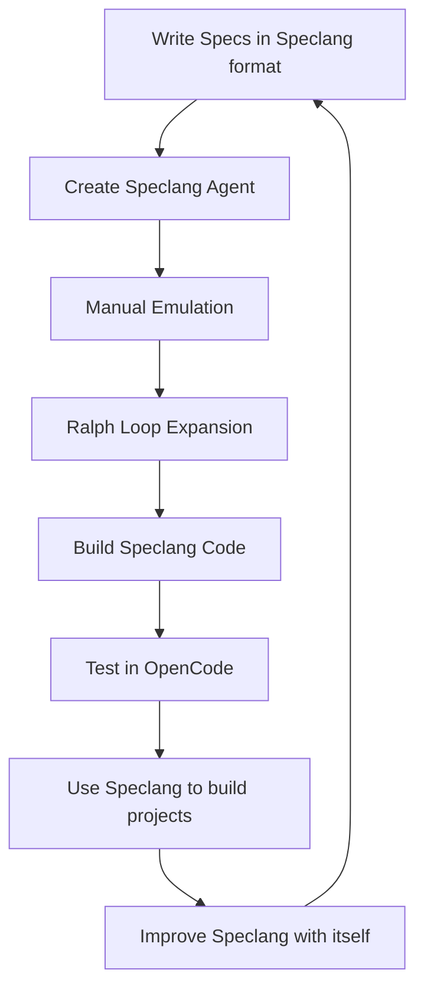

# speclang-header lines:7
id: "@implementation/meta-circular"
version: 0.1.0
layer: 0
tags: [meta, circular, development, bootstrapping]
status: draft
---
# Meta-Circular Development

Building Speclang using Speclang itself.

## Overview

```speclang
# @block:meta/overview @kind:note
Speclang is built using Speclang. This spec describes the meta-circular development approach:

1. Write specs describing how to build Speclang
2. Create an agent that understands Speclang workflow
3. Manually emulate Speclang with that agent
4. Use Ralph Loop to complete expansion
5. Build actual Speclang code
6. Test in OpenCode
7. Use built Speclang to build new projects
8. Use each version to improve the next

This creates a self-improving system.
```

## The Meta Loop

```speclang
# @block:meta/loop @kind:diagram

```

## Phase 1: Foundation

### @meta/phase1
```speclang
# @block:meta/phase1 @kind:entity
Phase1:
  tasks:
    - Finalize SIPs & Skills (existing in opencode/skills/)
    - Write implementation specs (this directory)
    - Define agent that understands Speclang workflow
    - Create _index.json mapping file
  
  output:
    - Complete spec set
    - Agent skill for meta development
    - Index for model access
```

## Phase 2: Hybrid Bootstrap

### @meta/phase2
```speclang
# @block:meta/phase2 @kind:entity
Phase2:
  tasks:
    - Build core templates manually
    - Create OpenCode plugin skeleton
    - Create TypeScript MCP server skeleton
    - Implement basic SQLite schema
  
  approach:
    - Manual coding for minimal core
    - Enough to start Ralph Loop
    - Templates for speclang init
```

## Phase 3: Ralph Loop

### @meta/phase3
```speclang
# @block:meta/phase3 @kind:entity
Phase3:
  description: "Use Ralph Loop pattern to complete system"
  
  ralph_loop_pattern:
    - Allocate array with required backing specifications
    - Give it a goal
    - Loop the goal
    - Watch loop for failure domains
    - Engineer solutions for failures
  
  application:
    - Goal: Complete Speclang implementation
    - Loop: Expand all implementation specs
    - Watch: Identify missing components
    - Fix: Add specs/components as needed
```

## Phase 4: Dogfooding

### @meta/phase4
```speclang
# @block:meta/phase4 @kind:entity
Phase4:
  description: "Use built Speclang to improve itself"
  
  workflow:
    1. Build Speclang v0.1 from specs
    2. Test v0.1 in OpenCode
    3. Use v0.1 to build v0.2 specs
    4. Generate v0.2 code
    5. Test v0.2
    6. Repeat
    
  key_insight:
    - Each version can build the next
    - Continuous self-improvement
    - Evolutionary software development
```

## Agent Creation

### @meta/agent
```speclang
# @block:meta/agent @kind:entity
MetaAgent:
  name: speclang-builder
  purpose: "Understand Speclang workflow and emulate it manually"
  
  capabilities:
    - Read all SIPs and skills
    - Understand spec format
    - Emulate cascade behavior
    - Write implementation specs
    - Coordinate with human
  
  workflow:
    1. Human talks to agent
    2. Agent reads existing specs
    3. Agent suggests next steps
    4. Human approves/guides
    5. Agent writes specs
    6. Repeat until Ralph Loop ready
```

## Index File

### @meta/index
```speclang
# @block:meta/index @kind:entity
IndexFile:
  path: _index.json
  format: JSONL (one JSON object per line)
  spec: @ref:sip-009-index-format
  content: aggregated headers from all files
  
  purpose:
    - Models can read without database
    - Quick overview of all specs
    - Track file relationships
    - Support search without SQLite
  
  generation:
    - On each file change
    - Parse header only
    - Add to index
    - Maintain sorted order
    - Follows SIP 9 specification
```

## Self-Reference

```speclang
# @block:meta/self-reference @kind:note
This spec describes itself.

- It is written in Speclang format
- It follows header conventions
- It uses @ref: pointers
- It will be used to build Speclang
- Speclang will then read this spec

Meta-circular completeness.
```

## Next Steps

1. ✓ Create _index.json per SIP 9 (done)
2. ✓ Write agent skill for speclang-builder (done)
3. Begin manual emulation
4. Implement Ralph Loop
5. Build core templates
6. Start dogfooding loop