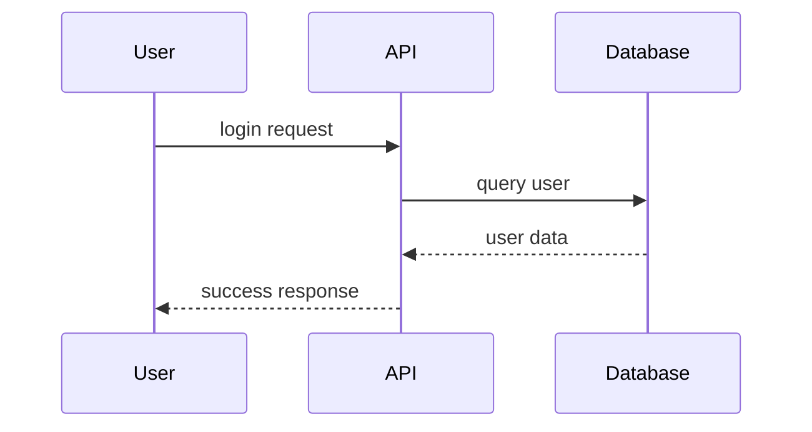
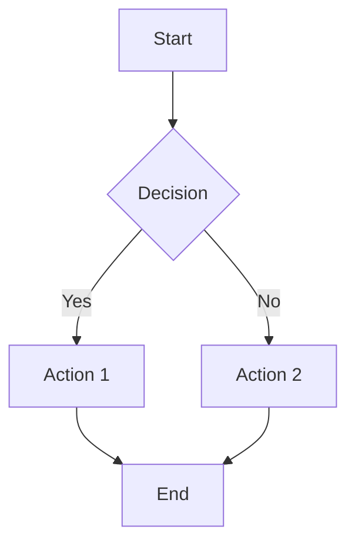
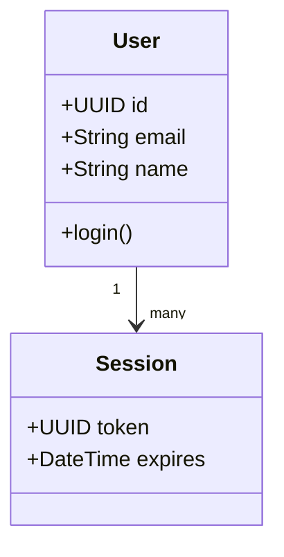
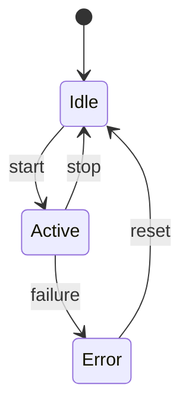
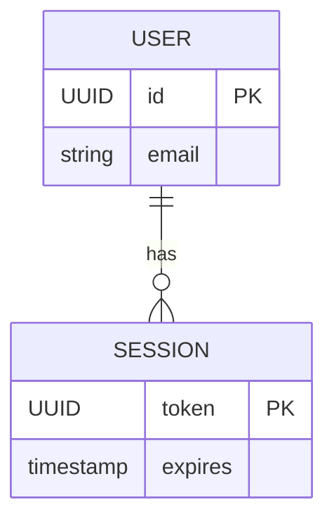
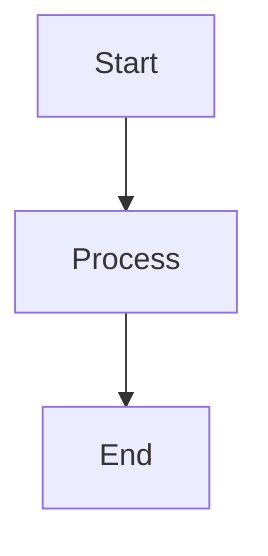
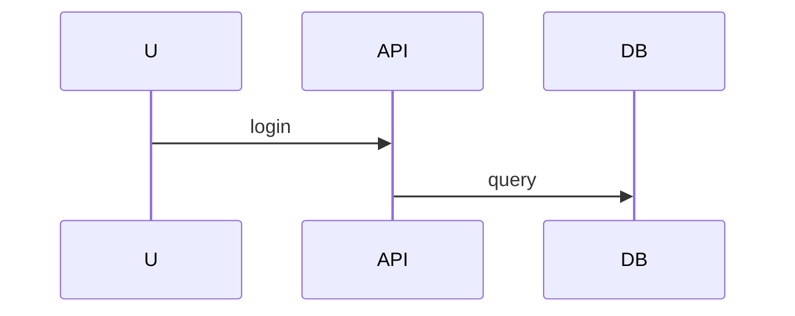

# speclang-header lines:13
id: "@speclang/lenses/mermaid"
version: 0.1.0
layer: 2
parent: "@speclang/lenses"
part: 2/2
tags: [lenses, diagram, mermaid]
imports: ["@speclang/lenses"]
project_level: Alpha
agent_support: agent_assisted
short: Mermaid Diagram Lens
---

# Mermaid Diagram Lens

Mermaid is a diagramming and charting tool that uses text definitions to generate diagrams. In SpecLang, the DiagramLens supports Mermaid as one of its primary formats.

## DiagramLens Reference

```speclang
# @block:lens/diagram @kind:entity
DiagramLens:
  format: mermaid, plantuml, graphviz
  use: visualizing flows, relationships
  
Example:
  # @block:auth/flow @kind:diagram
  ```mermaid
  sequenceDiagram
    U->>API: login
    API->>DB: find user
    DB-->>API: user
    API->>Auth: verify
    Auth-->>API: token
    API-->>U: success
  ```
```

## Mermaid Syntax

Mermaid supports several diagram types:

### Sequence Diagrams



### Flowcharts



### Class Diagrams



### State Diagrams



### Entity Relationship Diagrams



## Using Mermaid in SpecLang

To use Mermaid in a spec block, use the `@kind:diagram` marker and wrap the Mermaid code in triple backticks with the `mermaid` language identifier:

```speclang
# @block:example/flow @kind:diagram

```

The DiagramLens will automatically detect the ````mermaid` fence and parse the content.

## Detection Rules

```speclang
# @block:lens/detection/diagram @kind:operation
detectDiagramLens(content: String) -> Boolean:
  rules:
    - content contains ````mermaid` fence
    - @kind marker is `diagram`
    - content matches Mermaid syntax patterns
```

## Integration with Other Lenses

Mermaid diagrams can be combined with other lenses within the same block:

```speclang
# @block:auth/system @kind:operation
login flow

# diagram


# acceptance criteria
GIVEN valid credentials
WHEN login
THEN success
```

AI will extract and correlate the diagram with the operation description.

## Customizing Mermaid Themes

SpecLang can apply custom Mermaid themes via configuration:

```yaml
# speclang-config.yaml
mermaid:
  theme: dark
  fontSize: 14px
  sequence:
    actorFontSize: 14
```

## References

- [Mermaid Official Documentation](https://mermaid.js.org)
- @ref:speclang/lenses/formats#diagram
- @ref:speclang/lenses