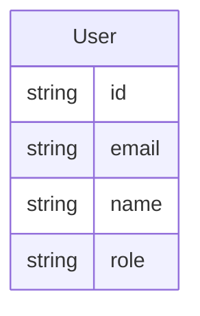
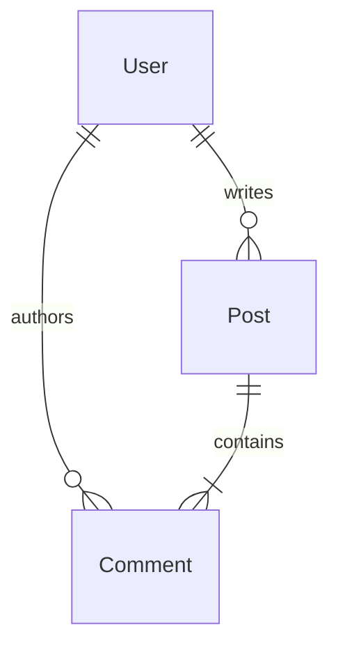

# speclang-header lines:11
id: "@speclang/lenses/entity"
version: 0.1.0
layer: 4
project_level: Alpha
agent_support: agent_autonomous
tags: [lenses, entity, er-diagram, visualization]
short: "Entity relationship visualization lens"
target: src/lenses/entity-lens.ts
status: draft
---

# Entity Lens

Visualizes entities and their relationships.

## Input Format (Spec Blocks)

### @lenses/entity/input-format

Entity lens accepts spec blocks with `@kind:entity` marker. The entity definition can be in various formats:

**YAML-like format:**
```speclang
### @block::user-entity @kind:entity

User:
  id: UUID
  email: String
  name: String
  role: String = "user"
```

**Markdown table format:**
```speclang
### @block::product-entity @kind:entity

| Field | Type | Required | Default |
|-------|------|----------|---------|
| id    | UUID | yes      |         |
| name  | String | yes    |         |
| price | Float | yes      | 0.0     |
```

**TypeScript interface format:**
```speclang
### @block::auth-entity @kind:entity

```typescript
interface User {
  id: string;
  email: string;
  passwordHash: string;
  createdAt: Date;
}
```
```

## Output Format (Entity Visualizations)

### @lenses/entity/output-format

Generates entity visualizations in multiple formats:

**Mermaid ER diagram:**


**PlantUML class diagram:**
```plantuml
class User {
  id: string
  email: string
  name: string
  role: string
}
```

**Interactive web visualization:** HTML/JavaScript component with expandable nodes.

## Supported Entity Types

### @lenses/entity/types

**Entity categories:**
- **Database entities:** Tables, columns, indexes, relationships
- **API resources:** REST resources, GraphQL types, RPC messages
- **Domain objects:** Business entities with behavior
- **Value objects:** Immutable data structures
- **Aggregates:** Root entities with invariants

**Relationship types:**
- **One-to-One:** `User` ↔ `Profile`
- **One-to-Many:** `User` → `Post`
- **Many-to-Many:** `User` ↔ `Role`
- **Inheritance:** `User` → `AdminUser`
- **Composition:** `Order` → `OrderItem`
- **Aggregation:** `Department` → `Employee`

## Entity Extraction

### @lenses/entity/extraction

Extracts entity definitions from spec blocks with accurate field and relationship detection.

**Extraction process:**
1. Detect entity format (YAML, table, TypeScript)
2. Parse entity name and fields
3. Extract field metadata (type, required, default, constraints)
4. Detect relationships from field types (references to other entities)
5. Build entity graph with relationships

**Field parsing:**
- **Type inference:** `String`, `UUID`, `Int`, `Float`, `Boolean`, `Date`, `JSON`
- **Constraints:** `required`, `unique`, `indexed`, `foreignKey`
- **Defaults:** `= "value"`, `= 0`, `= null`
- **Documentation:** Inline comments, descriptions

## Relationship Detection

### @lenses/entity/relationship-detection

Automatically detects relationships between entities.

**Detection strategies:**
- **Type references:** `userId: UUID` → references `User.id`
- **Naming conventions:** `user_id`, `userId`, `user`
- **Explicit annotations:** `@relation`, `@foreignKey`, `@oneToMany`
- **Schema definitions:** Foreign key constraints, join tables

**Relationship metadata:**
- **Cardinality:** `1:1`, `1:N`, `N:M`
- **Ownership:** Which entity owns the relationship
- **Cascade behavior:** Delete, update rules
- **Navigation:** Bidirectional or unidirectional

## ER Diagram Generation

### @lenses/entity/diagram-generation

Generates Entity-Relationship diagrams from extracted entity graph.

**Mermaid ER syntax:**


**PlantUML syntax:**
```plantuml
entity User {
  * id: string
  email: string
  name: string
}

entity Post {
  * id: string
  title: string
  body: string
}

User ||--o{ Post
```

**Graphviz DOT syntax:** For advanced layout control.

## Validation Rules

### @lenses/entity/validation

Validates entity definitions for consistency and correctness.

**Syntax validation:**
- Valid field type names
- Consistent naming conventions
- No duplicate field names
- Proper relationship syntax

**Semantic validation:**
- Referenced entities exist
- Relationship cardinality consistent
- No circular dependencies without resolution
- Foreign key types match referenced types

**Completeness validation:**
- Required fields have types
- Relationships have both ends defined
- No orphaned entities

## Examples

### @lenses/entity/examples

**Example 1: User entity with relationships**

```speclang
### @block::user-model @kind:entity

User:
  id: UUID
  email: String @unique
  name: String
  role: String = "user"
  posts: Post[] @oneToMany
  comments: Comment[] @oneToMany
```

**Example 2: E-commerce schema**

```speclang
### @block::ecommerce-schema @kind:entity

Product:
  id: UUID
  name: String
  price: Float
  category: Category @manyToOne

Category:
  id: UUID
  name: String
  products: Product[] @oneToMany

Order:
  id: UUID
  user: User @manyToOne
  items: OrderItem[] @oneToMany
```

**Example 3: API resource entity**

```speclang
### @block::api-resource @kind:entity

```typescript
interface UserResource {
  id: string;
  email: string;
  name: string;
  links: {
    self: string;
    posts: string;
    comments: string;
  };
}
```
```

## Implementation Notes

### @lenses/entity/implementation

The entity lens implementation should:

1. **Detection:** Identify `@kind:entity` blocks and parse various formats
2. **Parsing:** Extract entities, fields, relationships with metadata
3. **Graph building:** Construct entity relationship graph
4. **Visualization:** Generate diagrams in multiple formats
5. **Validation:** Check consistency and completeness

**Integration:** The lens integrates with the existing lens registry and supports all standard lens operations (parse, render, validate).

**Testing:** Each entity format should have test coverage for extraction, relationship detection, and diagram generation.

**Performance:** Entity lens should handle large schemas efficiently (100+ entities).
