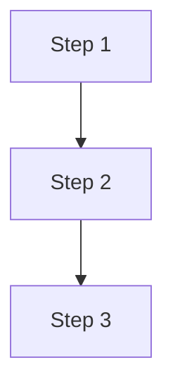
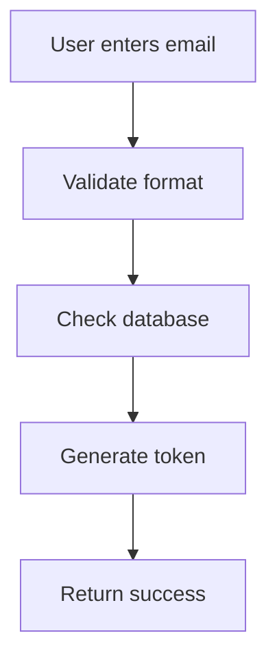
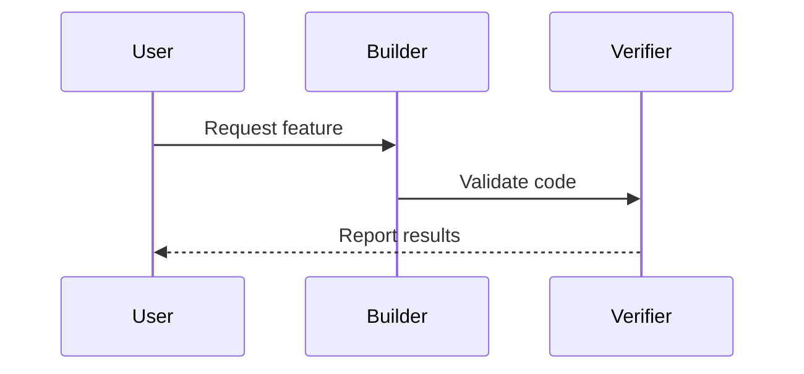
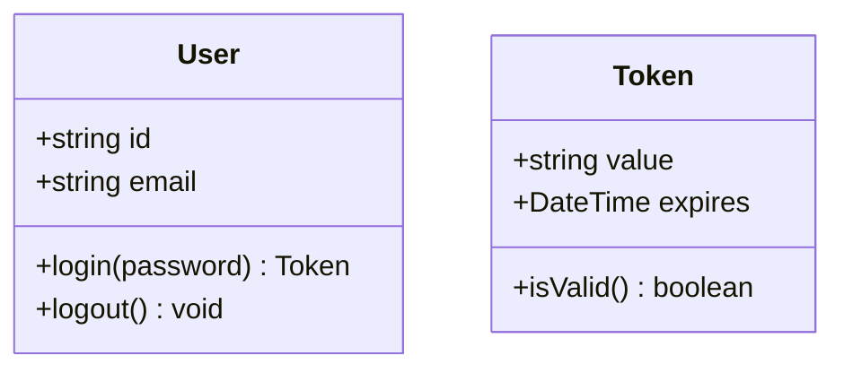
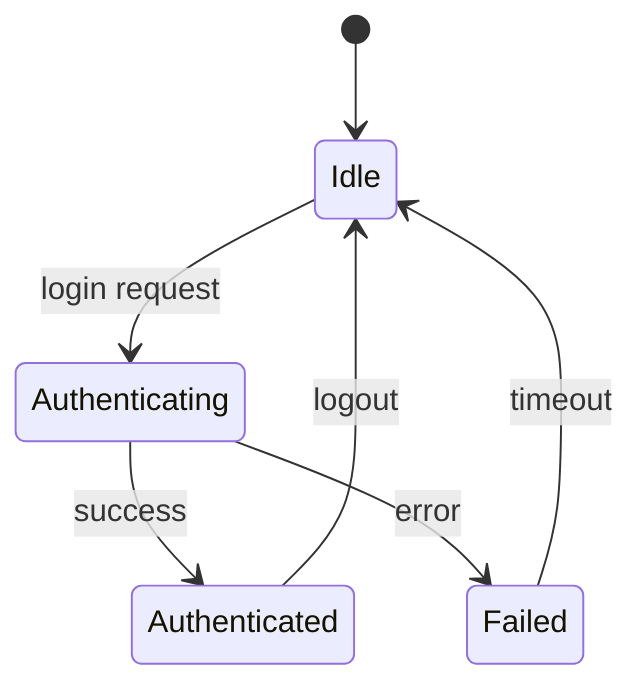
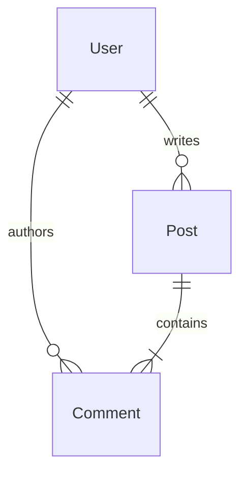
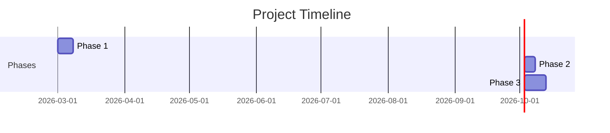

# Mermaid Diagram Lens

Generates Mermaid diagrams from spec blocks.

## Input Format (Spec Blocks)

### @lenses/mermaid/input-format

Mermaid lens accepts spec blocks with `@kind:diagram` marker. The diagram type (flowchart, sequence, class, state, er, gantt) is inferred from the block content using heuristics:

- **Flowchart**: Process flow steps using arrow notation (`→`)
- **Sequence**: Agent interactions with participants and messages
- **Class**: Entity definitions with fields and relationships
- **State**: State transitions with triggers and actions
- **ER**: Entity-relationship diagrams for database schemas
- **Gantt**: Timeline with tasks and dependencies

Each block contains natural language descriptions that the lens parses into diagram elements.

## Output Format (Mermaid Diagrams)

### @lenses/mermaid/output-format

Generates standard Mermaid syntax with appropriate diagram type:

- **Flowchart**: `flowchart TD` or `flowchart LR` with nodes and edges
- **Sequence**: `sequenceDiagram` with participants, messages, and loops
- **Class**: `classDiagram` with classes, fields, methods, and relationships
- **State**: `stateDiagram-v2` with states and transitions
- **ER**: `erDiagram` with entities, attributes, and relationships
- **Gantt**: `gantt` with tasks, durations, and dependencies

Output includes proper Mermaid code fences for embedding in specs.

## Supported Diagrams

### @lenses/mermaid/types

**Diagram Types:**
- Flowchart: Process flows and decisions
- Sequence: Interactions over time
- Class: Object-oriented structures
- State: State machines
- Entity-Relationship: Database schemas
- Gantt: Project timelines

## Flowchart Generation

### @lenses/mermaid/flowchart

Converts spec blocks to flowchart syntax.

**Input:**
```speclang
### @block::process @kind:diagram
Step 1 → Step 2 → Step 3
```

**Output:**


**Additional Examples:**

```speclang
### @block::login-flow @kind:diagram
User enters email → Validate format → Check database → Generate token → Return success
```



## Sequence Diagram Generation

### @lenses/mermaid/sequence

Converts agent interactions to sequence diagrams.

**Input:**
```speclang
### @block::agent-interaction @kind:diagram
User -> Builder: Request feature
Builder -> Verifier: Validate code
Verifier --> User: Report results
```

**Output:**


**Dependencies:**
- @ref:specs/agent-protocol

## Class Diagram Generation

### @lenses/mermaid/class

Converts entity definitions to class diagrams.

**Input:**
```speclang
### @block::user-entity @kind:diagram
User
- id: string
- email: string
+ login(password): Token
+ logout(): void

Token
- value: string
- expires: DateTime
+ isValid(): boolean
```

**Output:**


## State Diagram Generation

### @lenses/mermaid/state

Converts state machine descriptions to state diagrams.

**Input:**
```speclang
### @block::auth-state @kind:diagram
Idle → Authenticating on login request
Authenticating → Authenticated on success
Authenticating → Failed on error
Authenticated → Idle on logout
Failed → Idle after timeout
```

**Output:**


## Entity-Relationship Diagram Generation

### @lenses/mermaid/er

Converts database schema definitions to ER diagrams.

**Input:**
```speclang
### @block::schema @kind:diagram
User ||--o{ Post : writes
User ||--o{ Comment : authors
Post ||--|{ Comment : contains
```

**Output:**


## Gantt Chart Generation

### @lenses/mermaid/gantt

Converts project timelines to Gantt charts.

**Input:**
```speclang
### @block::project-timeline @kind:diagram
Phase 1: 2026-03-01, 7d
Phase 2: after Phase 1, 5d
Phase 3: after Phase 2, 10d
```

**Output:**


## Implementation Notes

### @lenses/mermaid/implementation

The Mermaid lens should:
1. Detect `@kind:diagram`, `@kind:diagram`, etc. markers
2. Parse natural language into structured diagram elements
3. Generate appropriate Mermaid syntax
4. Handle edge cases (missing arrows, invalid syntax)
5. Provide helpful error messages

**Integration:** The lens integrates with the existing diagram lens for parsing existing Mermaid code, but adds generation capabilities.

**Testing:** Each diagram type should have comprehensive test coverage.
