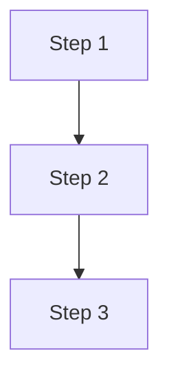

# speclang-header lines:9
id: "@speclang/lenses/mermaid"
parent: ""@ref:specs/lenses"short: "Mermaid diagram generation lens"
project_level: Alpha
agent_support: agent_autonomous
tags: [lenses, mermaid, diagrams, visualization]
version: 0.1.0
layer: 4
---

# Mermaid Diagram Lens

Generates Mermaid diagrams from spec blocks.

## Supported Diagrams

### @lenses/mermaid/types

**Diagram Types:**
- Flowchart: Process flows and decisions
- Sequence: Interactions over time
- Class: Object-oriented structures
- State: State machines
- Entity-Relationship: Database schemas
- Gantt: Project timelines

## Flowchart Generation

### @lenses/mermaid/flowchart

Converts spec blocks to flowchart syntax.

**Input:**
```speclang
### @block::process @kind:flow
Step 1 → Step 2 → Step 3
```

**Output:**


## Sequence Diagram Generation

### @lenses/mermaid/sequence

Converts agent interactions to sequence diagrams.

**Dependencies:**
- @ref:specs/agent-protocol
