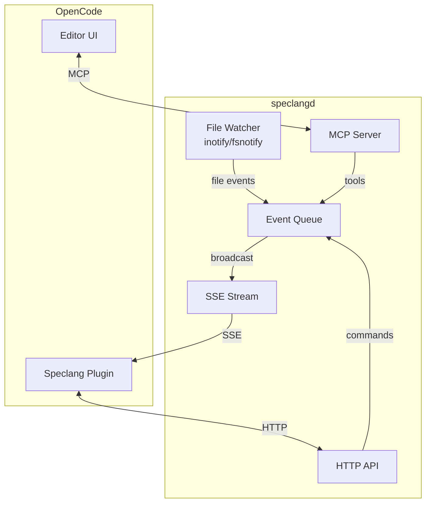

# speclang-header lines:16
id: "@speclang/mcp-daemon/architecture"
version: 0.1.0
layer: 2
tags: [mcp, daemon, http, sse, enterprise]
imports: ["@speclang/core", "@speclang/daemon", "@speclang/deployment"]
status: draft
project_level: Alpha
agent_support: agent_assisted
parent: "@speclang/mcp-daemon"
part: 1/2
siblings:
  next: "@speclang/mcp-daemon/config"

short: MCP Daemon Architecture
---
# MCP Daemon

The enterprise speclangd daemon with HTTP/SSE server and queue management.

## Overview

```speclang
# @block:mcp/overview @kind:note
speclangd is an optional daemon for enterprise mode:

- HTTP server with SSE for events
- MCP-compatible API
- Queue visibility and control
- Worktree management
- Agent control commands

Exposes queue status to the main editor.
Enables testing while building next version.
```

---

## Architecture

### @mcp/arch

```speclang
# @block:mcp/arch @kind:diagram

```

---

## HTTP API

### @mcp/http

```speclang
# @block:mcp/http @kind:entity
HTTPServer:
  port: 8765 (configurable)
  host: localhost
  
  endpoints:
    GET /status
      returns: { mode, queue_depth, files_watching, uptime }
      
    GET /events
      returns: SSE stream of all events
      
    GET /queue
      returns: { pending: [], in_progress: [], completed: [] }
      
    POST /command
      body: { command, params }
      commands: pause, resume, priority, worktree
      
    GET /worktrees
      returns: list of active worktrees
      
    POST /worktree/create
      body: { name, base_commit? }
      returns: { path, ready }
      
    POST /worktree/{name}/test
      body: { filter? }
      returns: { test_id, status }
```

### @mcp/http-examples

```speclang
# @block:mcp/http-examples @kind:code
```bash
# Get status
curl http://localhost:8765/status
# {"mode":"enterprise","queue_depth":12,"files_watching":847,"uptime":3600}

# Get queue
curl http://localhost:8765/queue
# {"pending":["auth.scl","user.scl"],"in_progress":["api.scl"],"completed":45}

# Pause queue
curl -X POST http://localhost:8765/command \
  -d '{"command":"pause"}'
# {"ok":true,"queue_paused":true}

# Create worktree
curl -X POST http://localhost:8765/worktree/create \
  -d '{"name":"test-v1.2"}'
# {"path":".speclang/worktrees/test-v1.2","ready":true}

# Run tests in worktree
curl -X POST http://localhost:8765/worktree/test-v1.2/test
# {"test_id":"test-001","status":"running"}
```
```

---

## SSE Events

### @mcp/sse

```speclang
# @block:mcp/sse @kind:entity
SSEEventStream:
  endpoint: GET /events
  format: text/event-stream
  
  event_types:
    file.changed:
      data: { path, kind, timestamp }
      
    queue.updated:
      data: { depth, added, removed }
      
    agent.started:
      data: { session, agent, file }
      
    agent.finished:
      data: { session, summary, files_written }
      
    convergence.detected:
      data: { quiet_seconds, files_changed }
      
    pipeline.started:
      data: { stages }
      
    pipeline.finished:
      data: { success, duration }
```

### @mcp/sse-example

```speclang
# @block:mcp/sse-example @kind:code
```
event: file.changed
data: {"path":"specs/auth.scl","kind":"modify","timestamp":1705312200}

event: queue.updated
data: {"depth":5,"added":["user.scl"],"removed":[]}

event: agent.started
data: {"session":"sess-003","agent":"spec-writer","file":"specs/auth.scl"}

event: agent.finished
data: {"session":"sess-003","summary":"expanded auth entities","files_written":2}

event: convergence.detected
data: {"quiet_seconds":30,"files_changed":12}
```
```

---

## MCP Tools

### @mcp/tools

```speclang
# @block:mcp/tools @kind:entity
MCPTools:
  
  speclang_queue_status:
    description: "Get current queue status"
    returns: { pending, in_progress, completed, depth }
    
  speclang_queue_pause:
    description: "Pause queue processing"
    returns: { ok, paused_at }
    
  speclang_queue_resume:
    description: "Resume queue processing"
    returns: { ok, resumed_at }
    
  speclang_worktree_create:
    params: { name, base_commit? }
    description: "Create isolated worktree"
    returns: { path, ready }
    
  speclang_worktree_test:
    params: { worktree, filter? }
    description: "Run tests in worktree"
    returns: { test_id, status, results }
    
  speclang_worktree_deploy:
    params: { worktree, target }
    description: "Deploy worktree version"
    returns: { deployment_id, status }
    
  speclang_agent_control:
    params: { session, command }
    commands: pause, resume, split, re-expand, priority
    description: "Control a specific agent"
    returns: { ok, new_status }
```

---
