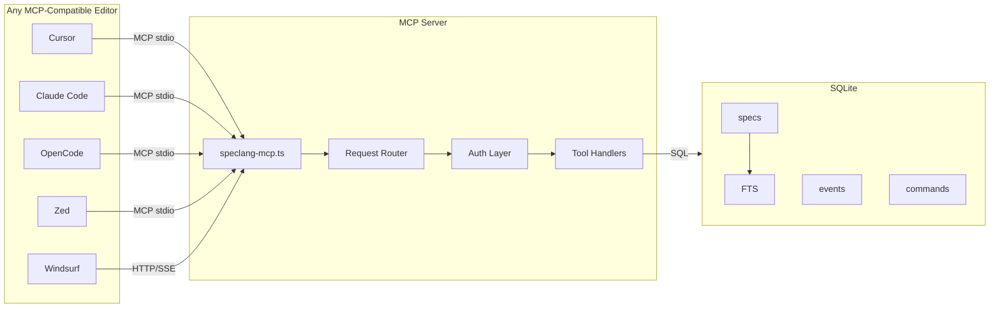

# speclang-header lines:12
id: "@speclang/mcp.architecture"
parent: "@ref:speclang/mcp"part: 2/12
siblings:
  next: "@ref:specs/mcp.spec.dir/run-modes"
short: MCP server architecture diagram and components
project_level: Alpha
agent_support: agent_assisted
tags: [mcp, speclang]
version: 0.1.0
layer: 3
---
# MCP Server Architecture

### @mcp/architecture

```speclang
# @block:mcp/architecture @kind:diagram

```
