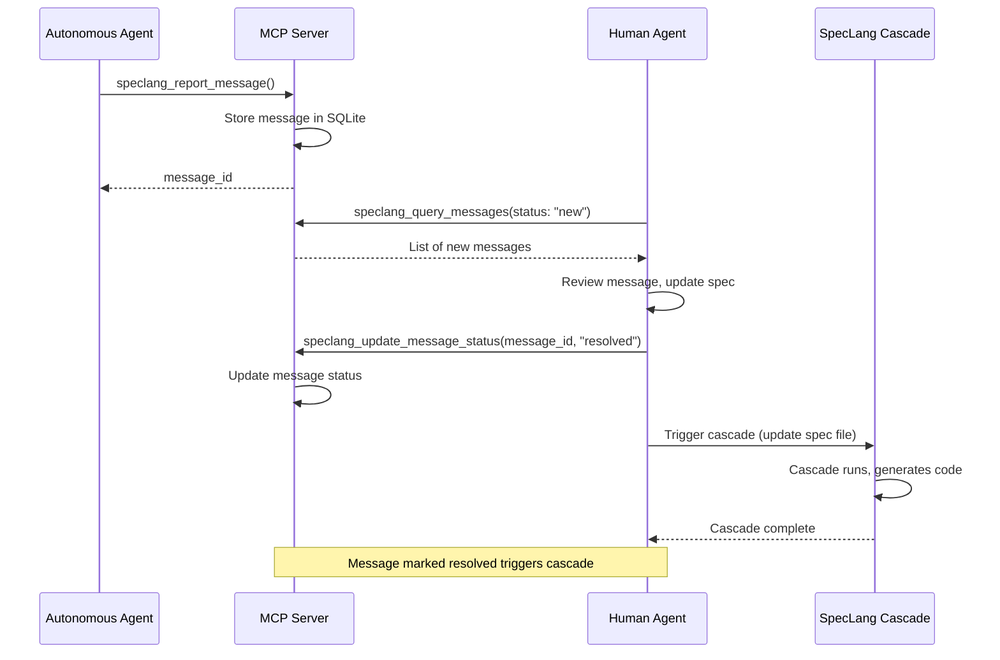

# speclang-header lines:9
id: "@speclang/mcp/messages"
version: 0.1.0
layer: 2
tags: [mcp, messages, notifications, communication, agents]
parent: ""@ref:specs/mcp"project_level: Alpha
agent_support: agent_autonomous
short: MCP Message Protocol - Communication between autonomous agents and humans
---
# MCP Message Protocol

Communication system between autonomous agents and human agents via MCP server. Agents report spec issues, human agents query and resolve them.

## Overview

```speclang
# @block:mcp/messages/overview @kind:note
MCP Message Protocol enables:

- Autonomous agents report spec ambiguities, incompleteness, validation failures
- Human agents query message inbox via MCP server
- Clear protocol for resolving issues and updating specs
- Message status tracking (new → in-progress → resolved)
- Integration with cascade: resolved messages trigger cascade updates

This creates a feedback channel between the autonomous system and human oversight.
```

## Message Data Structure

### @mcp/messages/structure

```speclang
# @block:mcp/messages/structure @kind:entity
Message:
  id: UUID (generated by agent)
  type: enum [ambiguity, incompleteness, validation_failure, question, suggestion]
  priority: enum [blocking, high, medium, low, informational]
  
  source:
    agent: string (agent role: spec-writer, code-gen, etc.)
    session_id: string
    change_id: string (UUID of change that triggered this message)
    
  target:
    spec_id: string (e.g., "@specs/auth#login")
    file_path: string
    line_range: [start_line, end_line] (optional)
    
  content:
    title: string (short summary)
    description: string (detailed issue)
    suggested_fix: string (optional)
    code_snippet: string (optional)
    
  metadata:
    created_at: timestamp
    updated_at: timestamp
    status: enum [new, in_progress, resolved, dismissed]
    resolved_by: string (optional, agent who resolved)
    resolved_at: timestamp (optional)
    resolution_notes: string (optional)
    
  cascade_links:
    cascade_id: string (optional, which cascade this belongs to)
    parent_message_id: string (optional, for threaded discussions)
```

## MCP Tools for Messages

### @mcp/messages/tools

```speclang
# @block:mcp/messages/tools @kind:entity
MessageTools:
  
  speclang_report_message:
    description: "Agent reports a spec issue or question"
    params:
      type: string (ambiguity|incompleteness|validation_failure|question|suggestion)
      priority: string (blocking|high|medium|low|informational)
      spec_id: string
      file_path: string
      title: string
      description: string
      suggested_fix: string (optional)
      code_snippet: string (optional)
      line_range: [number, number] (optional)
    returns:
      message_id: string
      created_at: timestamp
    
  speclang_query_messages:
    description: "Human agent queries message inbox"
    params:
      status: string (optional, new|in_progress|resolved|dismissed)
      priority: string (optional)
      type: string (optional)
      spec_id: string (optional)
      limit: number (default: 20)
      offset: number (default: 0)
    returns:
      messages: Message[]
      total_count: number
    
  speclang_get_message:
    description: "Get specific message by ID"
    params:
      message_id: string
    returns:
      message: Message
    
  speclang_update_message_status:
    description: "Update message status (human agent responds)"
    params:
      message_id: string
      status: string (in_progress|resolved|dismissed)
      resolution_notes: string (optional)
    returns:
      success: boolean
      updated_at: timestamp
    
  speclang_add_message_response:
    description: "Add response to message (threaded discussion)"
    params:
      message_id: string
      content: string
      agent: string (agent role)
    returns:
      response_id: string
      created_at: timestamp
```

## Message Flow

### @mcp/messages/flow

```speclang
# @block:mcp/messages/flow @kind:diagram

```

## Integration with Cascade

### @mcp/messages/cascade-integration

```speclang
# @block:mcp/messages/cascade-integration @kind:entity
CascadeIntegration:
  
  automatic_triggers:
    - When message marked "resolved": trigger cascade on affected spec
    - When cascade fails: auto-create validation_failure message
    - When spec validation fails: auto-create incompleteness message
    
  agent_behavior:
    - SpecWriter: Reports ambiguities in natural language specs
    - CodeGen: Reports validation failures in code generation
    - TestWriter: Reports incompleteness in test specs
    - Orchestrator: Reports systemic issues and suggests fixes
    
  human_agent_workflow:
    1. Query inbox for new messages
    2. Review each message, examine spec
    3. Update spec to resolve issue
    4. Mark message as resolved
    5. Cascade automatically triggers
    6. Verify generated code works
```

## Priority Levels

### @mcp/messages/priorities

```speclang
# @block:mcp/messages/priorities @kind:entity
MessagePriorities:
  
  blocking:
    description: "Cascade cannot proceed until resolved"
    examples:
      - Syntax error in spec
      - Missing required dependency
      - Validation failure blocking code generation
    agent_response: "Stop cascade, wait for human"
    
  high:
    description: "Serious issue affecting functionality"
    examples:
      - Ambiguous business logic
      - Incomplete implementation spec
      - Security concern
    agent_response: "Continue but flag for immediate attention"
    
  medium:
    description: "Issue affecting quality but not functionality"
    examples:
      - Missing edge case tests
      - Documentation gaps
      - Performance concern
    agent_response: "Continue, flag for near-term attention"
    
  low:
    description: "Minor issue or improvement suggestion"
    examples:
      - Typo in documentation
      - Code style suggestion
      - UX improvement idea
    agent_response: "Continue, log for future consideration"
    
  informational:
    description: "FYI notification, no action required"
    examples:
      - Spec expansion completed
      - Test coverage increased
      - Performance improvement achieved
    agent_response: "Continue, log for tracking"
```

## Examples

### @mcp/messages/examples

```speclang
# @block:mcp/messages/examples @kind:code
```json
// Example 1: Ambiguity report from SpecWriter
{
  "id": "msg-001",
  "type": "ambiguity",
  "priority": "high",
  "source": {
    "agent": "spec-writer",
    "session_id": "sess-a1b2c3d",
    "change_id": "change-b2c3d4e"
  },
  "target": {
    "spec_id": "@specs/auth#login",
    "file_path": "specs/auth.spec.md",
    "line_range": [45, 52]
  },
  "content": {
    "title": "Ambiguous password validation requirements",
    "description": "The spec says 'validate password' but doesn't specify minimum length, character requirements, or whether to check against breached password databases.",
    "suggested_fix": "Add specific requirements: minimum 8 characters, at least one uppercase, one lowercase, one number, and optionally check against HaveIBeenPwned API.",
    "code_snippet": "### @block::auth/password-validation @kind:operation\nPassword validation should:\n1. Minimum 8 characters\n2. At least one uppercase letter\n3. At least one lowercase letter\n4. At least one number\n5. Optional: check against HaveIBeenPwned"
  },
  "metadata": {
    "created_at": "2025-02-22T10:30:00Z",
    "status": "new"
  }
}

// Example 2: Human agent response
{
  "message_id": "msg-001",
  "response": {
    "agent": "human",
    "content": "Updated spec with your suggested requirements. Added minimum length and character requirements. Skipped HaveIBeenPwned integration for now (MVP scope).",
    "created_at": "2025-02-22T10:45:00Z"
  }
}
```
```

## SQLite Schema

### @mcp/messages/schema

```speclang
# @block:mcp/messages/schema @kind:code
```sql
CREATE TABLE messages (
  id TEXT PRIMARY KEY,
  type TEXT NOT NULL CHECK (type IN ('ambiguity', 'incompleteness', 'validation_failure', 'question', 'suggestion')),
  priority TEXT NOT NULL CHECK (priority IN ('blocking', 'high', 'medium', 'low', 'informational')),
  
  source_agent TEXT NOT NULL,
  source_session_id TEXT NOT NULL,
  source_change_id TEXT,
  
  target_spec_id TEXT NOT NULL,
  target_file_path TEXT NOT NULL,
  target_line_start INTEGER,
  target_line_end INTEGER,
  
  title TEXT NOT NULL,
  description TEXT NOT NULL,
  suggested_fix TEXT,
  code_snippet TEXT,
  
  created_at INTEGER NOT NULL,
  updated_at INTEGER NOT NULL,
  status TEXT NOT NULL CHECK (status IN ('new', 'in_progress', 'resolved', 'dismissed')),
  resolved_by TEXT,
  resolved_at INTEGER,
  resolution_notes TEXT,
  
  cascade_id TEXT,
  parent_message_id TEXT,
  
  FOREIGN KEY (parent_message_id) REFERENCES messages(id)
);

CREATE TABLE message_responses (
  id TEXT PRIMARY KEY,
  message_id TEXT NOT NULL,
  agent TEXT NOT NULL,
  content TEXT NOT NULL,
  created_at INTEGER NOT NULL,
  FOREIGN KEY (message_id) REFERENCES messages(id)
);

CREATE INDEX idx_messages_status ON messages(status);
CREATE INDEX idx_messages_spec ON messages(target_spec_id);
CREATE INDEX idx_messages_priority ON messages(priority);
CREATE INDEX idx_messages_created ON messages(created_at DESC);
```
```

## SLA and Notification System

### @mcp/messages/sla

```speclang
# @block:mcp/messages/sla @kind:entity
MessageSLA:
  
  priority_slas:
    blocking:
      max_response_time_minutes: 15
      notification_channels: [push, email, sms]
      auto_escalation_minutes: 30
      required_human_response: true
      
    high:
      max_response_time_minutes: 60
      notification_channels: [email, push]
      auto_escalation_minutes: 120
      required_human_response: true
      
    medium:
      max_response_time_minutes: 240
      notification_channels: [email]
      auto_escalation_minutes: 480
      required_human_response: false
      
    low:
      max_response_time_minutes: 1440  # 24 hours
      notification_channels: [email]
      auto_escalation_minutes: 2880
      required_human_response: false
      
    informational:
      max_response_time_minutes: 0  # no SLA
      notification_channels: []
      auto_escalation_minutes: 0
      required_human_response: false
      
  notification_channels:
    push:
      description: "Real-time push notification"
      delivery: "WebSocket, MCP server push"
      ack_required: true
      
    email:
      description: "Email notification"
      delivery: "SMTP"
      template: "message_notification.html"
      ack_required: false
      
    sms:
      description: "SMS notification"
      delivery: "Twilio, AWS SNS, etc."
      ack_required: false
      
  escalation_workflow:
    - Message created with timestamp
    - Timer starts based on priority SLA
    - If not acknowledged within SLA, send reminder
    - If not resolved within auto_escalation_minutes, escalate to higher priority
    - Escalation can trigger additional notifications (manager, on-call)
    
  acknowledgment:
    - Human must acknowledge receipt of blocking/high priority messages
    - Acknowledgment stops SLA timer
    - Resolution expected within reasonable time after acknowledgment
```

### @mcp/messages/confidence-calculation

```speclang
# @block:mcp/messages/confidence-calculation @kind:entity
ConfidenceCalculation:
  
  factors:
    historical_patterns:
      description: "Similar messages resolved in past"
      weight: 0.3
      calculation: "Cosine similarity of message content to resolved messages"
      
    agent_confidence_score:
      description: "Agent's self-reported confidence"
      weight: 0.2
      calculation: "Agent provides 0.0-1.0 confidence score"
      
    spec_completeness:
      description: "How complete the target spec is"
      weight: 0.2
      calculation: "Percentage of required fields present"
      
    validation_error_type:
      description: "Type of validation error"
      weight: 0.3
      calculation: "Predefined confidence for error types"
        - syntax_error: 0.9
        - missing_field: 0.7
        - ambiguous_language: 0.5
        - business_logic_gap: 0.3
        
  auto_resolution_threshold: 0.8
  
  auto_resolution_rules:
    - Confidence >= 0.9: Auto-resolve with suggested fix
    - Confidence 0.8-0.89: Auto-resolve but notify human
    - Confidence 0.7-0.79: Suggest fix, wait for human confirmation
    - Confidence < 0.7: Require human review
    
  learning_mechanism:
    - Track human resolutions
    - Update confidence weights based on accuracy
    - Improve pattern matching over time
```

## Integration with Continuous Improvement Loop

### @mcp/messages/continuous-improvement

```speclang
# @block:mcp/messages/continuous-improvement @kind:entity
ContinuousImprovementIntegration:
  
  role_in_loop:
    - MCP message inbox is the primary communication channel
    - Agents report issues that block autonomous operation
    - Human agents query inbox via MCP server
    - Resolved messages trigger cascade updates
    
  escalation_path:
    - Messages accumulate in inbox
    - If unresolved messages exceed `escalation_threshold`, notify human
    - Human can prioritize and resolve messages
    - AI can auto-resolve messages with high confidence
    
  feedback_cycle:
    - Continuous improvement loop depends on message resolution
    - Each resolved message improves spec quality
    - Better specs enable more autonomous operation
    - Loop continues indefinitely
```

## References

- "@ref:specs/mcp - MCP server specification
- @ref:specs/agent-protocol - Agent communication protocol
- @ref:specs/cascade - Cascade system integration
- @ref:specs/cascade/continuous-improvement - Continuous improvement loop
- @ref:specs/sqlite - SQLite database schema