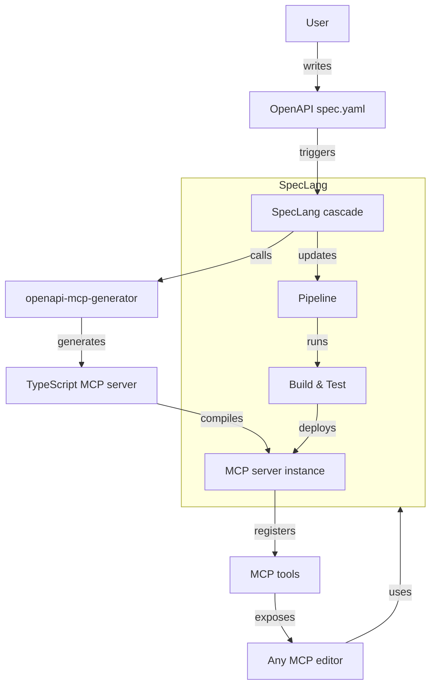

# speclang-header lines:11
id: "@speclang/mcp/openapi-generation"
version: 0.1.0
layer: 2
imports: ["@speclang/mcp", "@speclang/cli.spec", "@speclang/tools"]
tags: [mcp, openapi, generator, integration, automation]
short: Integration with openapi-mcp-generator for easy MCP server generation
status: draft
project_level: Alpha
agent_support: agent_assisted
---
# OpenAPI-MCP Generator Integration

Integrate SpecLang with [openapi-mcp-generator](https://github.com/harsha-iiiv/openapi-mcp-generator) to automatically generate MCP servers from OpenAPI specifications.

## Overview

```speclang
# @block:speclang/mcp/openapi-generation/overview @kind:note
Goal: Make MCP server generation trivial for SpecLang users.

- Use openapi-mcp-generator CLI to generate TypeScript MCP servers
- Integrate generation into SpecLang pipeline
- Provide CLI commands: `speclang mcp generate-openapi`
- Support stdio, web, and streamable-http transports
- Automatically register generated tools with SpecLang's MCP server
- Enable bidirectional sync: OpenAPI changes → regenerate MCP server
```

## Architecture

```speclang
# @block:speclang/mcp/openapi-generation/architecture @kind:diagram

```

## Integration Steps

### @speclang/mcp/openapi-generation/integration-steps

```speclang
# @block:speclang/mcp/openapi-generation/integration-steps @kind:entity
IntegrationSteps:
  1. Install openapi-mcp-generator as a dev dependency:
     ```bash
     npm install -g openapi-mcp-generator
     ```
     
  2. Add CLI command `speclang mcp generate-openapi`:
     - Input: path to OpenAPI spec (YAML/JSON)
     - Output: directory for generated MCP server
     - Options: transport, port, server name, etc.
     
  3. Generate MCP server code:
     - Call openapi-mcp-generator programmatically or via CLI
     - Place output in `generated/mcp-servers/{api-name}/`
     
  4. Integrate with SpecLang's MCP server:
     - Register generated tools dynamically
     - Or run generated server as separate process
     
  5. Add to pipeline:
     - On OpenAPI spec change, regenerate MCP server
     - Run tests for generated server
     - Deploy as part of build
```

## Integration Modes

### @speclang/mcp/openapi-generation/integration-modes

```speclang
# @block:speclang/mcp/openapi-generation/integration-modes @kind:entity
IntegrationModes:

  register_tools:
    description: Dynamically register generated tools with SpecLang's MCP server
    process:
      - Generate tools from OpenAPI spec
      - Register each tool with existing MCP server instance
      - Tools appear as native SpecLang tools
    advantages:
      - Single MCP server process
      - Unified authentication and logging
      - Lower resource usage
    limitations:
      - Requires tool registration API
      - May conflict with existing tool names

  separate_server:
    description: Run generated MCP server as separate process
    process:
      - Generate standalone TypeScript MCP server
      - Start as child process or external service
      - Connect via stdio, web, or streamable-http transport
    advantages:
      - Isolation from SpecLang process
      - Can be deployed independently
      - Easier debugging
    limitations:
      - Additional resource overhead
      - Requires inter-process communication

  dry_run_option:
    description: Validate OpenAPI spec and generate configuration without writing files
    usage: speclang mcp generate-openapi --dry-run
    outputs:
      - Validation report
      - List of tools that would be generated
      - Estimated file structure
    purpose:
      - Preview before actual generation
      - Catch errors early
```

## OpenAPI Spec Validation

### @speclang/mcp/openapi-generation/spec-validation

```speclang
# @block:speclang/mcp/openapi-generation/spec-validation @kind:entity
OpenAPISpecValidation:

  validation_steps:
    1. Schema validation:
       - Use OpenAPI validator (e.g., swagger-parser)
       - Ensure spec conforms to OpenAPI 3.0/3.1
       - Check for circular references, unresolvable references
    2. Security validation:
       - Detect potentially malicious specs (e.g., excessive recursion, large payloads)
       - Limit operation count, parameter size
       - Validate external URLs (allowlist)
    3. Content validation:
       - Ensure required fields present
       - Validate example values match schema
       - Check for duplicate operation IDs

  tools:
    - swagger-parser (Node.js)
    - openapi-validator (Python)
    - Custom validation in speclang

  integration:
    - Run validation before generation
    - Fail fast with descriptive errors
    - Provide suggestions for fixes

  prevention:
    - Never execute arbitrary code from spec
    - Sanitize strings used in file paths
    - Limit resource usage during validation
```

## CLI Commands

### @speclang/mcp/openapi-generation/cli-commands

```speclang
# @block:speclang/mcp/openapi-generation/cli-commands @kind:entity
CLICommands:
  
  speclang mcp generate-openapi:
    description: Generate MCP server from OpenAPI spec
    usage: speclang mcp generate-openapi --input <spec> --output <dir> [options]
    
    options:
      --input, -i:
        required: true
        description: Path or URL to OpenAPI spec (YAML/JSON)
        
      --output, -o:
        required: true
        description: Output directory for generated MCP project
        
      --transport, -t:
        default: stdio
        values: [stdio, web, streamable-http]
        description: Transport mode
        
      --port, -p:
        default: 3000
        description: Port for web-based transports
        
      --server-name, -n:
        description: Name of MCP server (default: OpenAPI title)
        
      --base-url, -b:
        description: Base URL for API requests
        
      --force:
        description: Overwrite existing files
        
      --register:
        description: Automatically register with SpecLang MCP server
        
    examples:
      - speclang mcp generate-openapi -i openapi.yaml -o generated/mcp/petstore
      - speclang mcp generate-openapi -i https://api.example.com/openapi.json -o generated/mcp/api --transport=web --port=8080 --register
```

## Programmatic API

### @speclang/mcp/openapi-generation/programmatic-api

```speclang
# @block:speclang/mcp/openapi-generation/programmatic-api @kind:code
```typescript
import { getToolsFromOpenApi } from 'openapi-mcp-generator';
import { MCPServer } from './speclang-mcp';

/**
 * Generate MCP tools from OpenAPI spec and register with SpecLang MCP server
 */
export async function generateAndRegisterOpenApiTools(
  specPath: string,
  options: {
    baseUrl?: string;
    transport?: 'stdio' | 'web' | 'streamable-http';
    serverName?: string;
  } = {}
): Promise<void> {
  // Generate tools from OpenAPI
  const tools = await getToolsFromOpenApi(specPath, {
    baseUrl: options.baseUrl,
    dereference: true,
  });
  
  // Get SpecLang MCP server instance
  const server = MCPServer.getInstance();
  
  // Register each tool
  for (const tool of tools) {
    server.registerTool({
      name: tool.name,
      description: tool.description,
      inputSchema: tool.inputSchema,
      handler: async (args: any) => {
        // Proxy request to actual API
        const response = await fetch(tool.url, {
          method: tool.method,
          headers: tool.headers,
          body: JSON.stringify(args),
        });
        return response.json();
      },
    });
  }
  
  console.log(`Registered ${tools.length} tools from ${specPath}`);
}
```
```

## Example Workflow

### @speclang/mcp/openapi-generation/example-workflow

```speclang
# @block:speclang/mcp/openapi-generation/example-workflow @kind:entity
ExampleWorkflow:
  
  scenario: User has a REST API with OpenAPI spec
  
  steps:
    1. User writes OpenAPI spec for their API (petstore.yaml)
    2. User runs: `speclang mcp generate-openapi -i petstore.yaml -o generated/mcp/petstore --register`
    3. SpecLang:
       - Calls openapi-mcp-generator
       - Generates TypeScript MCP server in generated/mcp/petstore/
       - Registers tools with SpecLang's MCP server
       - Starts the generated server (or integrates tools)
    4. User opens any MCP-compatible editor (Cursor, Claude Code, etc.)
    5. Editor connects to SpecLang MCP server
    6. User can now use MCP tools like `petstore_listPets`, `petstore_createPet`
    7. When OpenAPI spec changes, cascade triggers regeneration
```

## Configuration

### @speclang/mcp/openapi-generation/config

```speclang
# @block:speclang/mcp/openapi-generation/config @kind:entity
Configuration:
  
  spec: .speclang/openapi-mcp.yaml
  
  schema:
    servers:
      - name: string
        spec: string (path or URL)
        output: string (relative path)
        transport: string
        port: number
        auto_register: boolean
        watch: boolean (regenerate on spec change)
        
    defaults:
      transport: stdio
      output_base: generated/mcp-servers
      
  example:
    ```yaml
    servers:
      - name: petstore
        spec: ./api/petstore.yaml
        output: petstore
        transport: web
        port: 3001
        auto_register: true
        watch: true
        
      - name: weather
        spec: https://api.weather.com/openapi.json
        output: weather
        transport: stdio
        auto_register: false
    ```
```

## Pipeline Integration

### @speclang/mcp/openapi-generation/pipeline

```speclang
# @block:speclang/mcp/openapi-generation/pipeline @kind:entity
PipelineIntegration:
  
  build.yaml:
    ```yaml
    steps:
      - name: generate-mcp-servers
      run: speclang mcp generate-all
      watch:
        - "**/*.openapi.yaml"
        - "**/*.openapi.json"
        
      - name: build-mcp-servers
      run: |
        cd generated/mcp-servers
        for dir in */; do
          cd "$dir" && npm install && npm run build
        done
        
      - name: test-mcp-servers
      run: |
        cd generated/mcp-servers
        for dir in */; do
          cd "$dir" && npm test
        done
    ```
```

## Dependencies

### @speclang/mcp/openapi-generation/dependencies

```speclang
# @block:speclang/mcp/openapi-generation/dependencies @kind:entity
Dependencies:
  
  required:
    - openapi-mcp-generator (npm package) >= 0.1.0
    - @modelcontextprotocol/sdk >= 0.5.0
    - axios >= 1.0.0
    - zod >= 3.0.0
    
  optional:
    - hono (for web transport) >= 4.0.0
    - express (alternative) >= 4.0.0
    
  dev:
    - typescript >= 5.0.0
    - ts-node >= 10.0.0
    - @types/node >= 20.0.0
    
  version_pinning:
    description: Use package.json with exact versions for production
    recommendation: "Use npm shrinkwrap or package-lock.json"
```

## Security Considerations

### @speclang/mcp/openapi-generation/security

```speclang
# @block:speclang/mcp/openapi-generation/security @kind:entity
SecurityConsiderations:
  
  authentication_propagation:
    description: Generated MCP servers proxy authentication from MCP clients to target API
    methods:
      - api_key: API key from environment variable
      - bearer_token: Bearer token from environment variable
      - basic_auth: Username/password from environment variables
      - oauth2: Client credentials flow
    
  environment_variables:
    description: Sensitive credentials stored in environment variables
    pattern: API_KEY_<SCHEME_NAME>, BEARER_TOKEN_<SCHEME_NAME>, etc.
    security: Never commit .env files; use .env.example
    secret_management:
      - use vault or secret manager for production
      - rotate keys periodically
      - audit access logs
    
  input_validation:
    description: Generated Zod schemas validate input before proxying
    benefit: Prevents malformed requests reaching target API
    
  access_control:
    description: Limit which MCP clients can access generated tools
    methods:
      - MCP server authentication (basic, token)
      - IP whitelisting for web transports
      - Rate limiting per client (max requests per minute)
      - Authentication required for web transport (API key or JWT)
      - TLS enforcement for web transport (HTTPS only)
    
  tls_enforcement:
    description: Ensure all web transport uses TLS
    requirements:
      - HTTPS required for web and streamable-http transports
      - Redirect HTTP to HTTPS
      - HSTS headers
      - Valid certificates (Let's Encrypt or enterprise CA)
    
  rate_limiting:
    description: Prevent abuse of generated MCP tools
    implementation:
      - token bucket algorithm per client IP
      - configurable limits per tool
      - headers: X-RateLimit-Limit, X-RateLimit-Remaining
      - HTTP 429 Too Many Requests response
    
  security_scheme_mapping:
    description: Map OpenAPI security schemes to MCP tool authentication
    mapping:
      - apiKey → API key header
      - http bearer → Authorization header
      - oauth2 → OAuth2 client credentials flow
```

## Error Handling

### @speclang/mcp/openapi-generation/error-handling

```speclang
# @block:speclang/mcp/openapi-generation/error-handling @kind:entity
ErrorHandling:
  
  generator_failures:
    description: openapi-mcp-generator CLI may fail
    scenarios:
      - invalid OpenAPI spec
      - missing dependencies
      - network errors for URL specs
      - permission issues
    handling:
      - validate spec before generation
      - provide descriptive error messages
      - exit with appropriate error codes
  
  validation_errors:
    description: Zod schema validation failures
    handling:
      - return MCP error with validation details
      - status code: 400
  
  network_errors:
    description: Target API unreachable
    handling:
      - retry with exponential backoff
      - return MCP error with status code
      - log for monitoring
  
  authentication_errors:
    description: Invalid credentials for target API
    handling:
      - return MCP error "UNAUTHORIZED"
      - log without exposing secrets
  
  recovery:
    description: Automatic recovery from failures
    actions:
      - rollback to previous generated version
      - notify user via MCP tool
      - suggest fixes
```

## Future Enhancements

```speclang
# @block:speclang/mcp/openapi-generation/future @kind:note
Potential future enhancements:
- Auto-detection of OpenAPI spec changes via file watching
- Integration with Swagger UI for generated MCP servers
- Support for multiple OpenAPI versions
- Plugin system for custom generators
```

## References

- @ref:speclang/mcp
- @ref:speclang/cli
- @ref:speclang/tools
- @ref:speclang/pipeline
- @ref:northstar/speclang
