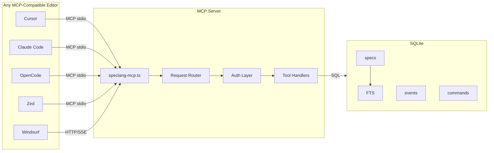

# speclang-header lines:8
id: @speclang/mcp
version: 0.3.0
layer: 3
imports: [@speclang/core, @speclang/sqlite]
tags: [mcp, typescript, server, implementation]
short: MCP server implementation for universal editor access
---

# MCP Server Implementation

Standalone TypeScript MCP server providing SQLite access to any editor.

---

## Overview

```speclang
# @block:mcp/overview @kind:note
MCP Server (~600 lines TypeScript):
- Standalone server, not tied to OpenCode
- Provides SQLite access via MCP tools
- Works with ANY MCP-compatible editor (Cursor, Claude Code, Zed, etc.)
- Three run modes: editor-initiated, remote, server
- Commands table for inter-agent communication
- Error logs accessible via MCP tools

Location: speclang-mcp.ts
```

---

## Architecture

### @mcp/architecture

```speclang
# @block:mcp/architecture @kind:diagram

```

---

## Run Modes

### @mcp/modes

```speclang
# @block:mcp/modes @kind:entity
RunModes:
  
  editor_initiated:
    command: speclang mcp start
    process: Editor spawns MCP server via stdio
    connection: stdio (bidirectional JSON-RPC)
    lifetime: Editor lifetime
    use_case: Personal projects, solo development
    
  remote_mode:
    command: speclang mcp start --remote --port 3000 [--auth=basic|token]
    process: Standalone daemon process
    connection: HTTP/SSE or WebSocket
    lifetime: Until killed or --daemon
    use_case: Team projects, shared access, remote agents
    security: 
      - Optional basic auth (--user, --pass)
      - Optional bearer token (--token)
      - TLS recommended for production
      
  server_mode:
    command: speclang mcp serve [--config=mcp.json]
    process: System daemon
    connection: Named pipe or socket
    lifetime: System boot to shutdown
    use_case: Enterprise, always-on
    
  comparison:
    | Mode | Spawned By | Connection | Auth | Use Case |
    |------|-----------|------------|------|----------|
    | Editor | Editor | stdio | None | Personal |
    | Remote | User | HTTP | Optional | Team |
    | Server | System | Socket | Config | Enterprise |
```

### @mcp/mode-implementation

```speclang
# @block:mcp/mode-implementation @kind:code
```typescript
// Mode detection and startup
import { Server } from "@modelcontextprotocol/sdk/server/index.js";
import { StdioServerTransport } from "@modelcontextprotocol/sdk/server/stdio.js";
import { SSEServerTransport } from "@modelcontextprotocol/sdk/server/sse.js";
import express from "express";
import { randomUUID } from "crypto";

class SpeclangMCPServer {
  private db: Database;
  private mode: 'stdio' | 'http' | 'socket';
  private transports = new Map<string, SSEServerTransport>();
  
  async start(args: string[]) {
    // Detect mode from args
    if (args.includes('--remote')) {
      await this.startHTTP(args);
    } else if (args.includes('--serve')) {
      await this.startSocket(args);
    } else {
      await this.startStdio();
    }
  }
  
  async startStdio() {
    this.mode = 'stdio';
    const server = new Server({
      name: "speclang",
      version: "1.0.0"
    }, {
      capabilities: { tools: {} }
    });
    
    this.registerTools(server);
    
    const transport = new StdioServerTransport();
    await server.connect(transport);
    
    console.error("Speclang MCP server running on stdio");
  }
  
  async startHTTP(args: string[]) {
    this.mode = 'http';
    const port = this.getArg(args, '--port', '3000');
    const authType = this.getArg(args, '--auth', 'none');

    const app = express();

    // Auth middleware
    if (authType === 'basic') {
      app.use(this.basicAuthMiddleware(args));
    } else if (authType === 'token') {
      app.use(this.tokenAuthMiddleware(args));
    }

    // SSE endpoint
    app.get('/mcp', (req, res) => {
      const clientId = randomUUID();
      const transport = new SSEServerTransport('/mcp/message', res);
      this.transports.set(clientId, transport);
      const server = new Server({ name: "speclang", version: "1.0.0" });
      this.registerTools(server);
      server.connect(transport);

      // Clean up on disconnect
      res.on('close', () => {
        this.transports.delete(clientId);
      });

      // Send client ID to client (optional)
      res.write(`data: ${JSON.stringify({ clientId })}\n\n`);
    });

    // Message endpoint for SSE transport
    app.post('/mcp/message', express.json(), (req, res) => {
      const clientId = req.headers['x-client-id'] || req.body.clientId;
      if (!clientId || typeof clientId !== 'string') {
        res.status(400).json({ error: 'Missing client ID' });
        return;
      }
      const transport = this.transports.get(clientId);
      if (!transport) {
        res.status(404).json({ error: 'Client not found' });
        return;
      }
      try {
        // Forward message to transport
        transport.handleMessage(req.body);
        res.status(200).json({ ok: true });
      } catch (err) {
        console.error('Error handling message:', err);
        res.status(500).json({ error: 'Failed to process message' });
      }
    });

    app.listen(port, () => {
      console.error(`Speclang MCP server on port ${port}`);
    });
  }
  
  async startSocket(args: string[]) {
    // Unix socket or named pipe
    const socketPath = process.platform === 'win32' 
      ? '\\\\.\\pipe\\speclang-mcp'
      : '/tmp/speclang-mcp.sock';
    
    // Implementation for socket server...
  }
}
```
```

---

## Tool Implementations

### @mcp/tools-detailed

```speclang
# @block:mcp/tools-detailed @kind:entity
MCP_TOOLS:
  
  speclang_search:
    description: Full-text search using FTS5
    params:
      query: string (FTS5 query syntax)
      limit: integer (default 10)
      tags: string[] (optional filter)
    returns:
      - file_path
      - id
      - short_desc
      - score (bm25)
    sql: |
      SELECT s.file_path, s.id, s.short_desc, bm25(specs_fts) as score
      FROM specs s
      JOIN specs_fts f ON s.spec_pk = f.rowid
      WHERE specs_fts MATCH ?
      ORDER BY score
      LIMIT ?
    
  speclang_semantic_search:
    description: Vector similarity search
    params:
      query_embedding: number[] (1536 dims)
      limit: integer (default 5)
    returns:
      - file_path
      - id
      - short_desc
      - distance
    implementation: |
      Cosine similarity on content_embedding column
      Requires sqlite-vss extension or computed in TypeScript
    
  speclang_get_spec:
    description: Get full spec by ID or path
    params:
      id: string (optional)
      file_path: string (optional)
    returns:
      Full spec record with parsed_json, tags (joined), deps (joined)
    sql: |
      SELECT s.*, 
             GROUP_CONCAT(st.tag) as tags,
             (SELECT json_group_array(json_object('id', d.id, 'path', d.file_path))
              FROM specs d 
              JOIN spec_deps sd ON d.spec_pk = sd.dst_spec_pk 
              WHERE sd.src_spec_pk = s.spec_pk) as dependencies
      FROM specs s
      LEFT JOIN spec_tags st ON s.spec_pk = st.spec_pk
      WHERE s.id = ? OR s.file_path = ?
      GROUP BY s.spec_pk
    
  speclang_find_dependents:
    description: Find specs that depend on this one
    params:
      id: string
    returns:
      List of specs with dependency relationship
    sql: |
      SELECT s.file_path, s.id, s.short_desc, sd.dep_kind
      FROM specs s
      JOIN spec_deps sd ON s.spec_pk = sd.src_spec_pk
      JOIN specs target ON sd.dst_spec_pk = target.spec_pk
      WHERE target.id = ?
    
  speclang_get_tree:
    description: Get dependency tree recursively
    params:
      id: string
      depth: integer (default 10)
    returns:
      Nested tree structure
    implementation: |
      Recursive CTE in SQLite
    
  speclang_get_status:
    description: Current cascade status
    params: {}
    returns:
      active_sessions: number
      queue_depth: number
      converged: boolean
      cascade_depth: number
      last_build: object
    sql: |
      SELECT 
        (SELECT COUNT(*) FROM sessions WHERE status IN ('active', 'idle')) as active_sessions,
        (SELECT COUNT(*) FROM commands WHERE status = 'pending') as queue_depth,
        (SELECT (SELECT COUNT(*) FROM sessions WHERE status IN ('active', 'idle')) = 0 AND (SELECT COUNT(*) FROM commands WHERE status = 'pending') = 0 AND (SELECT COUNT(*) FROM events WHERE processed = 0) = 0) as converged,
        (SELECT MAX(depth) FROM cascades WHERE status = 'active') as cascade_depth
    
  speclang_query_commands:
    description: Get pending commands
    params:
      status: string (optional, default 'pending')
      limit: integer (default 10)
    returns:
      List of commands
    sql: |
      SELECT * FROM commands 
      WHERE status = ? 
      ORDER BY priority DESC, created_at ASC
      LIMIT ?
    
  speclang_insert_command:
    description: Add command to queue
    params:
      cascade_id: string (optional)
      action: string
      target_file: string (optional)
      session_id: string (optional)
      payload: object (optional)
      priority: integer (default 0)
    returns:
      command_id: string
    sql: |
      INSERT INTO commands (command_id, cascade_id, action, target_file, session_id, payload, priority, status)
      VALUES (?, ?, ?, ?, ?, ?, ?, 'pending')
      RETURNING command_id
    
  speclang_claim_event:
    description: Atomically claim an event for processing
    params:
      worker_id: string
    returns:
      event: object or null
    sql: |
      UPDATE events
      SET claimed_by = ?, claimed_at = strftime('%s','now'), attempts = attempts + 1
      WHERE event_pk = (
        SELECT event_pk FROM events
        WHERE processed = 0 AND claimed_by IS NULL
        ORDER BY timestamp
        LIMIT 1
      )
      RETURNING *
    
  speclang_acquire_lock:
    description: Acquire file lock
    params:
      file_path: string
      session_id: string
      lock_token: string
      timeout: integer (seconds)
    returns:
      success: boolean
    sql: |
      INSERT INTO file_locks(file_path, session_id, lock_token, expires_at)
      VALUES (?, ?, ?, strftime('%s','now') + ?)
      ON CONFLICT(file_path) DO UPDATE SET
        session_id = excluded.session_id,
        lock_token = excluded.lock_token,
        acquired_at = excluded.acquired_at,
        expires_at = excluded.expires_at
      WHERE file_locks.expires_at IS NULL OR file_locks.expires_at < strftime('%s','now')
    
  speclang_release_lock:
    description: Release file lock
    params:
      file_path: string
      lock_token: string
    returns:
      success: boolean
    sql: |
      DELETE FROM file_locks 
      WHERE file_path = ? AND lock_token = ?
    
  speclang_query_errors:
    description: Query error logs
    params:
      level: string (optional)
      source: string (optional)
      file: string (optional)
      limit: integer (default 50)
    returns:
      List of errors
    
  speclang_create_version:
    description: Create content snapshot
    params:
      file_path: string
      content: string
      cascade_id: string (optional)
      session_id: string (optional)
    returns:
      version_pk: number
    sql: |
      INSERT INTO spec_versions (spec_pk, cascade_id, session_id, content_hash, content_raw)
      SELECT spec_pk, ?, ?, ?, ? FROM specs WHERE file_path = ?
      RETURNING version_pk
    
  speclang_get_previous_version:
    description: Get previous version for rollback
    params:
      file_path: string
    returns:
      content: string
      version_pk: number
    sql: |
      SELECT content_raw, version_pk
      FROM spec_versions sv
      JOIN specs s ON sv.spec_pk = s.spec_pk
      WHERE s.file_path = ?
      ORDER BY sv.created_at DESC
      LIMIT 1 OFFSET 1

  speclang_query:
    description: Execute a read-only SQL query
    params:
      sql: string
      params: any[] (optional)
    returns:
      rows: any[]
    implementation: |
      Executes SQL query with parameters. Only SELECT statements allowed.
      Returns array of rows.

  speclang_execute:
    description: Execute a write SQL statement
    params:
      sql: string
      params: any[] (optional)
    returns:
      rows_affected: number
    implementation: |
      Executes SQL statement with parameters. Returns number of rows affected.
```

### @mcp/tool-handlers

```speclang
# @block:mcp/tool-handlers @kind:code
```typescript
class ToolHandlers {
  constructor(private db: Database) {}
  
  async handleSearch(args: any) {
    const { query, limit = 10, tags } = args;
    
    let sql = `
      SELECT s.file_path, s.id, s.short_desc, 
             rank as score
      FROM specs_fts f
      JOIN specs s ON f.rowid = s.spec_pk
      WHERE specs_fts MATCH ?
    `;
    const params: any[] = [query];
    
    if (tags && tags.length > 0) {
      sql += ` AND EXISTS (
        SELECT 1 FROM spec_tags st 
        WHERE st.spec_pk = s.spec_pk AND st.tag IN (${tags.map(() => '?').join(',')})
      )`;
      params.push(...tags);
    }
    
    sql += ` ORDER BY score LIMIT ?`;
    params.push(limit);
    
    const results = this.db.prepare(sql).all(...params);
    return results;
  }
  
  async handleClaimEvent(args: any) {
    const { worker_id } = args;
    
    // Atomic claim - returns the event or null
    const event = this.db.prepare(`
      UPDATE events
      SET claimed_by = ?, claimed_at = strftime('%s','now'), attempts = attempts + 1
      WHERE event_pk = (
        SELECT event_pk FROM events
        WHERE processed = 0 AND claimed_by IS NULL
        ORDER BY timestamp
        LIMIT 1
      )
      RETURNING *
    `).get(worker_id);
    
    return { event };
  }
  
  async handleAcquireLock(args: any) {
    const { file_path, session_id, lock_token, timeout = 60 } = args;
    
    const result = this.db.prepare(`
      INSERT INTO file_locks(file_path, session_id, lock_token, expires_at)
      VALUES (?, ?, ?, strftime('%s','now') + ?)
      ON CONFLICT(file_path) DO UPDATE SET
        session_id = excluded.session_id,
        lock_token = excluded.lock_token,
        acquired_at = excluded.acquired_at,
        expires_at = excluded.expires_at
      WHERE file_locks.expires_at IS NULL OR file_locks.expires_at < strftime('%s','now')
      RETURNING file_path
    `).get(file_path, session_id, lock_token, timeout);
    
    return { success: !!result };
  }
  
  async handleGetTree(args: any) {
    const { id, depth = 10 } = args;
    
    const tree = this.db.prepare(`
      WITH RECURSIVE tree AS (
        SELECT s.spec_pk, s.id, s.file_path, s.short_desc, 0 as level
        FROM specs s
        WHERE s.id = ?
        
        UNION ALL
        
        SELECT s.spec_pk, s.id, s.file_path, s.short_desc, t.level + 1
        FROM specs s
        JOIN spec_deps sd ON sd.dst_spec_pk = s.spec_pk
        JOIN tree t ON sd.src_spec_pk = t.spec_pk
        WHERE t.level < ?
      )
      SELECT * FROM tree
    `).all(id, depth);
    
    return { tree };
  }
}
```
```

---

## Authentication

### @mcp/auth

```speclang
# @block:mcp/auth @kind:entity
Authentication:
  editor_initiated:
    method: None (trusted local process)
    note: Editor spawns server, inherits trust
    
  remote_mode:
    methods:
      basic:
        header: Authorization: Basic base64(user:pass)
        setup: --auth=basic --user=admin --pass=secret
        
      bearer:
        header: Authorization: Bearer <token>
        setup: --auth=token --token=xyz123
        
      none:
        warning: Only for local development
        
  server_mode:
    methods:
      config_file:
        location: /etc/speclang/mcp-auth.json
        format: { users: [{ user, hash, permissions }] }
        
      tls_client_cert:
        method: Mutual TLS
        use_case: Enterprise
```

### @mcp/auth-impl

```speclang
# @block:mcp/auth-impl @kind:code
```typescript
class AuthMiddleware {
  private users: Map<string, string> = new Map();
  private tokens: Set<string> = new Set();
  
  basicAuth(args: string[]): (req, res, next) => void {
    const user = this.getArg(args, '--user');
    const pass = this.getArg(args, '--pass');
    const expected = 'Basic ' + Buffer.from(`${user}:${pass}`).toString('base64');
    
    return (req, res, next) => {
      const auth = req.headers.authorization;
      if (auth !== expected) {
        res.status(401).json({ error: 'Unauthorized' });
        return;
      }
      next();
    };
  }
  
  tokenAuth(args: string[]): (req, res, next) => void {
    const token = this.getArg(args, '--token');
    this.tokens.add(token);
    
    return (req, res, next) => {
      const auth = req.headers.authorization;
      if (!auth?.startsWith('Bearer ')) {
        res.status(401).json({ error: 'Unauthorized' });
        return;
      }
      
      const provided = auth.slice(7);
      if (!this.tokens.has(provided)) {
        res.status(401).json({ error: 'Invalid token' });
        return;
      }
      
      next();
    };
  }
}
```
```

---

## Error Handling

### @mcp/errors

```speclang
# @block:mcp/errors @kind:entity
ErrorHandling:
  database_errors:
    SQLITE_BUSY:
      retry: true
      backoff: exponential
      max_retries: 3
      
    SQLITE_CONSTRAINT:
      log: true
      notify: false
      return: user-friendly message
      
    SQLITE_CORRUPT:
      action: exit
      notify: admin
      
  tool_errors:
    invalid_params:
      return: { error: string, code: "INVALID_PARAMS" }
      
    not_found:
      return: { error: string, code: "NOT_FOUND" }
      
    unauthorized:
      return: { error: string, code: "UNAUTHORIZED" }
      
  transport_errors:
    connection_lost:
      action: attempt_reconnect
      max_attempts: 3
      
    parse_error:
      action: log and ignore
```

---

## SSE Stream

### @mcp/sse

```speclang
# @block:mcp/sse @kind:entity
SSEStream:
  purpose: Real-time updates to HTTP clients
  
  endpoint: /events
  format: text/event-stream
  
  events:
    file.changed:
      data: { path, change_type }
      
    agent.spawned:
      data: { session_id, agent, file }
      
    agent.completed:
      data: { session_id, file, status }
      
    cascade.converged:
      data: { cascade_id, duration }
      
    command.executed:
      data: { command_id, action, status }
      
  implementation:
    1. Client connects to /events
    2. Server sends periodic keepalive
    3. On SQLite change, broadcast to all clients
    4. Client reconnects on disconnect
```

### @mcp/sse-impl

```speclang
# @block:mcp/sse-impl @kind:code
```typescript
class SSEManager {
  private clients: Map<string, Response> = new Map();
  private db: Database;
  
  start() {
    // Poll SQLite for changes
    setInterval(() => this.pollChanges(), 1000);
  }
  
  addClient(id: string, res: Response) {
    this.clients.set(id, res);
    
    // Send initial headers
    res.writeHead(200, {
      'Content-Type': 'text/event-stream',
      'Cache-Control': 'no-cache',
      'Connection': 'keep-alive'
    });
    
    // Send keepalive every 30s
    const keepalive = setInterval(() => {
      res.write(':keepalive\n\n');
    }, 30000);
    
    // Cleanup on disconnect
    res.on('close', () => {
      clearInterval(keepalive);
      this.clients.delete(id);
    });
  }
  
  broadcast(event: string, data: any) {
    const message = `event: ${event}\ndata: ${JSON.stringify(data)}\n\n`;
    
    for (const [id, res] of this.clients) {
      try {
        res.write(message);
      } catch (e) {
        // Client disconnected
        this.clients.delete(id);
      }
    }
  }
  
  private async pollChanges() {
    // Check for new events, commands, etc
    // Broadcast changes to clients
  }
}
```
```

---

## Configuration

### @mcp/config

```speclang
# @block:mcp/config @kind:entity
Configuration:
  file: .speclang/mcp.json
  
  schema:
    database:
      path: string (default: .speclang/speclang.db)
      wal_mode: boolean (default: true)
      
    server:
      mode: "stdio" | "http" | "socket"
      port: number (if http)
      host: string (default: localhost)
      
    auth:
      type: "none" | "basic" | "token"
      users: array (if basic)
      tokens: array (if token)
      
    logging:
      level: "debug" | "info" | "warn" | "error"
      file: string
      
    limits:
      max_connections: number
      query_timeout_ms: number
      max_results: number
```

### @mcp/config-example

```speclang
# @block:mcp/config-example @kind:code
```json
{
  "database": {
    "path": ".speclang/speclang.db",
    "wal_mode": true
  },
  "server": {
    "mode": "http",
    "port": 3000,
    "host": "127.0.0.1"
  },
  "auth": {
    "type": "token",
    "tokens": ["dev-token-123", "prod-token-456"]
  },
  "logging": {
    "level": "info",
    "file": ".speclang/mcp.log"
  },
  "limits": {
    "max_connections": 100,
    "query_timeout_ms": 5000,
    "max_results": 1000
  }
}
```
```

---

## CLI Interface

### @mcp/cli

```speclang
# @block:mcp/cli @kind:entity
CLI:
  speclang mcp start [options]:
    Start MCP server
    Options:
      --remote: HTTP mode
      --port: Port number
      --auth: Auth type (none, basic, token)
      --user: Username (basic auth)
      --pass: Password (basic auth)
      --token: Token (token auth)
      --config: Config file path
      
  speclang mcp serve:
    Daemon mode
    Options:
      --config: Config file path
      
  speclang mcp status:
    Show server status
    
  speclang mcp stop:
    Stop daemon
    
  speclang mcp generate-openapi [options]:
    Generate MCP server from OpenAPI spec
    Options:
      --input, -i: Path or URL to OpenAPI spec (YAML/JSON)
      --output, -o: Output directory for generated MCP project
      --transport, -t: Transport mode (stdio, web, streamable-http)
      --port, -p: Port for web-based transports
      --server-name, -n: Name of MCP server
      --base-url, -b: Base URL for API requests
      --force: Overwrite existing files
      --register: Automatically register with SpecLang MCP server
```

---

## Implementation Checklist

### @mcp/checklist

```speclang
# @block:mcp/checklist @kind:table
| Component | Status | Notes |
|-----------|--------|-------|
| Server startup | TODO | stdio, HTTP, socket modes |
| Tool registration | TODO | 14 tools |
| Tool handlers | TODO | SQL implementations |
| Authentication | TODO | basic, token, none |
| SSE streaming | TODO | Real-time updates |
| Error handling | TODO | All categories |
| Configuration | TODO | JSON schema |
| Connection mgmt | TODO | Cleanup on disconnect |
| Logging | TODO | Structured logging |
| CLI | TODO | Commands |
```
