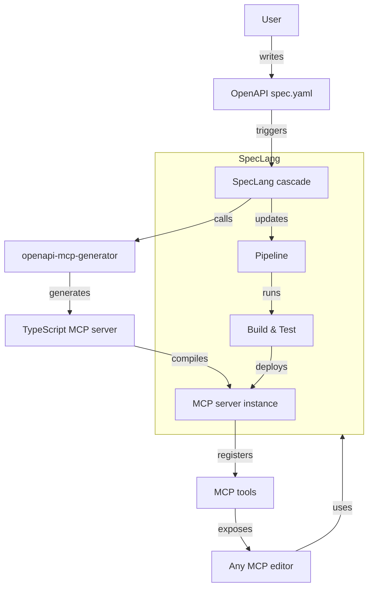

# speclang-header lines:12
id: @speclang/mcp-openapi-generation
version: 0.1.0
layer: 2
imports: [@speclang/mcp, @speclang/cli, @speclang/tools]
tags: [mcp, openapi, generator, integration, automation]
short: Integration with openapi-mcp-generator for easy MCP server generation
status: draft
---
# OpenAPI-MCP Generator Integration

Integrate SpecLang with [openapi-mcp-generator](https://github.com/harsha-iiiv/openapi-mcp-generator) to automatically generate MCP servers from OpenAPI specifications.

## Overview

```speclang
# @block:openapi-mcp/overview @kind:note
Goal: Make MCP server generation trivial for SpecLang users.

- Use openapi-mcp-generator CLI to generate TypeScript MCP servers
- Integrate generation into SpecLang pipeline
- Provide CLI commands: `speclang mcp generate-openapi`
- Support stdio, web, and streamable-http transports
- Automatically register generated tools with SpecLang's MCP server
- Enable bidirectional sync: OpenAPI changes → regenerate MCP server
```

## Architecture

```speclang
# @block:openapi-mcp/architecture @kind:diagram

```

## Integration Steps

### @openapi-mcp/integration-steps

```speclang
# @block:openapi-mcp/integration-steps @kind:entity
IntegrationSteps:
  1. Install openapi-mcp-generator as a dev dependency:
     ```bash
     npm install -g openapi-mcp-generator
     ```
     
  2. Add CLI command `speclang mcp generate-openapi`:
     - Input: path to OpenAPI spec (YAML/JSON)
     - Output: directory for generated MCP server
     - Options: transport, port, server name, etc.
     
  3. Generate MCP server code:
     - Call openapi-mcp-generator programmatically or via CLI
     - Place output in `generated/mcp-servers/{api-name}/`
     
  4. Integrate with SpecLang's MCP server:
     - Register generated tools dynamically
     - Or run generated server as separate process
     
  5. Add to pipeline:
     - On OpenAPI spec change, regenerate MCP server
     - Run tests for generated server
     - Deploy as part of build
```

## CLI Commands

### @openapi-mcp/cli-commands

```speclang
# @block:openapi-mcp/cli-commands @kind:entity
CLICommands:
  
  speclang mcp generate-openapi:
    description: Generate MCP server from OpenAPI spec
    usage: speclang mcp generate-openapi --input <spec> --output <dir> [options]
    
    options:
      --input, -i:
        required: true
        description: Path or URL to OpenAPI spec (YAML/JSON)
        
      --output, -o:
        required: true
        description: Output directory for generated MCP project
        
      --transport, -t:
        default: stdio
        values: [stdio, web, streamable-http]
        description: Transport mode
        
      --port, -p:
        default: 3000
        description: Port for web-based transports
        
      --server-name, -n:
        description: Name of MCP server (default: OpenAPI title)
        
      --base-url, -b:
        description: Base URL for API requests
        
      --force:
        description: Overwrite existing files
        
      --register:
        description: Automatically register with SpecLang MCP server
        
    examples:
      - speclang mcp generate-openapi -i openapi.yaml -o generated/mcp/petstore
      - speclang mcp generate-openapi -i https://api.example.com/openapi.json -o generated/mcp/api --transport=web --port=8080 --register
```

## Programmatic API

### @openapi-mcp/programmatic-api

```speclang
# @block:openapi-mcp/programmatic-api @kind:code
```typescript
import { getToolsFromOpenApi } from 'openapi-mcp-generator';
import { MCPServer } from './speclang-mcp';

/**
 * Generate MCP tools from OpenAPI spec and register with SpecLang MCP server
 */
export async function generateAndRegisterOpenApiTools(
  specPath: string,
  options: {
    baseUrl?: string;
    transport?: 'stdio' | 'web' | 'streamable-http';
    serverName?: string;
  } = {}
): Promise<void> {
  // Generate tools from OpenAPI
  const tools = await getToolsFromOpenApi(specPath, {
    baseUrl: options.baseUrl,
    dereference: true,
  });
  
  // Get SpecLang MCP server instance
  const server = MCPServer.getInstance();
  
  // Register each tool
  for (const tool of tools) {
    server.registerTool({
      name: tool.name,
      description: tool.description,
      inputSchema: tool.inputSchema,
      handler: async (args: any) => {
        // Proxy request to actual API
        const response = await fetch(tool.url, {
          method: tool.method,
          headers: tool.headers,
          body: JSON.stringify(args),
        });
        return response.json();
      },
    });
  }
  
  console.log(`Registered ${tools.length} tools from ${specPath}`);
}
```
```

## Example Workflow

### @openapi-mcp/example-workflow

```speclang
# @block:openapi-mcp/example-workflow @kind:entity
ExampleWorkflow:
  
  scenario: User has a REST API with OpenAPI spec
  
  steps:
    1. User writes OpenAPI spec for their API (petstore.yaml)
    2. User runs: `speclang mcp generate-openapi -i petstore.yaml -o generated/mcp/petstore --register`
    3. SpecLang:
       - Calls openapi-mcp-generator
       - Generates TypeScript MCP server in generated/mcp/petstore/
       - Registers tools with SpecLang's MCP server
       - Starts the generated server (or integrates tools)
    4. User opens any MCP-compatible editor (Cursor, Claude Code, etc.)
    5. Editor connects to SpecLang MCP server
    6. User can now use MCP tools like `petstore_listPets`, `petstore_createPet`
    7. When OpenAPI spec changes, cascade triggers regeneration
```

## Configuration

### @openapi-mcp/config

```speclang
# @block:openapi-mcp/config @kind:entity
Configuration:
  
  spec: .speclang/openapi-mcp.yaml
  
  schema:
    servers:
      - name: string
        spec: string (path or URL)
        output: string (relative path)
        transport: string
        port: number
        auto_register: boolean
        watch: boolean (regenerate on spec change)
        
    defaults:
      transport: stdio
      output_base: generated/mcp-servers
      
  example:
    ```yaml
    servers:
      - name: petstore
        spec: ./api/petstore.yaml
        output: petstore
        transport: web
        port: 3001
        auto_register: true
        watch: true
        
      - name: weather
        spec: https://api.weather.com/openapi.json
        output: weather
        transport: stdio
        auto_register: false
    ```
```

## Pipeline Integration

### @openapi-mcp/pipeline

```speclang
# @block:openapi-mcp/pipeline @kind:entity
PipelineIntegration:
  
  build.yaml:
    ```yaml
    steps:
      - name: generate-mcp-servers
      run: speclang mcp generate-all
      watch:
        - "**/*.openapi.yaml"
        - "**/*.openapi.json"
        
      - name: build-mcp-servers
      run: |
        cd generated/mcp-servers
        for dir in */; do
          cd "$dir" && npm install && npm run build
        done
        
      - name: test-mcp-servers
      run: |
        cd generated/mcp-servers
        for dir in */; do
          cd "$dir" && npm test
        done
    ```
```

## Dependencies

### @openapi-mcp/dependencies

```speclang
# @block:openapi-mcp/dependencies @kind:entity
Dependencies:
  
  required:
    - openapi-mcp-generator (npm package)
    - @modelcontextprotocol/sdk
    - axios
    - zod
    
  optional:
    - hono (for web transport)
    - express (alternative)
    
  dev:
    - typescript
    - ts-node
    - @types/node
```

## References

- @ref:speclang/mcp
- @ref:speclang/cli
- @ref:speclang/tools
- @ref:speclang/pipeline
- @ref:northstar/speclang