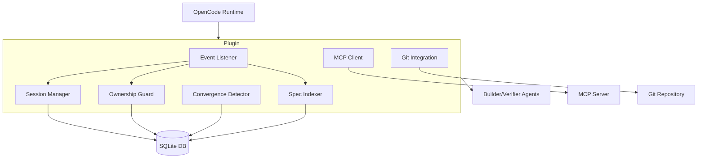

# speclang-header lines:10
id: "@speclang/opencode-plugin-spec-dir/architecture"
version: 0.1.0
layer: 4
imports: ["@speclang/opencode-plugin.spec.dir/overview"]
tags: [opencode, plugin, architecture, diagram]
short: Architecture diagram and components for OpenCode Speclang plugin
project_level: Alpha
agent_support: agent_assisted
---
# Plugin Architecture

## Component Diagram

```speclang
# @block:opencode-plugin/architecture/diagram @kind:diagram

```

## Components Description

### Event Listener
Listens to OpenCode events: `file.edited`, `agent.finished`, `session.idle`. Filters for spec files (`*.spec.md`, `*.spec.yaml`, `*.scl`).

### Session Manager
Tracks active agent sessions, maps sessions to owned files, manages session timeouts.

### Ownership Guard
Ensures only the session that owns a file can modify it. Uses lock tokens and expiration.

### Spec Indexer
Parses spec headers, updates SQLite index, maintains dependencies and references.

### MCP Client
Connects to Speclang MCP server, invokes tools (`speclang_query`, `speclang_execute`).

### Git Integration
Commits each spec file change with `speclang:` prefix messages. Uses `git commit --only`.

### Convergence Detector
Monitors quiet period (no changes for 30s), triggers pipeline (`generate_index.py`, validation).

## Data Flow

1. File edited → Event Listener → Ownership check → Index update → Route to agent
2. Agent finished → Convergence check → If quiet, run pipeline
3. Session idle → Release ownership locks

## References

- "@ref:speclang/opencode-plugin.spec.dir/event-system
- @ref:speclang/opencode-plugin.spec.dir/session-manager
- @ref:speclang/opencode-plugin.spec.dir/ownership-guard