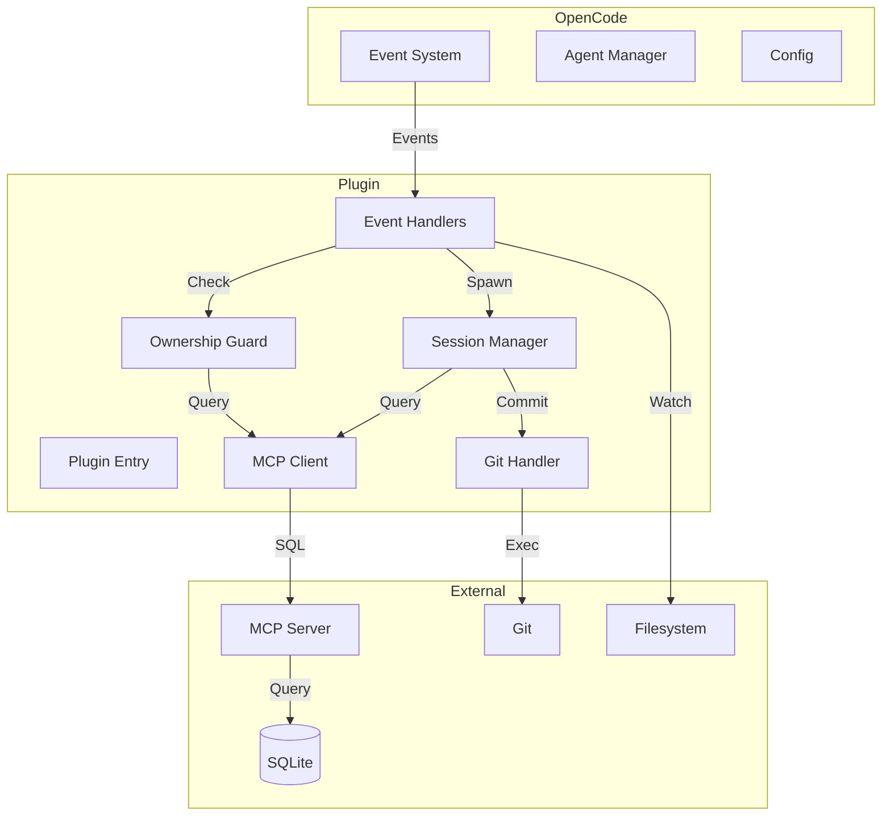

# speclang-header lines:8
id: @speclang/opencode-plugin
version: 0.2.0
layer: 3
imports: [@speclang/core, @speclang/agent-protocol, @speclang/sqlite, @speclang/mcp]
tags: [opencode, plugin, typescript, implementation]
short: TypeScript OpenCode plugin for Speclang integration
---

# OpenCode Plugin Implementation

TypeScript plugin for OpenCode that integrates Speclang reactive cascade system.

---

## Overview

```speclang
# @block:plugin/overview @kind:note
The OpenCode plugin is the primary runtime integration for Speclang:
- ~800 lines TypeScript
- Runs inside OpenCode process
- Hooks into OpenCode event system
- Manages agent sessions
- Enforces file ownership
- Coordinates cascade via MCP

Location: .opencode/plugins/speclang.ts
```

---

## Architecture

### @plugin/architecture

```speclang
# @block:plugin/architecture @kind:diagram

```

---

## Event System Integration

### @plugin/events

```speclang
# @block:plugin/events @kind:entity
OpenCodeEventTypes:
  file.watcher.updated:
    trigger: File change detected
    payload: { path, changeType: 'create' | 'modify' | 'delete' }
    action: Start cascade if spec file
    
  file.edited:
    trigger: User saved file
    payload: { path, contentHash }
    action: Validate header, update SQLite
    
  file.created:
    trigger: New file created
    payload: { path }
    action: Index in SQLite
    
  file.deleted:
    trigger: File deleted
    payload: { path }
    action: Mark deleted in SQLite
    
  session.tool_called:
    trigger: Agent invoked tool
    payload: { tool_name, args, session_id }
    action: Log for debugging
    
  session.idle:
    trigger: Agent finished
    payload: { session_id }
    action: Check convergence
```

### @plugin/event-handlers

```speclang
# @block:plugin/event-handlers @kind:code
```typescript
// Event handler implementations

interface FileWatcherEvent {
  path: string;
  changeType: 'create' | 'modify' | 'delete';
}

interface FileEditedEvent {
  path: string;
  contentHash: string;
}

class SpeclangPlugin {
  private db: MCPClient;
  private sessionManager: SessionManager;
  private guard: OwnershipGuard;
  
  private async ensureActiveCascade(rootTrigger: string): Promise<string> {
    // Get existing active cascade
    const rows = await this.db.query(
      `SELECT cascade_id FROM cascades WHERE status = 'active' LIMIT 1`
    );
    if (rows.length > 0) {
      return rows[0].cascade_id;
    }
    // Create new cascade
    const cascadeId = crypto.randomUUID();
    await this.db.execute(
      `INSERT INTO cascades (cascade_id, root_trigger, status) VALUES (?, ?, 'active')`,
      [cascadeId, rootTrigger]
    );
    return cascadeId;
  }
  
  private async getActiveCascadeId(): Promise<string | null> {
    const rows = await this.db.query(
      `SELECT cascade_id FROM cascades WHERE status = 'active' LIMIT 1`
    );
    return rows.length > 0 ? rows[0].cascade_id : null;
  }
  
  async onFileWatcherUpdated(event: FileWatcherEvent) {
    // Only process spec files
    if (!this.isSpecFile(event.path)) {
      return;
    }
    
    // Update event log in SQLite
    const cascadeId = await this.ensureActiveCascade(event.path);
    let fileHashAfter = null;
    if (event.changeType !== 'delete') {
      fileHashAfter = await this.hashFile(event.path);
    }
    const details = JSON.stringify({
      changeType: event.changeType,
      timestamp: Date.now()
    });
    await this.db.execute(
      `INSERT INTO events (cascade_id, kind, path, session_id, file_hash_before, file_hash_after, details) VALUES (?, ?, ?, NULL, NULL, ?, ?)`,
      [cascadeId, event.changeType, event.path, fileHashAfter, details]
    );
    
    // Route to owning agent
    const owner = await this.getFileOwner(event.path);
    if (owner) {
      await this.sessionManager.notify(owner, event);
    }
  }
  
  async onFileEdited(event: FileEditedEvent) {
    // Validate header
    const header = await this.parseHeader(event.path);
    if (!header.valid) {
      await this.showError(`Invalid header in ${event.path}: ${header.error}`);
      return;
    }
    
    // Update SQLite index
    await this.indexSpec(event.path, header);
  }

  private async indexSpec(filePath: string, header: any): Promise<void> {
    // Determine owning session based on file path pattern
    const sessionId = await this.getOwningSession(filePath);
    const content = await this.readFileContent(filePath);
    const headerRaw = header.raw || content.split('---')[0] + '---';
    await this.db.execute(
      `INSERT OR REPLACE INTO specs (file_path, id, header_lines, header_raw, content_raw, owner_session_id, owned_by, content_hash, short_desc)
       VALUES (?, ?, ?, ?, ?, ?, ?, ?, ?)`,
      [
        filePath,
        header.id,
        header.lines,
        headerRaw,
        content,
        sessionId,
        this.getAgentType(filePath),
        await this.hashFile(filePath),
        header.short || ''
      ]
    );
  }

  private async getOwningSession(filePath: string): Promise<string | null> {
    // Find session that owns this file pattern
    const rows = await this.db.query(
      `SELECT session_id FROM sessions WHERE status IN ('active', 'idle') AND agent = ?`,
      [this.getAgentType(filePath)]
    );
    return rows.length > 0 ? rows[0].session_id : null;
  }

  private async getFileOwner(filePath: string): Promise<string | null> {
    const rows = await this.db.query(
      `SELECT owner_session_id FROM specs WHERE file_path = ?`,
      [filePath]
    );
    return rows.length > 0 ? rows[0].owner_session_id : null;
  }

  private getAgentType(filePath: string): string {
    // Map file path to agent type based on patterns
    if (filePath.match(/\.spec\.(md|yaml|yml|scl)$/) || filePath.includes('specs/')) {
      return 'spec-writer';
    } else if (filePath.endsWith('.go')) {
      return 'code-gen-go';
    } else if (filePath.match(/\.test\.spec\.(md|yaml|yml|scl)$/)) {
      return 'test-writer';
    } else {
      return 'spec-writer';
    }
  }

  private isSpecFile(filePath: string): boolean {
    // Simple check for spec file extensions
    return filePath.match(/\.spec\.(md|yaml|yml|scl)$/) !== null || 
           filePath.endsWith('project.scl');
  }

  private async readFileContent(filePath: string): Promise<string> {
    const fs = require('fs').promises;
    return await fs.readFile(filePath, 'utf-8');
  }

  private async parseHeader(filePath: string): Promise<any> {
    const content = await this.readFileContent(filePath);
    const lines = content.split('\n');
    if (!lines[0].includes('speclang-header')) {
      return { valid: false, error: 'Missing speclang-header' };
    }
    const match = lines[0].match(/speclang-header lines:(\d+)/);
    if (!match) {
      return { valid: false, error: 'Invalid header format' };
    }
    const headerLines = parseInt(match[1], 10);
    const headerRaw = lines.slice(0, headerLines).join('\n');
    // Parse YAML after the first line
    const yamlText = lines.slice(1, headerLines - 1).join('\n');
    const yaml = require('yaml');
    let parsed;
    try {
      parsed = yaml.parse(yamlText);
    } catch (e) {
      return { valid: false, error: e.message };
    }
    return {
      valid: true,
      id: parsed.id,
      lines: headerLines,
      short: parsed.short,
      raw: headerRaw,
      ...parsed
    };
  }

  private async hashFile(filePath: string): Promise<string> {
    const crypto = require('crypto');
    const fs = require('fs').promises;
    const content = await fs.readFile(filePath, 'utf-8');
    return crypto.createHash('sha256').update(content).digest('hex');
  }

  private async showError(message: string): Promise<void> {
    await opencode.showNotification({
      type: 'error',
      message,
      actions: []
    });
  }

  async onSessionIdle(event: { sessionId: string }) {
    // Trigger convergence check
    await this.checkConvergence();
  }

  private async checkConvergence(): Promise<void> {
    // Check all convergence signals
    const [events, commands, sessions] = await Promise.all([
      this.db.query(`SELECT COUNT(*) as count FROM events WHERE processed = 0`),
      this.db.query(`SELECT COUNT(*) as count FROM commands WHERE status = 'pending'`),
      this.db.query(`SELECT COUNT(*) as count FROM sessions WHERE status IN ('active', 'idle')`)
    ]);
    
    const noEvents = events[0].count === 0;
    const noCommands = commands[0].count === 0;
    const noActiveSessions = sessions[0].count === 0;
    
    if (noEvents && noCommands && noActiveSessions) {
      // All signals converged
      await this.markCascadeConverged();
    }
  }

  private async markCascadeConverged(): Promise<void> {
    const cascadeId = await this.getActiveCascadeId();
    if (!cascadeId) {
      return; // No active cascade
    }
    await this.db.execute(
      `UPDATE cascades SET status = 'converged', converged_at = strftime('%s','now') WHERE cascade_id = ?`,
      [cascadeId]
    );
    // Trigger pipeline
    await this.triggerPipeline(cascadeId);
  }

  private async triggerPipeline(cascadeId: string): Promise<void> {
    // Notify pipeline that cascade converged
    await this.db.execute(
      `INSERT INTO commands (command_id, cascade_id, action, target_file, status) VALUES (?, ?, 'run-tests', NULL, 'pending')`,
      [crypto.randomUUID(), cascadeId]
    );
  }
}
```
```

---

## Session Manager

### @plugin/session-manager

```speclang
# @block:plugin/session-manager @kind:entity
SessionManager:
  responsibilities:
    - Spawn agent sessions
    - Track session lifecycle
    - Route events to sessions
    - Manage session timeouts
    - Cleanup stale sessions
    
  session_types:
    spec-writer:
      owns: specs/**/*.spec.{md,yaml,yml,scl}
      max_concurrent: 10
      timeout: 300s
      
    code-gen-go:
      owns: generated/go/**/*.go
      max_concurrent: 5
      timeout: 120s
      
    test-writer:
      owns: tests/**/*.test.spec.{md,yaml,yml,scl}
      max_concurrent: 5
      timeout: 180s
      
  lifecycle:
    spawn:
      1. Check max_concurrent limit
      2. Create session in SQLite
      3. Spawn OpenCode agent
      4. Set timeout timer
      
    activate:
      1. Update status to 'active'
      2. Assign file to process
      3. Send event to agent
      
    complete:
      1. Update status to 'done'
      2. Git commit the file
      3. Cleanup session
      
    timeout:
      1. Mark status 'error'
      2. Release file lock
      3. Create recovery command
      4. Notify orchestrator
```

### @plugin/session-impl

```speclang
# @block:plugin/session-impl @kind:code
```typescript
class SessionManager {
  private db: MCPClient;
  private activeSessions: Map<string, Session> = new Map();
  private timeouts: Map<string, NodeJS.Timeout> = new Map();
  
  async spawnSession(agentType: string, filePath: string): Promise<Session> {
    // Check limits
    const count = await this.getActiveCount(agentType);
    const config = await this.getAgentConfig(agentType);
    
    if (count >= config.maxConcurrent) {
      throw new Error(`Max concurrent ${agentType} sessions reached`);
    }
    
    // Create session
    const sessionId = crypto.randomUUID();
    const cascadeId = await this.getActiveCascadeId(filePath);
    await this.db.execute(
      `INSERT INTO sessions (session_id, agent, status, current_file, cascade_id) 
       VALUES (?, ?, 'idle', ?, ?)`,
      [sessionId, agentType, filePath, cascadeId]
    );
    
    // Set timeout
    const timeout = setTimeout(
      () => this.handleTimeout(sessionId),
      config.timeout * 1000
    );
    this.timeouts.set(sessionId, timeout);
    
    // Spawn OpenCode agent
    const session = await opencode.spawnAgent({
      id: sessionId,
      skill: agentType,
      context: { file: filePath }
    });
    
    this.activeSessions.set(sessionId, session);
    return session;
  }
  
  async notify(sessionId: string, event: any) {
    const session = this.activeSessions.get(sessionId);
    if (!session) {
      // Spawn new session
      const agentType = await this.getAgentForFile(event.path);
      await this.spawnSession(agentType, event.path);
      return;
    }
    
    // Send event to agent
    await session.sendEvent(event);
    
    // Update last active
    await this.db.execute(
      `UPDATE sessions SET last_active = strftime('%s','now') 
       WHERE session_id = ?`,
      [sessionId]
    );
  }

  async completeSession(sessionId: string, status: 'done' | 'error' = 'done') {
    // Clear timeout
    const timeout = this.timeouts.get(sessionId);
    if (timeout) {
      clearTimeout(timeout);
      this.timeouts.delete(sessionId);
    }

    await this.db.execute(
      `UPDATE sessions SET status = ?, ended_at = strftime('%s','now') WHERE session_id = ?`,
      [status, sessionId]
    );

    this.activeSessions.delete(sessionId);
  }

  private async getActiveCascadeId(filePath: string): Promise<string> {
    const rows = await this.db.query(
      `SELECT cascade_id FROM cascades WHERE status = 'active' LIMIT 1`
    );
    if (rows.length > 0) {
      return rows[0].cascade_id;
    }
    // Create new cascade
    const cascadeId = crypto.randomUUID();
    await this.db.execute(
      `INSERT INTO cascades (cascade_id, root_trigger, status) VALUES (?, ?, 'active')`,
      [cascadeId, filePath]
    );
    return cascadeId;
  }

  private async handleTimeout(sessionId: string) {
    await this.db.execute(
      `UPDATE sessions SET status = 'error', error_message = 'Timeout'
       WHERE session_id = ?`,
      [sessionId]
    );
    
    // Create recovery command
    await this.db.execute(
      `INSERT INTO commands (command_id, cascade_id, session_id, action, target_file, status)
       VALUES (?, (SELECT cascade_id FROM sessions WHERE session_id = ?), ?, 'unstick', (SELECT current_file FROM sessions WHERE session_id = ?), 'pending')`,
      [crypto.randomUUID(), sessionId, sessionId, sessionId]
    );
    
    this.activeSessions.delete(sessionId);
    this.timeouts.delete(sessionId);
  }
}
```
```

---

## Ownership Guard

### @plugin/ownership-guard

```speclang
# @block:plugin/ownership-guard @kind:entity
OwnershipGuard:
  purpose: Prevent agents from writing files they don't own
  
  enforcement_point: Intercept all file write operations
  
  check_algorithm:
    1. Get session_id from agent
    2. Query SQLite for file ownership
    3. Compare session_id with owner_session_id
    4. If match: allow write
    5. If mismatch: block write, log violation
    
  exemptions:
    - orchestrator: full access
    - user session: full access (human override)
    - back-sync: read-only on generated/
    
  violation_handling:
    1. Block the write operation
    2. Log to error_logs table
    3. Show error notification in OpenCode
    4. Suggest correct agent
    5. Optionally: auto-route to correct agent
```

### @plugin/guard-impl

```speclang
# @block:plugin/guard-impl @kind:code
```typescript
class OwnershipGuard {
  private db: MCPClient;
  private exemptSessions: Set<string> = new Set();
  
  async checkWrite(sessionId: string, filePath: string): Promise<boolean> {
    // Check exemption
    if (this.exemptSessions.has(sessionId)) {
      return true;
    }
    
    // Get file owner
    const result = await this.db.query(
      `SELECT owner_session_id FROM specs WHERE file_path = ?`,
      [filePath]
    );
    
    if (!result) {
      // File not in database yet, check if session can create it
      const canCreate = await this.canCreateFile(sessionId, filePath);
      if (!canCreate) {
        await this.logViolation(sessionId, filePath, 'create_not_allowed');
        return false;
      }
      return true;
    }
    
    if (result.owner_session_id !== sessionId) {
      await this.logViolation(sessionId, filePath, 'wrong_owner');
      return false;
    }
    
    return true;
  }
  
  async interceptWrite(
    sessionId: string, 
    filePath: string, 
    content: string
  ): Promise<boolean> {
    const allowed = await this.checkWrite(sessionId, filePath);
    
    if (!allowed) {
      // Show error in OpenCode
      await opencode.showNotification({
        type: 'error',
        message: `Session ${sessionId} cannot write ${filePath}`,
        actions: [
          { label: 'View Owner', command: 'speclang.showOwner' },
          { label: 'Request Transfer', command: 'speclang.requestTransfer' }
        ]
      });
      
      // Log violation
      await this.db.execute(
        `INSERT INTO error_logs (source, file, session_id, message, level)
         VALUES ('plugin', ?, ?, ?, 'error')`,
        [filePath, sessionId, `Write blocked: session does not own file`]
      );
      
      return false;
    }
    
    return true;
  }
  
  exempt(sessionId: string) {
    this.exemptSessions.add(sessionId);
  }
  
  unexempt(sessionId: string) {
    this.exemptSessions.delete(sessionId);
  }
}
```
```

---

## MCP Client

### @plugin/mcp-client

```speclang
# @block:plugin/mcp-client @kind:entity
MCPClient:
  purpose: Connect to MCP server for SQLite access
  
  connection:
    method: stdio or HTTP
    auto_reconnect: true
    retry_attempts: 3
    auth:
      http:
        supports:
          - basic: username/password
          - token: bearer token
          - none: no auth
        config: mcp_server.auth section
      
  operations:
    query:
      type: read-only SQL
      uses: SELECT statements
      returns: rows
      
    execute:
      type: write SQL
      uses: INSERT, UPDATE, DELETE
      returns: row count
      
    callTool:
      type: MCP tool invocation
      uses: speclang_search, speclang_get_status, etc
      returns: tool result
      
  caching:
    enabled: true
    ttl: 30s
    invalidate_on: file change
```

### @plugin/mcp-client-impl

```speclang
# @block:plugin/mcp-client-impl @kind:code
```typescript
interface MCPConfig {
  command: string;
  transport: 'stdio' | 'http';
  port?: number;
  host?: string;
  auth?: {
    type: 'none' | 'basic' | 'token';
    user?: string;
    pass?: string;
    token?: string;
  };
}

class MCPClient {
  private client: MCPClientSDK;
  private cache: Map<string, { value: any; expires: number }> = new Map();
  private config: MCPConfig;
  
  constructor(config: MCPConfig) {
    this.config = config;
  }
  
  async connect() {
    const connectionOptions: any = {
      command: this.config.command,
      transport: this.config.transport
    };
    
    if (this.config.transport === 'http') {
      connectionOptions.url = `http://${this.config.host || 'localhost'}:${this.config.port || 3000}`;
      
      if (this.config.auth?.type === 'basic') {
        connectionOptions.auth = {
          username: this.config.auth.user,
          password: this.config.auth.pass
        };
      } else if (this.config.auth?.type === 'token') {
        connectionOptions.headers = {
          'Authorization': `Bearer ${this.config.auth.token}`
        };
      }
    }
    
    this.client = new MCPClientSDK(connectionOptions);
    await this.client.connect();
  }
  
  async query(sql: string, params?: any[]): Promise<any[]> {
    // Check cache for read queries
    const cacheKey = `${sql}:${JSON.stringify(params)}`;
    const cached = this.cache.get(cacheKey);
    if (cached && cached.expires > Date.now()) {
      return cached.value;
    }
    
    const result = await this.client.callTool('speclang_query', { sql, params });
    
    // Cache SELECT results
    if (sql.trim().toLowerCase().startsWith('select')) {
      this.cache.set(cacheKey, {
        value: result,
        expires: Date.now() + 30000 // 30s TTL
      });
    }
    
    return result;
  }
  
  async execute(sql: string, params?: any[]): Promise<number> {
    // Invalidate cache on writes
    if (!sql.trim().toLowerCase().startsWith('select')) {
      this.cache.clear();
    }
    
    return await this.client.callTool('speclang_execute', { sql, params });
  }
  
  async search(query: string, limit?: number): Promise<any[]> {
    return await this.client.callTool('speclang_search', { query, limit });
  }
  
  async getStatus(): Promise<Status> {
    return await this.client.callTool('speclang_get_status', {});
  }
  
  invalidateCache() {
    this.cache.clear();
  }
}
```
```

---

## Git Integration

### @plugin/git-integration

```speclang
# @block:plugin/git-integration @kind:entity
GitIntegration:
  purpose: Per-file commits from agents
  
  commit_strategy:
    when: After agent finishes writing file
    what: Only the file(s) that agent modified
    format: "speclang: {agent_summary}"
    
  algorithm:
    1. Agent completes work
    2. Generate commit message from agent output
    3. Stage only the owned file: git add --only <file>
    4. Commit: git commit -m "speclang: {summary}"
    5. Update specs.git_commit in SQLite
    
  examples:
    - "speclang: added auth entities to specs/auth.scl"
    - "speclang: generated handler.go from auth spec"
    
  error_handling:
    - If commit fails: retry once
    - If conflict: notify orchestrator
    - If uncommitted changes: stash, commit, pop
```

### @plugin/git-impl

```speclang
# @block:plugin/git-impl @kind:code
```typescript
class GitHandler {
  async commitFile(
    filePath: string, 
    message: string, 
    sessionId: string
  ): Promise<string> {
    try {
      // Stage only this file using spawn to avoid injection
      await new Promise<void>((resolve, reject) => {
        const proc = spawn('git', ['add', '--only', filePath]);
        proc.on('close', (code) => code === 0 ? resolve() : reject(new Error(`git add exited with code ${code}`)));
      });
      
      // Commit with message using spawn to avoid injection
      const commitHash = await new Promise<string>((resolve, reject) => {
        const proc = spawn('git', ['commit', '-m', `speclang: ${message}`]);
        let stdout = '';
        proc.stdout.on('data', (data) => stdout += data.toString());
        proc.on('close', (code) => code === 0 ? resolve(stdout) : reject(new Error(`git commit exited with code ${code}`)));
      });
      
      // Extract hash from output
      const hash = commitHash.match(/\[.*\s+([a-f0-9]+)\]/)?.[1];
      
      // Update SQLite
      await this.db.execute(
        `UPDATE specs SET git_commit = ? WHERE file_path = ?`,
        [hash, filePath]
      );
      
      // Log commit
      await this.db.execute(
        `INSERT INTO git_commits (file_path, commit_hash, message, author, session_id)
         VALUES (?, ?, ?, (SELECT agent FROM sessions WHERE session_id = ?), ?)`,
        [filePath, hash, message, sessionId, sessionId]
      );
      
      return hash;
    } catch (error) {
      // Handle failure
      await this.db.execute(
        `INSERT INTO error_logs (source, file, message, level)
         VALUES ('git', ?, ?, 'error')`,
        [filePath, error.message]
      );
      throw error;
    }
  }
}
```
```

---

## Convergence Detection

### @plugin/convergence

```speclang
# @block:plugin/convergence @kind:entity
ConvergenceDetector:
  purpose: Know when cascade is complete
  
  signals:
    quiet_period:
      duration: 30s
      condition: No file changes for N seconds
      
    all_agents_idle:
      condition: All sessions status = 'idle' or 'done'
      
    empty_queues:
      condition: No unprocessed events (processed = 0), no pending commands
      
  algorithm:
    1. On session idle: Check unprocessed events (processed = 0)
    2. If no unprocessed events: Check pending commands
    3. If no pending commands: Check active sessions
    4. If all three empty: Mark cascade converged
    5. Trigger pipeline
    
  debounce: Reset timer on new file change
```

---

## Configuration

### @plugin/config

```speclang
# @block:plugin/config @kind:entity
PluginConfiguration:
  location: .opencode/speclang.json
  
  schema:
    watch_patterns:
      type: array of glob patterns
      default: ["**/*.spec.{md,yaml,yml,scl}", "**/project.scl"]
      
    ignore_patterns:
      type: array of glob patterns
      default: [".speclang/**", "*.log", "reports/**"]
      
    mcp_server:
      command: string
      transport: "stdio" | "http"
      port: number (if http)
      host: string (if http, default: localhost)
      auth:
        type: "none" | "basic" | "token"
        user: string (if type=basic)
        pass: string (if type=basic)
        token: string (if type=token)
        
    agents:
      spec-writer:
        max_concurrent: number
        timeout: seconds
      code-gen-go:
        max_concurrent: number
        timeout: seconds
        
    convergence:
      quiet_period: seconds
      max_depth: number
      
    git:
      auto_commit: boolean
      commit_message_template: string
      
    logging:
      level: "debug" | "info" | "warn" | "error"
      file: string
```

### @plugin/config-example

```speclang
# @block:plugin/config-example @kind:code
```json
{
  "watch_patterns": [
    "**/*.spec.{md,yaml,yml,scl}",
    "**/*.{go,ts,py}.spec",
    "**/project.scl"
  ],
  "ignore_patterns": [
    ".speclang/**",
    "*.log",
    "reports/**",
    ".git/**"
  ],
  "mcp_server": {
    "command": "speclang mcp start",
    "transport": "stdio"
  },
  "agents": {
    "spec-writer": {
      "max_concurrent": 10,
      "timeout": 300
    },
    "code-gen-go": {
      "max_concurrent": 5,
      "timeout": 120
    }
  },
  "convergence": {
    "quiet_period": 30,
    "max_depth": 100
  },
  "git": {
    "auto_commit": true,
    "commit_message_template": "speclang: {summary}"
  },
  "logging": {
    "level": "info",
    "file": ".speclang/plugin.log"
  }
}
```

Remote mode with token auth:
```json
{
  "mcp_server": {
    "command": "speclang mcp start --remote",
    "transport": "http",
    "port": 3000,
    "host": "localhost",
    "auth": {
      "type": "token",
      "token": "your-secret-token-here"
    }
  }
}
```

Remote mode with basic auth:
```json
{
  "mcp_server": {
    "command": "speclang mcp start --remote",
    "transport": "http",
    "port": 3000,
    "host": "localhost",
    "auth": {
      "type": "basic",
      "user": "admin",
      "pass": "secret-password"
    }
  }
}
```
```

---

## Plugin Lifecycle

### @plugin/lifecycle

```speclang
# @block:plugin/lifecycle @kind:entity
PluginLifecycle:
  load:
    1. Read configuration
    2. Connect to MCP server
    3. Initialize SQLite if needed
    4. Register event handlers
    5. Start file watcher
    6. Log startup
    
  run:
    1. Listen for OpenCode events
    2. Process file changes
    3. Manage agent sessions
    4. Track convergence
    5. Handle commands
    
  unload:
    1. Stop accepting new events
    2. Wait for active sessions to complete
    3. Close MCP connection
    4. Close file watcher
    5. Log shutdown
```

---

## Tools Provided

### @plugin/tools

```speclang
# @block:plugin/tools @kind:entity
PluginTools:
  speclang_search:
    params: { query: string, limit?: number, tags?: string[] }
    returns: [{ file_path, id, short_desc, score }]
    
  speclang_find_dependents:
    params: { id: string }
    returns: [{ file_path, id, short_desc }]
    
  speclang_get_tree:
    params: { id: string, depth?: number }
    returns: tree structure
    
  speclang_validate:
    params: { file_path: string }
    returns: { valid: boolean, errors: string[] }
    
  speclang_split_if_needed:
    params: { file_path: string, max_tokens?: number }
    returns: { split: boolean, new_files?: string[] }
    
  speclang_get_status:
    params: {}
    returns: { 
      active_sessions: number,
      queue_depth: number,
      converged: boolean,
      cascade_depth: number
    }
    
  speclang_insert_command:
    params: { action: string, target_file?: string, payload?: any }
    returns: { command_id: string }
```

---

## Error Handling

### @plugin/errors

```speclang
# @block:plugin/errors @kind:entity
ErrorHandling:
  categories:
    config_error:
      action: Log and exit
      example: Invalid config file
      
    mcp_connection_error:
      action: Retry with backoff, then exit
      example: MCP server not responding
      
    file_watch_error:
      action: Log and continue
      example: Permission denied on directory
      
    validation_error:
      action: Notify user, block cascade
      example: Invalid spec header
      
    ownership_violation:
      action: Block write, log violation
      example: Agent writing non-owned file
      
    session_timeout:
      action: Create recovery command
      example: Agent taking too long
      
    git_error:
      action: Retry once, then notify
      example: Commit fails
```

---

## Implementation Checklist

### @plugin/checklist

```speclang
# @block:plugin/checklist @kind:table
| Component | Status | Notes |
|-----------|--------|-------|
| Event system hooks | DONE | 5 event handlers implemented |
| Session manager | DONE | Spawn/track/cleanup sessions with timeout |
| Ownership guard | DONE | Intercept writes with ownership checks |
| MCP client | DONE | Connect/query/call tools with caching |
| Git integration | DONE | Per-file commits with spawn safety |
| Convergence detector | DONE | Quiet period logic with multi-signal |
| Configuration | DONE | JSON schema with auth |
| Error handling | DONE | All categories with logging |
| Tool definitions | DONE | 7 tools defined |
| Logging | DONE | Structured logging integrated |
```
