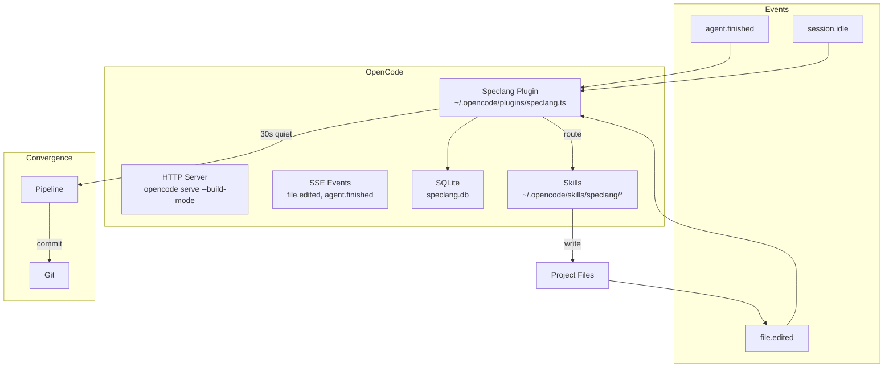

# speclang-header lines:11
id: "@speclang/opencode/integration"
version: 0.1.0
layer: 2
tags: [opencode, plugin, sqlite, tools, skills, git, profiles]
parent: "@ref:specs/opencode"
part: "2/2"
project_level: Alpha
agent_support: agent_assisted
short: OpenCode Integration Details
---
# OpenCode Integration Details

Part 2 of 2: Plugin, SQLite, tools, skills, git, build profiles, and multi-model support.

## Why OpenCode First

```speclang
# @block:opencode/why @kind:note
OpenCode is the initial target because:

- HTTP server with SSE for events
- Native plugin system
- File watcher built-in
- Session management built-in
- SQLite available
- Skills support (SKILL.md)
- Multi-model support

We don't need to build a custom daemon initially.
Just extend OpenCode with a Speclang plugin.
```

## Architecture

```speclang
# @block:opencode/architecture @kind:diagram

```

## Build Mode

### @opencode/build-mode

```speclang
# @block:opencode/build-mode @kind:entity
BuildMode:
  command: opencode serve --build-mode --project=/path
  
  features:
    - watches project directory
    - exposes SSE for file events
    - tracks session state
    - runs plugins on events
    - SQLite for state persistence
    
  config:
    - project: directory to watch
    - quiet_period: seconds before convergence (default: 30)
    - max_concurrent: concurrent agent sessions (default: 10)
    - profile: POC | MVP | Enterprise
```

## Plugin

### @opencode/plugin

```speclang
# @block:opencode/plugin @kind:entity
SpeclangPlugin:
  location: ~/.opencode/plugins/speclang.ts
  size: ~200 lines
  
  responsibilities:
    - parse headers on file edit
    - update SQLite index
    - route events to correct skill
    - enforce file ownership
    - detect convergence
    - run pipeline
    - commit per file
  
  hooks:
    - on_file_edited: parse, index, route
    - on_agent_finished: check quiet, maybe converge
    - on_session_idle: convergence check
    - on_write_attempt: ownership guard
```

### @opencode/plugin-code

```speclang
# @block:opencode/plugin-code @kind:code
```typescript
import type { Plugin } from "@opencode/plugin";

export const Speclang: Plugin = async ({ events, db, tools }) => {
  // Initialize SQLite
  await db.exec(`
    CREATE TABLE IF NOT EXISTS specs (
      path TEXT PRIMARY KEY,
      id TEXT,
      depth INTEGER,
      owned_by TEXT,
      depends_on TEXT,
      tags TEXT,
      short_desc TEXT,
      header_lines INTEGER,
      last_modified INTEGER
    )
  `);

  // On file edit: parse header, index, route
  events.on("file.edited", async (file) => {
    if (!isSpecFile(file.path)) return;
    
    const header = await parseHeader(file.path);
    await indexSpec(db, file.path, header);
    
    const session = getCurrentSession();
    if (ownsFile(session, file.path)) {
      await routeToAgent(file.path, header);
    }
  });

  // On agent finish: check convergence
  events.on("agent.finished", async (agent) => {
    const lastEdit = await getLastEditTime(db);
    const quiet = Date.now() - lastEdit > QUIET_PERIOD;
    
    if (quiet && await allAgentsIdle()) {
      await runPipeline();
      await commitPerFile();
    }
  });

  // Ownership guard
  events.on("write.attempt", async (session, path) => {
    if (!ownsFile(session, path)) {
      throw new Error(`Session ${session} cannot write ${path}`);
    }
  });
};
```
```

## SQLite Schema

### @opencode/sqlite

```speclang
# @block:opencode/sqlite @kind:entity
SQLiteSchema:
  location: .speclang/speclang.db
  
  tables:
    specs:
      - path: TEXT PRIMARY KEY
      - id: TEXT (e.g., @project/auth)
      - depth: INTEGER
      - owned_by: TEXT (session id)
      - depends_on: TEXT (JSON array of @refs)
      - tags: TEXT (JSON array)
      - short_desc: TEXT
      - header_lines: INTEGER
      - last_modified: INTEGER (timestamp)
      
    sessions:
      - id: TEXT PRIMARY KEY
      - agent: TEXT
      - owns: TEXT (JSON array of patterns)
      - status: TEXT (idle|active|done)
      - last_active: INTEGER
      
    events:
      - id: INTEGER PRIMARY KEY
      - timestamp: INTEGER
      - kind: TEXT
      - path: TEXT
      - session: TEXT
      - details: TEXT (JSON)
      
    cascade:
      - id: TEXT PRIMARY KEY
      - root_trigger: TEXT
      - depth: INTEGER
      - files_changed: INTEGER
      - started: INTEGER
      - ended: INTEGER
```

### @opencode/sqlite-queries

```speclang
# @block:opencode/sqlite-queries @kind:code
```sql
-- Find all dependents of a file
SELECT path FROM specs 
WHERE depends_on LIKE '%@ref:auth%';

-- Find files by depth
SELECT path, id, short_desc FROM specs 
WHERE depth = 3;

-- Get cascade graph
SELECT s1.path as parent, s2.path as child
FROM specs s1, specs s2
WHERE s2.depends_on LIKE '%' || s1.id || '%';

-- Check if all sessions idle
SELECT COUNT(*) FROM sessions 
WHERE status != 'idle';

-- Get last edit time
SELECT MAX(last_modified) FROM specs;
```
```

## Tools

### @opencode/tools

```speclang
# @block:opencode/tools @kind:entity
SpeclangTools:
  provided to agents via plugin:
  
  speclang_create_spec:
    params: { path, header, content }
    action: create new spec file
    triggers: inotify cascade
    
  speclang_read_header:
    params: { path }
    action: read only header (efficient)
    returns: parsed header object
    
  speclang_find_deps:
    params: { id }
    action: find all dependents
    returns: list of file paths
    
  speclang_find_by_tag:
    params: { tag }
    action: find specs by tag
    returns: list of specs
    
  speclang_get_tree:
    params: { path }
    action: get spec tree (parent + children)
    returns: tree structure
```

## Skills Loading

### @opencode/skills

```speclang
# @block:opencode/skills @kind:entity
SkillsInOpenCode:
  location: ~/.opencode/skills/speclang/
  
  structure:
    speclang/
      SpecWriter/SKILL.md
      CodeGen-Go/SKILL.md
      CodeGen-TS/SKILL.md
      TestWriter/SKILL.md
      BackSync/SKILL.md
      Orchestrator/SKILL.md
      Adversarial/SKILL.md
      
  loading:
    - OpenCode auto-loads skills from directory
    - Each SKILL.md defines agent behavior
    - Plugin routes files to correct skill
```

## Git Integration

### @opencode/git

```speclang
# @block:opencode/git @kind:entity
GitStrategy:
  commit_per_file: true
  
  on_agent_finish:
    - get files written by agent
    - get agent summary
    - commit each file individually
    - message: "speclang: {summary}"
    
  example:
    git commit --only specs/auth.scl -m "speclang: added auth entities"
    git commit --only generated/go/auth.go -m "speclang: generated auth handler"
    
  benefits:
    - perfect cherry-pick capability
    - clear history of what changed
    - easy rollback per file
    - blame shows which agent did what
```

## Build Profiles

### @opencode/profiles

```speclang
# @block:opencode/profiles @kind:entity
BuildProfiles:
  POC:
    description: "Proof of concept"
    agents: [SpecWriter, CodeGen, TestWriter]
    tests: basic
    pipeline: build only
    
  MVP:
    description: "Minimum viable product"
    agents: all core
    tests: standard
    pipeline: build + test
    
  Enterprise:
    description: "Production ready"
    agents: all + Adversarial, SecurityAudit
    tests: comprehensive + coverage
    pipeline: build + test + security + compliance
```

### @opencode/profile-config

```speclang
# @block:opencode/profile-config @kind:code
```yaml
# .speclangrc
profile: enterprise

profiles:
  enterprise:
    agents:
      - SpecWriter
      - CodeGen-Go
      - CodeGen-TS
      - TestWriter
      - Adversarial
      - SecurityAudit
      - ComplianceCheck
    tests:
      coverage_min: 80
      security_scan: true
    pipeline:
      - build
      - test
      - security
      - compliance
```
```

## Multi-Model Support

### @opencode/models

```speclang
# @block:opencode/models @kind:entity
ModelAssignment:
  description: "Different models for different agents"
  
  config:
    SpecWriter: claude-3-opus
    CodeGen-Go: claude-3-sonnet
    CodeGen-TS: gpt-4
    TestWriter: claude-3-haiku
    Adversarial: claude-3-opus
    
  in .speclangrc:
    models:
      spec-writer: claude-3-opus
      code-gen-go: claude-3-sonnet
```