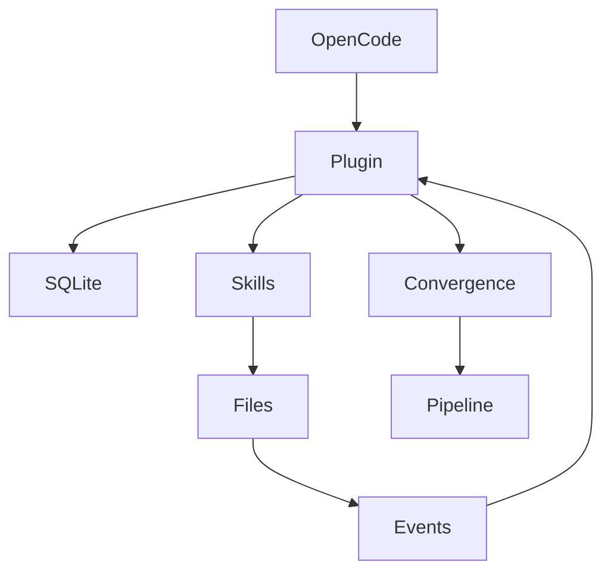

# speclang-header lines:12
id: "@speclang/opencode"
version: 0.1.0
target: src/opencode/
layer: 0
tags: [opencode, integration, plugin, sse]
imports: ["@speclang/core", "@speclang/daemon", "@speclang/agent-protocol"]
status: draft

project_level: Alpha
agent_support: agent_assisted
short: OpenCode Integration
---

# OpenCode Integration

Speclang's initial implementation using OpenCode as the runtime.

## Overview

OpenCode provides the ideal foundation for Speclang's reactive cascade system:
- Built‑in HTTP server with SSE for real‑time events
- Native plugin system for custom logic
- File watcher across all platforms
- Session management and SQLite persistence
- Skills system for agent behavior
- Multi‑model support out of the box

## Sub‑Specifications

This high‑level spec is expanded into two detailed sub‑specs:

```speclang
# @block:opencode/subspecs @kind:refs
@ref:speclang/opencode/events
@ref:speclang/opencode/integration
```

### 1. Events & Convergence (`@speclang/opencode/events`)
- File watching strategies (native vs custom)
- Session events (`file.edited`, `agent.finished`, etc.)
- Convergence detection (30‑second quiet period)

### 2. Integration Details (`@speclang/opencode/integration`)
- Plugin architecture and code
- SQLite schema and queries
- Tools exposed to agents
- Skills loading and routing
- Git integration (commit‑per‑file)
- Build profiles (POC, MVP, Enterprise)
- Multi‑model assignment

## Quick Start

```bash
opencode serve --build-mode --project=/path/to/speclang
```

The Speclang plugin will be loaded from `~/.opencode/plugins/speclang.ts` and will:
1. Watch the project directory for spec file changes
2. Parse headers and update the SQLite index
3. Route events to the appropriate skill (SpecWriter, CodeGen, etc.)
4. Enforce file‑ownership rules
5. Detect convergence after 30 seconds of inactivity
6. Run the pipeline (build, test, commit) when converged

## Architecture Summary

```speclang
# @block:opencode/architecture-summary @kind:diagram

```

## Next Steps

- Install the Speclang plugin in OpenCode
- Configure build profile (POC/MVP/Enterprise)
- Set model assignments per agent
- Start the build‑mode server

For full details, see the sub‑specs in `specs/opencode.spec.dir/`.
