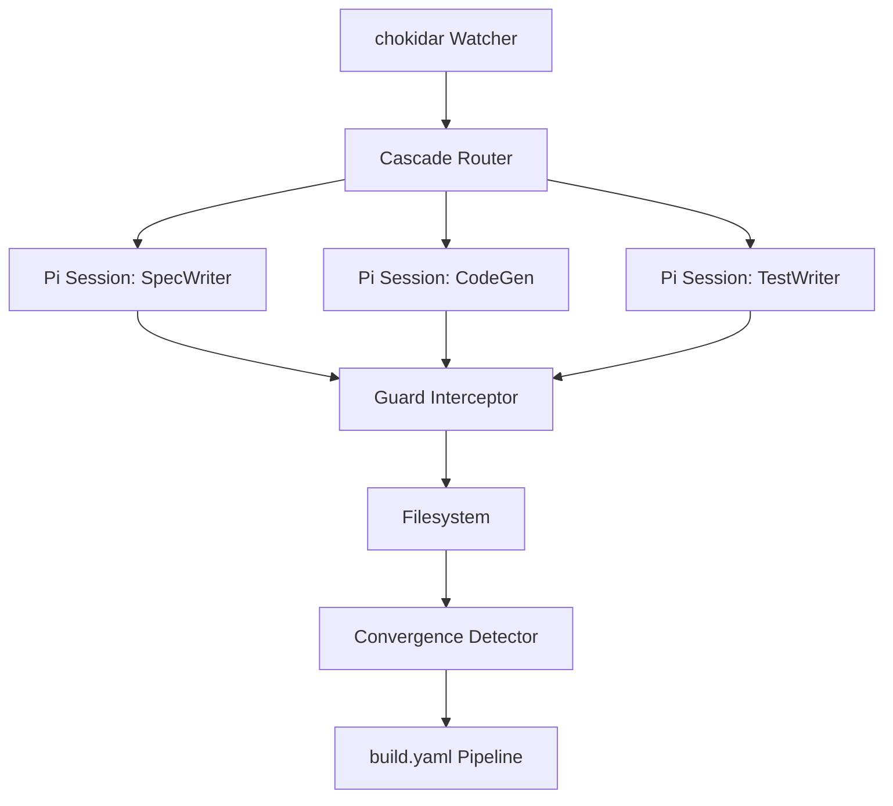

# speclang-header lines:12
id: "@speclang/pi-integration"
version: 0.1.0
target: src/pi-integration/
layer: 0
tags: [pi, integration, runtime, agents]
imports: ["@speclang/core", "@speclang/daemon", "@speclang/agent-protocol"]
status: draft

project_level: Alpha
agent_support: agent_assisted
short: Pi Agent Integration
---

# Pi Agent Integration

Speclang's runtime implementation using Pi Agent as the agent harness.

## Overview

Pi Agent provides the ideal foundation for Speclang's reactive cascade system:
- `createAgentSession()` SDK for programmatic agent control
- TypeScript extension system with `pi.registerTool()`
- Event interception (`onToolCall`, `onSessionEvent`)
- Custom commands (`/speclang:status`)
- Hot-reload support (`/reload`)
- RPC mode for external programmatic control
- Minimal footprint — system prompt under 1000 tokens

## Sub-Specifications

This high-level spec is expanded into detailed sub-specs:

```speclang
# @block:pi-integration/subspecs @kind:refs
@ref:speclang/pi-integration/daemon
@ref:speclang/pi-integration/extensions
```

### 1. Daemon Setup (`@speclang/daemon-setup`)
- File watching with chokidar
- Cascade event routing
- Pi agent session lifecycle
- Convergence detection

### 2. Extension Examples (`@speclang/pi-extension-examples`)
- Custom tools via pi.registerTool()
- Guard interceptor via onToolCall
- Custom commands via pi.registerCommand()
- Event handlers

## Quick Start

```bash
npm install @earendil-works/pi-coding-agent chokidar
speclangd --watch specs/ --pipeline build.yaml
```

The daemon will:
1. Watch `specs/` directory for file changes via chokidar
2. Parse headers and determine owning agent
3. Create Pi agent sessions via `createAgentSession()`
4. Enforce file-ownership rules via guard interceptor
5. Detect convergence after 30 seconds of inactivity
6. Run the pipeline (build, test, commit) when converged

## Architecture Summary

```speclang
# @block:pi-integration/architecture-summary @kind:diagram

```

## Next Steps

- Install Pi Agent SDK: `npm install @earendil-works/pi-coding-agent`
- Install chokidar: `npm install chokidar`
- Configure daemon watcher paths
- Write guard extension using `pi.registerTool()` + `onToolCall`

For full details, see the sub-specs in `specs/pi-integration.spec.dir/`.
