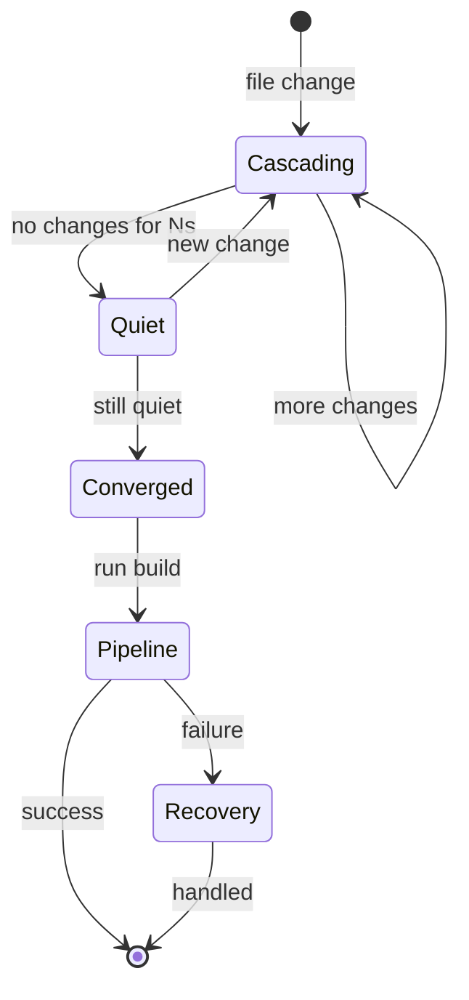

# speclang-header lines:14
id: "@speclang/pipeline/build"
parent: "@ref:speclang/pipeline"
part: 1/3
siblings:
  next: "@ref:speclang/pipeline/hooks"
short: Build Pipeline - Core Stages
project_level: Alpha
agent_support: agent_assisted
tags: [pipeline, build, convergence, stages]
imports: ["@speclang/core"]
version: 0.1.0
layer: 2
---
# Build Pipeline

The pipeline runs after convergence. Defined in specs, executed by speclangd.

## Overview

```speclang
# @block:pipeline/overview @kind:note
When speclangd detects convergence (all files quiet for N seconds),
it reads the pipeline definition and executes it.

The pipeline is self-defining - specs describe how to build themselves.
```

## Pipeline Definition

### @pipeline/file

```speclang
# @block:pipeline/file @kind:entity
PipelineFile:
  name: build.yaml or build.scl or build.spec.yaml
  location: project root
  owner: north star (user's primary AI)
  
  contents:
    - triggers: when to run
    - stages: what to execute
    - hooks: pre/post actions
    - recovery: failure handling
```

### @pipeline/structure

```speclang
# @block:pipeline/structure @kind:code
```yaml
# build.yaml
convergence:
  quiet_period: 30s
  max_iterations: 100

pipeline:
  on_converge:
    - name: install
      run: "go mod tidy"
      condition: "*.go files changed"
      
    - name: build
      run: "go build ./..."
      depends_on: [install]
      
    - name: test
      run: "go test ./... -v"
      depends_on: [build]
      hooks:
        pre: "echo 'Running generated tests...'"
        post_fail: "speclang recover --last"
        
    - name: lint
      run: "golangci-lint run"
      depends_on: [build]
      
  on_success:
    - "git add -A"
    - "git commit -m 'speclang: converged'"
    - "echo 'Build complete'"

recovery:
  max_attempts: 3
  on_fail:
    - rollback: last_spec_change
    - notify: northstar
    - log: .speclang/failures.log

targets:
  go:
    output: generated/go/
    commands:
      build: "go build"
      test: "go test"
      lint: "golangci-lint run"
```
```

---

## Triggers

### @pipeline/triggers

```speclang
# @block:pipeline/triggers @kind:entity
Trigger:
  description: "Conditions that start pipeline stages"
  
  types:
    - on_converge: when all files quiet
    - on_file_pattern: when specific files change
    - on_command: user runs /build or /finalize
    - on_schedule: cron-based (for CI)
    
  conditions:
    - "*.go changed": go files modified
    - "specs/ changed": any spec modified
    - "frontend changed": tsx/js files modified
```

### @pipeline/trigger-example

```speclang
# @block:pipeline/trigger-example @kind:code
```yaml
triggers:
  - name: backend_changed
    condition: "generated/go/**/*.go"
    run: [go_build, go_test]
    
  - name: frontend_changed
    condition: "generated/ts/**/*.ts"
    run: [npm_build, npm_test]
    
  - name: specs_changed
    condition: "specs/**/*.scl"
    run: [regenerate, all_tests]
```
```
---

## Stages

### @pipeline/stages

```speclang
# @block:pipeline/stages @kind:entity
Stage:
  name: String
  run: Command | Command[]
  depends_on: String[]?
  condition: String?
  timeout: Duration?
  retry: Int?
  
StageResult:
  name: String
  status: success | failed | skipped
  output: String
  duration: Duration
  error: String?
```

### @pipeline/stage-ordering

```speclang
# @block:pipeline/stage-ordering @kind:note
Stages run in dependency order:
1. Stages with no depends_on run first (parallel)
2. Stages wait for their dependencies
3. If dependency fails, stage is skipped
4. All stages have implicit timeout (default 5min)
```
## Convergence Detection

### @pipeline/convergence

```speclang
# @block:pipeline/convergence @kind:entity
Convergence:
  description: "How speclangd knows the cascade is done"
  
  signals:
    - quiet_period: no file writes for N seconds
    - all_agents_idle: every agent session reports done
    - max_iterations: safety limit (default 100)
    - user_command: /finalize or /build
    
  default_quiet: 30 seconds
  
  on_converge:
    1. wait for in-flight writes
    2. verify agent states
    3. trigger pipeline
```

### @pipeline/convergence-state

```speclang
# @block:pipeline/convergence-state @kind:diagram

```
## Output

### @pipeline/output

```speclang
# @block:pipeline/output @kind:entity
PipelineOutput:
  artifacts:
    - binaries: compiled executables
    - docker: container images
    - packages: npm/cargo/pypi packages
    
  reports:
    - test_results: .speclang/test-results.json
    - coverage: .speclang/coverage/
    - build_log: .speclang/build.log
    
  notifications:
    - console: stdout/stderr
    - northstar: message to user's AI session
    - webhook: POST to configured URL
```
## Per-Target Configuration

### @pipeline/targets

```speclang
# @block:pipeline/targets @kind:entity
TargetConfig:
  go:
    output: generated/go/
    build: "go build ./..."
    test: "go test ./..."
    lint: "golangci-lint run"
    
  typescript:
    output: generated/ts/
    build: "npm run build"
    test: "npm test"
    lint: "eslint ."
    
  rust:
    output: generated/rs/
    build: "cargo build"
    test: "cargo test"
    lint: "cargo clippy"
    
  python:
    output: generated/py/
    build: "pip install -e ."
    test: "pytest"
    lint: "ruff check ."
```
## Example: Full Pipeline

### @pipeline/full-example

```speclang
# @block:pipeline/full-example @kind:code
```yaml
# build.yaml - complete example
convergence:
  quiet_period: 30s
  max_iterations: 100

pipeline:
  on_converge:
    - name: detect_changes
      run: "speclang diff --json"
      
    - name: go_mod
      run: "go mod tidy"
      condition: "go files changed"
      
    - name: go_build
      run: "go build ./..."
      depends_on: [go_mod]
      
    - name: go_test
      run: "go test ./... -coverprofile=coverage.out"
      depends_on: [go_build]
      hooks:
        post_fail: "speclang rollback --last"
        
    - name: npm_install
      run: "npm ci"
      condition: "ts files changed"
      
    - name: npm_build
      run: "npm run build"
      depends_on: [npm_install]
      
    - name: npm_test
      run: "npm test"
      depends_on: [npm_build]
      hooks:
        post_fail: "speclang rollback --last"

  on_success:
    - "git add -A"
    - "git commit -m 'speclang: build complete'"
    - "echo '✅ Ready to ship'"

recovery:
  max_attempts: 3
  on_fail:
    - rollback: last_spec_change
    - notify: northstar
    - log: .speclang/failures.log
```
```
