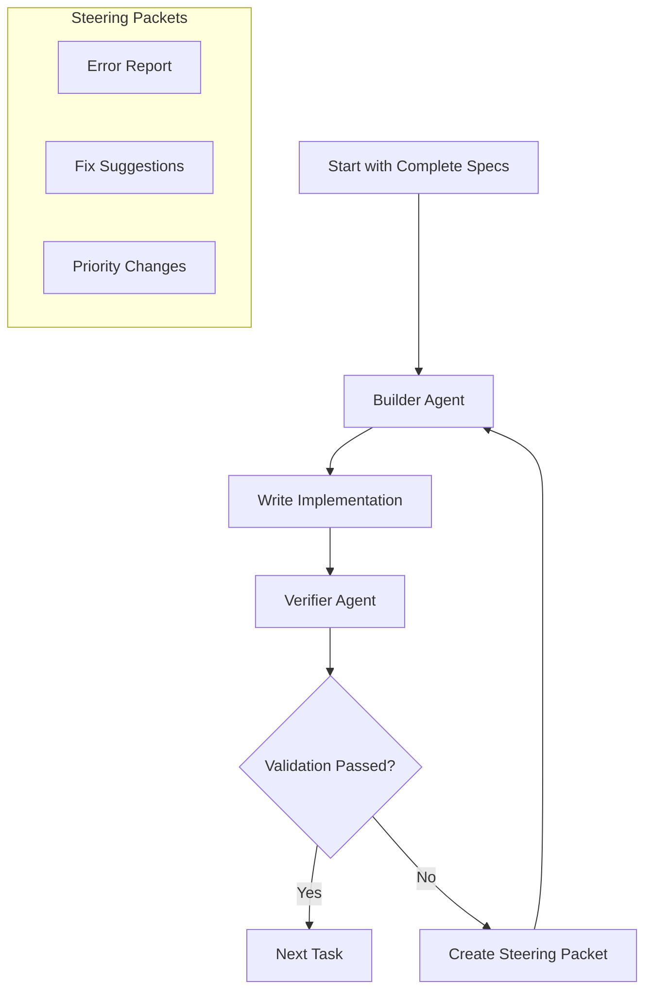

# speclang-header lines:12
id: "@speclang/ralph-loop/workflow"
version: 0.1.0
layer: 2
tags: [ralph, loop, workflow, agents, coordination]
parent: "@ref:specs/ralph-loop"
part: 1/2
status: draft
project_level: Alpha
agent_support: agent_assisted
short: Ralph Loop workflow and operational processes
---
# Ralph Loop Workflow

Operational processes, control flow, and integration for the dual‑agent Ralph Loop.

## Dual-Agent Architecture

### @ralph/architecture
```speclang
# @block:ralph/architecture @kind:diagram

```

## Loop Control

### @ralph/control
```speclang
# @block:ralph/control @kind:operation
ralph_loop_control():

steps:
  1. Load complete backing specifications
  2. Generate todo list
  3. Spawn Builder and Verifier agents
  4. While todo list has pending tasks:
     a. Get next task
     b. Assign task to Builder
     c. Builder executes task
     d. Verifier validates output
     e. If validation succeeds, mark task done and add any recommendations
     f. If validation fails, create steering packet, send to Builder, retry task
  5. When all tasks done, run system verification, final validation, and success report
```

## Integration with Existing System

### @ralph/integration
```speclang
# @block:ralph/integration @kind:entity
Integration:
  
  with_agent_protocol:
    - Builder and Verifier are special agents
    - Use existing session management
    - Follow ownership rules
    - Integrate with cascade system
    
  with_cascade:
    - Loop can trigger file changes
    - File changes can add to todo list
    - Convergence detection can pause loop
    
  with_recovery:
    - Loop failures trigger recovery
    - Steering packets can request rollback
    - Validation failures auto-recover
```

## Implementation Phases

### @ralph/phases
```speclang
# @block:ralph/phases @kind:entity
ImplementationPhases:
  
  phase_1_manual_emulation:
    - Human acts as Builder
    - speclang-builder agent acts as Verifier
    - Manual steering packets
    - Goal: Complete spec set
    
  phase_2_semi_automated:
    - speclang-builder as Builder
    - Automated validation scripts as Verifier
    - SQLite-based steering packets
    - Goal: Core implementation specs
    
  phase_3_full_automation:
    - Dedicated Builder agent
    - Dedicated Verifier agent  
    - Full validation pipeline
    - Goal: Complete Speclang system
    
  phase_4_self_hosting:
    - Use built Speclang to improve itself
    - Evolutionary development
    - Continuous Ralph Loop
```

## Failure Domains and Engineering

### @ralph/failure-domains
```speclang
# @block:ralph/failure-domains @kind:note
Watch the loop for failure domains:

Common failure domains:
1. Spec format violations
2. Missing dependencies
3. Compilation errors
4. Test failures
5. Integration issues
6. Performance problems
7. Security vulnerabilities

Engineering responses:
1. Add validation checks
2. Create better error messages
3. Improve todo list generation
4. Enhance steering packets
5. Add recovery mechanisms
6. Update documentation/SIPs
```

## Next Steps

1. ✓ Define Ralph Loop spec (this file)
2. Review all existing specs for completeness
3. Generate todo list from spec analysis
4. Implement validation pipeline
5. Create Builder and Verifier agent skills
6. Begin Phase 1 (Manual Emulation)
7. Progress through phases to full automation