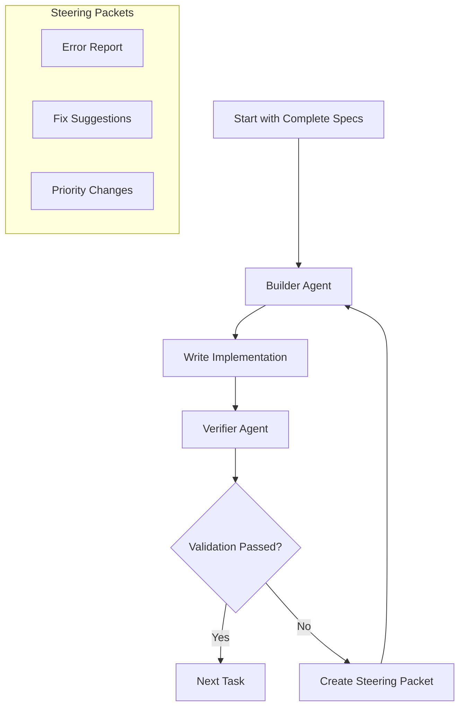

# speclang-header lines:11
id: "@speclang/ralph-loop"
version: 0.1.0
layer: 0
tags: [ralph, loop, agents, coordination, validation]
imports: ["@speclang/agent-protocol", "@speclang/cascade", "@speclang/recovery"]
status: draft
project_level: Alpha
agent_support: agent_assisted
short: Ralph Loop System
---
# Ralph Loop System

Dual-agent Ralph Loop with steering packets for building Speclang using Speclang.

## Overview

```speclang
# @block:ralph/overview @kind:note
Ralph Loop pattern applied to Speclang development:

1. Allocate array with complete backing specifications
2. Goal: Build complete Speclang system
3. Loop with two agents:
   - Builder Agent: Writes implementation specs and code
   - Verifier Agent: Validates output, creates steering packets
4. Watch loop for failure domains
5. Engineer solutions for failures
6. Repeat until goal achieved

This implements meta-circular development.
```

## Dual-Agent Architecture

### @ralph/architecture
```speclang
# @block:ralph/architecture @kind:diagram

```

## Agents

### @ralph/builder-agent
```speclang
# @block:ralph/builder-agent @kind:entity
BuilderAgent:
  role: "Write implementation specs and code"
  
  capabilities:
    - Read all SIPs and existing specs
    - Write implementation specs (.spec.md or .spec.yaml)
    - Generate code from specs (.go.spec, .ts.spec)
    - Follow file naming conventions
    - Use speclang tools (when available)
    
  triggers:
    - Steering packet from Verifier
    - Todo list item
    - Manual human instruction
    
  outputs:
    - New/modified spec files
    - Generated code files
    - Commit messages
    - Progress report
```

### @ralph/verifier-agent
```speclang
# @block:ralph/verifier-agent @kind:entity
VerifierAgent:
  role: "Validate output, create steering packets"
  
  capabilities:
    - Validate spec format compliance
    - Check code compilation
    - Run tests
    - Verify references and dependencies
    - Create steering packets
    
  validation_pipeline:
    1. Spec Format Check
    2. Header Compliance
    3. Reference Validation
    4. Code Compilation
    5. Test Execution
    6. Integration Test
    
  outputs:
    - Validation reports
    - Steering packets
    - Failure analysis
    - Success confirmation
```

## Steering Packets

### @ralph/steering-packets
```speclang
# @block:ralph/steering-packets @kind:entity
SteeringPacket:
  format: JSON stored in SQLite commands table
  
  types:
    error_report:
      fields:
        - task_id
        - error_type
        - file_path
        - error_message
        - suggested_fix
        - priority
      
    fix_suggestion:
      fields:
        - task_id
        - file_path
        - current_state
        - suggested_change
        - rationale
        
    priority_change:
      fields:
        - task_id
        - new_priority
        - reason
        - dependencies
        
    success_confirmation:
      fields:
        - task_id
        - files_created
        - tests_passed
        - next_recommendation
```

## Validation Pipeline

### @ralph/validation
```speclang
# @block:ralph/validation @kind:entity
ValidationPipeline:
  stages:
    
    stage_1_spec_format:
      checks:
        - Header present and valid
        - ID matches file path convention
        - Required fields present
        - Tags non-empty
        - References exist
        - File extension correct (.spec.md, .spec.yaml, .{ext}.spec)
        
    stage_2_code_compilation:
      checks:
        - Generated code syntax valid
        - Imports resolve
        - Type checking passes
        - No compilation errors
        
    stage_3_test_execution:
      checks:
        - All tests pass
        - Test coverage meets threshold
        - Integration tests pass
        - Performance within bounds
        
    stage_4_integration:
      checks:
        - System components integrate
        - End-to-end flows work
        - No regression issues
        - Security checks pass
```

## Todo List Management

### @ralph/todo-list
```speclang
# @block:ralph/todo-list @kind:entity
TodoList:
  source: Generated from complete spec analysis
  
  generation:
    1. Analyze all specs in _index.json
    2. Identify missing implementation specs
    3. Determine dependencies
    4. Estimate effort/complexity
    5. Create prioritized list
    
  format:
    - task_id: unique identifier
    - description: what to implement
    - depends_on: prerequisite tasks
    - estimated_complexity: low/medium/high
    - priority: 1-10
    - assigned_to: builder/verifier
    - status: pending/in_progress/done/failed
```

## Loop Control

### @ralph/control
```speclang
# @block:ralph/control @kind:operation
ralph_loop_control():
  
  initialize:
    1. Load complete backing specifications
    2. Generate todo list
    3. Spawn Builder and Verifier agents
    
  loop:
    while todo_list.has_pending():
      
      # Builder phase
      task = todo_list.get_next()
      builder.assign(task)
      output = builder.execute()
      
      # Verifier phase  
      verifier.validate(output)
      result = verifier.get_result()
      
      if result.success:
        todo_list.mark_done(task)
        if result.has_next_recommendation:
          todo_list.add(result.next_recommendation)
      else:
        steering_packet = verifier.create_steering_packet(result)
        builder.receive(steering_packet)
        todo_list.retry(task)
        
  completion:
    when todo_list.all_done():
      - System verification
      - Final validation
      - Success report
```

## SQLite Schema Extensions

### @ralph/sqlite
```speclang
# @block:ralph/sqlite @kind:code
```sql
-- Ralph Loop tables (extends existing schema)
CREATE TABLE ralph_tasks (
  id TEXT PRIMARY KEY,
  description TEXT NOT NULL,
  depends_on TEXT,  -- JSON array
  estimated_complexity TEXT,
  priority INTEGER DEFAULT 5,
  assigned_to TEXT,
  status TEXT DEFAULT 'pending',
  created_at INTEGER,
  started_at INTEGER,
  completed_at INTEGER
);

CREATE TABLE steering_packets (
  id TEXT PRIMARY KEY,
  task_id TEXT,
  type TEXT,
  content TEXT,  -- JSON
  created_at INTEGER,
  processed_at INTEGER,
  FOREIGN KEY (task_id) REFERENCES ralph_tasks(id)
);

CREATE TABLE validation_results (
  id TEXT PRIMARY KEY,
  task_id TEXT,
  stage TEXT,
  passed BOOLEAN,
  details TEXT,  -- JSON
  created_at INTEGER,
  FOREIGN KEY (task_id) REFERENCES ralph_tasks(id)
);
```
```

## Integration with Existing System

### @ralph/integration
```speclang
# @block:ralph/integration @kind:entity
Integration:
  
  with_agent_protocol:
    - Builder and Verifier are special agents
    - Use existing session management
    - Follow ownership rules
    - Integrate with cascade system
    
  with_cascade:
    - Loop can trigger file changes
    - File changes can add to todo list
    - Convergence detection can pause loop
    
  with_recovery:
    - Loop failures trigger recovery
    - Steering packets can request rollback
    - Validation failures auto-recover
```

## Implementation Phases

### @ralph/phases
```speclang
# @block:ralph/phases @kind:entity
ImplementationPhases:
  
  phase_1_manual_emulation:
    - Human acts as Builder
    - speclang-builder agent acts as Verifier
    - Manual steering packets
    - Goal: Complete spec set
    
  phase_2_semi_automated:
    - speclang-builder as Builder
    - Automated validation scripts as Verifier
    - SQLite-based steering packets
    - Goal: Core implementation specs
    
  phase_3_full_automation:
    - Dedicated Builder agent
    - Dedicated Verifier agent  
    - Full validation pipeline
    - Goal: Complete Speclang system
    
  phase_4_self_hosting:
    - Use built Speclang to improve itself
    - Evolutionary development
    - Continuous Ralph Loop
```

## Failure Domains and Engineering

### @ralph/failure-domains
```speclang
# @block:ralph/failure-domains @kind:note
Watch the loop for failure domains:

Common failure domains:
1. Spec format violations
2. Missing dependencies
3. Compilation errors
4. Test failures
5. Integration issues
6. Performance problems
7. Security vulnerabilities

Engineering responses:
1. Add validation checks
2. Create better error messages
3. Improve todo list generation
4. Enhance steering packets
5. Add recovery mechanisms
6. Update documentation/SIPs
```

## Next Steps

1. ✓ Define Ralph Loop spec (this file)
2. Review all existing specs for completeness
3. Generate todo list from spec analysis
4. Implement validation pipeline
5. Create Builder and Verifier agent skills
6. Begin Phase 1 (Manual Emulation)
7. Progress through phases to full automation
