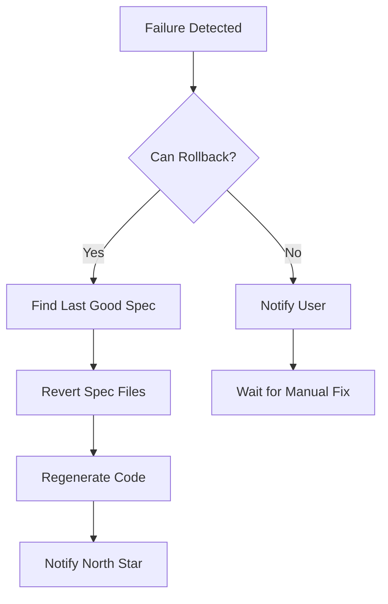

# speclang-header lines:12
id: "@speclang/recovery/rollback"
version: 0.1.0
layer: 2

tags: [recovery, rollback]
imports: ["@speclang/recovery"]
status: draft
project_level: Alpha
agent_support: agent_assisted
short: Rollback
---

# Rollback

### @recovery/rollback

```speclang
# @block:recovery/rollback @kind:entity
Rollback:
  description: "Revert to last known good state"
  
  what_gets_rolled_back:
    - spec file changes
    - generated code changes
    - git commits (if made)
    
  what_stays:
    - north star file (user's intent)
    - logs and error reports
    
  trigger:
    - test failure
    - build failure
    - explicit user command
```

### @recovery/rollback-flow

```speclang
# @block:recovery/rollback-flow @kind:diagram

```