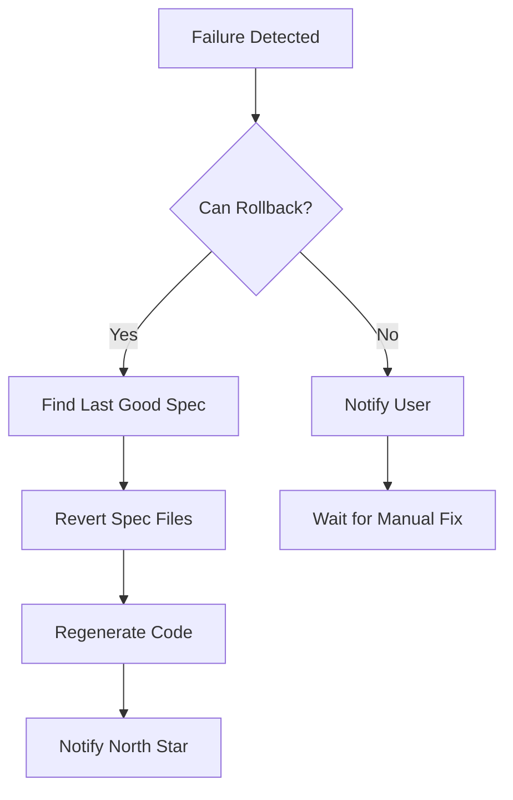
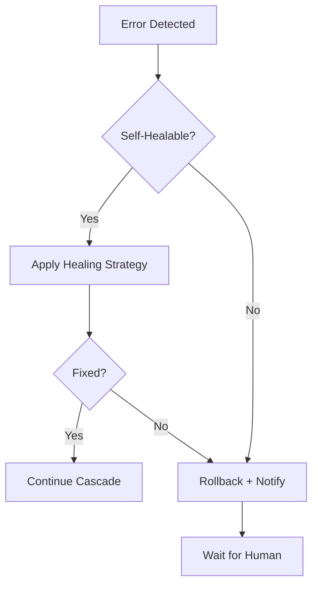

# speclang-header lines:9
id: "@speclang/recovery"
version: 0.1.0
layer: 0
tags: [recovery, self-healing, rollback, errors]
imports: ["@speclang/core", "@speclang/pipeline"]
status: draft

---

# Recovery

Self-healing when things go wrong. Automatic rollback and notification.

## Overview

```speclang
# @block:recovery/overview @kind:note
When the pipeline fails or an agent errors, Speclang doesn't just crash.
It recovers - rolling back spec changes, notifying the user, and trying again.

The system defines its own recovery strategies in the specs.
```

---

## Failure Types

### @recovery/failures

```speclang
# @block:recovery/failures @kind:entity
FailureType:
  build_fail:
    cause: code doesn't compile
    recovery: rollback spec, notify
    
  test_fail:
    cause: tests don't pass
    recovery: rollback spec, notify, show diff
    
  agent_timeout:
    cause: agent didn't respond
    recovery: kill session, retry
    
  lock_conflict:
    cause: two agents want same file
    recovery: serialize, first-come-first-serve
    
  spec_invalid:
    cause: spec has syntax errors
    recovery: notify orchestrator, block cascade
    
  ref_broken:
    cause: @ref points to non-existent block
    recovery: notify, require manual fix
```

---

## Rollback

### @recovery/rollback

```speclang
# @block:recovery/rollback @kind:entity
Rollback:
  description: "Revert to last known good state"
  
  what_gets_rolled_back:
    - spec file changes
    - generated code changes
    - git commits (if made)
    
  what_stays:
    - north star file (user's intent)
    - logs and error reports
    
  trigger:
    - test failure
    - build failure
    - explicit user command
```

### @recovery/rollback-flow

```speclang
# @block:recovery/rollback-flow @kind:diagram

```

---

## Notification

### @recovery/notify

```speclang
# @block:recovery/notify @kind:entity
Notification:
  description: "Tell the user's primary AI what happened"
  
  target: orchestrator session (north star owner)
  
  content:
    - what failed
    - error message
    - stack trace / details
    - what was rolled back
    - suggested fix
    
  channels:
    - inline in north star file
    - AI session message
    - log file
```

### @recovery/notify-format

```speclang
# @block:recovery/notify-format @kind:code
```yaml
# notification written to .speclang/notifications/
notification:
  id: notify-2024-01-15-001
  timestamp: 2024-01-15T10:30:00Z
  severity: error
  
  failure:
    type: test_fail
    stage: go_test
    message: "3 tests failed in auth package"
    
  rollback:
    spec_file: specs/auth.scl
    change: "added @block:auth/magic-login"
    reverted_to: version 1.0.0
    
  suggestion:
    - "Review magic-login implementation"
    - "Check JWT token generation"
    - "Verify email mock is configured"
```
```

---

## Retry Strategies

### @recovery/retry

```speclang
# @block:recovery/retry @kind:entity
RetryStrategy:
  description: "Try again before giving up"
  
  types:
    immediate: retry right away
    backoff: wait with exponential delay
    scheduled: retry at specific time
    
  limits:
    max_attempts: 3
    backoff_base: 1s
    backoff_max: 30s
```

### @recovery/retry-flow

```speclang
# @block:recovery/retry-flow @kind:code
```yaml
retry:
  max_attempts: 3
  backoff: exponential
  base_delay: 1s
  max_delay: 30s
  
on_transient_error:
  1st attempt: immediate
  2nd attempt: wait 1s
  3rd attempt: wait 2s
  4th attempt: wait 4s (if under max)
  after max: give up, rollback
```
```

---

## Error Logging

### @recovery/logging

```speclang
# @block:recovery/logging @kind:entity
ErrorLog:
  location: .speclang/errors/
  format: JSON per file
  
  contents:
    - timestamp
    - error type
    - error message
    - stack trace
    - affected files
    - recovery action taken
    
  retention: 30 days
```

### @recovery/log-example

```speclang
# @block:recovery/log-example @kind:code
```json
// .speclang/errors/2024-01-15T10-30-00.json
{
  "timestamp": "2024-01-15T10:30:00Z",
  "session": "sess-003",
  "agent": "code-gen-go",
  "error": {
    "type": "build_fail",
    "message": "undefined: User in handler.go:23",
    "file": "generated/go/auth/handler.go",
    "line": 23
  },
  "recovery": {
    "action": "rollback",
    "spec_reverted": "specs/auth.scl",
    "notification_sent": true
  }
}
```
```

---

## Self-Healing Strategies

### @recovery/self-heal

```speclang
# @block:recovery/self-heal @kind:entity
SelfHealingStrategy:
  description: "Recover without human intervention when possible"
  
  strategies:
    regenerate:
      trigger: generated code corrupted
      action: delete and regenerate from spec
      
    re_expand:
      trigger: expanded spec has errors
      action: delete and re-expand from parent
      
    fix_imports:
      trigger: missing imports in generated code
      action: auto-add imports from stdlib
      
    fix_refs:
      trigger: broken @ref
      action: search for correct ref, update
```

### @recovery/heal-flow

```speclang
# @block:recovery/heal-flow @kind:diagram

```

---

## Manual Intervention

### @recovery/manual

```speclang
# @block:recovery/manual @kind:entity
ManualIntervention:
  description: "When auto-recovery fails, human steps in"
  
  triggers:
    - max retries exceeded
    - unhealable error
    - spec syntax error (AI can't fix)
    
  actions:
    - user edits north star or spec
    - user runs /recover or /retry
    - user runs /rollback manually
    
  commands:
    /recover: attempt recovery again
    /rollback: revert last changes
    /status: show current error state
    /ignore: mark error as known, continue
```

---

## Recovery Configuration

### @recovery/config

```speclang
# @block:recovery/config @kind:entity
RecoveryConfig:
  location: build.yaml or .speclangrc
  
  defaults:
    max_attempts: 3
    backoff: exponential
    notify_on_fail: true
    auto_rollback: true
    log_retention: 30d
    
  per_agent:
    spec-writer:
      on_error: notify_only
    code-gen:
      on_error: rollback_and_retry
```

### @recovery/config-example

```speclang
# @block:recovery/config-example @kind:code
```yaml
# build.yaml
recovery:
  max_attempts: 3
  backoff: exponential
  auto_rollback: true
  
  on_fail:
    - log: .speclang/errors/
    - rollback: last_spec_change
    - notify: northstar
    
  strategies:
    build_fail: rollback
    test_fail: rollback_and_notify
    agent_timeout: retry_with_backoff
    spec_invalid: notify_only
```
```

---

## State Recovery

### @recovery/state

```speclang
# @block:recovery/state @kind:entity
StateRecovery:
  description: "Recover from corrupted state"
  
  checkpoints:
    - before each cascade
    - before each pipeline run
    - after each successful convergence
    
  checkpoint_data:
    - spec file hashes
    - generated file hashes
    - agent session states
    - lock states
    
  restore:
    - load checkpoint
    - verify hashes
    - restore file states
    - restart cascade
```

---

## Escalation

### @recovery/escalation

```speclang
# @block:recovery/escalation @kind:entity
Escalation:
  description: "When recovery keeps failing"
  
  levels:
    level_1: auto_retry (3 attempts)
    level_2: auto_rollback + notify
    level_3: pause cascade + notify
    level_4: require human approval
    
  triggers:
    - 3 consecutive failures
    - same error repeated
    - critical system error
    
  on_escalate:
    - write to north star with details
    - create .speclang/ESCALATION file
    - stop all agent activity
    - wait for /resume or /abort
```
