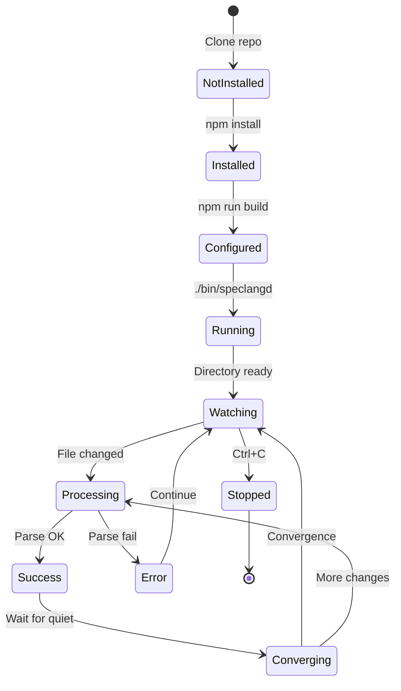

# speclang-header lines:7
id: "@speclang/roadmap/poc/user-flows"
parent: "@ref:specs/roadmap/poc"version: 0.1.0
layer: 2
short: "User interaction flows and journeys"
tags: [poc, ux, user-flows, interactions]
---

# POC: User Interaction Flows

Complete user journey and interaction flows.

## Primary User Flow

### @poc/flows/primary

**The Happy Path: Create → Edit → Generate → Use**

```
┌─────────────────────────────────────────────────────────────┐
│  1. USER INSTALLS SPECLANG                                  │
│     $ git clone ... && npm install                          │
└─────────────────────────────────────────────────────────────┘
                            │
                            ▼
┌─────────────────────────────────────────────────────────────┐
│  2. USER STARTS DAEMON                                      │
│     $ ./bin/speclangd                                       │
│     [speclangd] ✅ Ready. Watching specs/                   │
└─────────────────────────────────────────────────────────────┘
                            │
                            ▼
┌─────────────────────────────────────────────────────────────┐
│  3. USER CREATES SPEC                                       │
│     $ mkdir -p specs                                        │
│     $ vim specs/feature.spec.md                             │
└─────────────────────────────────────────────────────────────┘
                            │
                            ▼
┌─────────────────────────────────────────────────────────────┐
│  4. SYSTEM DETECTS CHANGE                                   │
│     [speclangd] Change detected: specs/feature.spec.md      │
│     [speclangd] Processing...                               │
└─────────────────────────────────────────────────────────────┘
                            │
                            ▼
┌─────────────────────────────────────────────────────────────┐
│  5. CODE GENERATES                                          │
│     [speclangd] Generated: src/feature/index.ts             │
│     [speclangd] ✅ Done (1 file, 45ms)                      │
└─────────────────────────────────────────────────────────────┘
                            │
                            ▼
┌─────────────────────────────────────────────────────────────┐
│  6. USER USES GENERATED CODE                                │
│     $ cat src/feature/index.ts                              │
│     $ npm run build  # Compiles successfully!               │
└─────────────────────────────────────────────────────────────┘
```

**Time: < 5 seconds from save to working code**

## User Personas

### @poc/flows/personas

**Persona 1: New Developer (Alice)**
- Just heard about SpecLang
- Wants to try it quickly
- Needs clear error messages
- Wants to see immediate results

**Goals:**
1. Install in < 5 minutes
2. Generate first code in < 2 minutes
3. Understand the workflow intuitively

**Pain Points:**
- Confused by dual-view (specs vs src/)
- Doesn't know what to edit
- Scared of "generated code"

**Flow for Alice:**
```
1. Reads README
2. Runs quick start commands
3. Creates first spec (copy-paste example)
4. Watches code appear
5. Edits spec, sees update
6. "Aha!" moment ✨
```

**Persona 2: Experienced Dev (Bob)**
- Understands code generation
- Wants to integrate into existing project
- Needs configuration options
- Cares about performance

**Goals:**
1. Integrate with existing codebase
2. Customize output location
3. Configure for team use
4. CI/CD integration

**Flow for Bob:**
```
1. Installs as dev dependency
2. Configures watch directory
3. Integrates into build pipeline
4. Sets up team conventions
5. Writes custom templates (future)
```

## Detailed Interactions

### @poc/flows/interactions

**Scenario 1: First Time User**

```bash
# Terminal state
$

# User types
$ ./bin/speclangd

# System responds
[speclangd] Starting SpecLang POC daemon v0.1.0
[speclangd] Watching: ./specs
[speclangd] Output: ./src
[speclangd] 
[speclangd] ⚠️  Watch directory not found: ./specs
[speclangd] 
[speclangd] Create it with: mkdir specs
[speclangd] Or specify different: ./bin/speclangd --watch ./my-specs

# User fixes
$ mkdir specs
$ ./bin/speclangd

# System responds
[speclangd] Starting SpecLang POC daemon v0.1.0
[speclangd] Watching: ./specs
[speclangd] Output: ./src
[speclangd] 
[speclangd] ⚠️  No spec files found
[speclangd] 
[speclangd] Create your first spec:
[speclangd]   echo '# speclang-header lines:5' > specs/hello.spec.md
[speclangd]   echo 'id: "@demo/hello"' >> specs/hello.spec.md
[speclangd]   echo '---' >> specs/hello.spec.md
[speclangd]   echo '' >> specs/hello.spec.md
[speclangd]   echo '### @block::greet @kind:function' >> specs/hello.spec.md
[speclangd]   echo 'Say hello.' >> specs/hello.spec.md
[speclangd] 
[speclangd] ✅ Ready. Watching for changes...

# User creates spec in another terminal
$ vim specs/hello.spec.md
# (writes spec content and saves)

# System responds (in daemon terminal)
[speclangd] [14:32:05] Change detected: specs/hello.spec.md
[speclangd] [14:32:05] Parsing spec...
[speclangd] [14:32:05] Found 1 block: greet
[speclangd] [14:32:05] Generating code...
[speclangd] [14:32:05] Writing: specs/hello.spec.dir/src/greet.ts
[speclangd] [14:32:05] Creating symlink: src/hello
[speclangd] [14:32:05] ✅ Generated 1 file in 45ms
[speclangd] [14:32:10] ✅ Convergence detected

# User checks result
$ ls -la src/
# lrwxr-xr-x hello -> ../specs/hello.spec.dir/src

$ cat src/hello/greet.ts
# // SPECLANG-GENERATED: function
# // Source: specs/hello.spec.md#greet
# export function greet(): void {
#   throw new Error('Not implemented');
# }

# User builds
$ npm run build
# ✅ Build successful

# User celebrates! 🎉
```

**Scenario 2: Editing Existing Spec**

```bash
# User edits spec
$ vim specs/hello.spec.md
# (changes description, adds parameter, saves)

# System responds
[speclangd] [14:35:22] Change detected: specs/hello.spec.md
[speclangd] [14:35:22] Parsing spec...
[speclangd] [14:35:22] Found 1 block: greet
[speclangd] [14:35:22] Generating code...
[speclangd] [14:35:22] ✅ Updated: src/hello/greet.ts
[speclangd] [14:35:27] ✅ Convergence detected

# User sees updated code
$ cat src/hello/greet.ts
# (shows updated version)
```

**Scenario 3: Error Recovery**

```bash
# User makes mistake
$ vim specs/hello.spec.md
# (accidentally deletes header, saves)

# System responds
[speclangd] [14:40:10] Change detected: specs/hello.spec.md
[speclangd] [14:40:10] ⚠️  Parse error in spec
[speclangd] [14:40:10]   File: specs/hello.spec.md
[speclangd] [14:40:10]   Error: Missing speclang-header
[speclangd] [14:40:10]   
[speclangd] [14:40:10] Fix: Add header to first line
[speclangd] [14:40:10]   # speclang-header lines:5
[speclangd] [14:40:10]   
[speclangd] [14:40:10] Continuing to watch other files...

# User fixes
$ vim specs/hello.spec.md
# (adds header back, saves)

# System responds
[speclangd] [14:41:05] Change detected: specs/hello.spec.md
[speclangd] [14:41:05] ✅ Generated: src/hello/greet.ts
```

**Scenario 4: Multiple Files**

```bash
# User creates multiple specs quickly
$ touch specs/auth.spec.md specs/user.spec.md specs/api.spec.md

# System responds
[speclangd] [14:45:01] Change detected: 3 files
[speclangd] [14:45:01] Processing specs/auth.spec.md...
[speclangd] [14:45:01] Processing specs/user.spec.md...
[speclangd] [14:45:01] Processing specs/api.spec.md...
[speclangd] [14:45:02] ✅ Generated 8 files
[speclangd] [14:45:07] ✅ Convergence detected
```

## State Diagram

### @poc/flows/state-diagram



## Decision Trees

### @poc/flows/decisions

**Should I edit specs/ or src/?**
```
User wants to make change
    │
    ├── Is it in specs/?
    │   ├── YES → Edit it ✓
    │   └── NO → Check if in src/
    │       ├── YES → Don't edit! Edit specs/ instead
    │       └── NO → Create new spec
    │
    └── Rule: NEVER edit src/ directly
```

**System detects file change**
```
File changed
    │
    ├── Is it a .spec.md file?
    │   ├── NO → Ignore
    │   └── YES → Parse header
    │       │
    │       ├── Parse succeeds?
    │       │   ├── NO → Log error, skip
    │       │   └── YES → Extract blocks
    │       │       │
    │       │       ├── Generate code for each block
    │       │       ├── Write to .spec.dir/src/
    │       │       ├── Update symlink in src/
    │       │       └── Log success
    │       │
    │       └── Wait for convergence
    │           ├── More changes? → Process more
    │           └── Quiet for 5s? → Converged ✓
```

## Error Recovery Flows

### @poc/flows/errors

**Parse Error Recovery:**
```
User edits spec
    ↓
System detects change
    ↓
Parse fails
    ↓
System shows clear error message
    ↓
System continues watching (doesn't crash)
    ↓
User fixes error
    ↓
System detects fix
    ↓
System generates code
    ↓
✅ Recovered
```

**Build Error Recovery:**
```
Code generates
    ↓
User runs npm run build
    ↓
Build fails
    ↓
User sees TypeScript errors
    ↓
User fixes spec (not generated code!)
    ↓
Code regenerates
    ↓
Build succeeds
    ↓
✅ Fixed
```

## User Feedback Loop

### @poc/loops/feedback

**Immediate Feedback (< 1s):**
- File change detected
- Parsing started

**Short Feedback (< 5s):**
- Code generated
- Files written
- Symlinks created

**Confirmation Feedback (< 10s):**
- Convergence detected
- Summary stats

**Delayed Feedback (on demand):**
- Build results
- Test results

## Success Indicators

### @poc/flows/success

**Visual Indicators:**
- ✅ Green checkmarks for success
- ⚠️ Yellow warnings for issues
- ❌ Red errors for failures
- ⏳ Spinner during processing

**Sound (optional future):**
- Success: Pleasant chime
- Error: Soft warning

**Notifications (optional future):**
- Desktop notification on convergence
- "SpecLang: Generated 3 files"
