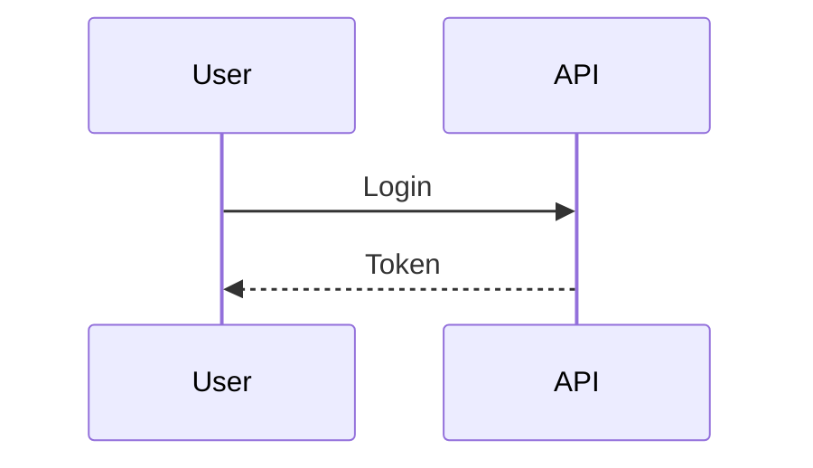

# speclang-header lines:126
# id: @specs/skills
# version: 1.0.0
# layer: 5


# SIP 9: File Naming

**Status:** Draft  
**Version:** 0.1.0  
**Author:** Speclang Core Team

## README

This SIP defines file naming conventions and format selection for Speclang.

### Quick Start

1. **Core Specs:** `.scl` - Primary format
2. **Markdown Specs:** `.spec.md` - Human-readable with diagrams
3. **YAML Specs:** `.spec.yaml` - Machine-precise structure
4. **Code Specs:** `.{lang}.spec` - Direct code mapping (e.g., `.go.spec`)

### Format Selection

| Extension | Use When |
|-----------|----------|
| `.scl` | Core specs, North Star |
| `.spec.md` | Human-readable, diagrams, prose |
| `.spec.yaml` | Precise structure, machine-parsable |
| `.go.spec` | Produces exactly one `.go` file |
| `.ts.spec` | Produces exactly one `.ts` file |
| `.py.spec` | Produces exactly one `.py` file |

### Examples

```
project.scl                 # North Star
specs/auth.spec.md          # Auth spec with diagrams
specs/auth/entities.spec.yaml  # Entity definitions
auth.go.spec                # Go code generation spec
auth.ts.spec                # TypeScript code generation spec
```

### Key Concepts

- **Format Determines Parser:** How speclangd reads the file
- **Code Mapping:** `handler.go.spec` → `handler.go`
- **Layer-Based:** Higher layers use .spec.md, lower use .{lang}.spec
- **Flexibility:** Choose format based on content needs

### When to Read This

- **Creating new specs:** Choose the right format
- **Organizing project:** Structure files appropriately
- **Implementing parsers:** Understand file formats

### Related SIPs

- SIP 2: Header Format
- SIP 3: Block System
- SIP 5: Splitting and Sizing

## Abstract

This SIP defines the file naming conventions and format selection rules for Speclang specs. Different file extensions indicate different purposes, parsing strategies, and content types.

## Motivation

Specs serve different purposes:
- Some need rich formatting (diagrams, prose)
- Some need precise structure (YAML)
- Some map directly to code (language specs)
- The core needs its own format

Different formats allow optimization for each use case.

## Rationale

**Why Multiple Formats?**
- Markdown is human-readable
- YAML is machine-precise
- Language specs are direct mappings
- Core format is consistent

**Extension-Based Selection:**
- Clear intent from filename
- Easy to route to correct parser
- Self-documenting
- IDE-friendly

## Specification

### Core Format (.scl)

**Purpose:** Primary Speclang format

**Usage:**
- North Star (project.scl)
- Core specifications
- Foundation specs

**Characteristics:**
- Human and machine readable
- Supports all features
- Default format

### Markdown Format (.spec.md)

**Purpose:** Human-readable with rich formatting

**Usage:**
- High-level specs (levels 0-3)
- Architecture documentation
- Prose explanations
- Mixed content

**Supports:**
- Mermaid diagrams
- Code fences
- Tables
- Lists
- Headers with YAML frontmatter

**Example:**
```markdown
---
speclang-header:
  id: @specs/auth
  version: 1.0.0
---

# Authentication

## Overview



# @block:auth/login @kind:operation
...
```

### YAML Format (.spec.yaml)

**Purpose:** Machine-first, precise structure

**Usage:**
- Low-level specs (levels 4-10)
- Structured data
- Configuration
- When precision matters

**Characteristics:**
- Native YAML parsing
- Strict structure
- Good for entities, operations
- Headers in comments

**Example:**
```yaml
# speclang-header lines:10
# id: @specs/auth/entities
# version: 1.0.0
---

entities:
  User:
    id: UUID
    email: String
```

### Language Format (.{lang}.spec)

**Purpose:** Direct code mapping

**Pattern:** `{name}.{ext}.spec → {name}.{ext}`

**Supported:**
- `.go.spec` → `.go`
- `.ts.spec` → `.ts`
- `.js.spec` → `.js`
- `.py.spec` → `.py`
- `.rs.spec` → `.rs`
- `.java.spec` → `.java`

**Characteristics:**
- One spec = one code file
- Direct correspondence
- Final layer before code
- Contains code with header

**Example:**
```yaml
# handler.go.spec
# speclang-header lines:12
# id: @specs/auth/handler.go.spec
# target: go
# produces: handler.go
---

package auth

func Login(...) {...}
```

## File Structure

### By Purpose

**Configuration:**
- `project.scl` - North Star
- `build.scl` - Build configuration
- `build.yaml` - Pipeline configuration

**Specs Directory:**
```
specs/
├── auth.spec.md              # High-level
├── auth.spec.spec.dir/            # Split directory
│   ├── entities.spec.yaml    # Structured
│   ├── operations.spec.yaml
│   └── policies.spec.yaml
└── generated/
    ├── go/
    │   └── auth.go.spec      # Code spec
    └── ts/
        └── auth.ts.spec
```

### By Layer

**Level 0-3:**
- `.scl` for project
- `.spec.md` for features

**Level 4-7:**
- `.spec.yaml` for structured
- `.spec.md` for prose

**Level 8-10:**
- `.{lang}.spec` for code
- Direct mapping

## Format Selection Guide

**Use .scl when:**
- It's the North Star
- Core framework spec
- Needs all features

**Use .spec.md when:**
- Humans will edit frequently
- Need diagrams or prose
- Architecture documentation
- Mixed content

**Use .spec.yaml when:**
- Machine precision matters
- Structured data
- Configuration
- Low-level details

**Use .{lang}.spec when:**
- Mapping to code directly
- Final layer
- Specific language
- Code-focused

## Parser Selection

**Based on Extension:**
```python
def get_parser(file_path):
    ext = get_extension(file_path)
    
    parsers = {
        '.scl': SpeclangParser,
        '.spec.md': MarkdownParser,
        '.spec.yaml': YAMLParser,
        '.go.spec': GoSpecParser,
        '.ts.spec': TypeScriptSpecParser,
        '.py.spec': PythonSpecParser,
    }
    
    return parsers.get(ext, DefaultParser)
```

## Integration

**With Headers:**
- All formats support headers
- Header format adapts to file type
- Line 1-2 declaration
- YAML frontmatter

**With Cascade:**
- Extension determines parser
- Parser determines blocks
- Blocks trigger agents
- Agents write files

**With SQLite:**
- Store extension
- Query by format
- Filter by type

## Backwards Compatibility

**Legacy Files:**
- May use older naming
- Migration tool provided
- Gradual adoption

## Examples

### Complete Project

```
my-project/
├── project.scl              # North Star
├── build.scl              # Build config
├── specs/
│   ├── core.spec.md       # Core system
│   ├── auth.spec.md       # Auth high-level
│   ├── auth.spec.spec.dir/     # Auth details
│   │   ├── entities.spec.yaml
│   │   ├── operations.spec.yaml
│   │   └── tests.spec.yaml
│   └── api/
│       ├── rest.spec.md
│       └── graphql.spec.md
└── generated/
    ├── go/
    │   └── auth.go.spec
    └── ts/
        └── auth.ts.spec
```

### Naming Patterns

**Feature Specs:**
```
{feature}.spec.md
{feature}.spec.yaml
{feature}.scl
```

**Split Specs:**
```
{feature}.spec.spec.dir/
├── {part1}.spec.yaml
├── {part2}.spec.yaml
└── {part3}.spec.yaml
```

**Code Specs:**
```
{module}.{lang}.spec
{module}/{component}.{lang}.spec
```

## Validation

**On File Create:**
- Check extension is valid
- Ensure parser exists
- Validate format

**Errors:**
```
Error: Unknown extension ".unknown"
Error: No parser for ".xyz.spec"
Warning: Mixing formats in same directory
```

## References

- SIP 2: Header Format
- SIP 3: Block System
- SIP 5: Splitting and Sizing

## Copyright

This document is in the public domain.