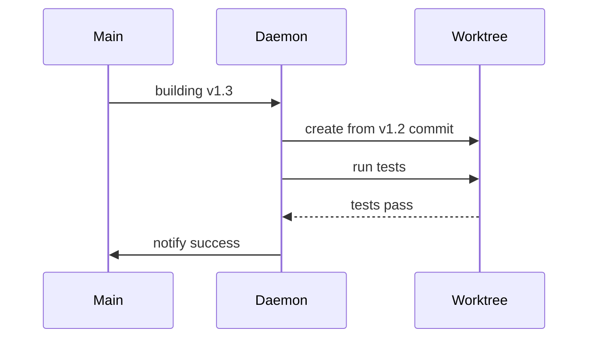

# speclang-header lines:5
# id: @specs/skills
# version: 1.0.0
# layer: 5


# SIP 43: MCP Daemon

**Status:** Draft  
**Version:** 0.1.0  
**Author:** SpecLang Core Team

## README

This SIP defines MCP Daemon—the enterprise speclangd daemon with HTTP/SSE server.

### Quick Start

Enterprise mode features:
- HTTP server on port 8765
- SSE stream for events
- Queue visibility and control
- Worktree isolation

### When to Read This

- **Enterprise setup**: Running at scale
- **Queue management**: Monitoring work
- **Worktrees**: Testing in isolation

### Related SIPs

- SIP 10: Daemon
- SIP 11: MCP Tools
- SIP 39: Deployment Modes

## Abstract

This SIP defines MCP Daemon—an optional enterprise daemon that provides HTTP/SSE API, queue management, worktree isolation, and agent control. It exposes queue status to editors and enables testing while building the next version.

## Motivation

Enterprise users need:
- Queue visibility
- Worktree isolation
- Agent control
- Compliance logging

MCP Daemon provides these capabilities.

## Rationale

**Daemon architecture:**

1. **HTTP API**: RESTful endpoints for control
2. **SSE Stream**: Real-time event broadcasting
3. **Queue Manager**: Priority-based processing
4. **Worktrees**: Isolated testing environments

## Specification

### Architecture

```yaml
DaemonArchitecture:
  components:
    FileWatcher: inotify/fsnotify
    EventQueue: Priority-based queue
    SSEStream: Event broadcasting
    HTTPAPI: RESTful endpoints
    MCPServer: Protocol interface
    
  flow:
    - FileWatcher detects changes
    - Events go to Queue
    - Queue broadcasts to SSE
    - HTTP provides control
    - MCP exposes tools
```

### HTTP Server

```yaml
HTTPServer:
  port: 8765
  host: localhost
  
  endpoints:
    GET /status:
      returns: { mode, queue_depth, files_watching, uptime }
      
    GET /events:
      returns: SSE stream of all events
      
    GET /queue:
      returns: { pending: [], in_progress: [], completed: [] }
      
    POST /command:
      body: { command, params }
      commands: [pause, resume, priority, worktree]
      
    GET /worktrees:
      returns: list of active worktrees
      
    POST /worktree/create:
      body: { name, base_commit? }
      returns: { path, ready }
      
    POST /worktree/{name}/test:
      body: { filter? }
      returns: { test_id, status }
```

### SSE Events

```yaml
SSEEvents:
  endpoint: GET /events
  format: text/event-stream
  
  event_types:
    file.changed:
      data: { path, kind, timestamp }
      
    queue.updated:
      data: { depth, added, removed }
      
    agent.started:
      data: { session, agent, file }
      
    agent.finished:
      data: { session, summary, files_written }
      
    convergence.detected:
      data: { quiet_seconds, files_changed }
      
    pipeline.started:
      data: { stages }
      
    pipeline.finished:
      data: { success, duration }
```

### Queue Management

```yaml
EventQueue:
  max_size: 1000
  
  states:
    pending: waiting to be processed
    in_progress: being processed by agent
    completed: finished
    failed: error occurred
    
  priority:
    user_edits: high
    spec_expansions: normal
    code_generation: normal
    tests: low
    
  commands:
    pause: stop processing new items
    resume: continue processing
    priority: move item to front
    clear: remove all pending
```

### Worktree Isolation

```yaml
WorktreeManagement:
  purpose: "Test versions while building next"
  location: .speclang/worktrees/{name}/
  
  workflow:
    1: Create worktree from commit
    2: Run tests in worktree
    3: If tests pass, merge
    4: If tests fail, fix in main
    
  use_cases:
    - Test v1.2 while building v1.3
    - Run integration tests in parallel
    - Deploy specific version
    
  commands:
    create: new isolated worktree
    test: run tests in worktree
    merge: merge worktree back
    delete: remove worktree
```

### Agent Control

```yaml
AgentControl:
  description: "One agent controls another"
  
  who_can_control:
    - orchestrator: can control all
    - north_star: can control sub-agents
    
  commands:
    pause: stop agent, keep state
    resume: continue agent
    split: force split of current file
    re-expand: regenerate from parent
    priority: change queue priority
    kill: terminate agent (rollback)
    
  safety:
    - only orchestrator can kill
    - pause/resume logged for audit
    - control commands require reason
```

### MCP Tools

```yaml
MCPTools:
  speclang_queue_status:
    description: "Get current queue status"
    returns: { pending, in_progress, completed, depth }
    
  speclang_queue_pause:
    description: "Pause queue processing"
    returns: { ok, paused_at }
    
  speclang_queue_resume:
    description: "Resume queue processing"
    returns: { ok, resumed_at }
    
  speclang_worktree_create:
    params: { name, base_commit? }
    description: "Create isolated worktree"
    returns: { path, ready }
    
  speclang_worktree_test:
    params: { worktree, filter? }
    description: "Run tests in worktree"
    returns: { test_id, status, results }
    
  speclang_worktree_deploy:
    params: { worktree, target }
    description: "Deploy worktree version"
    returns: { deployment_id, status }
    
  speclang_agent_control:
    params: { session, command }
    commands: [pause, resume, split, re-expand, priority]
    description: "Control a specific agent"
    returns: { ok, new_status }
```

### Binary

```yaml
BinarySpec:
  name: speclangd
  size: ~5-10MB
  language: Go or Rust
  
  platforms:
    - Linux (amd64, arm64)
    - macOS (amd64, arm64)
    - Windows (amd64)
    
  commands:
    speclangd start: Start daemon
    speclangd stop: Stop daemon
    speclangd status: Check status
    speclangd config: View config
    
  config:
    location: .speclang/daemon.json
    fields:
      - port: HTTP port
      - queue_size: max queue depth
      - worktrees: max worktrees
      - log_level: debug/info/warn
```

## Examples

### Example 1: HTTP API Usage

```bash
# Get status
$ curl http://localhost:8765/status
{"mode":"enterprise","queue_depth":12,"files_watching":847,"uptime":3600}

# Get queue
$ curl http://localhost:8765/queue
{"pending":["auth.scl","user.scl"],"in_progress":["api.scl"],"completed":45}

# Pause queue
$ curl -X POST http://localhost:8765/command -d '{"command":"pause"}'
{"ok":true,"queue_paused":true}

# Create worktree
$ curl -X POST http://localhost:8765/worktree/create -d '{"name":"test-v1.2"}'
{"path":".speclang/worktrees/test-v1.2","ready":true}
```

### Example 2: SSE Events

```
event: file.changed
data: {"path":"specs/auth.scl","kind":"modify","timestamp":1705312200}

event: queue.updated
data: {"depth":5,"added":["user.scl"],"removed":[]}

event: agent.started
data: {"session":"sess-003","agent":"spec-writer","file":"specs/auth.scl"}

event: convergence.detected
data: {"quiet_seconds":30,"files_changed":12}
```

### Example 3: Worktree Flow



## Implementation

```python
from dataclasses import dataclass
from typing import Optional
from enum import Enum
import subprocess
import json

class QueueState(Enum):
    PENDING = "pending"
    IN_PROGRESS = "in_progress"
    COMPLETED = "completed"
    FAILED = "failed"

@dataclass
class QueueItem:
    path: str
    priority: int
    state: QueueState
    timestamp: float

@dataclass
class DaemonConfig:
    port: int = 8765
    queue_size: int = 1000
    max_worktrees: int = 3
    log_level: str = "info"

class MCPDaemon:
    def __init__(self, config: DaemonConfig):
        self.config = config
        self.queue: list[QueueItem] = []
        self.worktrees: dict[str, str] = {}
        self.paused = False
        
    def start(self) -> None:
        subprocess.Popen(["./speclangd", "start", 
                         "--port", str(self.config.port)])
        
    def stop(self) -> None:
        subprocess.run(["./speclangd", "stop"])
        
    def status(self) -> dict:
        return {
            "mode": "enterprise",
            "queue_depth": len(self.queue),
            "files_watching": 0,
            "uptime": 0
        }
        
    def queue_status(self) -> dict:
        pending = [i for i in self.queue if i.state == QueueState.PENDING]
        in_progress = [i for i in self.queue if i.state == QueueState.IN_PROGRESS]
        completed = [i for i in self.queue if i.state == QueueState.COMPLETED]
        
        return {
            "pending": [i.path for i in pending],
            "in_progress": [i.path for i in in_progress],
            "completed": len(completed)
        }
        
    def pause_queue(self) -> dict:
        self.paused = True
        return {"ok": True, "paused": True}
        
    def resume_queue(self) -> dict:
        self.paused = False
        return {"ok": True, "paused": False}
        
    def create_worktree(self, name: str, base_commit: Optional[str] = None) -> dict:
        path = f".speclang/worktrees/{name}"
        subprocess.run(["git", "worktree", "add", path, base_commit or "HEAD"])
        self.worktrees[name] = path
        return {"path": path, "ready": True}
        
    def test_in_worktree(self, name: str, filter: Optional[str] = None) -> dict:
        path = self.worktrees.get(name)
        if not path:
            return {"error": "worktree not found"}
        result = subprocess.run(
            ["bun", "test", filter] if filter else ["bun", "test"],
            cwd=path,
            capture_output=True
        )
        return {"test_id": f"test-{name}", "status": "completed" if result.returncode == 0 else "failed"}
```

## References

- @ref:speclang/mcp-daemon
- @ref:speclang/mcp-daemon.spec.dir/architecture
- @ref:speclang/mcp-daemon.spec.dir/config
- SIP 10: Daemon
- SIP 11: MCP Tools
- SIP 39: Deployment Modes

## Copyright

This document is in the public domain.
