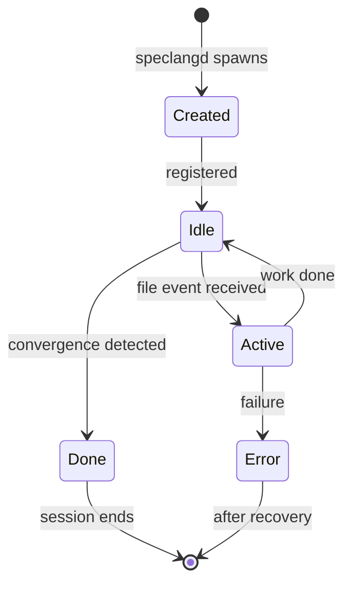

# speclang-header lines:5
# id: @specs/skills
# version: 1.0.0
# layer: 5


# SIP 56: Agent Sessions

**Status:** Draft  
**Version:** 0.1.0  
**Author:** Speclang Core Team

## README

This SIP defines agent session lifecycle and state persistence.

### Quick Start

1. **Create:** speclangd spawns agent session
2. **Active:** Session processes file events
3. **Idle:** Between events
4. **Done:** Convergence detected
5. **Persist:** State saved to SQLite

### Example

```
POST /session/create
  body: { agent: "spec-writer", owns: ["specs/**/*.spec.*"] }
  response: { session_id: "sess-001" }

GET /session/sess-001/status
  response: { status: "active", files: [...], last_active: "2024-01-15T10:30:00Z" }
```

### Key Concepts

- **Session:** Active agent instance
- **Ownership:** Files session can write
- **Lifecycle:** Created → Idle → Active → Done
- **State:** Persisted in SQLite

### When to Read This

- **Understanding sessions:** How agents work
- **Debugging:** Session state issues
- **Implementation:** Building agents

### Related SIPs

- SIP 6: Agent Protocol
- SIP 55: Cascade Triggers
- SIP 10: Daemon

## Abstract

This SIP defines the agent session system for Speclang. Sessions represent active agent instances with defined file ownership, lifecycle states, and persistent state management.

## Motivation

Agents need:
- Isolated execution context
- Defined file ownership
- State persistence
- Lifecycle management
- Error recovery

## Rationale

**Session Model:**

```
Session = Agent + Ownership + State + Lifecycle
```

**Benefits:**
- Clear ownership boundaries
- Concurrent execution
- State recovery
- Error isolation
- Audit trail

## Specification

### Session Entity

**@protocol/session:**

```yaml
AgentSession:
  id: String                    # unique session ID
  agent: AgentKind              # type of agent
  owns: FilePattern[]           # files this session can write
  created: DateTime
  last_active: DateTime
  status: idle | active | done | error
  
AgentKind:
  - orchestrator    # user's primary AI
  - spec-writer     # expands specs
  - code-gen        # generates code
  - test-writer     # writes tests
  - back-sync       # syncs code to spec
```

### Session Lifecycle

**@protocol/session-lifecycle:**



**State Transitions:**

| From | To | Trigger |
|------|-----|---------|
| Created | Idle | Registration complete |
| Idle | Active | File event received |
| Active | Idle | Work complete |
| Idle | Done | Convergence detected |
| Active | Error | Failure occurred |

### Session API

**@protocol/session-api:**

```yaml
SessionAPI:
  base_url: http://localhost:{port}
  
  endpoints:
    POST /session/create:
      body: { agent, owns }
      response: { session_id }
      
    GET /session/{id}/status:
      response: { status, files, last_active }
      
    POST /session/{id}/event:
      body: { kind, path, details }
      response: { accepted }
      
    DELETE /session/{id}:
      response: { ok }
```

### Session Creation

```python
def create_session(agent_kind, owns):
    session = AgentSession(
        id=generate_id(),
        agent=agent_kind,
        owns=owns,
        created=now(),
        last_active=now(),
        status='idle'
    )
    
    # Persist to SQLite
    db.insert('sessions', session)
    
    # Register with daemon
    daemon.register(session)
    
    return session
```

### Session Ownership

**Ownership Rules:**

```yaml
OwnershipRules:
  - No two agents write same file
  - Ownership defined by glob patterns
  - Patterns registered at session creation
  - Changes require session restart
  
  examples:
    orchestrator:
      owns: ["project.scl", "*.md"]
      
    spec-writer:
      owns: ["specs/**/*.spec.*", "specs/**/*.scl"]
      
    code-gen:
      owns: ["generated/**/*", "*.go.spec"]
      
    test-writer:
      owns: ["tests/**/*", "*.test.spec.*"]
```

**Ownership Validation:**

```python
def can_write(session, file_path):
    for pattern in session.owns:
        if match(pattern, file_path):
            return True
    return False

def validate_write(session, file_path):
    if not can_write(session, file_path):
        raise AccessDenied(
            f"Session {session.id} cannot write {file_path}"
        )
```

### Concurrency Model

**@protocol/concurrency:**

```yaml
ConcurrencyModel:
  description: "Multiple agents run concurrently, one per file"
  
  guarantees:
    - No two agents write same file
    - Reads are always allowed
    - Writes are serialized per file
    - Agents can read while another writes
    
  limits:
    - max_concurrent_agents: 50
    - max_file_changes_per_cascade: 100
```

### State Persistence

**SQLite Schema:**

```sql
CREATE TABLE sessions (
  id TEXT PRIMARY KEY,
  agent TEXT NOT NULL,
  owns JSON NOT NULL,
  created TEXT NOT NULL,
  last_active TEXT NOT NULL,
  status TEXT NOT NULL,
  cascade_id TEXT,
  metadata JSON
);

CREATE TABLE session_events (
  id INTEGER PRIMARY KEY,
  session_id TEXT NOT NULL,
  kind TEXT NOT NULL,
  file_path TEXT,
  details JSON,
  timestamp TEXT NOT NULL,
  FOREIGN KEY (session_id) REFERENCES sessions(id)
);
```

**State Recovery:**

```python
def recover_session(session_id):
    session = db.get('sessions', session_id)
    
    if session is None:
        raise SessionNotFound(session_id)
        
    if session.status == 'error':
        # Attempt recovery
        events = db.query(
            'SELECT * FROM session_events WHERE session_id = ? ORDER BY timestamp',
            [session_id]
        )
        last_good_state = find_last_good_state(events)
        return restore_state(session, last_good_state)
        
    return session
```

### Error Handling

**@protocol/errors:**

```yaml
AgentError:
  types:
    - AccessDenied: tried to write non-owned file
    - LockTimeout: couldn't acquire lock
    - SessionNotFound: invalid session ID
    - AgentTimeout: agent didn't respond
    
  recovery:
    - log error to .speclang/errors/
    - notify orchestrator if critical
    - retry with backoff for transient errors
    - abort session after max retries
```

**Error Recovery:**

```python
def handle_error(session, error):
    log_error(session, error)
    
    if error.is_transient():
        retry_with_backoff(session, error)
    elif error.is_critical():
        notify_orchestrator(session, error)
        abort_session(session)
    else:
        mark_session_error(session, error)
```

### Metadata-Based Behavior

**@protocol/metadata-behavior:**

```yaml
MetadataBehavior:
  description: "Agent behavior influenced by spec metadata"
  
  fields:
    project_level:
      - POC/MVP → more human oversight
      - Production+ → more autonomy
      
    agent_support:
      - human_only → read-only access
      - agent_assisted → write with approval
      - agent_autonomous → full write/deploy
      
    layer:
      - Determines detail level to add
```

**@protocol/metadata-routing:**

```yaml
MetadataRouting:
  session_behavior:
    - Agents check project_level and agent_support
    - Adjust interaction style based on metadata
    - Request human approval when required
    
  ownership_transfer:
    - During maturity transitions, ownership may transfer
    - agent_assisted → agent_autonomous transfers from human to agent
    
  resource_allocation:
    - Higher project_level gets more resources
    - agent_autonomous specs get priority routing
```

## Configuration

**project.scl:**

```yaml
config:
  sessions:
    max_concurrent: 50
    timeout: 300  # seconds
    retry_limit: 3
    retry_backoff: 5  # seconds
    
  agents:
    orchestrator:
      owns: ["project.scl", "*.md"]
      timeout: 600
      
    spec-writer:
      owns: ["specs/**/*.spec.*", "specs/**/*.scl"]
      timeout: 300
      
    code-gen:
      owns: ["generated/**/*", "*.go.spec"]
      timeout: 180
```

## Implementation

### Session Manager

```python
class SessionManager:
    def __init__(self, db, config):
        self.db = db
        self.config = config
        self.sessions = {}
        
    def create(self, agent_kind, owns):
        if len(self.sessions) >= self.config.max_concurrent:
            raise TooManySessions()
            
        session = AgentSession(
            id=generate_id(),
            agent=agent_kind,
            owns=owns,
            created=now(),
            status='idle'
        )
        
        self.db.insert('sessions', session)
        self.sessions[session.id] = session
        return session
        
    def get(self, session_id):
        if session_id in self.sessions:
            return self.sessions[session_id]
        return self.recover(session_id)
        
    def update_status(self, session_id, status):
        session = self.get(session_id)
        session.status = status
        session.last_active = now()
        self.db.update('sessions', session)
        
    def delete(self, session_id):
        self.db.delete('sessions', session_id)
        del self.sessions[session_id]
```

### Event Processing

```python
class SessionEventProcessor:
    def process(self, session, event):
        # Update status
        session_manager.update_status(session.id, 'active')
        
        # Log event
        self.log_event(session, event)
        
        # Validate ownership
        self.validate_ownership(session, event.file)
        
        # Process based on agent type
        result = self.dispatch(session, event)
        
        # Update status
        session_manager.update_status(session.id, 'idle')
        
        return result
        
    def log_event(self, session, event):
        db.insert('session_events', {
            'session_id': session.id,
            'kind': event.kind,
            'file_path': event.file,
            'details': event.details,
            'timestamp': now()
        })
```

## Debugging

**Commands:**

```bash
# List active sessions
speclang session list

# Show session details
speclang session show sess-001

# View session events
speclang session events sess-001

# Force session termination
speclang session kill sess-001
```

**Log Output:**

```
2024-01-15T10:30:00Z [SESSION] created sess-001 agent=spec-writer
2024-01-15T10:30:01Z [SESSION] status sess-001 idle → active
2024-01-15T10:30:05Z [SESSION] event sess-001 file.edited specs/auth.scl
2024-01-15T10:30:10Z [SESSION] status sess-001 active → idle
2024-01-15T10:30:37Z [SESSION] done sess-001
```

## References

- SIP 6: Agent Protocol
- SIP 55: Cascade Triggers
- SIP 10: Daemon
- SIP 54: SQLite Schema

## Copyright

This document is in the public domain.
