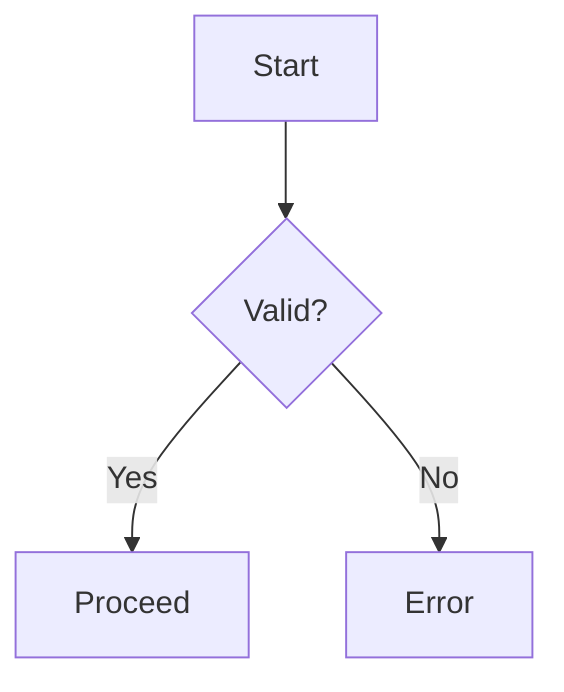
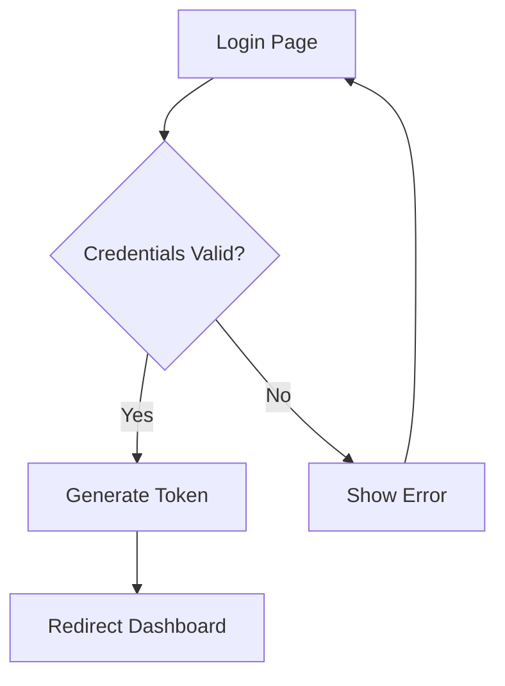
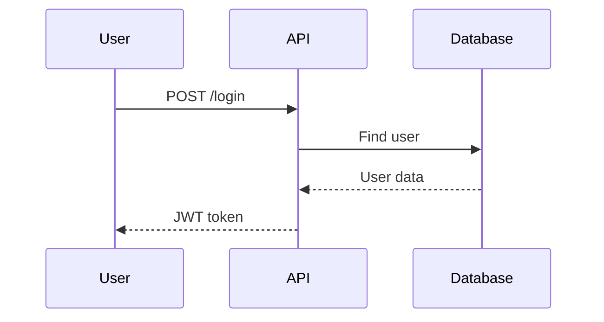
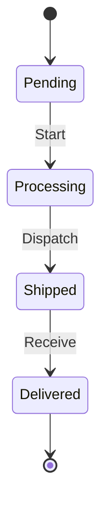
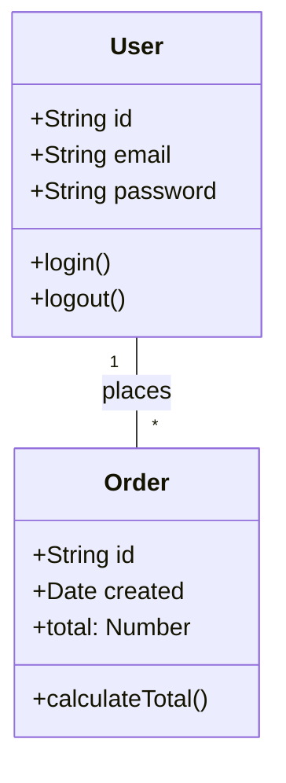

# speclang-header lines:5
# id: @specs/skills
# version: 1.0.0
# layer: 5


# SIP 84: Mermaid Diagram Lens

**Status:** Draft  
**Version:** 0.1.0  
**Author:** Spe## README

Thisclang Core Team

 SIP defines the Mermaid Diagram Lens—parsing and rendering of Mermaid diagrams within spec blocks.

### Quick Start

```markdown
### @block:auth-flow @kind:diagram


```

### When to Read This

- **Diagrams**: Flowcharts, sequence, class, state diagrams
- **Visual specs**: Architecture and flow documentation
- **Auto-generation**: Converting prose to diagrams

### Related SIPs

- SIP 35: Lenses System
- SIP 3: Block System
- SIP 4: Reference System

## Abstract

This SIP defines the Mermaid Diagram Lens—a specialized lens for parsing and rendering Mermaid diagrams within SpecLang blocks. The lens supports flowchart, sequence, class, state, ER, and journey diagram types.

## Motivation

Diagrams communicate structure and flow better than text:
- Architecture visualization
- Process flows
- Sequence of operations
- State machines

Mermaid provides text-to-diagram conversion that is version-controllable.

## Rationale

**Why Mermaid:**
- Text-based, version-controllable
- Wide tool support
- Parsable, transformable
- Multiple diagram types

## Specification

### Lens Definition

**@lens/definition:**

```yaml
MermaidLens:
  name: "mermaid"
  kind_marker: "@kind:diagram"
  detector: "content.includes('```mermaid')"
  priority: 10
```

### Supported Diagram Types

**@lens/diagram_types:**

| Type | Syntax | Purpose |
|------|--------|---------|
| flowchart | `flowchart TD` | Process flows |
| sequence | `sequenceDiagram` | Interactions |
| class | `classDiagram` | UML classes |
| state | `stateDiagram` | State machines |
| er | `erDiagram` | Entity relationships |
| journey | `journey` | User journeys |
| gantt | `gantt` | Timelines |
| pie | `pie` | Pie charts |
| mindmap | `mindmap` | Mind maps |

### Block Format

**@lens/format:**

```yaml
block:
  id: "@block:example"
  kind: "diagram"
  
  diagram_lens:
    type: flowchart
    direction: TD|BT|LR|RL
    content: |
      A[Node] --> B{Decision}
      B -->|Yes| C[Result]
      B -->|No| D[Alternative]
```

### Parsing

**@lens/parsing:**

```typescript
interface MermaidBlock {
  kind: 'diagram';
  diagramType: string;
  direction?: 'TD' | 'BT' | 'LR' | 'RL';
  content: string;
  nodes: DiagramNode[];
  edges: DiagramEdge[];
}

interface DiagramNode {
  id: string;
  label: string;
  shape: 'rectangle' | 'diamond' | 'circle' | 'stadium' | 'hexagon' | 'parallelogram';
}

interface DiagramEdge {
  from: string;
  to: string;
  label?: string;
  style: 'solid' | 'dashed' | 'dotted';
}
```

### Parsing Algorithm

**@lens/algorithm:**

```typescript
function parseMermaid(content: string): MermaidBlock {
  const match = content.match(/```mermaid\s*([\s\S]*?)```/);
  if (!match) throw new Error('No mermaid code block found');
  
  const diagramText = match[1].trim();
  const lines = diagramText.split('\n');
  
  const firstLine = lines[0].trim();
  const typeMatch = firstLine.match(/(flowchart|sequenceDiagram|classDiagram|stateDiagram|erDiagram|journey|gantt|pie|mindmap)/);
  
  const diagramType = typeMatch ? typeMatch[1] : 'flowchart';
  
  let direction: string | undefined;
  if (diagramType === 'flowchart') {
    const dirMatch = firstLine.match(/(TD|BT|LR|RL)/);
    direction = dirMatch ? dirMatch[1] : 'TD';
  }
  
  const body = lines.slice(1).join('\n');
  const { nodes, edges } = parseDiagramBody(diagramType, body);
  
  return {
    kind: 'diagram',
    diagramType,
    direction,
    content: body,
    nodes,
    edges,
  };
}
```

### Node Shape Detection

**@lens/nodes:**

```typescript
const nodeShapes: Record<string, string[]> = {
  rectangle: ['[', ']'],
  diamond: ['{', '}'],
  circle: ['(', ')'],
  stadium: ['[', ']'],
  hexagon: ['[', ']'],
  parallelogram: ['[/', '/]'],
};

function parseNodes(lines: string[]): DiagramNode[] {
  const nodes: DiagramNode[] = [];
  const nodePattern = /(\w+)\[([^\]]+)\]/g;
  const diamondPattern = /(\w+)\{([^}]+)\}/g;
  const circlePattern = /(\w+)\(([^)]+)\)/g;
  
  for (const line of lines) {
    let match;
    while ((match = nodePattern.exec(line)) !== null) {
      nodes.push({ id: match[1], label: match[2], shape: 'rectangle' });
    }
    while ((match = diamondPattern.exec(line)) !== null) {
      nodes.push({ id: match[1], label: match[2], shape: 'diamond' });
    }
    while ((match = circlePattern.exec(line)) !== null) {
      nodes.push({ id: match[1], label: match[2], shape: 'circle' });
    }
  }
  
  return nodes;
}
```

### Edge Parsing

**@lens/edges:**

```typescript
function parseEdges(lines: string[]): DiagramEdge[] {
  const edges: DiagramEdge[] = [];
  const edgePattern = /(\w+)\s*(--?|-->|===|==>)\s*(?:\|([^|]+)\|)?\s*(\w+)/g;
  
  for (const line of lines) {
    let match;
    while ((match = edgePattern.exec(line)) !== null) {
      edges.push({
        from: match[1],
        to: match[4],
        label: match[3],
        style: match[2].includes('-.') ? 'dotted' : 
               match[2].includes('==') ? 'dashed' : 'solid',
      });
    }
  }
  
  return edges;
}
```

### Rendering

**@lens/rendering:**

```typescript
function renderMermaid(block: MermaidBlock): string {
  const lines: string[] = ['```mermaid'];
  
  if (block.diagramType === 'flowchart') {
    lines.push(`flowchart ${block.direction || 'TD'}`);
  } else {
    lines.push(block.diagramType);
  }
  
  for (const node of block.nodes) {
    const shape = nodeShapesReverse[node.shape];
    lines.push(`${node.id}${shape[0]}${node.label}${shape[1]}`);
  }
  
  for (const edge of block.edges) {
    const arrow = edge.style === 'dotted' ? '-.->' : 
                  edge.style === 'dashed' ? '==>' : '-->';
    if (edge.label) {
      lines.push(`${edge.from} ${arrow} |${edge.label}| ${edge.to}`);
    } else {
      lines.push(`${edge.from} ${arrow} ${edge.to}`);
    }
  }
  
  lines.push('```');
  return lines.join('\n');
}
```

### Validation Rules

**@lens/validation:**

```yaml
ValidationRules:
  - name: valid_mermaid_syntax
    description: "Diagram must parse as valid Mermaid"
    check: parseMermaid(content)
    
  - name: required_diagram_type
    description: "Must specify diagram type"
    check: diagramType in validTypes
    
  - name: unique_node_ids
    description: "Node IDs must be unique"
    check: nodes.length == unique(nodes).length
    
  - name: referenced_nodes_exist
    description: "All edge endpoints must be defined"
    check: edge.from in nodes && edge.to in nodes
```

### AI Behavior

**@lens/ai:**

```yaml
AIBehavior:
  auto_detection:
    - "Detects ```mermaid blocks"
    - "Identifies diagram type from syntax"
    - "Extracts nodes and edges"
    
  generation:
    - "Generates mermaid from prose"
    - "Converts to different diagram types"
    - "Optimizes layout"
    
  transformation:
    - "Flowchart <-> Sequence diagram"
    - "Adds labels to unlabeled edges"
    - "Simplifies complex diagrams"
```

## Examples

### Example 1: Flowchart

**@example/flowchart:**

```markdown
### @block:user-auth @kind:diagram


```

**Parsed:**
```yaml
block:
  id: "@block:user-auth"
  kind: "diagram"
  diagramType: "flowchart"
  direction: "TD"
  nodes:
    - { id: "A", label: "Login Page", shape: "rectangle" }
    - { id: "B", label: "Credentials Valid?", shape: "diamond" }
    - { id: "C", label: "Generate Token", shape: "rectangle" }
    - { id: "D", label: "Show Error", shape: "rectangle" }
    - { id: "E", label: "Redirect Dashboard", shape: "rectangle" }
  edges:
    - { from: "A", to: "B", style: "solid" }
    - { from: "B", to: "C", label: "Yes", style: "solid" }
    - { from: "B", to: "D", label: "No", style: "solid" }
    - { from: "C", to: "E", style: "solid" }
    - { from: "D", to: "A", style: "solid" }
```

### Example 2: Sequence Diagram

**@example/sequence:**

```markdown
### @block:api-call @kind:diagram


```

### Example 3: State Diagram

**@example/state:**

```markdown
### @block:order-state @kind:diagram


```

### Example 4: Class Diagram

**@example/class:**

```markdown
### @block:models @kind:diagram


```

## Implementation

### Mermaid Parser

```typescript
export class MermaidLens implements Lens {
  name = 'mermaid';
  
  detect(content: string): boolean {
    return content.includes('```mermaid');
  }
  
  parse(content: string): MermaidBlock {
    return parseMermaid(content);
  }
  
  render(block: MermaidBlock): string {
    return renderMermaid(block);
  }
  
  validate(block: MermaidBlock): ValidationResult {
    const errors: string[] = [];
    
    try {
      parseMermaid(renderMermaid(block));
    } catch (e) {
      errors.push(`Invalid mermaid: ${e.message}`);
    }
    
    return { valid: errors.length === 0, errors };
  }
}
```

### Node Extraction

```typescript
export function extractNodes(diagramText: string): DiagramNode[] {
  const nodes: DiagramNode[] = [];
  
  const patterns = [
    { regex: /(\w+)\[([^\]]+)\]/, shape: 'rectangle' },
    { regex: /(\w+)\{([^}]+)\}/, shape: 'diamond' },
    { regex: /(\w+)\(([^)]+)\)/, shape: 'circle' },
    { regex: /(\w+)\[([^)]+\)\]/, shape: 'stadium' },
  ];
  
  for (const { regex, shape } of patterns) {
    let match;
    while ((match = regex.exec(diagramText)) !== null) {
      nodes.push({
        id: match[1],
        label: match[2],
        shape,
      });
    }
  }
  
  return nodes;
}
```

### Render to SVG

```typescript
import mermaid from 'mermaid';

mermaid.initialize({
  startOnLoad: false,
  theme: 'default',
  flowchart: { curve: 'basis' },
});

export async function renderToSVG(mermaidCode: string): Promise<string> {
  const id = `mermaid-${Date.now()}`;
  const { svg } = await mermaid.render(id, mermaidCode);
  return svg;
}
```

## References

- @ref:sip-035-lenses
- @ref:speclang/lenses/diagram
- @ref:speclang/lenses/mermaid

## Copyright

This document is in the public domain.
