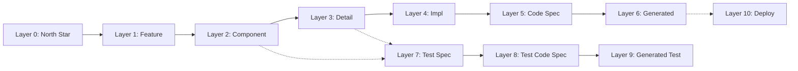

# speclang-header lines:5
# id: @specs/skills
# version: 1.0.0
# layer: 5


# SIP 89: Layers Overview

**Status:** Draft  
**Version:** 0.1.0  
**Author:** Speclang Core Team

## README

This SIP provides a high-level overview of the layer system for organizing specs.

### Quick Start

Layers 0-10 represent abstraction levels:
- **0:** North Star (intent)
- **1-3:** Feature → Component → Detail
- **4-5:** Implementation → Code Spec
- **6:** Generated Code
- **7-9:** Test Specs
- **10:** Deployment/Ops

### When to Read This

- Understanding spec organization
- Choosing correct layer for new specs
- Navigating spec hierarchy

### Related SIPs

- SIP 17: Layer Definitions
- SIP 90: Abstraction Concepts

## Abstract

This SIP provides an overview of the layer system. The layer field (0-10) defines abstraction depth in SpecLang specs. Lower layers are abstract and high-level; higher layers are concrete and implementation-specific.

## Motivation

SpecLang needs a layered approach to:
- Organize specs by abstraction level
- Enable agent specialization by layer
- Validate spec completeness progression
- Support parallel development at different depths

## Layer Hierarchy

### Conceptual Model

```
Layer 0  ┌─────────────────────────────────────┐
         │  North Star                         │
         │  Project intent, vision, goals     │
Layer 1  ├─────────────────────────────────────┤
         │  Feature                            │
         │  User stories, use cases           │
Layer 2  ├─────────────────────────────────────┤
         │  Component                          │
         │  Entities, interfaces              │
Layer 3  ├─────────────────────────────────────┤
         │  Detail                             │
         │  Algorithms, pseudocode            │
Layer 4  ├─────────────────────────────────────┤
         │  Implementation                     │
         │  Language constructs                │
Layer 5  ├─────────────────────────────────────┤
         │  Code Spec                          │
         │  Direct code mapping                │
Layer 6  ├─────────────────────────────────────┤
         │  Generated Code                     │
         │  Output code                        │
Layer 7  ├─────────────────────────────────────┤
         │  Test Spec                          │
         │  Test descriptions                 │
Layer 8  ├─────────────────────────────────────┤
         │  Test Code Spec                     │
         │  Test code mapping                  │
Layer 9  ├─────────────────────────────────────┤
         │  Generated Test                     │
         │  Test code output                   │
Layer 10 └─────────────────────────────────────┘
         │  Deployment/Ops                      │
           Infrastructure, config
```

### Layer Categories

| Category | Layers | Purpose |
|----------|--------|---------|
| Strategic | 0 | Vision and goals |
| Design | 1-3 | Feature to detail |
| Implementation | 4-6 | Code generation |
| Validation | 7-9 | Testing |
| Operations | 10 | Deployment |

## Layer Relationships

### Parent-Child Rules

```yaml
ParentChildRules:
  - "Child spec layer >= parent layer"
  - "Sibling specs can have same or adjacent layers"
  - "depends_on implies layer relationship"

ValidProgression:
  - "layer 0 → layer 1 (feature breakdown)"
  - "layer 1 → layer 2 (component definition)"
  - "layer 2 → layer 3 (detail design)"
  - "layer 3 → layer 4 (implementation mapping)"
  - "layer 4 → layer 5 (code spec)"
  - "layer 5 → layer 6 (generated code)"
```

### Cross-Layer References

```yaml
CrossLayerReferences:
  - "@ref:specs/auth (layer 1) → entities at layer 2"
  - "Implementation (layer 4) → references Detail (layer 3)"
  - "Code Spec (layer 5) → references Implementation (layer 4)"
  - "Tests (layer 7) → references Feature (layer 1)"
```

## Agent Layer Ownership

### By Role

| Agent Role | Layers | Primary Focus |
|------------|--------|----------------|
| spec-writer | 0-3 | Design and architecture |
| code-gen | 4-6 | Implementation and code |
| test-writer | 7-9 | Validation and testing |
| ops-agent | 10 | Deployment and operations |

### Agent Behavior by Layer

```yaml
AgentBehavior:
  Layer0_1:
    - "Focus on high-level intent"
    - "Clarify requirements"
    - "Ensure completeness of vision"
    
  Layer2_3:
    - "Detailed design work"
    - "Technical accuracy"
    - "Interface contracts"
    
  Layer4_5:
    - "Code generation"
    - "Language-specific patterns"
    - "Best practices enforcement"
    
  Layer7_9:
    - "Test coverage"
    - "Edge cases"
    - "Validation scenarios"
    
  Layer10:
    - "Infrastructure as code"
    - "Configuration management"
    - "Deployment automation"
```

## Validation

### Layer Consistency Rules

```yaml
LayerValidation:
  rules:
    - "Child layer >= parent layer"
    - "Code generation requires implementation spec"
    - "Test specs should reference feature/component specs"
    - "Deployment specs should reference all dependent layers"
    
  errors:
    - "Layer violation: child {layer} < parent {layer}"
    - "Missing implementation: layer {n} without layer {n-1}"
    - "Orphaned spec: no parent or depends_on reference"
```

## Examples

### Typical Project Structure

```
project.scl                    (layer 0)
├── auth.spec.md               (layer 1)
│   ├── auth/entities.spec.yaml    (layer 2)
│   ├── auth/login.spec.yaml       (layer 3)
│   ├── auth/login-impl.spec.yaml   (layer 4)
│   ├── auth/login.go.spec          (layer 5)
│   └── generated/go/auth/login.go  (layer 6)
├── users.spec.md              (layer 1)
│   ├── users/entities.spec.yaml   (layer 2)
│   └── ...
└── tests/
    ├── auth/login.test.spec.md     (layer 7)
    └── auth/login.test.go.spec     (layer 8)
```

### Layer Flow



## Summary

The layer system provides:
1. **Organization:** Clear hierarchy from intent to deployment
2. **Specialization:** Agents own specific layer ranges
3. **Validation:** Rules ensure proper layer relationships
4. **Progression:** Projects evolve through layers

See SIP 17 for detailed layer definitions and SIP 90 for abstraction concepts.

## References

- @ref:speclang/layers
- @ref:speclang/layers/overview
- @ref:speclang/layers/definitions
- SIP 17: Layer Definitions
- SIP 90: Abstraction Concepts
- SIP 91-93: Maturity Levels

## Copyright

This document is in the public domain.
