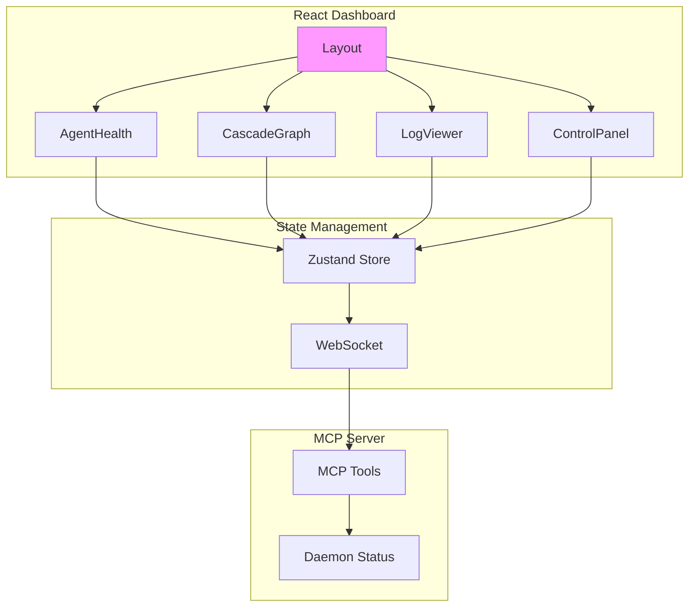

# UI Dashboard Module Spec

This spec defines the React UI dashboard components for SpecLang system monitoring.

## Overview

### @block:overview @kind:note
The dashboard provides real-time visualization of the SpecLang system:

- Agent health and status
- Cascade execution graphs
- Log streaming and filtering
- Configuration management

## Architecture

### @block:architecture @kind:diagram


## Components

### @block:components/layout @kind:interface
```typescript
interface DashboardLayout {
  sidebar: {
    width: number;
    collapsible: boolean;
    items: NavItem[];
  };
  header: {
    height: number;
    title: string;
    actions: HeaderAction[];
  };
  main: {
    padding: number;
    grid: GridConfig;
  };
}

interface NavItem {
  id: string;
  label: string;
  icon: string;
  path: string;
  badge?: number;
}

interface HeaderAction {
  id: string;
  label: string;
  handler: () => void;
}
```

### @block:components/agent-health @kind:interface
```typescript
interface AgentHealthProps {
  agents: Agent[];
  refreshInterval: number;
  onAgentClick?: (agentId: string) => void;
}

interface Agent {
  id: string;
  name: string;
  status: 'active' | 'idle' | 'error' | 'offline';
  lastSeen: Date;
  tasks: number;
  cpu: number;
  memory: number;
}
```

### @block:components/cascade-graph @kind:interface
```typescript
interface CascadeGraphProps {
  cascadeId: string;
  nodes: GraphNode[];
  edges: GraphEdge[];
  onNodeClick?: (nodeId: string) => void;
  onZoom?: (level: number) => void;
}

interface GraphNode {
  id: string;
  label: string;
  type: 'spec' | 'code' | 'test' | 'pipeline';
  status: 'pending' | 'running' | 'complete' | 'failed';
  layer: number;
  x?: number;
  y?: number;
}

interface GraphEdge {
  source: string;
  target: string;
  type: 'depends-on' | 'triggers' | 'generates';
}
```

### @block:components/log-viewer @kind:interface
```typescript
interface LogViewerProps {
  logs: LogEntry[];
  filters: LogFilter[];
  onFilterChange?: (filter: LogFilter) => void;
  onExport?: () => void;
}

interface LogEntry {
  timestamp: Date;
  level: 'debug' | 'info' | 'warn' | 'error';
  source: string;
  message: string;
  metadata?: Record<string, unknown>;
}

interface LogFilter {
  level: LogEntry['level'][];
  sources: string[];
  search: string;
  timeRange?: {
    start: Date;
    end: Date;
  };
}
```

### @block:components/control-panel @kind:interface
```typescript
interface ControlPanelProps {
  daemonStatus: DaemonStatus;
  onStartDaemon: () => void;
  onStopDaemon: () => void;
  onRestartDaemon: () => void;
  onEditConfig: (config: Config) => void;
  onSaveConfig: () => void;
}

interface DaemonStatus {
  running: boolean;
  pid?: number;
  uptime: number;
  version: string;
  port: number;
}

interface Config {
  watchPaths: string[];
  cascadeInterval: number;
  logLevel: string;
  plugins: string[];
}
```

## Layout Wireframes

### @block:layouts/main @kind:wireframe
```
┌─────────────────────────────────────────────────────────────┐
│  SpecLang Dashboard                            [Settings]  │
├────────┬────────────────────────────────────────────────────┤
│        │                                                    │
│ [Nav]  │  ┌─────────────────────────────────────────────┐  │
│        │  │         Agent Health Status                 │  │
│ ● Home │  │  ● Agent-1  ● Agent-2  ● Agent-3  ● Agent-4  │  │
│ ○ Logs │  └─────────────────────────────────────────────┘  │
│ ○ Graph│                                                    │
│ ○ Ctrl │  ┌─────────────────────────────────────────────┐  │
│        │  │         Cascade Execution Graph             │  │
│        │  │                                             │  │
│        │  │    [Interactive D3.js visualization]       │  │
│        │  │                                             │  │
│        │  └─────────────────────────────────────────────┘  │
│        │                                                    │
│        │  ┌─────────────────────────────────────────────┐  │
│        │  │         Live Log Stream                      │  │
│        │  │  08:36:15 [INFO] Cascade started             │  │
│        │  │  08:36:16 [INFO] Parsing spec...             │  │
│        │  │  08:36:17 [DEBUG] Validating references      │  │
│        │  └─────────────────────────────────────────────┘  │
│        │                                                    │
└────────┴────────────────────────────────────────────────────┘
```

### @block:layouts/control @kind:wireframe
```
┌─────────────────────────────────────────────────────────────┐
│  Control Panel                                  [Save] [↺] │
├────────┬────────────────────────────────────────────────────┤
│        │  ┌─────────────────────────────────────────────┐  │
│ [Nav]  │  │ Daemon Status: ● RUNNING (PID: 12345)      │  │
│        │  │ Uptime: 2h 34m | Version: v0.1.0           │  │
│ ● Home │  └─────────────────────────────────────────────┘  │
│ ○ Logs │                                                    │
│ ○ Graph│  ┌─────────────────────────────────────────────┐  │
│ ○ Ctrl │  │ Configuration                                │  │
│        │  │ ┌─────────────────────────────────────────┐  │  │
│        │  │ │ Watch Paths:                             │  │  │
│        │  │ │   □ specs/  □ src/  □ tests/            │  │  │
│        │  │ └─────────────────────────────────────────┘  │  │
│        │  │ ┌─────────────────────────────────────────┐  │  │
│        │  │ │ Cascade Interval: [30] seconds         │  │  │
│        │  │ └─────────────────────────────────────────┘  │  │
│        │  │ ┌─────────────────────────────────────────┐  │  │
│        │  │ │ Log Level:  ○ Debug  ● Info  ○ Warn     │  │  │
│        │  │ └─────────────────────────────────────────┘  │  │
│        │  └─────────────────────────────────────────────┘  │
│        │                                                    │
└────────┴────────────────────────────────────────────────────┘
```

## State Management

### @block:state/store @kind:interface
```typescript
interface DashboardStore {
  // Agents
  agents: Agent[];
  selectedAgent: string | null;
  
  // Cascade
  currentCascade: Cascade | null;
  cascadeHistory: Cascade[];
  
  // Logs
  logs: LogEntry[];
  logFilters: LogFilter[];
  
  // Daemon
  daemonStatus: DaemonStatus;
  config: Config;
  
  // UI State
  sidebarCollapsed: boolean;
  activeView: 'home' | 'logs' | 'graph' | 'control';
  
  // Actions
  refreshAgents: () => Promise<void>;
  refreshCascade: () => Promise<void>;
  refreshLogs: () => Promise<void>;
  updateConfig: (config: Partial<Config>) => void;
}
```

## Real-time Updates

### @block:realtime/protocol @kind:note
Real-time updates via WebSocket connection to MCP server:

1. **Subscribe** to events: `tools/subscribe`
2. **Events received:**
   - `agent:status` - Agent status changes
   - `cascade:start` - Cascade execution started
   - `cascade:progress` - Node completion
   - `cascade:complete` - Cascade finished
   - `log:entry` - New log entry
   - `daemon:status` - Daemon status change
3. **Heartbeat** every 30 seconds

## Styling

### @block:styling/theme @kind:note
- **Color Palette:**
  - Primary: `#6366f1` (Indigo)
  - Success: `#22c55e` (Green)
  - Warning: `#f59e0b` (Amber)
  - Error: `#ef4444` (Red)
  - Background: `#0f172a` (Dark slate)
  - Surface: `#1e293b` (Slate)
  - Text: `#f8fafc` (Light)

- **Typography:**
  - Font: Inter, system-ui
  - Headings: 600 weight
  - Body: 400 weight

- **Spacing:**
  - Base unit: 4px
  - Margins: 16px, 24px, 32px
  - Padding: 8px, 12px, 16px

## Acceptance Criteria

### @block:acceptance @kind:criteria
- [ ] Dashboard renders with all four main components
- [ ] Agent health shows real-time status
- [ ] Cascade graph visualizes execution flow
- [ ] Log viewer streams and filters logs
- [ ] Control panel starts/stops daemon
- [ ] Configuration editing works
- [ ] WebSocket real-time updates function
- [ ] Responsive layout on mobile/tablet/desktop
- [ ] Dark theme applied consistently

## Dependencies

### @block:dependencies @kind:table
| Dependency | Purpose | Version |
|------------|---------|---------|
| React | UI Framework | ^18.x |
| D3.js | Graph visualization | ^7.x |
| Zustand | State management | ^4.x |
| TailwindCSS | Styling | ^3.x |
| date-fns | Date formatting | ^2.x |

---

*This spec defines the complete UI dashboard for SpecLang monitoring.*
