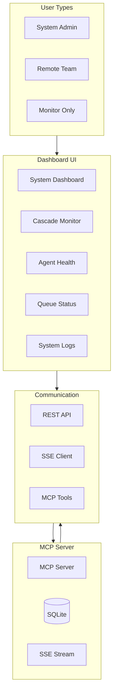
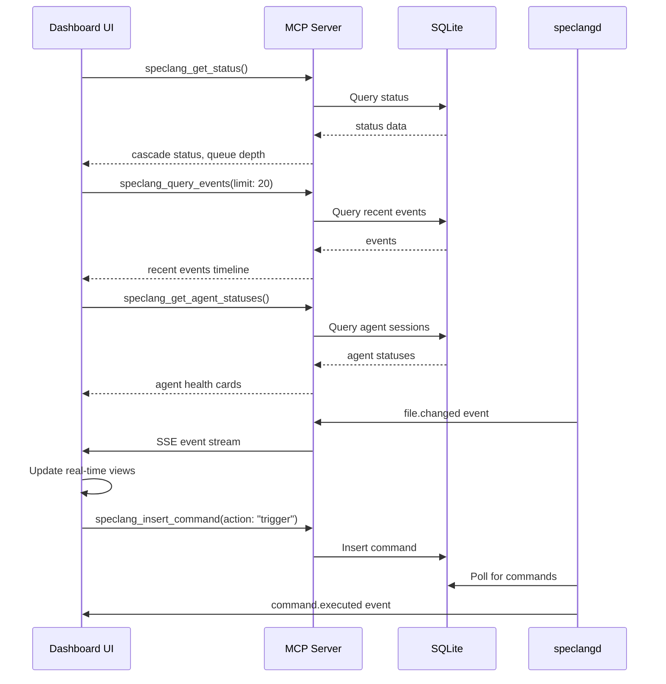

# System Dashboard Specification

Web-based monitoring and control interface for the SpecLang reactive cascade.

## Overview

```speclang
# @block:dashboard/overview @kind:note
The dashboard provides real-time visibility into the SpecLang cascade, allowing system operators to:
- Monitor agent health and activity
- Visualize cascade depth and convergence status
- View queue depth and pending commands
- Trigger manual cascades and control convergence
- Inspect system logs and error reports

Primary users: system administrators, remote teams, developers monitoring cascade health.
Complementary to OpenCode: OpenCode for editing, Dashboard for monitoring.
```

### @dashboard/architecture-overview

```speclang
# @block:dashboard/architecture-overview @kind:diagram

```

## Architecture

### @dashboard/architecture

```speclang
# @block:dashboard/architecture @kind:entity
DashboardArchitecture:
  stack:
    - framework: React 18+ with TypeScript (or lightweight alternative)
    - state_management: Zustand (lightweight)
    - routing: React Router (optional)
    - styling: Tailwind CSS + shadcn/ui components
    - realtime: EventSource (SSE) for live updates
    - charts: Recharts or similar for metrics

  communication:
    primary: MCP tools via HTTP (remote mode)
    realtime: SSE stream from MCP server for events
    polling: Periodic status updates (optional)

  deployment:
    - web: Static HTML served by MCP server (embedded)
    - standalone: Electron app for desktop (optional)
    - remote: Accessible via browser to remote MCP server
```

### @dashboard/data-flow

```speclang
# @block:dashboard/data-flow @kind:diagram

```

## Core Views

### @dashboard/views

```speclang
# @block:dashboard/views @kind:entity
DashboardViews:
  
  system_dashboard:
    purpose: Overview of system health and cascade status
    components:
      - Cascade status (active/converged)
      - Recent events timeline
      - Agent health status cards
      - Queue depth and pending commands
      - System metrics (CPU, memory, disk)
      - Action buttons (trigger cascade, finalize, pause)

  cascade_monitor:
    purpose: Real-time visualization of cascade flow
    components:
      - Graph of file dependencies (D3.js)
      - Timeline of events with playback controls
      - Depth meter and convergence indicator
      - Agent activity logs with filtering

  agent_health:
    purpose: Monitor agent health and activity
    components:
      - Agent status cards (idle, active, error)
      - Session details (current file, queue depth)
      - Performance metrics (processing time)
      - Manual agent controls (restart, pause)

  queue_status:
    purpose: View pending commands and event queue
    components:
      - Pending commands list with priorities
      - Event queue depth visualization
      - Processing rate metrics
      - Manual queue control (pause, resume, clear)

  system_logs:
    purpose: Inspect system logs and error reports
    components:
      - Real-time log viewer with filtering
      - Error severity indicators
      - Search across logs
      - Export logs for debugging
```

### @dashboard/layout-system-dashboard

```speclang
# @block:dashboard/layout-system-dashboard @kind:entity
SystemDashboardLayout:
  grid_structure: "CSS Grid with exposed 8px grid lines, defined areas: header, sidebar, main, footer"
  sections:
    header:
      height: "64px"
      position: "fixed top"
      content: "Project name, cascade indicator, convergence timer, queue depth, user controls"
      visual: "Black background, white text, 1px bottom border, grid texture"
    
    main_content:
      grid_areas: "['header header header', 'sidebar main main', 'sidebar main main']"
      responsive_behavior: "Mobile: single column; Tablet: sidebar collapses; Desktop: full grid"
      visual: "Exposed grid lines background, sharp borders between sections"
    
    sidebar:
      width: "256px"
      collapsible_behavior: "Collapses to 64px width, reveals icons only"
      visual: "Black background, 1px right border, grid texture"
  
  background: "var(--color-background) with grid texture (grid-background class)"
  decorative_elements: "Exposed grid lines overlay, diagonal crosshatch on header, red accent line on active section"
```

### @dashboard/view-system-dashboard

```speclang
# @block:dashboard/view-system-dashboard @kind:operation
render_system_dashboard():
  inputs:
    - cascade_status: from speclang_get_status
    - recent_events: from speclang_query_events(limit: 20)
    - agent_statuses: from speclang_get_agent_statuses
    - project_stats: from speclang_get_project_stats

  layout:
    top_bar:
      - project_name: from project.scl
      - cascade_indicator: green/yellow/red
      - convergence_timer: time since last change
      - queue_depth: pending commands count

    main_grid:
      left_column:
        - stats_cards: [specs_count, generated_files, tests_passed]
        - quick_actions: [trigger_cascade, finalize, pause]

      middle_column:
        - timeline_component: recent events as vertical timeline
        - queue_visualization: pending commands list

      right_column:
        - agent_health: cards for each agent type
        - system_health: CPU, memory, disk usage

  interactions:
    - click cascade_indicator: navigate to cascade monitor
    - click timeline_event: show event details modal
    - click agent_card: navigate to agent health view
    - click queue_depth: navigate to queue status view
```
