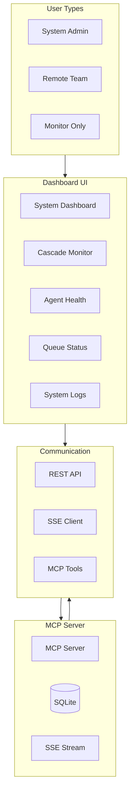
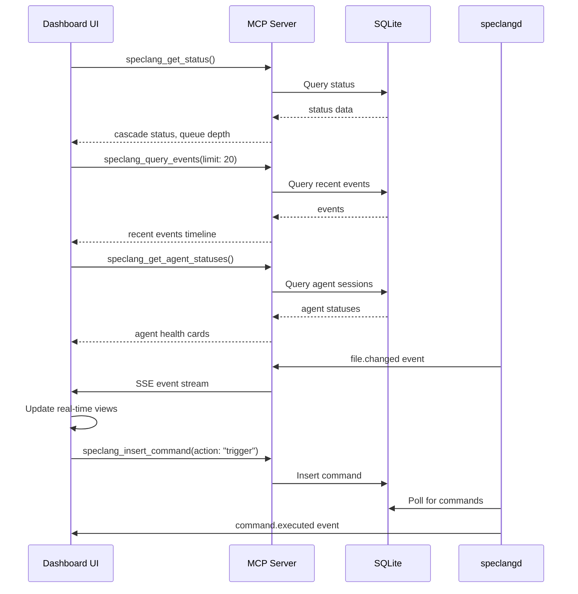

# speclang-header lines:8
id: "@speclang/ui"
version: 0.2.0
layer: 2
tags: [dashboard, monitoring, system, mcp, web]
imports: ["@speclang/cascade", "@speclang/mcp", "@speclang/agent-protocol", "@speclang/sqlite", "@speclang/mcp-ui-tools"]
status: draft
short: System monitoring dashboard for SpecLang cascade and agent health
---

# System Dashboard Specification

Web-based monitoring and control interface for the SpecLang reactive cascade.

## Overview

```speclang
# @block:dashboard/overview @kind:note
The dashboard provides real-time visibility into the SpecLang cascade, allowing system operators to:
- Monitor agent health and activity
- Visualize cascade depth and convergence status
- View queue depth and pending commands
- Trigger manual cascades and control convergence
- Inspect system logs and error reports

Primary users: system administrators, remote teams, developers monitoring cascade health.
Complementary to OpenCode: OpenCode for editing, Dashboard for monitoring.
```

### @dashboard/architecture-overview

```speclang
# @block:dashboard/architecture-overview @kind:diagram

```

## Architecture

### @dashboard/architecture

```speclang
# @block:dashboard/architecture @kind:entity
DashboardArchitecture:
  stack:
    - framework: React 18+ with TypeScript (or lightweight alternative)
    - state_management: Zustand (lightweight)
    - routing: React Router (optional)
    - styling: Tailwind CSS + shadcn/ui components
    - realtime: EventSource (SSE) for live updates
    - charts: Recharts or similar for metrics

  communication:
    primary: MCP tools via HTTP (remote mode)
    realtime: SSE stream from MCP server for events
    polling: Periodic status updates (optional)

  deployment:
    - web: Static HTML served by MCP server (embedded)
    - standalone: Electron app for desktop (optional)
    - remote: Accessible via browser to remote MCP server
```

### @dashboard/data-flow

```speclang
# @block:dashboard/data-flow @kind:diagram

```

## Core Views

### @dashboard/views

```speclang
# @block:dashboard/views @kind:entity
DashboardViews:
  
  system_dashboard:
    purpose: Overview of system health and cascade status
    components:
      - Cascade status (active/converged)
      - Recent events timeline
      - Agent health status cards
      - Queue depth and pending commands
      - System metrics (CPU, memory, disk)
      - Action buttons (trigger cascade, finalize, pause)

  cascade_monitor:
    purpose: Real-time visualization of cascade flow
    components:
      - Graph of file dependencies (D3.js)
      - Timeline of events with playback controls
      - Depth meter and convergence indicator
      - Agent activity logs with filtering

  agent_health:
    purpose: Monitor agent health and activity
    components:
      - Agent status cards (idle, active, error)
      - Session details (current file, queue depth)
      - Performance metrics (processing time)
      - Manual agent controls (restart, pause)

  queue_status:
    purpose: View pending commands and event queue
    components:
      - Pending commands list with priorities
      - Event queue depth visualization
      - Processing rate metrics
      - Manual queue control (pause, resume, clear)

  system_logs:
    purpose: Inspect system logs and error reports
    components:
      - Real-time log viewer with filtering
      - Error severity indicators
      - Search across logs
      - Export logs for debugging
```

### @dashboard/layout-system-dashboard

```speclang
# @block:dashboard/layout-system-dashboard @kind:entity
SystemDashboardLayout:
  grid_structure: "CSS Grid with exposed 8px grid lines, defined areas: header, sidebar, main, footer"
  sections:
    header:
      height: "64px"
      position: "fixed top"
      content: "Project name, cascade indicator, convergence timer, queue depth, user controls"
      visual: "Black background, white text, 1px bottom border, grid texture"
    
    main_content:
      grid_areas: "['header header header', 'sidebar main main', 'sidebar main main']"
      responsive_behavior: "Mobile: single column; Tablet: sidebar collapses; Desktop: full grid"
      visual: "Exposed grid lines background, sharp borders between sections"
    
    sidebar:
      width: "256px"
      collapsible_behavior: "Collapses to 64px width, reveals icons only"
      visual: "Black background, 1px right border, grid texture"
  
  background: "var(--color-background) with grid texture (grid-background class)"
  decorative_elements: "Exposed grid lines overlay, diagonal crosshatch on header, red accent line on active section"
```

### @dashboard/view-system-dashboard

```speclang
# @block:dashboard/view-system-dashboard @kind:operation
render_system_dashboard():
  inputs:
    - cascade_status: from speclang_get_status
    - recent_events: from speclang_query_events(limit: 20)
    - agent_statuses: from speclang_get_agent_statuses
    - project_stats: from speclang_get_project_stats

  layout:
    top_bar:
      - project_name: from project.scl
      - cascade_indicator: green/yellow/red
      - convergence_timer: time since last change
      - queue_depth: pending commands count

    main_grid:
      left_column:
        - stats_cards: [specs_count, generated_files, tests_passed]
        - quick_actions: [trigger_cascade, finalize, pause]

      middle_column:
        - timeline_component: recent events as vertical timeline
        - queue_visualization: pending commands list

      right_column:
        - agent_health: cards for each agent type
        - system_health: CPU, memory, disk usage

  interactions:
    - click cascade_indicator: navigate to cascade monitor
    - click timeline_event: show event details modal
    - click agent_card: navigate to agent health view
    - click queue_depth: navigate to queue status view


## Dashboard Components

### @ui/component-library-overview

```speclang
# @block:ui/component-library-overview @kind:note
Component library provides reusable, agent-implementable UI components for the dashboard.
Each component includes:
- TypeScript interfaces for props and state
- Event handler signatures
- Lifecycle methods
- Error boundary requirements
- Performance optimization hints
- Accessibility requirements
- Testing specifications

Components are designed for autonomous agent implementation with minimal ambiguity.
```

### @ui/component-cascade-status-card

```speclang
# @block:ui/component-cascade-status-card @kind:entity
CascadeStatusCard:
  purpose: Display current cascade status (active/converged) with depth and timing
  
  visual_design:
    layout: "Vertical stack: status indicator at top, depth meter middle, timers bottom, controls right-aligned"
    colors:
      active_state: "var(--color-accent) red border with black background"
      converged_state: "var(--color-success) green border with black background"
      warning_state: "var(--color-warning) yellow border with black background"
      error_state: "var(--color-error) red border with black background, red text"
    typography:
      title: "var(--font-display) 24px uppercase"
      metrics: "var(--font-mono) 32px bold"
      labels: "var(--font-body) 12px uppercase"
    effects:
      - "Exposed grid lines as subtle background texture"
      - "1px solid borders separating sections"
      - "No rounded corners"
    animations:
      - "Depth meter fills with linear animation over 200ms"
      - "Status border pulses (brutalist-pulse) when active"
      - "Error state blinks (brutalist-blink) 3 times"
  
  props_interface:
    ```typescript
    interface CascadeStatusCardProps {
      // Core status
      active: boolean;
      converged: boolean;
      depth: number;
      maxDepth: number;
      
      // Timing
      lastEventTime: string | null; // ISO string
      convergenceTime: string | null; // ISO string
      cascadeId: string | null;
      
      // Callbacks
      onTriggerCascade: () => Promise<void>;
      onPauseResume: () => Promise<void>;
      onFinalize: () => Promise<void>;
      onViewDetails: () => void;
      
      // UI state
      isLoading: boolean;
      error: Error | null;
      
      // Configuration
      showControls: boolean;
      compactView: boolean;
    }
    ```
  state_interface:
    ```typescript
    interface CascadeStatusCardState {
      // Local UI state
      isHovered: boolean;
      isExpanded: boolean;
      confirmationPending: boolean;
      
      // Async operation state
      isTriggering: boolean;
      isPausing: boolean;
      isFinalizing: boolean;
      
      // Error state
      lastError: Error | null;
      errorDismissed: boolean;
    }
    ```
  lifecycle_methods:
    - componentDidMount: Subscribe to SSE cascade events
    - componentWillUnmount: Unsubscribe from events
    - getDerivedStateFromError: Error boundary for async operations
    - componentDidUpdate: Update timers, handle prop changes
  
  event_handlers:
    - handleTriggerClick: Validate preconditions → call onTriggerCascade → optimistic update → handle success/error
    - handlePauseResumeClick: Toggle state → call onPauseResume → update button label
    - handleFinalizeClick: Show confirmation → call onFinalize → show progress → handle result
    - handleCardClick: Navigate to cascade monitor view
    - handleErrorDismiss: Clear error state
  
  rendering_logic:
    - Conditionally render based on active/converged state
    - Color coding: green (converged), yellow (active), red (error/stuck)
    - Depth meter visualization with warning thresholds
    - Timer display with auto-updating intervals
    - Control buttons with loading states
  
  error_boundary:
    - Catches errors in async operations
    - Displays fallback UI with retry option
    - Logs errors to MCP server via speclang_log_error
  
  performance_optimizations:
    - Memoize computed values (depth percentage, time strings)
    - Throttle timer updates (1-second interval)
    - Use React.memo for prop equality
    - Lazy load heavy visualizations
  
  accessibility_requirements:
    - ARIA labels for status indicators
    - Keyboard navigation for buttons
    - Screen reader announcements for status changes
    - High contrast color support
  
  test_specifications:
    - Unit tests: render with various status combinations
    - Interaction tests: click handlers trigger correct callbacks
    - Error boundary tests: recover from async errors
    - Performance tests: memoization prevents unnecessary re-renders
    - Accessibility tests: ARIA labels present and correct
```

### @ui/component-agent-health-grid

```speclang
# @block:ui/component-agent-health-grid @kind:entity
AgentHealthGrid:
  purpose: Grid of agent status cards showing health, activity, and queue depth
  
  visual_design:
    layout: "Responsive grid with exposed grid lines background, each card occupies full cell"
    colors:
      idle_state: "var(--color-text-muted) gray border"
      active_state: "var(--color-accent) red border with black background"
      error_state: "var(--color-error) red border with red text"
      paused_state: "var(--color-text-muted) gray border with strikethrough"
    typography:
      agent_type: "var(--font-display) 14px uppercase"
      metrics: "var(--font-mono) 20px bold"
      labels: "var(--font-body) 11px uppercase"
    effects:
      - "Each card has 1px solid border separating from grid"
      - "Hover reveals red border and subtle grid line intensification"
      - "No rounded corners, sharp edges"
    animations:
      - "Card entry slides in with brutalist-slide animation"
      - "Status indicator pulses when agent becomes active"
      - "Queue depth number counts up linearly"
  
  props_interface:
    ```typescript
    interface AgentHealthGridProps {
      // Data
      agents: AgentStatus[];
      agentTypes: string[]; // Available agent types
      
      // Filtering
      filterByType: string | null;
      filterByStatus: AgentStatusType[] | null; // idle, active, error
      searchQuery: string;
      
      // Callbacks
      onAgentClick: (agentId: string) => void;
      onRestartAgent: (agentId: string) => Promise<void>;
      onPauseAgent: (agentId: string) => Promise<void>;
      onDebugAgent: (agentId: string) => void;
      onFilterChange: (filters: AgentFilters) => void;
      
      // Configuration
      autoRefresh: boolean;
      refreshInterval: number; // milliseconds
      showHeatmap: boolean;
      compactView: boolean;
      
      // UI state
      isLoading: boolean;
      error: Error | null;
    }
    
    interface AgentStatus {
      id: string;
      type: string; // spec-writer, code-gen, test-writer, north-star
      status: 'idle' | 'active' | 'error' | 'paused';
      currentFile: string | null;
      queueDepth: number;
      uptimeSeconds: number;
      lastActive: string; // ISO string
      performance: {
        processingTimeAvg: number;
        successRate: number;
        errorCount: number;
      };
      sessionId: string;
    }
    ```
  state_interface:
    ```typescript
    interface AgentHealthGridState {
      // Local UI state
      expandedAgentId: string | null;
      selectedAgentIds: string[];
      sortBy: keyof AgentStatus;
      sortDirection: 'asc' | 'desc';
      
      // Filter state
      localFilters: AgentFilters;
      
      // Async operation state
      restartingAgents: Set<string>;
      pausingAgents: Set<string>;
      
      // Data state
      lastUpdated: string;
      updateCount: number;
      
      // Error state
      agentErrors: Map<string, Error>;
    }
    ```
  lifecycle_methods:
    - componentDidMount: Start auto-refresh timer, subscribe to agent events
    - componentWillUnmount: Clear timers, unsubscribe
    - shouldComponentUpdate: Compare agents array efficiently
    - getSnapshotBeforeUpdate: Capture scroll position for smooth updates
  
  event_handlers:
    - handleAgentClick: Expand/collapse details panel
    - handleRestartClick: Confirm → call onRestartAgent → optimistic update → handle result
    - handlePauseClick: Toggle pause state → call onPauseAgent → update UI
    - handleFilterChange: Debounce → update local filters → call onFilterChange
    - handleRefresh: Manual refresh → fetch latest data
    - handleSortChange: Update sort state → reorder agents
  
  rendering_logic:
    - Grid layout with responsive columns (1 mobile, 2 tablet, 4 desktop)
    - Each agent card shows status indicator, type icon, queue depth, uptime
    - Expandable details panel with performance metrics and recent actions
    - Heatmap visualization for activity over time (if showHeatmap true)
    - Virtual scrolling for large agent lists (50+)
  
  error_boundary:
    - Catches errors in individual agent cards
    - Isolates errors to prevent grid collapse
    - Provides retry per agent
  
  performance_optimizations:
    - Virtualize agent grid for large datasets
    - Memoize filtered/sorted agent list
    - Debounce filter changes (300ms)
    - Lazy load heatmap visualization
    - Use windowing for large agent lists
  
  accessibility_requirements:
    - Grid role with row/column headers
    - Keyboard navigation between cards
    - Screen reader announcements for status changes
    - Focus management for expanded panels
  
  test_specifications:
    - Unit tests: render with 0, 1, many agents
    - Filter tests: filter by type/status/search
    - Sort tests: sort by all columns both directions
    - Interaction tests: click handlers, expansion
    - Performance tests: virtual scrolling with 1000 agents
    - Accessibility tests: keyboard navigation, ARIA labels
```

### @ui/component-event-timeline

```speclang
# @block:ui/component-event-timeline @kind:entity
EventTimeline:
  purpose: Vertical timeline of recent cascade events with filtering and drill-down
  
  visual_design:
    layout: "Vertical timeline with left-aligned events, connecting line down center"
    colors:
      success_event: "var(--color-success) green border"
      error_event: "var(--color-error) red border"
      pending_event: "var(--color-warning) yellow border"
      agent_colors:
        spec_writer: "#000000"
        code_gen: "#2a2a2a"
        test_writer: "#444444"
        north_star: "#666666"
    typography:
      timestamp: "var(--font-mono) 11px uppercase"
      event_title: "var(--font-display) 14px"
      details: "var(--font-body) 12px"
    effects:
      - "Connecting line is 1px solid white, dashed for errors"
      - "Event cards have 1px border, no rounded corners"
      - "Selected event gets red left border and grid background"
    animations:
      - "New events slide in from left with brutalist-slide"
      - "Timeline line draws progressively as user scrolls"
      - "Event selection highlights with instant border change"
  
  props_interface:
    ```typescript
    interface EventTimelineProps {
      // Data
      events: CascadeEvent[];
      totalEvents: number; // For pagination
      
      // Filtering
      filterByAgent: string | null;
      filterByFile: string | null;
      filterByDepth: { min: number, max: number } | null;
      timeRange: { start: string, end: string } | null;
      
      // Callbacks
      onEventClick: (event: CascadeEvent) => void;
      onFilterChange: (filters: EventFilters) => void;
      onLoadMore: () => Promise<void>;
      onExport: (format: 'json' | 'csv') => Promise<void>;
      
      // Configuration
      autoScroll: boolean;
      showDetails: boolean;
      groupBy: 'agent' | 'depth' | 'time' | 'none';
      maxEvents: number; // Virtualization limit
      
      // UI state
      isLoading: boolean;
      isLoadingMore: boolean;
      error: Error | null;
    }
    
    interface CascadeEvent {
      id: string;
      cascadeId: string;
      depth: number;
      triggerFile: string;
      agent: string;
      outputFiles: string[];
      timestamp: string; // ISO string
      durationMs: number;
      status: 'success' | 'error' | 'pending';
      errorMessage: string | null;
    }
    ```
  state_interface:
    ```typescript
    interface EventTimelineState {
      // UI state
      selectedEventId: string | null;
      expandedEventIds: Set<string>;
      scrollPosition: number;
      isScrolling: boolean;
      
      // Filter state
      localFilters: EventFilters;
      filterDebounceTimer: NodeJS.Timeout | null;
      
      // Virtualization
      visibleRange: { start: number, end: number };
      itemHeights: Map<string, number>;
      
      // Loading state
      isExporting: boolean;
      exportProgress: number;
      
      // Error state
      loadErrors: Map<string, Error>;
    }
    ```
  lifecycle_methods:
    - componentDidMount: Setup scroll listener, virtualization calculations
    - componentWillUnmount: Cleanup timers, listeners
    - getSnapshotBeforeUpdate: Capture scroll position for smooth updates
    - componentDidUpdate: Handle filter changes, adjust virtualization
  
  event_handlers:
    - handleEventClick: Select event, show details panel
    - handleScroll: Virtualize events, load more if near bottom
    - handleFilterChange: Debounce → update local filters → call onFilterChange
    - handleExportClick: Show format selector → call onExport → track progress
    - handleLoadMore: Call onLoadMore → append events → adjust virtualization
  
  rendering_logic:
    - Vertical timeline with events as cards
    - Color coding by agent type, status
    - Group headers when groupBy enabled
    - Virtual scrolling for performance
    - Details panel on event selection
    - Timeline scale with zoom controls
  
  error_boundary:
    - Catches errors in individual event rendering
    - Falls back to simple event display
    - Preserves timeline continuity
  
  performance_optimizations:
    - Virtualize events (render only visible ones)
    - Memoize event cards based on event ID
    - Throttle scroll events
    - Lazy load details panels
  
  accessibility_requirements:
    - Timeline role with aria-posinset, aria-setsize
    - Keyboard navigation between events
    - Screen reader announcements for new events
    - High contrast timeline colors
  
  test_specifications:
    - Unit tests: render with 0, 1, many events
    - Virtualization tests: only render visible events
    - Filter tests: filter by agent/file/depth
    - Scroll tests: load more on scroll
    - Export tests: export functionality
    - Accessibility tests: keyboard navigation
```

### @ui/component-queue-depth-meter

```speclang
# @block:ui/component-queue-depth-meter @kind:entity
QueueDepthMeter:
  purpose: Visual gauge showing pending command queue depth with priority breakdown
  
  visual_design:
    layout: "Circular gauge on left, priority breakdown bars on right, command list below"
    colors:
      gauge_low: "var(--color-success) green"
      gauge_medium: "var(--color-warning) yellow"
      gauge_high: "var(--color-error) red"
      priority_high: "var(--color-error) red"
      priority_medium: "var(--color-warning) yellow"
      priority_low: "var(--color-text-muted) gray"
    typography:
      gauge_value: "var(--font-mono) 48px bold"
      gauge_label: "var(--font-body) 12px uppercase"
      priority_label: "var(--font-display) 10px uppercase"
    effects:
      - "Circular gauge with sharp line strokes, no rounded ends"
      - "Priority breakdown as stacked bars with 1px borders between segments"
      - "Command list with alternating row backgrounds (zebra striping)"
    animations:
      - "Gauge needle sweeps linearly with depth changes"
      - "Priority bars grow horizontally with linear animation"
      - "New commands appear with slide-down animation"
  
  props_interface:
    ```typescript
    interface QueueDepthMeterProps {
      // Data
      queueDepth: number;
      maxQueueDepth: number; // Warning threshold
      priorityBreakdown: {
        high: number;
        medium: number;
        low: number;
      };
      pendingCommands: CommandSummary[];
      
      // Callbacks
      onViewQueue: () => void;
      onClearQueue: (priority: string | null) => Promise<void>;
      onPauseQueue: () => Promise<void>;
      onResumeQueue: () => Promise<void>;
      
      // Configuration
      showBreakdown: boolean;
      showCommands: boolean;
      warningThreshold: number; // percentage
      criticalThreshold: number; // percentage
      
      // UI state
      isLoading: boolean;
      error: Error | null;
    }
    
    interface CommandSummary {
      id: string;
      action: string;
      targetFile: string | null;
      priority: 'high' | 'medium' | 'low';
      ageSeconds: number;
      sessionId: string | null;
    }
    ```
  state_interface:
    ```typescript
    interface QueueDepthMeterState {
      // UI state
      isHovered: boolean;
      expanded: boolean;
      selectedPriority: string | null;
      
      // Async operation state
      isClearing: boolean;
      isPausing: boolean;
      isResuming: boolean;
      
      // Animation state
      previousDepth: number;
      animateChange: boolean;
      
      // Error state
      clearError: Error | null;
    }
    ```
  lifecycle_methods:
    - componentDidMount: Subscribe to queue depth updates
    - componentDidUpdate: Animate depth changes
    - componentWillUnmount: Unsubscribe
  
  event_handlers:
    - handleMeterClick: Navigate to queue status view
    - handleClearClick: Show confirmation → call onClearQueue → optimistic update
    - handlePauseResumeClick: Toggle → call onPauseQueue/onResumeQueue
    - handlePrioritySelect: Filter commands by priority
  
  rendering_logic:
    - Circular gauge showing queue depth percentage
    - Color gradient: green (low) → yellow (medium) → red (high)
    - Priority breakdown as stacked bars or pie chart
    - Command list with virtualization
    - Animated transitions for depth changes
  
  error_boundary:
    - Catches errors in queue operations
    - Shows fallback gauge with error state
  
  performance_optimizations:
    - Throttle gauge animations (60fps)
    - Memoize priority breakdown calculations
    - Virtualize command list
  
  accessibility_requirements:
    - ARIA gauge role with value, min, max
    - Screen reader announcements for threshold breaches
    - Keyboard controls for queue actions
  
  test_specifications:
    - Unit tests: render various depth levels
    - Threshold tests: warning/critical color changes
    - Interaction tests: click handlers
    - Animation tests: smooth depth transitions
    - Accessibility tests: ARIA gauge attributes
```

### @ui/component-system-metrics-panel

```speclang
# @block:ui/component-system-metrics-panel @kind:entity
SystemMetricsPanel:
  purpose: Charts showing system resource usage (CPU, memory, disk) and performance metrics
  
  visual_design:
    layout: "Grid of charts (2x2), each chart with title, value, and sparkline"
    colors:
      cpu_chart: "var(--color-accent) red"
      memory_chart: "var(--color-success) green"
      disk_chart: "var(--color-text-muted) gray"
      network_chart: "var(--color-warning) yellow"
      threshold_warning: "var(--color-warning) yellow"
      threshold_critical: "var(--color-error) red"
    typography:
      chart_title: "var(--font-display) 12px uppercase"
      chart_value: "var(--font-mono) 32px bold"
      chart_unit: "var(--font-body) 12px"
    effects:
      - "Charts use sharp line strokes, no curves (step function)"
      - "Grid lines visible behind charts"
      - "Threshold lines as dashed 1px lines"
    animations:
      - "Chart lines draw progressively on load"
      - "Value updates with count-up animation"
      - "Threshold breaches trigger brutalist-blink"
  
  props_interface:
    ```typescript
    interface SystemMetricsPanelProps {
      // Data
      metrics: SystemMetrics;
      history: SystemMetricsHistory[]; // Last N samples
      
      // Callbacks
      onRefresh: () => Promise<void>;
      onTimeRangeChange: (range: TimeRange) => void;
      onMetricSelect: (metric: string) => void;
      
      // Configuration
      timeRange: TimeRange;
      refreshInterval: number;
      autoRefresh: boolean;
      showCharts: boolean;
      chartType: 'line' | 'bar' | 'area';
      selectedMetrics: string[];
      
      // UI state
      isLoading: boolean;
      error: Error | null;
    }
    
    interface SystemMetrics {
      cpu: {
        percent: number;
        cores: number;
        loadAverage: number[];
      };
      memory: {
        used: number; // MB
        total: number; // MB
        percent: number;
      };
      disk: {
        used: number; // MB
        total: number; // MB
        percent: number;
      };
      network: {
        bytesIn: number;
        bytesOut: number;
      };
      process: {
        specLangMemory: number; // MB
        specLangCpu: number; // percent
      };
    }
    ```
  state_interface:
    ```typescript
    interface SystemMetricsPanelState {
      // UI state
      expandedChart: string | null; // cpu, memory, disk, network
      hoveredDataPoint: { metric: string, index: number } | null;
      chartDimensions: { width: number, height: number };
      
      // Refresh state
      lastRefreshTime: string;
      refreshTimer: NodeJS.Timeout | null;
      
      // Data state
      localHistory: SystemMetricsHistory[];
      historyLimit: number;
      
      // Error state
      metricErrors: Map<string, Error>;
    }
    ```
  lifecycle_methods:
    - componentDidMount: Setup refresh timer, resize listener
    - componentWillUnmount: Clear timers, listeners
    - componentDidUpdate: Handle time range changes
  
  event_handlers:
    - handleRefresh: Call onRefresh → update metrics
    - handleChartHover: Show tooltip with detailed values
    - handleChartClick: Drill down into metric details
    - handleTimeRangeChange: Update local state → call onTimeRangeChange
    - handleResize: Update chart dimensions
  
  rendering_logic:
    - Grid of charts (CPU, memory, disk, network)
    - Real-time updating charts
    - Tooltips with detailed metrics
    - Threshold indicators (warning/critical)
    - Historical trend lines
  
  error_boundary:
    - Catches errors in individual charts
    - Falls back to simplified numeric display
    - Preserves other functioning charts
  
  performance_optimizations:
    - Throttle chart updates (1-second intervals)
    - Memoize chart data calculations
    - Use canvas-based charts for performance
    - Debounce resize events
  
  accessibility_requirements:
    - Chart titles and descriptions
    - Data table alternative for screen readers
    - High contrast chart colors
    - Keyboard navigation between charts
  
  test_specifications:
    - Unit tests: render with various metric values
    - Chart tests: correct rendering of data points
    - Refresh tests: auto-refresh functionality
    - Error tests: graceful degradation
    - Accessibility tests: screen reader alternatives
```

### @ui/component-control-panel

```speclang
# @block:ui/component-control-panel @kind:entity
ControlPanel:
  purpose: Centralized controls for cascade operations (trigger, pause, finalize, step mode)
  
  visual_design:
    layout: "Grid of large action buttons, grouped by function (trigger, control, destructive)"
    colors:
      safe_action: "var(--color-success) green border"
      warning_action: "var(--color-warning) yellow border"
      destructive_action: "var(--color-error) red border"
      disabled_state: "var(--color-text-muted) gray border"
    typography:
      button_label: "var(--font-display) 16px uppercase"
      button_description: "var(--font-body) 11px"
    effects:
      - "Buttons have 2px solid borders, no background fill"
      - "Hover reveals solid fill with border color"
      - "Disabled buttons have strikethrough text"
    animations:
      - "Button press effect: border thickness increases momentarily"
      - "Confirmation dialog slides in from top"
      - "Destructive actions trigger warning pulse"
  
  props_interface:
    ```typescript
    interface ControlPanelProps {
      // System state
      cascadeActive: boolean;
      cascadeConverged: boolean;
      queueDepth: number;
      agentCount: number;
      
      // Callbacks
      onTriggerCascade: (options: TriggerOptions) => Promise<void>;
      onPauseCascade: () => Promise<void>;
      onResumeCascade: () => Promise<void>;
      onFinalizeCascade: () => Promise<void>;
      onStepCascade: () => Promise<void>;
      onAbortCascade: () => Promise<void>;
      onOpenSettings: () => void;
      
      // Configuration
      availableTargets: string[]; // Files that can be triggered
      defaultTarget: string | null;
      confirmDestructiveActions: boolean;
      showAdvancedControls: boolean;
      
      // UI state
      isLoading: boolean;
      error: Error | null;
    }
    
    interface TriggerOptions {
      targetFile?: string;
      force?: boolean;
      dryRun?: boolean;
    }
    ```
  state_interface:
    ```typescript
    interface ControlPanelState {
      // UI state
      selectedTarget: string | null;
      showTargetSelector: boolean;
      showConfirmation: { action: string, message: string } | null;
      expandedSection: string | null; // basic, advanced, diagnostics
      
      // Async operation state
      isTriggering: boolean;
      isPausing: boolean;
      isFinalizing: boolean;
      isStepping: boolean;
      isAborting: boolean;
      
      // Options state
      triggerOptions: TriggerOptions;
      
      // Error state
      lastActionError: Error | null;
    }
    ```
  lifecycle_methods:
    - componentDidMount: Load available targets from MCP
    - componentWillUnmount: Cancel pending actions
  
  event_handlers:
    - handleTriggerClick: Show target selector → validate → confirm → call onTriggerCascade
    - handlePauseResumeClick: Toggle → call appropriate callback
    - handleFinalizeClick: Show confirmation → call onFinalizeCascade
    - handleStepClick: Call onStepCascade → update UI
    - handleAbortClick: Show severe confirmation → call onAbortCascade
    - handleTargetSelect: Update selected target
  
  rendering_logic:
    - Grid of large, clear action buttons
    - Color coding: green (safe), yellow (warning), red (destructive)
    - Disabled states based on preconditions
    - Loading spinners during async operations
    - Confirmation dialogs for destructive actions
    - Advanced controls collapsible section
  
  error_boundary:
    - Catches errors in action execution
    - Shows error details with retry option
    - Prevents panel from becoming unusable
  
  performance_optimizations:
    - Memoize button disabled states
    - Throttle rapid clicks
    - Lazy load advanced controls
  
  accessibility_requirements:
    - Button ARIA labels with action descriptions
    - Keyboard navigation between buttons
    - Screen reader announcements for state changes
    - Focus management for confirmation dialogs
  
  test_specifications:
    - Unit tests: render with various system states
    - Interaction tests: all button click handlers
    - Confirmation tests: destructive action confirmations
    - Error tests: error recovery
    - Accessibility tests: keyboard navigation
```

### @ui/component-cascade-graph

```speclang
# @block:ui/component-cascade-graph @kind:entity
CascadeGraph:
  purpose: Interactive D3.js graph visualization of file dependencies and cascade flow
  
  visual_design:
    layout: "Force-directed graph with exposed grid background, pan/zoom controls"
    colors:
      spec_node: "var(--color-success) green border"
      generated_node: "var(--color-text-muted) gray border"
      test_node: "var(--color-warning) yellow border"
      agent_node: "var(--color-accent) red border"
      dependency_edge: "var(--color-text-muted) gray"
      trigger_edge: "var(--color-accent) red"
      cascade_flow: "var(--color-success) green animated gradient"
    typography:
      node_label: "var(--font-mono) 10px"
      edge_label: "var(--font-body) 8px uppercase"
    effects:
      - "Nodes are squares with 1px borders, no rounded corners"
      - "Edges are straight lines with arrowheads (triangles)"
      - "Cascade flow animation as moving dashed line"
      - "Selected node gets red border and grid background"
    animations:
      - "Force layout simulation with linear easing"
      - "Cascade flow animation along edges (brutalist-pulse)"
      - "Node entry/exit slides with linear motion"
  
  props_interface:
    ```typescript
    interface CascadeGraphProps {
      // Data
      nodes: GraphNode[];
      edges: GraphEdge[];
      cascadeEvents: CascadeEvent[];
      
      // Filtering
      filterByDepth: number | null;
      filterByAgent: string | null;
      filterByFileType: string | null; // spec, generated, test
      
      // Callbacks
      onNodeClick: (node: GraphNode) => void;
      onEdgeClick: (edge: GraphEdge) => void;
      onViewportChange: (viewport: Viewport) => void;
      onExportGraph: (format: 'svg' | 'png' | 'json') => Promise<void>;
      
      // Configuration
      layout: 'force' | 'hierarchical' | 'radial';
      showLabels: boolean;
      showAnimations: boolean;
      autoLayout: boolean;
      maxNodes: number; // Performance limit
      
      // UI state
      isLoading: boolean;
      error: Error | null;
    }
    
    interface GraphNode {
      id: string;
      type: 'spec' | 'generated' | 'test' | 'agent';
      label: string;
      filePath: string;
      layer: number;
      tags: string[];
      status: 'unchanged' | 'modified' | 'generated' | 'error';
      size: number; // Visual size
    }
    
    interface GraphEdge {
      source: string;
      target: string;
      type: 'dependency' | 'trigger' | 'generates';
      strength: number;
      cascadeDepth: number;
    }
    ```
  state_interface:
    ```typescript
    interface CascadeGraphState {
      // Graph state
      viewport: Viewport;
      selectedNodeId: string | null;
      selectedEdgeId: string | null;
      hoveredElementId: string | null;
      
      // Layout state
      layoutRunning: boolean;
      layoutIterations: number;
      nodePositions: Map<string, { x: number, y: number }>;
      
      // Filter state
      localFilters: GraphFilters;
      
      // Performance state
      renderedNodes: Set<string>; // For virtualization
      frameRequestId: number | null;
      
      // Export state
      isExporting: boolean;
      exportProgress: number;
    }
    ```
  lifecycle_methods:
    - componentDidMount: Initialize D3, setup layout engine, start animation loop
    - componentWillUnmount: Cleanup D3, cancel animation frame
    - shouldComponentUpdate: Optimize re-renders based on data changes
    - getSnapshotBeforeUpdate: Capture graph state for smooth transitions
  
  event_handlers:
    - handleNodeClick: Select node, show details panel
    - handleEdgeClick: Highlight dependency path
    - handleZoom: Update viewport, call onViewportChange
    - handleDrag: Update node positions
    - handleFilterChange: Update local filters, re-layout graph
    - handleExportClick: Generate export → call onExportGraph → track progress
  
  rendering_logic:
    - SVG-based graph rendering with D3
    - Force-directed or hierarchical layout
    - Node coloring by type/status
    - Edge styling by type/strength
    - Animated cascade flow visualization
    - Details panel for selected elements
    - Zoom and pan controls
  
  error_boundary:
    - Catches D3 rendering errors
    - Falls back to simplified node list
    - Preserves graph data for recovery
  
  performance_optimizations:
    - WebGL rendering for large graphs (1000+ nodes)
    - Level-of-detail rendering based on zoom
    - Throttle layout calculations
    - Virtualize off-screen nodes
    - Use requestAnimationFrame for animations
  
  accessibility_requirements:
    - SVG titles and descriptions
    - Keyboard navigation for graph elements
    - Text alternative for graph structure
    - High contrast mode support
  
  test_specifications:
    - Unit tests: render with various graph sizes
    - Layout tests: different layout algorithms
    - Interaction tests: node/edge clicks, zoom, drag
    - Performance tests: large graph rendering
    - Export tests: export functionality
    - Accessibility tests: keyboard navigation
```

### @ui/component-log-viewer

```speclang
# @block:ui/component-log-viewer @kind:entity
LogViewer:
  purpose: Real-time log viewer with filtering, search, and export capabilities
  
  visual_design:
    layout: "Virtualized list with left-aligned timestamps, level indicators, and message"
    colors:
      error_level: "var(--color-error) red text on black background"
      warn_level: "var(--color-warning) yellow text"
      info_level: "var(--color-text) white text"
      debug_level: "var(--color-text-muted) gray text"
    typography:
      timestamp: "var(--font-mono) 11px"
      level: "var(--font-display) 10px uppercase"
      message: "var(--font-body) 13px monospace"
    effects:
      - "Each log row separated by 1px solid border"
      - "Error rows have red left border"
      - "Search matches highlighted with yellow background"
      - "No rounded corners, sharp edges"
    animations:
      - "New log entries slide in from left (brutalist-slide)"
      - "Auto-scroll follows tail with linear motion"
      - "Highlight pulses on error arrival"
  
  props_interface:
    ```typescript
    interface LogViewerProps {
      // Data
      logs: LogEntry[];
      totalLogs: number;
      logSources: string[]; // Available sources
      
      // Filtering
      filterByLevel: LogLevel[]; // error, warn, info, debug
      filterBySource: string | null;
      filterByTimeRange: TimeRange | null;
      searchQuery: string;
      
      // Callbacks
      onLoadMore: () => Promise<void>;
      onFilterChange: (filters: LogFilters) => void;
      onExportLogs: (format: 'json' | 'text' | 'csv') => Promise<void>;
      onClearLogs: () => Promise<void>;
      
      // Configuration
      autoScroll: boolean;
      followTail: boolean;
      showTimestamps: boolean;
      wrapLines: boolean;
      maxLines: number; // Virtualization limit
      
      // UI state
      isLoading: boolean;
      isLoadingMore: boolean;
      error: Error | null;
    }
    
    interface LogEntry {
      id: string;
      timestamp: string; // ISO string
      level: 'error' | 'warn' | 'info' | 'debug';
      source: string; // agent, cascade, mcp, system
      message: string;
      metadata: Record<string, any>;
      context: {
        cascadeId?: string;
        agentId?: string;
        filePath?: string;
      };
    }
    ```
  state_interface:
    ```typescript
    interface LogViewerState {
      // UI state
      selectedLogId: string | null;
      expandedLogIds: Set<string>;
      scrollPosition: number;
      isScrolling: boolean;
      
      // Filter state
      localFilters: LogFilters;
      filterDebounceTimer: NodeJS.Timeout | null;
      searchDebounceTimer: NodeJS.Timeout | null;
      
      // Virtualization
      visibleRange: { start: number, end: number };
      lineHeights: Map<string, number>;
      
      // Export state
      isExporting: boolean;
      exportProgress: number;
      
      // Follow tail state
      isFollowingTail: boolean;
      tailSubscription: EventSource | null;
    }
    ```
  lifecycle_methods:
    - componentDidMount: Setup scroll listener, virtualization, subscribe to tail
    - componentWillUnmount: Cleanup timers, subscriptions, listeners
    - getSnapshotBeforeUpdate: Capture scroll position for smooth updates
    - componentDidUpdate: Handle filter changes, adjust virtualization
  
  event_handlers:
    - handleLogClick: Select log, show details panel
    - handleScroll: Virtualize logs, load more if near bottom, update follow tail
    - handleFilterChange: Debounce → update local filters → call onFilterChange
    - handleSearchChange: Debounce → update search query → refilter logs
    - handleExportClick: Show format selector → call onExportLogs → track progress
    - handleClearClick: Confirm → call onClearLogs → clear local logs
  
  rendering_logic:
    - Virtualized list of log entries
    - Color coding by log level (red error, yellow warn, etc.)
    - Expandable details for metadata/context
    - Search highlighting
    - Auto-scroll when following tail
    - Line numbers and timestamps
  
  error_boundary:
    - Catches errors in log rendering
    - Falls back to simple text display
    - Preserves log viewing functionality
  
  performance_optimizations:
    - Virtualize log entries (render only visible ones)
    - Memoize log line rendering based on content
    - Debounce filter/search changes
    - Throttle scroll events
    - Lazy load metadata panels
  
  accessibility_requirements:
    - Log list as table with ARIA roles
    - Keyboard navigation between logs
    - Screen reader announcements for new errors
    - High contrast color coding
  
  test_specifications:
    - Unit tests: render with 0, 1, many logs
    - Virtualization tests: only render visible logs
    - Filter tests: filter by level/source/time
    - Search tests: highlight matching text
    - Export tests: export functionality
    - Accessibility tests: keyboard navigation
```

### @ui/components-cascade-visualization

```speclang
# @block:ui/components-cascade-visualization @kind:entity
CascadeVisualization:
  
  graph_component:
    library: D3.js or vis-network
    nodes:
      - spec files: circle, blue
      - generated files: square, green
      - test files: diamond, orange
    edges:
      - dependency: solid line
      - trigger: dashed line
      - cascade flow: animated gradient

  timeline_component:
    horizontal_timeline:
      - events as points on timeline
      - color by agent type
      - hover shows event details
      - click jumps to file

  depth_meter:
    visual: vertical bar showing current depth
    warning: turns red near max_depth
    tooltip: shows depth history

  playback_controls:
    - play/pause real-time updates
    - speed control (1x, 2x, 5x)
    - jump to specific time
    - export as GIF/video

  filtering:
    - by agent type
    - by file pattern
    - by time range
    - by cascade_id
```

### @ui/components-agent-monitor

```speclang
# @block:ui/components-agent-monitor @kind:entity
AgentMonitor:
  
  agent_cards:
    layout: grid of cards, one per agent instance
    card_contents:
      - agent name and type icon
      - status indicator (idle, active, error)
      - current file being processed
      - queue depth
      - uptime and performance metrics

  session_details:
    expandable panel on card click
    shows:
      - recent actions
      - lock acquisitions
      - error logs
      - configuration

  controls:
    per_agent:
      - restart: kill and respawn
      - pause: stop processing new events
      - resume: continue processing
      - debug: open debug logs

  heatmap:
    shows agent activity over time
    x-axis: time
    y-axis: agent instances
    color intensity: activity level
```

### @ui/components-search-filtering

```speclang
# @block:ui/components-search-filtering @kind:entity
SearchSystem:
  
  unified_search_bar:
    placeholder: "Search specs, commands, files..."
    sources:
      - speclang_search: full-text search
      - speclang_semantic_search: vector similarity
      - file_path_search: glob pattern matching

  filters:
    by_layer:
      - slider: 0-10
      - checkboxes: 0,1,2,3,4+
    by_tags:
      - tag cloud from all tags
      - multi-select dropdown
    by_status:
      - draft, stable, deprecated
    by_agent:
      - which agent owns the file

  results_display:
    grouped_by_type: specs, files, commands
    preview: first few lines with highlighting
    relevance_score: shown as bar
    actions: open, copy ref, view dependencies
```

## Interactions

### @ui/interactions-cascade-control

```speclang
# @block:ui/interactions-cascade-control @kind:operation
cascade_control_interactions():
  
  trigger_cascade:
    trigger: button click or shortcut
    action: speclang_insert_command(action: "trigger", target_file: current_file)
    feedback: toast notification "Cascade triggered"

  pause_resume:
    toggle button
    action: speclang_insert_command(action: "pause"/"resume")
    visual: button changes icon and color

  finalize:
    button with confirmation
    action: speclang_insert_command(action: "finalize")
    result: runs pipeline, commits changes

  step_mode:
    advanced control: execute one cascade step
    action: speclang_insert_command(action: "step")
    updates UI after each step

  abort_cascade:
    emergency stop with rollback
    confirmation required
    action: speclang_insert_command(action: "abort")
```

### @ui/interactions-spec-editing

```speclang
# @block:ui/interactions-spec-editing @kind:operation
spec_editing_workflow():
  
  create_new_spec:
    via: "New Spec" button or right-click in file tree
    dialog: asks for id, layer, tags
    template: generates header with required fields
    opens: in editor for further editing

  edit_existing_spec:
    double-click in file tree or search results
    editor opens with syntax highlighting
    auto-save: optional, with manual save button
    validation: real-time, errors prevent save

  add_block:
    button: "Add Block" or shortcut
    form: block id, kind, attributes
    inserts: template block at cursor

  add_ref:
    autocomplete: typing @ref: shows search results
    click: inserts full ref
    validation: checks ref exists in database

  preview_changes:
    split view: edit | preview
    preview updates on pause typing
    shows rendered blocks
```

### @ui/interactions-real-time-updates

```speclang
# @block:ui/interactions-real-time-updates @kind:operation
real_time_update_handling():
  
  sse_connection:
    establish: connect to MCP server /events endpoint
    events:
      - file.changed: update file tree, cascade visualization
      - agent.spawned: update agent monitor
      - agent.completed: update agent card, timeline
      - cascade.converged: show notification, update dashboard
      - command.executed: update command history

  optimistic_updates:
    when user triggers action, show immediate UI change
    if action fails, rollback with error message

  debounced_updates:
    rapid events (like file changes during cascade) batched
    visual indicators show "updating..." state

  offline_support:
    queue actions when disconnected
    sync when reconnected
    show connection status indicator
```

### @ui/interactions-git-integration

```speclang
# @block:ui/interactions-git-integration @kind:operation
git_integration():
  
  commit_view:
    shows: git status of spec files only
    staging: checkboxes per file
    commit_message: prefilled with "speclang: " prefix
    commit: via speclang_insert_command(action: "git_commit")

  history_view:
    git log visualization
    filter by speclang commits only
    click commit: show diff of spec files
    revert: option to revert specific commit

  branch_management:
    create branch from current state
    switch branches (warns about uncommitted changes)
    merge visualization

  conflict_resolution:
    when git pull causes conflicts
    visual diff tool for spec files
    merge assistance with block-level resolution
```

## Visual Design System

### @dashboard/visual-design-system

```speclang
# @block:dashboard/visual-design-system @kind:entity
VisualDesignSystem:
  aesthetic_direction: "Brutalist/Raw"
  
  conceptual_foundation:
    inspiration: "Architectural brutalism, exposed concrete, raw materials, functionalist design"
    metaphor: "Exposed mechanics of the reactive cascade"
    emotion: "Utilitarian, powerful, transparent, no-nonsense"
  
  color_palette:
    primary: "#000000 - Black (dominant surfaces, text)"
    secondary: "#FFFFFF - White (sharp contrast, highlights)"
    accent: "#FF0000 - Red (urgent actions, errors, warnings)"
    background: "#1a1a1a - Dark gray (main background)"
    surface: "#2a2a2a - Medium gray (cards, panels)"
    text: "#FFFFFF - White (primary text)"
    text_muted: "#888888 - Gray (secondary text, labels)"
    success: "#00FF00 - Green (success states, completed)"
    warning: "#FFFF00 - Yellow (warnings, pending)"
    error: "#FF0000 - Red (errors, failures)"
    
  typography:
    display_font: "Courier New - Raw monospace for headers, titles, and data displays"
    body_font: "IBM Plex Mono - Refined monospace for body text and UI labels"
    mono_font: "Courier New - Raw monospace for code and technical displays"
    sizes:
      - hero: "72px - Page titles"
      - h1: "48px - Section headers"
      - h2: "32px - Card titles"
      - h3: "24px - Subsections"
      - body: "16px - Main text"
      - small: "14px - Labels, metadata"
      - tiny: "12px - Timestamps, tags"
  
  spatial_system:
    grid: "8px baseline grid with exposed grid lines as background texture"
    spacing_scale: [0, 4, 8, 12, 16, 24, 32, 48, 64, 96, 128]
    border_radius: "0px (sharp corners only)"
    shadows: "None, or harsh 2px black drop shadows for elevation"
  
  motion_design:
    easing: "linear (mechanical, precise)"
    durations:
      - instant: "50ms - Micro-interactions"
      - fast: "100ms - Button states"
      - normal: "200ms - Transitions"
      - slow: "400ms - Page transitions"
      - dramatic: "600ms - Hero animations"
    stagger_delays: "Uniform 50ms steps for list items"
  
  component_styles:
    cards: "No rounded corners, solid 1px borders, exposed grid lines as subtle background texture"
    buttons: "Flat with no shadows, 1px border on hover, uppercase monospace labels"
    inputs: "Underline-only styling, no rounded corners, raw text entry"
    navigation: "Exposed tabs with raw separators, no rounded edges"
    timeline: "Vertical lines with raw connectors, monospace labels"
    metrics: "Large monospace numbers with exposed grid backgrounds"
  
  distinctive_elements:
    - "Exposed grid lines overlay across entire UI (subtle texture)"
    - "Monospace typography enforced throughout"
    - "Harsh black/white/red color scheme with no gradients"
    - "No rounded corners anywhere"
    - "Visible 1px borders separating all components"
    - "Raw data presentation with minimal abstraction"
    - "Technical diagrams with blueprint aesthetic"
  
  responsive_behavior:
    mobile_adaptations: "Maintain vertical stacking, grid lines may disappear on small screens"
    breakpoint_changes: "At 768px: expose grid lines; at 1024px: increase grid density"
```

### @dashboard/css-architecture

```speclang
# @block:dashboard/css-architecture @kind:code
```css
/* CSS Custom Properties - Brutalist Design System */
:root {
  /* Colors */
  --color-primary: #000000;
  --color-secondary: #ffffff;
  --color-accent: #ff0000;
  --color-background: #1a1a1a;
  --color-surface: #2a2a2a;
  --color-text: #ffffff;
  --color-text-muted: #888888;
  --color-success: #00ff00;
  --color-warning: #ffff00;
  --color-error: #ff0000;
  
  /* Typography */
  --font-display: 'Courier New', Courier, monospace;
  --font-body: 'IBM Plex Mono', 'Courier New', monospace;
  --font-mono: 'Courier New', Courier, monospace;
  
  /* Spacing */
  --space-unit: 8px;
  --space-0: 0;
  --space-1: calc(var(--space-unit) * 0.5);  /* 4px */
  --space-2: var(--space-unit);              /* 8px */
  --space-3: calc(var(--space-unit) * 1.5);  /* 12px */
  --space-4: calc(var(--space-unit) * 2);    /* 16px */
  --space-5: calc(var(--space-unit) * 3);    /* 24px */
  --space-6: calc(var(--space-unit) * 4);    /* 32px */
  --space-7: calc(var(--space-unit) * 6);    /* 48px */
  --space-8: calc(var(--space-unit) * 8);    /* 64px */
  --space-9: calc(var(--space-unit) * 12);   /* 96px */
  --space-10: calc(var(--space-unit) * 16);  /* 128px */
  
  /* Motion */
  --ease-linear: linear;
  --duration-instant: 50ms;
  --duration-fast: 100ms;
  --duration-normal: 200ms;
  --duration-slow: 400ms;
  --duration-dramatic: 600ms;
  
  /* Borders */
  --border-width: 1px;
  --border-radius: 0px;
  
  /* Grid */
  --grid-size: 8px;
  --grid-color: rgba(255, 255, 255, 0.05);
  --grid-line-width: 1px;
  
  /* Shadows */
  --shadow-harsh: 2px 2px 0px rgba(0, 0, 0, 0.8);
  --shadow-none: none;
}

/* Grid background texture */
.grid-background {
  background-image: 
    linear-gradient(var(--grid-color) var(--grid-line-width), transparent var(--grid-line-width)),
    linear-gradient(90deg, var(--grid-color) var(--grid-line-width), transparent var(--grid-line-width));
  background-size: var(--grid-size) var(--grid-size);
  background-position: calc(var(--grid-size) * -0.5) calc(var(--grid-size) * -0.5);
}

/* Brutalist utility classes */
.brutalist-card {
  background-color: var(--color-surface);
  border: var(--border-width) solid var(--color-primary);
  border-radius: var(--border-radius);
  font-family: var(--font-body);
}

.brutalist-button {
  font-family: var(--font-display);
  text-transform: uppercase;
  border: var(--border-width) solid transparent;
  background-color: var(--color-surface);
  color: var(--color-text);
  padding: var(--space-2) var(--space-4);
  transition: border-color var(--duration-fast) var(--ease-linear);
}

.brutalist-button:hover {
  border-color: var(--color-accent);
}

.brutalist-input {
  font-family: var(--font-mono);
  background-color: transparent;
  border: none;
  border-bottom: var(--border-width) solid var(--color-text-muted);
  border-radius: var(--border-radius);
  padding: var(--space-2) 0;
  color: var(--color-text);
}

.brutalist-input:focus {
  border-bottom-color: var(--color-accent);
  outline: none;
}

/* Animation keyframes */
@keyframes brutalist-pulse {
  0%, 100% { opacity: 1; }
  50% { opacity: 0.7; }
}

@keyframes brutalist-slide {
  from { transform: translateX(-100%); }
  to { transform: translateX(0); }
}

@keyframes brutalist-blink {
  0%, 100% { background-color: var(--color-surface); }
  50% { background-color: var(--color-accent); }
}
```
```

### @ui/design-themes

```speclang
# @block:ui/design-themes @kind:entity
Themes:
  
  brutalist_dark:
    background: var(--color-background)
    surface: var(--color-surface)
    text: var(--color-text)
    border: var(--color-primary)
    code_background: #000000
    grid_lines: visible
    aesthetic: "raw, exposed, utilitarian"
  
  brutalist_light:
    background: #ffffff
    surface: #f0f0f0
    text: #000000
    border: #000000
    code_background: #ffffff
    grid_lines: visible
    aesthetic: "high contrast, raw"
  
  high_contrast_brutalist:
    background: #000000
    surface: #000000
    text: #ffffff
    border: #ffffff
    code_background: #000000
    grid_lines: high_visibility
    larger_click_targets: true
    reduced_animations: true
  
  editor_themes:
    speclang_brutalist_dark: matches brutalist_dark theme
    speclang_brutalist_light: matches brutalist_light theme
    speclang_raw: monochrome with syntax highlighting only in red/green
```

### @dashboard/accessibility-considerations

```speclang
# @block:dashboard/accessibility-considerations @kind:entity
AccessibilityConsiderations:
  
  color_contrast:
    - "Black/white contrast ratio: 21:1 (exceeds WCAG AAA)"
    - "Red on black: 5.3:1 (may need enhancement for colorblind users)"
    - "Green on black: 15.3:1 (good)"
    - "Yellow on black: 19.6:1 (good)"
  
  typography_readability:
    - "Monospace fonts may reduce readability for dyslexic users"
    - "Provide option to switch to sans-serif font"
    - "Font size scaling: all sizes use relative units (rem)"
    - "Line height: 1.5 minimum for monospace"
  
  motion_sensitivity:
    - "All animations respect prefers-reduced-motion"
    - "Blinking animations limited to 3 times"
    - "No auto-playing animations that cannot be paused"
    - "Linear easing (mechanical) reduces motion sickness"
  
  keyboard_navigation:
    - "All interactive elements have focus indicators"
    - "Focus order follows visual layout"
    - "Skip links available for bypassing repetitive content"
    - "Complex widgets (graph, timeline) have keyboard alternatives"
  
  screen_reader_optimizations:
    - "ARIA labels for all grid lines and decorative elements"
    - "Live regions for real-time updates (cascade status, logs)"
    - "Status announcements for state changes"
    - "Alternative text for visualizations (graph, charts)"
  
  high_contrast_mode:
    - "High contrast brutalist theme provided"
    - "Forced colors mode (Windows High Contrast) supported"
    - "Custom focus indicators visible in high contrast"
  
  cognitive_accessibility:
    - "Consistent layout reduces cognitive load"
    - "Raw data presentation benefits technical users"
    - "Minimal abstraction may increase complexity for novice users"
    - "Provide tooltips and explanations for technical terms"
```

## Implementation Notes

### @ui/implementation-stack

```speclang
# @block:ui/implementation-stack @kind:code
```typescript
// Project structure
ui/
├── src/
│   ├── components/
│   │   ├── dashboard/
│   │   ├── editor/
│   │   ├── cascade/
│   │   ├── agents/
│   │   └── shared/
│   ├── hooks/
│   │   ├── useMCP.ts
│   │   ├── useSSE.ts
│   │   └── useSpecValidation.ts
│   ├── stores/
│   │   ├── cascadeStore.ts
│   │   ├── specStore.ts
│   │   └── uiStore.ts
│   ├── services/
│   │   ├── mcpClient.ts
│   │   ├── specParser.ts
│   │   └── eventBus.ts
│   └── types/
│       └── speclang.ts
├── public/
└── package.json
```
```

### @ui/implementation-mcp-integration

```speclang
# @block:ui/implementation-mcp-integration @kind:code
```typescript
// MCP client service
class MCPClient {
  private baseURL: string;
  private sse: EventSource | null = null;

  constructor(mode: 'local' | 'remote' = 'local') {
    this.baseURL = mode === 'local' 
      ? 'http://localhost:3000' 
      : 'http://speclang-server:3000';
  }

  async search(query: string, filters?: SearchFilters) {
    const response = await fetch(`${this.baseURL}/tools/speclang_search`, {
      method: 'POST',
      headers: { 'Content-Type': 'application/json' },
      body: JSON.stringify({ query, ...filters })
    });
    return response.json();
  }

  async getSpec(id: string) {
    const response = await fetch(`${this.baseURL}/tools/speclang_get_spec`, {
      method: 'POST',
      body: JSON.stringify({ id })
    });
    return response.json();
  }

  connectSSE() {
    this.sse = new EventSource(`${this.baseURL}/events`);
    this.sse.onmessage = (event) => {
      const data = JSON.parse(event.data);
      eventBus.emit(data.type, data.payload);
    };
  }
}
```
```

### @ui/implementation-editor-integration

```speclang
# @block:ui/implementation-editor-integration @kind:code
```typescript
// Monaco editor configuration
import * as monaco from 'monaco-editor';
import { speclangLanguageDefinition } from './languages/speclang';

monaco.languages.register({ id: 'speclang' });
monaco.languages.setMonarchTokensProvider('speclang', speclangLanguageDefinition);

// Register completion provider
monaco.languages.registerCompletionItemProvider('speclang', {
  provideCompletionItems: async (model, position) => {
    const word = model.getWordUntilPosition(position);
    const suggestions = await mcpClient.getCompletionSuggestions(word.word);
    
    return {
      suggestions: suggestions.map(s => ({
        label: s.label,
        kind: monaco.languages.CompletionItemKind[s.kind],
        insertText: s.insertText,
        documentation: s.documentation
      }))
    };
  }
});

// Create editor instance
const editor = monaco.editor.create(document.getElementById('editor'), {
  language: 'speclang',
  theme: 'speclang-dark',
  minimap: { enabled: true },
  wordWrap: 'on',
  fontSize: 14,
  lineNumbers: 'on',
  automaticLayout: true
});
```
```

### @ui/implementation-state-management

```speclang
# @block:ui/implementation-state-management @kind:code
```typescript
// Zustand store for cascade state
import { create } from 'zustand';

interface CascadeState {
  active: boolean;
  depth: number;
  events: CascadeEvent[];
  agents: AgentStatus[];
  
  actions: {
    triggerCascade: (file?: string) => Promise<void>;
    pauseCascade: () => Promise<void>;
    finalizeCascade: () => Promise<void>;
    addEvent: (event: CascadeEvent) => void;
    updateAgent: (agentId: string, status: Partial<AgentStatus>) => void;
  };
}

const useCascadeStore = create<CascadeState>((set, get) => ({
  active: false,
  depth: 0,
  events: [],
  agents: [],
  
  actions: {
    triggerCascade: async (file) => {
      await mcpClient.insertCommand({
        action: 'trigger',
        target_file: file
      });
      set({ active: true });
    },
    
    pauseCascade: async () => {
      await mcpClient.insertCommand({ action: 'pause' });
      set({ active: false });
    },
    
    finalizeCascade: async () => {
      await mcpClient.insertCommand({ action: 'finalize' });
      set({ active: false });
    },
    
    addEvent: (event) => {
      set(state => ({ 
        events: [...state.events, event].slice(-1000),
        depth: Math.max(state.depth, event.depth)
      }));
    },
    
    updateAgent: (agentId, status) => {
      set(state => ({
        agents: state.agents.map(agent => 
          agent.id === agentId ? { ...agent, ...status } : agent
        )
      }));
    }
  }
}));
```
```

## References

### @ui/refs-existing-specs

```speclang
# @block:ui/refs-existing-specs @kind:table
| Spec | Purpose | UI Integration |
|------|---------|----------------|
| @ref:specs/cascade | Cascade mechanics | Visualization, control |
| @ref:specs/mcp | MCP server API | Communication layer |
| @ref:specs/daemon | File watching | Status display |
| @ref:specs/agent-protocol | Agent communication | Agent monitor |
| @ref:specs/sqlite | Database schema | Search, queries |
| @ref:specs/spec-format | Spec syntax | Editor highlighting |
```

### @ui/refs-external-libraries

```speclang
# @block:ui/refs-external-libraries @kind:table
| Library | Purpose | License |
|---------|---------|---------|
| React | UI framework | MIT |
| TypeScript | Language | Apache 2.0 |
| Tailwind CSS | Styling | MIT |
| shadcn/ui | Component library | MIT |
| Monaco Editor | Code editor | MIT |
| D3.js | Data visualization | BSD-3-Clause |
| Zustand | State management | MIT |
| Vite | Build tool | MIT |
```

## Next Steps

### @ui/next-steps

```speclang
# @block:ui/next-steps @kind:table
| Priority | Task | Owner |
|----------|------|-------|
| High | Implement MCP client service | UI Team |
| High | Create basic dashboard layout | UI Team |
| High | Integrate Monaco editor with speclang syntax | UI Team |
| Medium | Implement cascade visualization with D3 | UI Team |
| Medium | Build agent monitor components | UI Team |
| Low | Add theme switching | UI Team |
| Low | Implement offline support | UI Team |
```

---

*This spec defines the UI for the SpecLang system. It should be implemented as a React application that communicates with the MCP server for real-time updates and database access.*