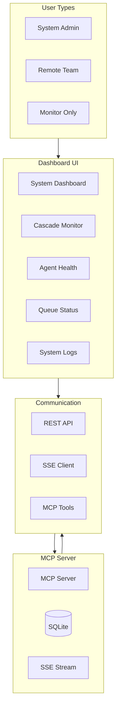
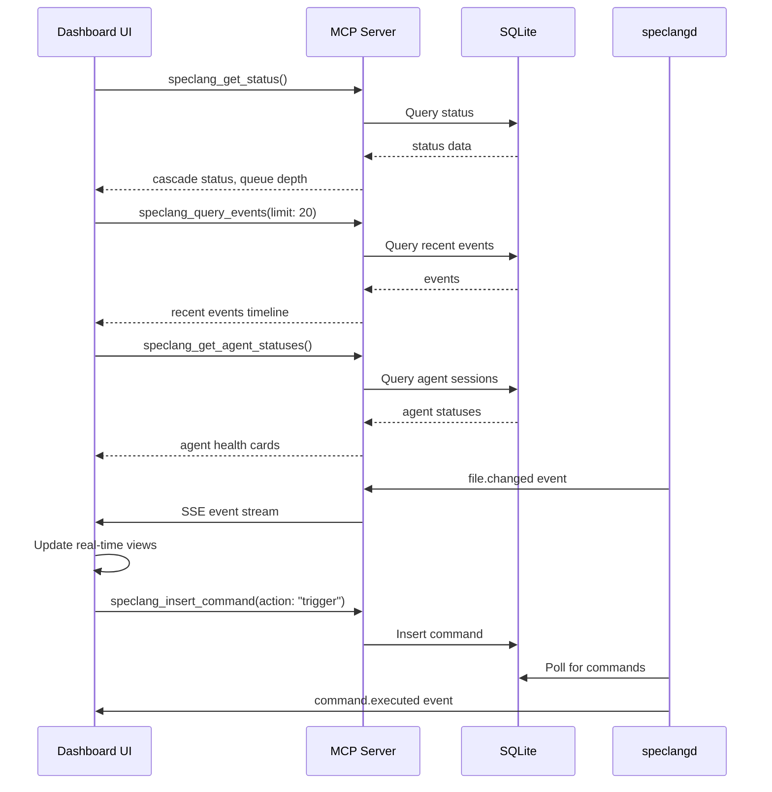

# speclang-header lines:8
id: "@speclang/ui"
version: 0.2.0
layer: 2
tags: [dashboard, monitoring, system, mcp, web]
imports: ["@speclang/cascade", "@speclang/mcp", "@speclang/agent-protocol", "@speclang/sqlite", "@speclang/mcp-ui-tools"]
status: draft
short: System monitoring dashboard for SpecLang cascade and agent health
---

# System Dashboard Specification

Web-based monitoring and control interface for the SpecLang reactive cascade.

## Overview

```speclang
# @block:dashboard/overview @kind:note
The dashboard provides real-time visibility into the SpecLang cascade, allowing system operators to:
- Monitor agent health and activity
- Visualize cascade depth and convergence status
- View queue depth and pending commands
- Trigger manual cascades and control convergence
- Inspect system logs and error reports

Primary users: system administrators, remote teams, developers monitoring cascade health.
Complementary to OpenCode: OpenCode for editing, Dashboard for monitoring.
```

### @dashboard/architecture-overview

```speclang
# @block:dashboard/architecture-overview @kind:diagram

```

## Architecture

### @dashboard/architecture

```speclang
# @block:dashboard/architecture @kind:entity
DashboardArchitecture:
  stack:
    - framework: React 18+ with TypeScript (or lightweight alternative)
    - state_management: Zustand (lightweight)
    - routing: React Router (optional)
    - styling: Tailwind CSS + shadcn/ui components
    - realtime: EventSource (SSE) for live updates
    - charts: Recharts or similar for metrics

  communication:
    primary: MCP tools via HTTP (remote mode)
    realtime: SSE stream from MCP server for events
    polling: Periodic status updates (optional)

  deployment:
    - web: Static HTML served by MCP server (embedded)
    - standalone: Electron app for desktop (optional)
    - remote: Accessible via browser to remote MCP server
```

### @dashboard/data-flow

```speclang
# @block:dashboard/data-flow @kind:diagram

```

## Core Views

### @dashboard/views

```speclang
# @block:dashboard/views @kind:entity
DashboardViews:
  
  system_dashboard:
    purpose: Overview of system health and cascade status
    components:
      - Cascade status (active/converged)
      - Recent events timeline
      - Agent health status cards
      - Queue depth and pending commands
      - System metrics (CPU, memory, disk)
      - Action buttons (trigger cascade, finalize, pause)

  cascade_monitor:
    purpose: Real-time visualization of cascade flow
    components:
      - Graph of file dependencies (D3.js)
      - Timeline of events with playback controls
      - Depth meter and convergence indicator
      - Agent activity logs with filtering

  agent_health:
    purpose: Monitor agent health and activity
    components:
      - Agent status cards (idle, active, error)
      - Session details (current file, queue depth)
      - Performance metrics (processing time)
      - Manual agent controls (restart, pause)

  queue_status:
    purpose: View pending commands and event queue
    components:
      - Pending commands list with priorities
      - Event queue depth visualization
      - Processing rate metrics
      - Manual queue control (pause, resume, clear)

  system_logs:
    purpose: Inspect system logs and error reports
    components:
      - Real-time log viewer with filtering
      - Error severity indicators
      - Search across logs
      - Export logs for debugging
```

### @dashboard/view-system-dashboard

```speclang
# @block:dashboard/view-system-dashboard @kind:operation
render_system_dashboard():
  inputs:
    - cascade_status: from speclang_get_status
    - recent_events: from speclang_query_events(limit: 20)
    - agent_statuses: from speclang_get_agent_statuses
    - project_stats: from speclang_get_project_stats

  layout:
    top_bar:
      - project_name: from project.scl
      - cascade_indicator: green/yellow/red
      - convergence_timer: time since last change
      - queue_depth: pending commands count

    main_grid:
      left_column:
        - stats_cards: [specs_count, generated_files, tests_passed]
        - quick_actions: [trigger_cascade, finalize, pause]

      middle_column:
        - timeline_component: recent events as vertical timeline
        - queue_visualization: pending commands list

      right_column:
        - agent_health: cards for each agent type
        - system_health: CPU, memory, disk usage

  interactions:
    - click cascade_indicator: navigate to cascade monitor
    - click timeline_event: show event details modal
    - click agent_card: navigate to agent health view
    - click queue_depth: navigate to queue status view


## Dashboard Components


### @ui/components-cascade-visualization

```speclang
# @block:ui/components-cascade-visualization @kind:entity
CascadeVisualization:
  
  graph_component:
    library: D3.js or vis-network
    nodes:
      - spec files: circle, blue
      - generated files: square, green
      - test files: diamond, orange
    edges:
      - dependency: solid line
      - trigger: dashed line
      - cascade flow: animated gradient

  timeline_component:
    horizontal_timeline:
      - events as points on timeline
      - color by agent type
      - hover shows event details
      - click jumps to file

  depth_meter:
    visual: vertical bar showing current depth
    warning: turns red near max_depth
    tooltip: shows depth history

  playback_controls:
    - play/pause real-time updates
    - speed control (1x, 2x, 5x)
    - jump to specific time
    - export as GIF/video

  filtering:
    - by agent type
    - by file pattern
    - by time range
    - by cascade_id
```

### @ui/components-agent-monitor

```speclang
# @block:ui/components-agent-monitor @kind:entity
AgentMonitor:
  
  agent_cards:
    layout: grid of cards, one per agent instance
    card_contents:
      - agent name and type icon
      - status indicator (idle, active, error)
      - current file being processed
      - queue depth
      - uptime and performance metrics

  session_details:
    expandable panel on card click
    shows:
      - recent actions
      - lock acquisitions
      - error logs
      - configuration

  controls:
    per_agent:
      - restart: kill and respawn
      - pause: stop processing new events
      - resume: continue processing
      - debug: open debug logs

  heatmap:
    shows agent activity over time
    x-axis: time
    y-axis: agent instances
    color intensity: activity level
```

### @ui/components-search-filtering

```speclang
# @block:ui/components-search-filtering @kind:entity
SearchSystem:
  
  unified_search_bar:
    placeholder: "Search specs, commands, files..."
    sources:
      - speclang_search: full-text search
      - speclang_semantic_search: vector similarity
      - file_path_search: glob pattern matching

  filters:
    by_layer:
      - slider: 0-10
      - checkboxes: 0,1,2,3,4+
    by_tags:
      - tag cloud from all tags
      - multi-select dropdown
    by_status:
      - draft, stable, deprecated
    by_agent:
      - which agent owns the file

  results_display:
    grouped_by_type: specs, files, commands
    preview: first few lines with highlighting
    relevance_score: shown as bar
    actions: open, copy ref, view dependencies
```

## Interactions

### @ui/interactions-cascade-control

```speclang
# @block:ui/interactions-cascade-control @kind:operation
cascade_control_interactions():
  
  trigger_cascade:
    trigger: button click or shortcut
    action: speclang_insert_command(action: "trigger", target_file: current_file)
    feedback: toast notification "Cascade triggered"

  pause_resume:
    toggle button
    action: speclang_insert_command(action: "pause"/"resume")
    visual: button changes icon and color

  finalize:
    button with confirmation
    action: speclang_insert_command(action: "finalize")
    result: runs pipeline, commits changes

  step_mode:
    advanced control: execute one cascade step
    action: speclang_insert_command(action: "step")
    updates UI after each step

  abort_cascade:
    emergency stop with rollback
    confirmation required
    action: speclang_insert_command(action: "abort")
```

### @ui/interactions-spec-editing

```speclang
# @block:ui/interactions-spec-editing @kind:operation
spec_editing_workflow():
  
  create_new_spec:
    via: "New Spec" button or right-click in file tree
    dialog: asks for id, layer, tags
    template: generates header with required fields
    opens: in editor for further editing

  edit_existing_spec:
    double-click in file tree or search results
    editor opens with syntax highlighting
    auto-save: optional, with manual save button
    validation: real-time, errors prevent save

  add_block:
    button: "Add Block" or shortcut
    form: block id, kind, attributes
    inserts: template block at cursor

  add_ref:
    autocomplete: typing @ref: shows search results
    click: inserts full ref
    validation: checks ref exists in database

  preview_changes:
    split view: edit | preview
    preview updates on pause typing
    shows rendered blocks
```

### @ui/interactions-real-time-updates

```speclang
# @block:ui/interactions-real-time-updates @kind:operation
real_time_update_handling():
  
  sse_connection:
    establish: connect to MCP server /events endpoint
    events:
      - file.changed: update file tree, cascade visualization
      - agent.spawned: update agent monitor
      - agent.completed: update agent card, timeline
      - cascade.converged: show notification, update dashboard
      - command.executed: update command history

  optimistic_updates:
    when user triggers action, show immediate UI change
    if action fails, rollback with error message

  debounced_updates:
    rapid events (like file changes during cascade) batched
    visual indicators show "updating..." state

  offline_support:
    queue actions when disconnected
    sync when reconnected
    show connection status indicator
```

### @ui/interactions-git-integration

```speclang
# @block:ui/interactions-git-integration @kind:operation
git_integration():
  
  commit_view:
    shows: git status of spec files only
    staging: checkboxes per file
    commit_message: prefilled with "speclang: " prefix
    commit: via speclang_insert_command(action: "git_commit")

  history_view:
    git log visualization
    filter by speclang commits only
    click commit: show diff of spec files
    revert: option to revert specific commit

  branch_management:
    create branch from current state
    switch branches (warns about uncommitted changes)
    merge visualization

  conflict_resolution:
    when git pull causes conflicts
    visual diff tool for spec files
    merge assistance with block-level resolution
```

## Design System

### @ui/design-system

```speclang
# @block:ui/design-system @kind:entity
DesignSystem:
  
  color_palette:
    primary:
      - cascade_blue: #2563eb (actions, active states)
      - spec_green: #10b981 (spec files, success)
      - agent_orange: #f59e0b (agent activity)
      - warning_red: #ef4444 (errors, warnings)
      - neutral_gray: #6b7280 (inactive, borders)

  typography:
    font_family: Inter, system-ui, sans-serif
    monospace: JetBrains Mono, monospace
    sizes:
      - xs: 12px (labels, metadata)
      - sm: 14px (body text)
      - base: 16px (main content)
      - lg: 18px (headings)
      - xl: 24px (page titles)

  spacing:
    unit: 4px
    scale: 0, 1, 2, 3, 4, 5, 6, 8, 10, 12, 16, 20, 24, 32

  components_library:
    based_on: shadcn/ui
    custom_components:
      - spec_block_card
      - cascade_graph_node
      - agent_status_badge
      - depth_meter_gauge
      - validation_error_tooltip

  responsive_design:
    breakpoints:
      - sm: 640px (mobile)
      - md: 768px (tablet)
      - lg: 1024px (desktop)
      - xl: 1280px (large desktop)
    layouts:
      - mobile: single column, collapsed sidebar
      - desktop: multi-column with persistent sidebar
```

### @ui/design-themes

```speclang
# @block:ui/design-themes @kind:entity
Themes:
  
  light_theme:
    background: #ffffff
    surface: #f9fafb
    text: #111827
    border: #e5e7eb
    code_background: #f3f4f6

  dark_theme:
    background: #111827
    surface: #1f2937
    text: #f9fafb
    border: #374151
    code_background: #1e293b

  high_contrast:
    enhanced contrast for accessibility
    larger click targets
    reduced animations

  editor_themes:
    speclang_light: custom theme for Monaco
    speclang_dark: dark variant
    matches: overall UI theme
```

## Implementation Notes

### @ui/implementation-stack

```speclang
# @block:ui/implementation-stack @kind:code
```typescript
// Project structure
ui/
├── src/
│   ├── components/
│   │   ├── dashboard/
│   │   ├── editor/
│   │   ├── cascade/
│   │   ├── agents/
│   │   └── shared/
│   ├── hooks/
│   │   ├── useMCP.ts
│   │   ├── useSSE.ts
│   │   └── useSpecValidation.ts
│   ├── stores/
│   │   ├── cascadeStore.ts
│   │   ├── specStore.ts
│   │   └── uiStore.ts
│   ├── services/
│   │   ├── mcpClient.ts
│   │   ├── specParser.ts
│   │   └── eventBus.ts
│   └── types/
│       └── speclang.ts
├── public/
└── package.json
```
```

### @ui/implementation-mcp-integration

```speclang
# @block:ui/implementation-mcp-integration @kind:code
```typescript
// MCP client service
class MCPClient {
  private baseURL: string;
  private sse: EventSource | null = null;

  constructor(mode: 'local' | 'remote' = 'local') {
    this.baseURL = mode === 'local' 
      ? 'http://localhost:3000' 
      : 'http://speclang-server:3000';
  }

  async search(query: string, filters?: SearchFilters) {
    const response = await fetch(`${this.baseURL}/tools/speclang_search`, {
      method: 'POST',
      headers: { 'Content-Type': 'application/json' },
      body: JSON.stringify({ query, ...filters })
    });
    return response.json();
  }

  async getSpec(id: string) {
    const response = await fetch(`${this.baseURL}/tools/speclang_get_spec`, {
      method: 'POST',
      body: JSON.stringify({ id })
    });
    return response.json();
  }

  connectSSE() {
    this.sse = new EventSource(`${this.baseURL}/events`);
    this.sse.onmessage = (event) => {
      const data = JSON.parse(event.data);
      eventBus.emit(data.type, data.payload);
    };
  }
}
```
```

### @ui/implementation-editor-integration

```speclang
# @block:ui/implementation-editor-integration @kind:code
```typescript
// Monaco editor configuration
import * as monaco from 'monaco-editor';
import { speclangLanguageDefinition } from './languages/speclang';

monaco.languages.register({ id: 'speclang' });
monaco.languages.setMonarchTokensProvider('speclang', speclangLanguageDefinition);

// Register completion provider
monaco.languages.registerCompletionItemProvider('speclang', {
  provideCompletionItems: async (model, position) => {
    const word = model.getWordUntilPosition(position);
    const suggestions = await mcpClient.getCompletionSuggestions(word.word);
    
    return {
      suggestions: suggestions.map(s => ({
        label: s.label,
        kind: monaco.languages.CompletionItemKind[s.kind],
        insertText: s.insertText,
        documentation: s.documentation
      }))
    };
  }
});

// Create editor instance
const editor = monaco.editor.create(document.getElementById('editor'), {
  language: 'speclang',
  theme: 'speclang-dark',
  minimap: { enabled: true },
  wordWrap: 'on',
  fontSize: 14,
  lineNumbers: 'on',
  automaticLayout: true
});
```
```

### @ui/implementation-state-management

```speclang
# @block:ui/implementation-state-management @kind:code
```typescript
// Zustand store for cascade state
import { create } from 'zustand';

interface CascadeState {
  active: boolean;
  depth: number;
  events: CascadeEvent[];
  agents: AgentStatus[];
  
  actions: {
    triggerCascade: (file?: string) => Promise<void>;
    pauseCascade: () => Promise<void>;
    finalizeCascade: () => Promise<void>;
    addEvent: (event: CascadeEvent) => void;
    updateAgent: (agentId: string, status: Partial<AgentStatus>) => void;
  };
}

const useCascadeStore = create<CascadeState>((set, get) => ({
  active: false,
  depth: 0,
  events: [],
  agents: [],
  
  actions: {
    triggerCascade: async (file) => {
      await mcpClient.insertCommand({
        action: 'trigger',
        target_file: file
      });
      set({ active: true });
    },
    
    pauseCascade: async () => {
      await mcpClient.insertCommand({ action: 'pause' });
      set({ active: false });
    },
    
    finalizeCascade: async () => {
      await mcpClient.insertCommand({ action: 'finalize' });
      set({ active: false });
    },
    
    addEvent: (event) => {
      set(state => ({ 
        events: [...state.events, event].slice(-1000),
        depth: Math.max(state.depth, event.depth)
      }));
    },
    
    updateAgent: (agentId, status) => {
      set(state => ({
        agents: state.agents.map(agent => 
          agent.id === agentId ? { ...agent, ...status } : agent
        )
      }));
    }
  }
}));
```
```

## References

### @ui/refs-existing-specs

```speclang
# @block:ui/refs-existing-specs @kind:table
| Spec | Purpose | UI Integration |
|------|---------|----------------|
| @ref:specs/cascade | Cascade mechanics | Visualization, control |
| @ref:specs/mcp | MCP server API | Communication layer |
| @ref:specs/daemon | File watching | Status display |
| @ref:specs/agent-protocol | Agent communication | Agent monitor |
| @ref:specs/sqlite | Database schema | Search, queries |
| @ref:specs/spec-format | Spec syntax | Editor highlighting |
```

### @ui/refs-external-libraries

```speclang
# @block:ui/refs-external-libraries @kind:table
| Library | Purpose | License |
|---------|---------|---------|
| React | UI framework | MIT |
| TypeScript | Language | Apache 2.0 |
| Tailwind CSS | Styling | MIT |
| shadcn/ui | Component library | MIT |
| Monaco Editor | Code editor | MIT |
| D3.js | Data visualization | BSD-3-Clause |
| Zustand | State management | MIT |
| Vite | Build tool | MIT |
```

## Next Steps

### @ui/next-steps

```speclang
# @block:ui/next-steps @kind:table
| Priority | Task | Owner |
|----------|------|-------|
| High | Implement MCP client service | UI Team |
| High | Create basic dashboard layout | UI Team |
| High | Integrate Monaco editor with speclang syntax | UI Team |
| Medium | Implement cascade visualization with D3 | UI Team |
| Medium | Build agent monitor components | UI Team |
| Low | Add theme switching | UI Team |
| Low | Implement offline support | UI Team |
```

---

*This spec defines the UI for the SpecLang system. It should be implemented as a React application that communicates with the MCP server for real-time updates and database access.*