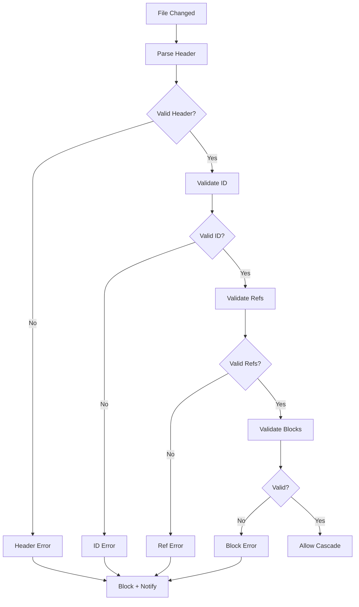

# speclang-header lines:12
id: "@speclang/validation/tool"
version: 0.1.0
layer: 2
parent: "@speclang/validation"
part: 2/2
tags: [validation, tool, flow]
status: draft
project_level: Alpha
agent_support: agent_autonomous
short: Validation tool and flow
---

# Validation Tool

Validation process and tool implementation.

## Overview

```speclang
# @block:validation/overview @kind:note
Every spec is validated before it's written.

Validation happens:
- On file save (before cascade)
- On agent write (guard plugin)
- On explicit /validate command

Invalid specs block cascades and notify the agent.
```

---

## Validation Flow

### @validation/flow

```speclang
# @block:validation/flow @kind:diagram
